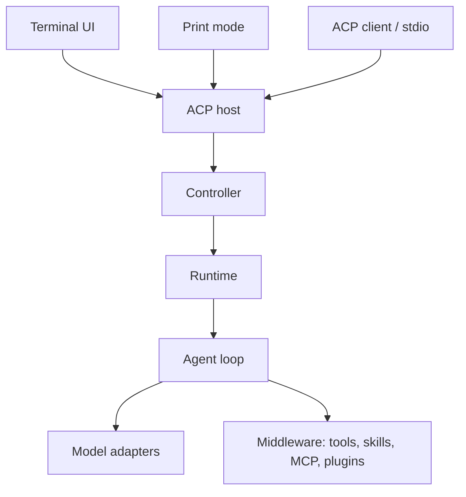

<div align="center">

# Peri Code

**A coding agent built in Rust. Work in your terminal, connect your models, extend your tools.**

[](LICENSE)
[](Cargo.toml)
[](#install)

[Get started](#get-started) · [Documentation](https://konghayao.github.io/peri-cool/) · [Releases](https://github.com/konghayao/peri/releases) · [Contributing](#contributing)

</div>

Peri Code (Perihelion) reads code, edits files, runs commands, and delegates work to subagents. It brings model configuration, tool approvals, session history, and background tasks into a terminal interface, with the same agent available through headless commands and ACP clients.

Use your own Anthropic or OpenAI-compatible endpoint. Extend the agent with skills, hooks, MCP servers, plugins, and JavaScript workflows.

## Install

**macOS / Linux**

```bash
curl -fsSL https://raw.githubusercontent.com/konghayao/peri/main/scripts/install.sh | bash
```

**Windows PowerShell**

```powershell
irm https://raw.githubusercontent.com/konghayao/peri/main/scripts/install.ps1 | iex
```

Follow the installer's PATH instructions, then open a new terminal if needed. To update an existing installation:

```bash
peri update
```

You can also choose a version from [Releases](https://github.com/konghayao/peri/releases), or [build from source](#build-from-source).

## Get started

Start in the repository you want to work on:

```bash
cd /path/to/your/project
peri
```

Peri defaults to Bypass and automatically approves tool calls. Use `--permission-mode default` when you want approval prompts for sensitive tool calls.

On first launch, the setup wizard lets you choose a language and configure a model provider, or migrate from Claude Code configuration. Have your API key, endpoint, and model names ready. After saving the initial setup, exit and restart `peri` to load it into the agent session.

Try a focused first task:

```text
Explain how this project's tests are organized. Read the relevant configuration,
identify the smallest useful test command, and do not modify any files.
```

Then ask for a change with a clear scope and a way to verify it. The conversation shows tool activity and results as the agent works.

Useful commands inside the TUI:

| Command | Purpose |
| --- | --- |
| `/login` | Add or edit model providers |
| `/model` | Select a model profile and adjust its settings |
| `/threads` | Browse saved sessions |
| `/mcp` | Inspect MCP servers |
| `/status` | View service status |

## What you can do

- **Work interactively.** Read streaming Markdown, code blocks, tables, and tool results; reference files from the input area and manage tasks through TUI panels.
- **Choose your models.** Configure providers and model profiles, then change the active model from the terminal.
- **Continue longer tasks.** Resume saved sessions, use goal tracking, and let context compaction reduce accumulated conversation history. Prompt caching depends on the provider, model, and workload.
- **Delegate work.** Run subagents in the background, or define parallel and staged execution in JavaScript workflows.
- **Extend the toolset.** Load skills, hooks, plugins, and MCP servers. Deferred tool search exposes additional tools when needed; dynamic MCP supports session-scoped connections.
- **Reuse familiar configuration.** Import Claude Code configuration and use supported skill, hook, MCP, plugin, and agent formats. Compatibility depends on the feature and configuration involved.
- **Inspect execution.** Use LSP integration for code intelligence and optional Langfuse tracing for model and tool activity.

The core application ships as a native binary. Extensions can require additional runtimes: JavaScript workflows and programmatic tool calling use Node.js, and MCP servers or plugins may have their own dependencies.

## Beyond the interactive terminal

### Resume a session

```bash
# Continue the most recent conversation in this directory
peri -c

# Resume a specific session
peri -r <session-id>
```

### Run a prompt and exit

After configuring a provider, use print mode for scripts and one-off tasks:

```bash
peri -p "Explain the architecture of this repository"
peri -p "Summarize the test configuration" --output-format json
```

Print mode also supports `stream-json` output and `--max-turns` to limit agentic rounds. These commands use the default Bypass permission mode and may execute tools.

### Connect an ACP client

Configure your ACP-compatible client to launch:

```bash
peri acp --cwd /path/to/your/project
```

The terminal, print mode, and ACP stdio entry points share the same host and agent execution path.

### Open a browser terminal

```bash
peri web --host 127.0.0.1
```

This starts a local Web PTY server. See the [Web Terminal guide](peri-web-pty/README.md) for details.

### Choose configuration and storage paths

Peri stores global settings in `~/.peri/settings.json` and session data in `~/.peri/threads/threads.db`. Override them when you need a separate setup:

```bash
peri --config-file ./peri-settings.json --db-path ./peri-sessions.db
```

These options apply to TUI, print, and ACP modes. Relative paths resolve from the launch directory; an explicitly supplied database path fails visibly if it cannot be opened. `--settings` is a separate settings/env input, not a replacement for `--config-file`.

Run `peri --help` or `peri <command> --help` for the full CLI reference.

## How it fits together

ACP is the boundary between the client interface and agent execution:



The host assembles session capabilities, the runtime coordinates sessions, and the agent loop drives model requests and tool execution. Langfuse observes execution through a separate telemetry path.

See the [architecture](docs/design/architecture.md), [design index](docs/design/README.md), and [code index](docs/code-index/) for implementation details.

## Contributing

Peri is developed with AI assistance; humans remain responsible for product direction, review, and releases. Changes should be grounded in repository behavior and include appropriate verification.

### Build from source

With a Rust toolchain supporting Edition 2024 and the platform's native build tools installed:

```bash
git clone https://github.com/konghayao/peri.git
cd peri
cargo build -p peri-tui --release
cargo run -p peri-tui
```

The release binary is written to `target/release/peri` (`peri.exe` on Windows). Documentation and TUI E2E tooling live in separate Git submodules.

Before making a change, read [repository guidance](CLAUDE.md) and the relevant module guide. Use these entry points:

| Looking for | Start here |
| --- | --- |
| Engineering rules and architecture contracts | [Standards](docs/standards/index.md) |
| Current and approved target designs | [Designs](docs/design/README.md) |
| Source files and behavior entry points | [Code index](docs/code-index/) |
| Active work and acceptance criteria | [Issues](spec/issues/) |
| Test scope and commands | [Testing standards](docs/standards/testing.md) |

## Acknowledgments

Built on [Ratatui](https://ratatui.rs), [ratatui-kit](https://github.com/KonghaYao/ratatui-kit), [Tokio](https://tokio.rs), and the [Agent Client Protocol](https://agentclientprotocol.com), with [Langfuse](https://langfuse.com) for observability.

Thanks to [Claude Code Best](https://github.com/claude-code-best/claude-code) for community feedback, and to [Superpowers](https://github.com/obra/superpowers) and [Matt Pocock's Skills](https://github.com/mattpocock/skills) for their contributions to the project's engineering workflow.

## License

[Apache 2.0](LICENSE)
