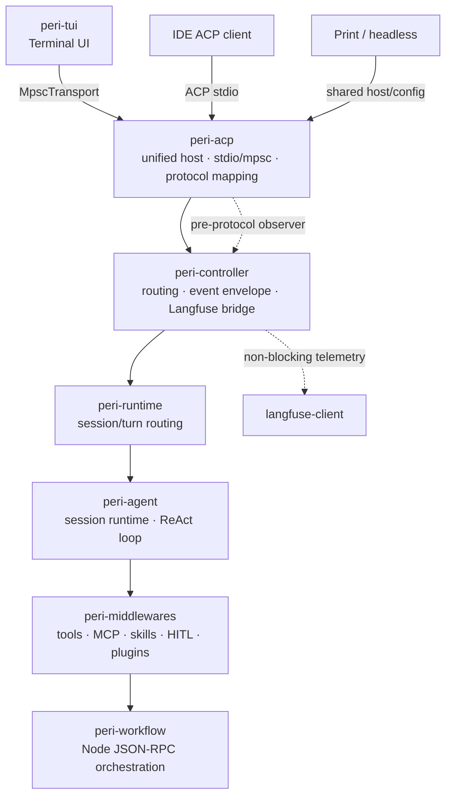

<div align="center">

# Peri Code

**A Rust-built coding agent — fast, lean, Claude Code compatible, any LLM.**

[](https://opensource.org/licenses/Apache-2.0)
[](https://www.rust-lang.org/)
[](#install)
[](#why-peri)
[](https://github.com/konghayao/peri)

</div>

One **13 MB binary**, **~50 MB of RAM**, **98% cache hits** — bring any API key (DeepSeek, GLM, Qwen, Anthropic) and switch on the fly. Your Claude Code config works today: skills, hooks, MCP, plugins, sub-agents. **Zero migration, zero lock-in.**

We believe the agent pattern is proven — planning, tool use, context management, delegation. What's missing is a harness that makes this complexity feel simple: fast startup, any provider, every surface. So we rebuilt it from scratch in Rust, with ACP at the core. We are the best like Claude Code. The foundation every agent deserves. Three things we bet on:

## Why Perihelion

### ⚡ Perf Care

The agent that respects your machine — not the one that borrows it.

- 🦀 **Rust, not Node.js** — 13 MB binary, ~50 MB RAM. Starts instantly, stays out of your way
- ⚡ **95–99% cache hit rate** — Frozen system prompt never recomputes. Tokens you don't pay for
- 🗜️ **Auto Compact** — Hours-long sessions stay lean automatically. Micro at 70%, full at 85% budget

### 🧠 Harness Design

Built for agents that plan, delegate, and finish — not just reply.

- 🤖 **7 Sub-agents + Fork Mode** — coder, explorer, plan, code-reviewer, web-researcher, verification, general-purpose. Fork clones context for deep follow-up. All run in background
- 🔄 **Ultracode Workflow** — Split one task into N agents, merge results. Pipeline, parallel, or sequential — one command
- 🎯 **Goal Tracking** — Declare a goal, the agent keeps going across turns. No babysitting
- 🔍 **Deferred Tool Search** — 12 core tools visible, the rest on demand. Lean prompt, hot cache, cheap tokens
- 🌐 **Any LLM, no lock-in** — Anthropic, OpenAI, DeepSeek, GLM, Qwen. Swap mid-session, bring your own key
- 🔌 **Claude Code compatible** — Skills, hooks, MCP, plugins. Point at your config and it just works

### 🖥️ TUI & Ecosystem

Every surface you need, everywhere you work.

- 🪟 **macOS · Linux · Windows** — One binary. Native ConPTY, true color, cross-platform spawn
- 📝 **Streaming Markdown** — Code blocks, tables, diffs render as the agent types. Read while it writes
- 📡 **Channel Support** — WeChat, Slack, Feishu. Reply in-thread, terminal stays synced
- 🌐 **Web Terminal** (`peri web`) — Browser shell, one command. xterm.js + split panes
- 🔧 **LSP + Langfuse** — Code intelligence and per-turn tracing out of the box

---

## Architecture

Perihelion is not just a TUI. It's a layered platform where the **agent core** is decoupled from the **frontend** via the [Agent Client Protocol](https://agentclientprotocol.com). The same core powers three entry points:



**Architecture boundary**: `peri-tui / print / IDE → peri-acp host → peri-controller → peri-runtime → peri-agent`; middleware capabilities are assembled per session, and Langfuse remains a non-blocking observer rather than part of the business event path. The root workspace membership is defined only by `Cargo.toml`.

**One core, three entry paths.** Use `peri` for TUI, `peri -p <prompt>` for print/headless execution, and `peri acp` for IDE/stdio clients. All three share configuration and database path handling; ACP stdio and TUI requests converge on the same host dispatch path.

---

## Install

Binaries available for macOS (x86_64 / Apple Silicon), Linux (x86_64 / aarch64 / riscv64), and Windows (x86_64).

```bash
# macOS / Linux
curl -fsSL https://raw.githubusercontent.com/konghayao/peri/main/scripts/install.sh | bash

```

```bash
# Windows (PowerShell)
irm https://raw.githubusercontent.com/konghayao/peri/main/scripts/install.ps1 | iex
```

```bash
# start peri
peri

# self-update
peri update
```

First launch guides you through model and API key configuration — no config file editing required.

### CLI 全局参数（路径重定向）

- `--config-file <path>`（别名 `--configFile`）— 重定向全局配置文件（默认 `~/.peri/settings.json`），TUI / `-p` print / `peri acp` 三路径的配置读取与保存均跟随；相对路径按启动时 cwd 解析。
- `--db-path <path>`（别名 `--dbPath`）— 重定向 SQLite 会话数据库（默认 `~/.peri/threads/threads.db`）；显式指定路径打开失败时直接报错（不 fallback 临时目录），TUI/print/acp 均以非零码退出。
- `--settings <file|json>` 语义不同：仅注入 env 字段（接受 JSON 字符串），不改变配置读写路径；`-p` 模式下 `--settings` 全权替换配置加载，`--config-file` 仍负责 env 注入与保存目标。

---

## Built by AI, Published by Human

Perihelion's code is primarily AI-assisted, with human responsibility for product direction, review, and release. The repository keeps its engineering knowledge in explicit, scoped facts rather than accumulating incident notes in one root prompt:

| Knowledge | Canonical location |
|---|---|
| Stable engineering rules and cross-crate contracts | `docs/standards/` |
| Current implementation navigation | `docs/code-index/` |
| Active changes, defects, and acceptance status | `spec/issues/` |
| Historical problem records | `spec/global/problems.md` |
| Repository and module routing | root/module `CLAUDE.md` and `AGENTS.md` |

A non-obvious constraint discovered during a fix is promoted only when it is stable: rules go to standards, behavior navigation goes to code-index, and temporary investigation stays in the active spec. Root guidance files remain small routers so every agent reaches the same canonical source instead of inheriting duplicated “TRAP” narratives.

→ Read the full story: [Nobody Coding](docs/blogs/ai-coding-paradigm/nobody-coding.md)

---

## Acknowledgments

- [Claude Code Best](https://github.com/claude-code-best/claude-code) — community support and feedback
- [Superpowers](https://github.com/obra/superpowers) & [Matt Pocock's Skills](https://github.com/mattpocock/skills) — the skill suites that drive Perihelion's AI engineering workflow
- [ACP](https://agentclientprotocol.com) — open protocol for agent-IDE communication
- [rmcp](https://github.com/anthropics/rmcp) — Rust MCP client library
- [ratatui-kit](https://github.com/KonghaYao/ratatui-kit) — React-style component framework powering the entire TUI (components, hooks, state atoms, routing, the `element!` macro)
- [Ratatui](https://ratatui.rs) — terminal rendering backend
- [Tokio](https://tokio.rs)
- [Langfuse](https://langfuse.com) — LLM observability
- [Zed](https://zed.dev) — first ACP-compatible IDE

## License

Apache 2.0
