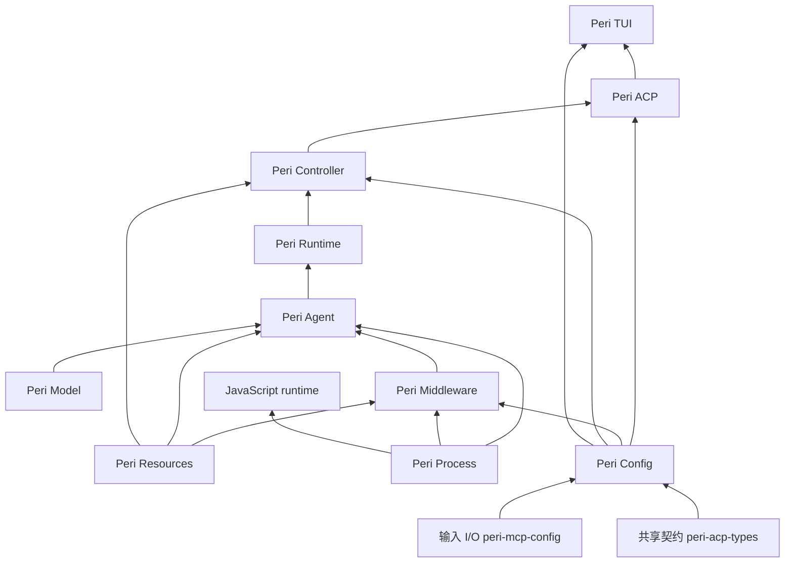
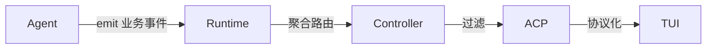
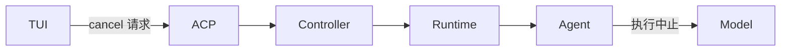
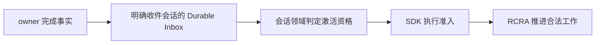

# Perihelion 总体架构

> 状态：现行设计
>
> 本文说明各层职责、允许的依赖方向与跨层数据流。跨模块强制不变量以
> `docs/standards/architecture-contracts.md` 为准；代码入口以
> `docs/code-index/` 为准。

## 0. 依赖规则

业务执行遵守跨模块契约，不绕过协议与领域边界。下图箭头表示能力提供方向，
不是 Rust crate 的完整依赖清单，也不表示消费者必须依赖提供方的具体实现：

- 边含义：Model 提供协议能力；Agent 提供 session 运行单元；Runtime 提供多 session 编排；Controller 提供业务操作；ACP 提供协议服务；Middleware 提供 Hook 实现；Resources 提供外部数据抓手
- Rust 依赖按消费者 → 提供方理解：`peri-middlewares` 消费 `peri-agent` 的 hook、
  工具与装配接口，Agent 不反向依赖 Middleware 实现；Runtime 消费共享契约中的
  `SessionHandle`，不依赖具体 Agent crate。
- ACP 宿主可在部署装配面消费 Agent、Middleware、Model 与 Resources，业务执行
  仍经注入端口推进；不能把这些合法装配边解释为协议层自行运行 Agent 业务。
- 依赖方向及装配豁免由 `scripts/check-layer-imports.sh` 与
  `scripts/import-exemptions.conf` 验证；跨层行为边界以架构标准为准，能力图不能
  替代门禁或成为新的依赖白名单。

`peri-config` 是内部配置权威面，向 ACP、Middleware、Controller、TUI 提供
typed 结果；消费者依赖 core。core 只消费共享契约与来源 I/O，不反向依赖业务层。
输入 adapter → 纯 resolver → scoped immutable snapshot/revision/explain/updateCAS
的边界见 [配置权威面](configuration-authority.md)。来源 MCP 独立 bootstrap，
不通过待配置工具池启动，不增加 daemon 或模型工具；环境来自选中的 source provider。

`peri-process` 是不依赖业务层的 OS 子进程能力：在 spawn 前配置独立进程组或
Windows 挂起进程，attach 后提供终止请求与实际退出证据。它不拥有 session、
数据库 lease、协议或 UI；Bash、MCP 和 JavaScript 的各自 owner 持有它并
负责等待清理。进程树实现不得因复用而引入反向依赖。

归层判据（三问定层）：

- 生命周期：状态跟着 session 活的归 Agent；跟着进程/多 session 活的归 Runtime；单次调用即结束的不跨层
- 来源：LLM 协议形态归 Model；ACP 协议形态归 ACP；外部系统数据，访问通道归 Resources，持有按生命周期
- 消费：界面呈现归 TUI；组合多源决策归 Controller；旁路观测走独立通道，不参与业务链路
- 优先级：通道与持有分离，通道归 Resources，持有按生命周期
- 优先级：生命周期优先于消费，消费层只拿引用
- 兜底：协议适配归 Model；业务切面归 Middleware；界面归 TUI；接口契约归 peri-acp-types
- 争议按上述顺序裁定，不另行讨论

## 1. Peri Model 层

- 协议适配：openai + anthropic 双协议 adapter
- 协议消息统一抽象：ModelMessage/ModelStream（仅协议形态，不含业务语义）
- 流式抽象：统一流式输出接口（ModelStreamEvent）
- 最底层，无依赖

## 2. Peri Agent 层

- session 生命周期容器：Session 创建/运行/销毁全生命周期归此层
  - 聚合根原则：归此层的职责以 session 生命周期为界；session 是聚合根，本节职责范围由此自洽
  - AgentGroup（agm 理念：Agent 平等、管线通讯）
  - frozen data 构建与持有：session 创建时从 Resources 拉磁盘数据（CLAUDE.md/skills/日期）冻结；subagent 创建时 copy
  - Session 级 hook（on_session_start/end）随 session 归此层
- subagent 创建：SessionFactory::spawn_subagent(parent, config)
  - 建 thread：经 Resources 存储，parent_thread_id 挂父子链
  - 建 session：transcript 绑定存储（with_persistence）
  - 运行 + 结束：更新 agent_status
- 内存任务运行句柄与持久任务绑定、交付责任分开；独立 Task 目录、跨实例任务恢复
  和关闭的已批准目标见 [Session 异步任务架构](session-async-tasks.md)，该设计
  明确标为待重构，不表示全部目标已实现。
- 消息统一：MessageType（Human/Ai/Tool/SystemReminder，v2 BaseMessage 更名；协议转换在 Reason 阶段）
- MQ 消息管理：MessageQueue（Prompt/Defer/Info + MessageSource）
- RCRA 循环：Receive -> Compact -> Reason -> Act，Receive 为唯一退出口
- Hook/Middleware 统一抽象：MiddlewareHook trait
- Middleware 链序蓝本在 Agent session 工厂，具体实例装配在
  `peri-middlewares/src/assembly.rs`，由宿主经装配端口注入，遵循 ARC-MIDDLEWARE-001。
- cancel 最终执行权：Cascade/Independent 判定与终止执行归此层，上层仅传递，Model 执行中止

## 3. Peri Runtime 层

- 多 session 句柄编排器：注册/销毁 session（经注入句柄）、事件聚合补打与请求转发；
  不作为消息激活或 SDK 执行准入的第二权威。
- 无状态：唯一持有 `session_id -> SessionHandle` 映射
  - 不持有 session 状态、无持久态、无业务配置
  - 其余全部注入，状态在 Agent 层各 session 内

## 4. Peri Middleware 分片

- 实现 MiddlewareHook，承载 Goal/SubAgent/Permission/AskUser 等业务切面；
  文件系统与终端工具由 builtin Workspace MCP 实例提供，不再是独立链槽位。
- MCP 客户端连接池、连接生命周期与工具桥接在 Middleware 层；宿主装配并注入 pool，
  不把连接状态误归 Resources。输入 I/O 与工具提供方经各自 MCP 能力边界消费。
- 任务发起、登记和工具桥接的现行入口见代码索引；独立任务目录与 owner 恢复的
  目标职责见 [Session 异步任务架构](session-async-tasks.md)，不能据此声称已完成。
- 切面 = hook 挂载 + 工具声明 + prompt 贡献 + 条件守卫

## 5. Peri Resources 层

- 外部系统门面：抽象外部数据，对上提供抓手
  - 配置来源 I/O：由独立 `peri-mcp-config` bootstrap 能力提供文件正文、具名环境与字节 CAS；有效配置规则归 `peri-config`，不归 Resources 或输入 provider
  - 会话持久化：SessionResources 契约与本地 SQLite、远端 Turso adapter，保存身份、
    transcript、绑定、Work 事实及事务回执。
  - Workspace 级 OAuth 凭据的持久存储；MCP 连接由 Middleware 持有，交互 broker
    由 ACP 宿主提供，不归 Resources。
- adapter 保存和适配状态，共用领域 reducer，不维护第二份业务规则；访问模式与
  存储完整性不构成执行所有权，执行唯一性由 SDK 管理。
- 以 context 形式提供给 Agent / Middleware / Controller

## 6. Peri Controller 层

- 控制面：lite params -> pick Resources -> pick Runtime -> run Session -> pop events
  - lite params 定义：session 标识、agent 定义引用、cwd、初始输入
  - 其余上下文由 Controller 从 Resources 组装注入
- 事件聚合/过滤（业务事件 -> 协议化前的出口）
- cancel：`Controller::cancel(session_id, policy)` -> Runtime 查映射 -> Agent 执行判定 -> Model 中止
  - 只定位与转发，不解释取消语义
- 观测：横切面旁路，非业务职责
  - 采集点分散各层：Model 层 token/调用、Agent 层 stage/turn、Controller 操作、ACP 事件
  - 汇聚：观测事件随主事件流走，在协议化前分支给 Langfuse bridge
  - bridge 是事件流旁路消费者（装配在 Controller 侧宿主），不承担 Controller 职责
  - 关联靠身份牌（session_id + turn_id + agent_id），不改变业务链路

## 7. Peri ACP 层

- 纯协议实现：ACP 协议适配，不承载业务
- settings 类型与 `ConfigSource` 由 `peri-config` 提供；正常 source 持有 `ConfigurationSystem`，宿主把同一 scoped snapshot 注入新建 MCP pool，并适配 provider / Langfuse 投影。ACP 不复制 typed 配置解析和来源规则；workspace 资源 consumer 使用 snapshot 的资源开关投影，不重读全局值。新来源须显式 reload 并重取 snapshot，旧 pool 固定旧 Arc，无 hot watcher。
- 事件协议化映射、caps 门控
- 全部客户端（TUI/CLI/stdio/IDE/print）一律经 ACP
- 部署单元：TUI/print = `peri-tui` 客户端装配；stdio/IDE = `run_acp_stdio(StdioInput)`（`peri-acp/src/host/stdio/mod.rs`）→ `assemble_stdio_config` → `run_acp_server`——与 TUI 共用同一 `run_acp_server`（`handle_request` + `dispatch_prompt_turn`），仅 transport 多态（mpsc vs `transport/stdio.rs` `StdioTransport`，JSON-RPC 2.0 newline-delimited）

## 8. Peri TUI 层（View 层）

- 职责：把 ACP 传来的数据映射成界面呈现（渲染）
- cli = 启动接口：装配 View 与 ACP 客户端，不承载业务
- print = 同层轻量渲染客户端（无界面，输出文本）
- 只经 ACP 拿数据，不触碰业务层
- 部署装配输入：cli 全局参数 `--config-file` / `--db-path`（别名 camelCase）选择全局 settings 与 SQLite 会话数据库路径，TUI / print / `peri acp` 三路径消费；MCP 基础配置使用选中来源的 snapshot，UI 类型归 `peri-config::ui`。存储实例化仍在装配面，locator / credentials 不属于本次核心配置迁移。自定义全局 skill 根的 `skillsDir` 已删除。

## 9. 横切面

事件链路：

cancel 链路：

事件契约：

- 事件携带 turn_id + agent_id；session_id 由 Runtime 聚合时按 session 维度补打（Agent 层事件不携带）
- 同 session 事件带单调序号（session_seq）
- terminal 事件必须位于该 turn 全部输出事件之后

身份标识：

- 跨层消息统一携带 (session_id, session_epoch, turn_id, attempt_id)
- epoch/attempt_id 不可复用（防迟到消息命中新 session）

cancel 契约：

- Agent 持有最终执行权，上层仅传递，Model 执行中止
- 幂等：针对 (session_id, turn_id, attempt_id)；重复 cancel 结果一致；turn 终态唯一（Completed 或 Interrupted）
- 优先级：cancel > 续跑 > promote > retry；cancel 后已排队的 resume/promote 全部失效
- cancel ≠ 清除待办：MQ 未消费消息保留，随下次循环消费（作为新 attempt 输入）
  - cancel 请求可带 clear_queue 标志（默认 false）

session 销毁顺序：

- 停收新输入 -> 取消 owned tasks -> join（带 deadline）-> 超时 abort -> 持久化事务收束 -> drain 事件 -> 移除映射

持久真相：

- Thread/transcript 与持久 Work 记录是事实源；任务绑定、委托、invocation、交付义务
  和控制回执可持久化，不能概括为“所有 Task 不持久化”。
- 内存 TaskManager、运行句柄、MQ 和 callback 是运行期能力或投影，不因加载历史
  而复活旧 execution；未知副作用和未结清义务保留身份并对账，不伪造中断或完成。

异步完成与激活（已批准目标边界，实施状态见 RCRA 消息权威）：

结果到达不是恢复已取消 turn 的授权；暂停、关闭及控制代际须参与准入判断。
历史 load 本身不是执行请求，具体可靠接纳与恢复目标见
[RCRA 消息权威](rcra-message-activation.md)。

错误模型：边界类型化，层内 anyhow

- 跨层边界用 thiserror 枚举，逐层包 context；层内 anyhow 穿透
- 仅三类必须类型化：终止类（cancel/interrupt，防 `?` 误报失败）、可重试类（rate limit/超时，重试策略用）、协议错误（ACP 序列化用）
- TurnError 语义保留 Agent 层（TUI 展示/重试依赖）
- 其余细节错误不逐层映射

compact：RCRA 阶段归 Agent，token 计数经 Model

HITL/secret：broker 经 Resources 注入 Middleware（OnPermissionRequest 在 Middleware）

Task vs Thread：

- Task 运行投影：内存 registry 与执行句柄；持久任务绑定、owner 路由及交付责任
  独立存在，完整 Task 目录与跨实例恢复仍按目标设计推进。
- Thread：持久化实体（sqlite），ThreadMeta + 消息，subagent 必有
- 父子链 parent_thread_id = 父子标记的持久化载体（thread_id = agent_id）
