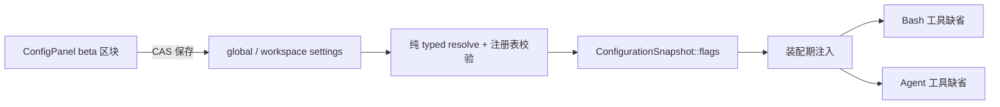

# Beta Flag 系统

> 状态：已批准目标设计。flag 注册表、配置面投影、消费注入与 TUI 管理面尚未实现；
> 实施范围、拆分与验收见 [2026-10-08 实施 issue](../../spec/issues/2026-10-08-beta-flags-implementation.md)。
>
> 事实源：settings 占位类型 `peri-config/src/app.rs::BetasConfig`；配置权威、快照、
> CAS 与 explain 的通用规则见 [configuration-authority.md](configuration-authority.md)；
> 消费点 `mcp-packages/workspace/src/terminal.rs`（Bash）、
> `peri-middlewares/src/subagent/tool/`（Agent）；管理面板
> `peri-tui/src/kit/panels/config.rs`；注册表挂载点 `peri-acp-types`（与 MetaHarness
> 常量表同址）。定位信息以 `docs/code-index/` 为准。

## 定位

Flag 是受控的 beta 能力开关：能力已在代码中实现但不默认启用，用户在 settings 中
显式开启后，新建会话按其缺省运行。开启只改变行为缺省与能力可见性，不引入第二实现，
未配置用户的行为与 flag 引入前一致。

边界：

- **不是通用配置**：常态能力参数使用各自领域的 typed 字段，不用 flag 表达。
- **不是 MetaHarness**：MetaHarness 表达「关闭一只已默认装配的组件」，flag 表达
  「开启一只未默认启用的能力」；两者都服从配置权威面，但注册表与消费面独立。
- **不做远程下发、灰度放量、AB 实验与用户分群**：实验与观测属于 Langfuse 领域。
- **不承载安全与兼容语义**：权限、审批、凭据准入与数据格式兼容不得以 beta 开关
  形式存在——这些规则没有 beta 状态。
- **不做会话内热生效**：flag 值随装配冻结，见「消费契约」。

## 领域模型

三个概念各有一处权威：

| 概念 | 含义 | 权威 |
| --- | --- | --- |
| Flag 定义 | 稳定 id（kebab-case）与 canonical 描述 | 代码注册表，flag 存在性的唯一权威 |
| Flag 覆盖 | settings `config.betas` 的稀疏 `id → bool` 表 | 用户 settings（global / workspace） |
| 有效值 | `覆盖.get(id).unwrap_or(false)` | resolve 投影 `BetaFlags` |

所有 flag 默认值恒为 false；注册表不得声明默认开启条目。id 一经发布不得改名
（settings 键、日志与面板身份），改名等同于「废除 + 引入」。面板操作产生的覆盖是
用户偏好数据，不因能力转正而被改写（残留键按未知键规则失效）。

## 注册表

注册表在 `peri-acp-types` 集中声明（与 MetaHarness 常量表同址），供配置校验、装配方
（peri-middlewares、peri-mcp-workspace）与 TUI 共同消费。条目字段：id、canonical
description。消费方以注册表常量（而非字符串字面量）引用 id。

生命周期：

- **引入**：能力已实现、默认关闭、描述明确、具备退出计划。
- **转正**：能力改为常态（默认行为或常态配置项），删除注册表条目。
- **废除**：删除条目。

转正与废除后，settings 中残留键按未知键规则处理。

## 配置面接入

settings 位置为 `config.betas`（沿用现有 `BetasConfig` 占位类型，内部为 bool 稀疏
map）。示例：

```json
{ "config": { "betas": { "full-async-tools": true } } }
```



| 规则 | 内容 |
| --- | --- |
| 合并 | global 与 workspace 逐 key 覆盖（workspace 同名键胜出），不做整体替换；workspace 显式 false 可关闭 global 的 true。差异提取与 MetaHarness 同款 |
| 校验 | 键必须在注册表内；未知键在解析后从内存配置剔除并记录 warning（`validate_meta_harness` 同款语义），不进入快照、投影与面板；磁盘残留键在下一次经权威保存路径写回时清理 |
| 类型 | 值必须为 bool；非 bool 使该来源解析失败，不静默降级为 false 或 true |
| 投影 | `ConfigurationSnapshot` 新增 `BetaFlags` 投影（与 `resources()` 同级），由合并后 settings 派生；`is_enabled(id)` 对未覆盖或未知 id 返回 false |
| 解释 | `ConfigurationField::Betas`，DOMAINS 声明来源为 Global + Workspace |
| 保存 | 复用 `ConfigSource::save`（revision 核对、纯 resolve 校验、字节 CAS、发布）；不建立独立写路径 |
| ACP | `config.betas` 随既有 `update_config` 全量配置语义参与读写；不新增 `SessionConfigOption`，不改变全量替换语义 |

## 消费契约

**装配期读取一次、随装配冻结。**

- 消费方仅在装配期（会话工具池、middleware、能力装配）从快照投影读取 flag 值，
  作为显式装配输入注入产物；值在一个会话（含其 SubAgent 与工具环境）内不变。
- 禁止执行期回读：工具调用、hook 与 middleware 执行路径不得重读配置源、快照之外
  的 settings，或自行解析 flag 语义。
- 设置更新发布新快照后，仅此后新建的会话使用新值；进行中的会话保持冻结值，
  行为不漂移。
- 值送达使用显式装配输入：workspace 工具经实例装配输入（`WorkspaceInstanceInput`
  同级）传递，middleware 工具经 middleware 装配参数传递；不引入全局单例读取或
  运行时查表。
- 快照缺失、未覆盖与未知 id 一律按 false 处理；配置面不可用不得导致能力意外开启。
- 装配时若有 flag 生效，记录 flag id 与来源层，供诊断。

## TUI 管理面

管理入口是 ConfigPanel（Ctrl+F / `/config`）：在既有配置行之后追加 **beta flag
区块**，按注册表顺序为每个条目渲染一行 Toggle（id、描述、开启/关闭）。行模型从
静态表扩展为「基础行 + 注册表驱动行」，滚动沿用面板既有能力。

- 切换写当前生效层的 `config.betas[id]`，经 `save_effective`（CAS）持久化；保存
  失败保持内存视图不变并提示错误，与既有配置行一致。
- 面板显示当前生效层的覆盖值；未设置与显式 false 均显示为关闭。有效值仍由权威面
  按合并规则计算。
- 区块标注**新会话生效**；已运行会话不受切换影响。
- 描述优先 i18n key `beta-desc-<id>`，缺失回退注册表 canonical 文本。
- BetasPanel（Ctrl+B / `/betas`，当前为 mock 列表）退役：flag 列表的单一权威是
  注册表，不保留第二入口。

## 首个 flag：full-async-tools

| 项 | 语义 |
| --- | --- |
| id / 默认 | `full-async-tools` / false |
| 效果 | `Bash` 与 `Agent` 在调用未显式给出 `run_in_background` 时，缺省由 false 变为 true |
| 显式优先 | 显式 `run_in_background: false` 仍走前台；flag 只改缺省，不覆盖显式意图。`Agent` 的 resume 调用（携带 `resume_thread_id`）不受影响 |
| 模型可见 | 工具 schema 中 `run_in_background` 的 `default` 与描述随有效缺省同步；schema 只影响模型倾向，硬缺省由执行路径执行 |
| 依赖前提 | 缺省转后台要求任务管理器就绪；缺失时维持既有报错语义，flag 不创造未装配的能力 |
| 不变项 | 任务注册、完成回传、取消、并发上限、前台超时 promote 与输出落盘链均不因 flag 改变 |

## 治理

- 注册表集中声明并随代码评审管理；禁止消费方散落字符串比较。
- flag 数量保持克制：beta 是临时状态，能力具备常态可用性后即转正或删除。
- 删除优于兼容：转正与废除时删除条目，不保留 deprecated 别名或兼容分支。

## 边界外

- 远程下发、灰度、AB 实验与用户分群。
- 安全策略与数据兼容语义的 beta 开关。
- 会话内热生效与运行期 flag 变更通知。
- 环境变量覆盖（若未来引入，必须经同一配置面与同一注册表校验，不建立第二解析）。
- 独立 ACP `SessionConfigOption` 暴露。
