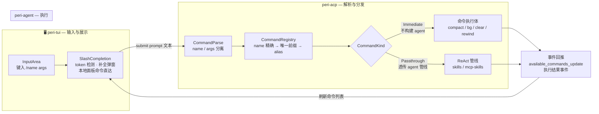
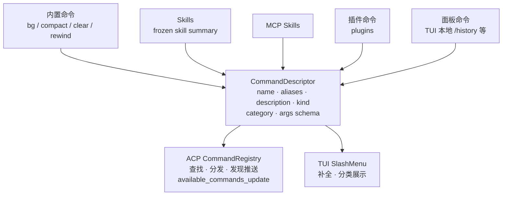

# Command 系统权威架构

> 最后核对：2026-08-15
> 事实源：`peri-acp-types/src/command.rs`（契约）、`peri-acp/src/session/command/mod.rs`（注册表）、`peri-agent/src/session/exec/executor.rs`（拦截）、`peri-tui/src/kit/input_area.rs` + `slash_completion.rs`（展示）。

## 概述

Command 系统的职责边界：**用户键入 `/name args` → 统一解析 → 注册表匹配 → 按语义分发执行 → 事件回推刷新补全**。

权威架构的两条主线：

1. **单一事实源**：命令的 `name / aliases / description / kind / category / args schema` 只在 CommandDescriptor 处定义一次，TUI 展示与 ACP 分发消费同一份元数据，任何一层不得反推。
2. **展示与执行解耦**：TUI 只消费 ACP 推送的命令描述并渲染补全，不承担命令语义判断；本地面板命令（如 `/history`）作为第一类命令来源纳入统一描述。

## 图 1：命令生命周期（运行时链路）

## 图 2：命令定义单一事实源（来源收敛）

## 设计不变式

1. **单一事实源**：命令元数据只在 CommandDescriptor 定义一次；`build_slash_items` 不得再用 SKILL_NAMES / MCP_SKILL_NAMES 集合反推 kind（现状：`peri-tui/src/kit/input_area.rs` 的 `build_slash_items` 在反推）。
2. **展示与执行解耦**：TUI 不执行命令语义判断；面板命令经 `panel_for_slash_command` 映射属于 TUI 侧执行语义，须以显式命令来源收敛进注册表，冲突由注册优先级裁决。
3. **解析唯一实现**：name/args 分离、前缀匹配、alias 解析只在注册表一处实现（现状 `find` / `find_arc` 双份复制）。
4. **执行语义二分**：`Immediate` / `Passthrough` 足够，`Transform` 未落地即删除；新命令必须归属其一。
5. **上下文按需注入**：`CommandContext` 不无限追加字段；新增依赖走显式注入面（如 `BgForkSpawner` 模式），缺注入的命令优雅报错。

## 与现状的差距（优化讨论起点）

- 元数据分散：TUI 反推 kind（Skill / McpSkill / Command），与 ACP 事实漂移风险。
- 注册表线性扫描 + `find` / `find_arc` 双实现。
- 无 args schema：参数解析各命令自研，无统一补全与校验。
- `CommandContext` 持续膨胀（frozen_* 系列为证），无扩展策略。
- 面板命令与 ACP 命令两套来源未收敛，同名冲突无裁决规则。
- `available_commands_update` 扁平推送，不带 kind / category / args 元数据。
