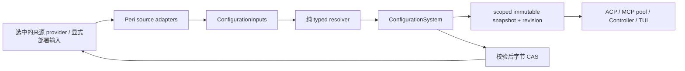

# 配置权威面

> 状态：现行设计。Peri 内部核心权威面已实现；专属领域扩展与部署验收见
> [active issue](../../spec/issues/2026-10-01-configuration-authority.md)。
> 本文定义稳定边界，代码入口见 [peri-config 索引](../code-index/peri-config.md)。

## 权威与依赖

`peri-config` 定义已迁移配置领域的 schema、默认值、来源规则、typed 投影、
scope、revision、解释与更新接纳。ACP、Middleware、Controller、TUI 消费结果。
输入提供方不决定系统有效值，消费者不维护第二份同领域解析规则。

消费者依赖核心，核心依赖 `peri-acp-types` 的共享契约与 `peri-mcp-config` 的
输入 I/O；核心不反向依赖 ACP、Middleware、Controller、TUI 实现。
纯 resolver 与 source adapter 分开，配置权威不要求独立进程。

## Bootstrap 与环境所有权

默认 adapter 使用独立配置 MCP 通道，先采集输入再决定 session 工具池启动。
它不注册模型工具、不进入 builtin 工具池、不新增 daemon，避免配置与待配置
工具池形成循环依赖。默认部署是内存 transport，部署可在首次访问前选远端 provider。

配置 provider 只提供文件正文、具名环境、路径/同文件身份、atomic 写入与字节 CAS。
环境取自选中的 provider，远端不可得不回落计算宿主。声明的环境键只覆盖相应
配置领域；工具执行凭据、进程控制环境与存储连接凭据仍遵守各自能力所有权。
这不是禁止业务访问所有 OS 环境变量的规则。

## Scope、解析与快照

scope 是绝对 cwd 与选中全局 settings 路径；来源包括 global settings、固定
workspace settings、project `.mcp.json` 与具名环境。adapter 负责同文件不拆层。
`assembly::DOMAINS` 在一个代码结构中声明各领域的参与来源、规则说明与敏感性；
具名环境采集键和 `explain` 的来源列表从该声明生成。`assembly::resolve` 负责
实际跨来源装配，领域模块保留各自的 typed 合并算法，避免把不同规则压成通用
JSON merge。`ConfigurationSnapshot::resolve(scope, inputs)` 不进行 I/O，校验输入后
提供只读投影：

| 领域 | 核心规则 |
| --- | --- |
| Settings | workspace 按领域覆盖 global；profiles 整体替换，MetaHarness 逐 key 合并 |
| Provider | `MODEL_PROVIDER` + `MODEL_TYPE` 成对指定配置中的 provider ID 与档位；未指定时取 active profile；默认值与 alias 规则归 core |
| MCP | global → plugin → project；手动内容去重插件，typed 准入；cache 任一来源 false 关闭 |
| Langfuse | global settings 后具名环境覆盖；维持 clamp、非法数值 fallback 与 batch 语义 |
| UI | 从合并 settings extra 投影 `TuiConfig`；bool 写回与可选键移除规则归 core |
| 资源开关 | `ResourceConfiguration` 从 global 投影 `disableBundledSkills`，优先 config 内键并兼容旧顶层键，默认 false |

插件发现/安装生命周期、执行参数与环境展开、builtin runtime overlay 留在
Middleware；它们把输入交给 core，不能复制 global/project/环境优先规则。
`mcp_with_plugins` 用快照冻结输入派生，不重新读取基础来源。
`mcp::builtin_enabled` 单一解释 `PERI_MCP_BUILTIN`；旧 builtin adapter 只采集
环境输入再委托该规则，不自行解释开关。

revision 由 scope 和输入内容确定，包含文件正文与具名环境；它是内容版本身份，
不是时间戳、递增全局序号或访问令牌。`ConfigurationSystem` 按 scope 管理 current
`Arc<ConfigurationSnapshot>`，完整 resolve 成功才发布。持有旧 Arc 的消费者
保留旧值；多个项目不得通过一个可变 map 串配置。

输入文件顺序采集，不承诺跨文件物理原子快照。revision 表达已采集的一组输入，
不能证明文件在某个共同墙钟时刻一致。

## 解释与秘密

`explain(scope, ConfigurationField)` 返回领域贡献来源、规则、revision 与敏感标记。
当前解释按领域组织，不提供每个标量的精确覆盖胜者；非法但被容错忽略的来源
出现于贡献列表，不意味着其值生效。普通解释不返回原始文件正文或环境值。
输入、快照、provider 与 Langfuse 的 Debug 避免输出凭据。

## 更新与保存

正常 `settings::ConfigSource` 固定布局并持有 `ConfigurationSystem`，为宿主提供
snapshot、显式 `reload_merged` 与 `save`；ACP store 仅 re-export。lenient 加载
失败可维持可用的设置视图，但没有成功 authority 时不能声称发布了有效快照，
仅临时可读、不可写。无 authority 的旧合并/保存路径已删除，reload/save 必须
明确失败，布局失败不得误写全局层。

`ConfigSource::save(expected_revision, &PeriConfig)` 返回
`Result<Arc<ConfigurationSnapshot>>`，caller 使用返回的 accepted snapshot 发布结果。
expected revision 必须在编辑开始从基线 snapshot 捕获并随草稿保留；提交时现场
读取最新版 revision 会丢掉 stale draft 检测，不能当作版本保护已完成。

权威 `update` / `update_mcp` 顺序为：核对 current 的预期 revision → 重新采集
并核对输入 revision → 生成负责领域的候选正文 → 纯 resolve/校验 → 目标文件
字节 CAS → 发布新 snapshot。冲突、解析、校验或 I/O 失败不 publish。

settings 保存只更新 `config` / schema，保留 `mcpServers`、`langfuse` 等兄弟域；
workspace 保存 global 相对差异，不把 global credentials 复制到工作区。
其中 nested `config.mcpServers` / `config.mcpCache` 由所属领域维护，settings 更新
保留目标原文中的值，即使 only-provider 请求未带它们也不删除；目标没有这些键时
不从 effective global 复制进 workspace。已有 workspace `$schema` 优先保留。
`update_mcp` 拒绝 Global / Plugin / Builtin / 其他 cwd.Project 来源的 server，
只接纳显式无来源项目输入或本 cwd `.mcp.json` 的 Project 来源，避免 merged
projection 把 global credentials 带入项目文件。
MCP 更新只维护 `.mcp.json` 的 MCP 键，保留同文件其他领域。`load_from` / `save_to`
是显式单文件 helpers；`save_to` 也用 expected 正文字节 CAS 并保留兄弟域，但
不发布 system snapshot，不能替代带 scoped revision 的权威更新。

全局来源更新会失效 registry 中共享同一路径的其他 scope；已持有快照仍不变，
其他 scope 需要显式 resolve。失败操作不得把候选值提前安装到 pool 或 UI。

底层 `WriteTextIfUnchanged` 对 expected 正文字节比较：不存在与空文件不同。
比较与 atomic replacement 共用进程锁和按目标路径协调的跨进程文件锁。
这只协调合作写者；不合作编辑器仍可在比较与替换之间改文件，也不构成多文件
事务或跨工具副作用去重。超时写入可能已进入 OS I/O，不得当作确定未写。

## Consumer 生命周期

ACP 持久 configOptions 分支与 `update_config` 按 candidate → 验证 → 保存成功 →
用 accepted snapshot 发布处理；保存失败不更新 live provider 或 agent cache，
不发送配置通知、不返回成功。该失败顺序已修复，但不意味着客户端延迟编辑的
revision token 已通过远程 wire 传递。
TUI `save_effective` 当前为串行当前视图便利入口，仍在提交时读取 snapshot revision；
延迟编辑器必须保留编辑开始的 token，远程请求也须携带对应基线。这些接线审计
见 active issue，不能把 public core 接受 expected revision 等同于全链路已闭环。

ACP 宿主装配将同一 `ConfigSource` snapshot 注入其新建 MCP pool，并从该快照
取 provider/观测投影。pool 初始化前一次绑定 revision；middleware 消费冻结的
基础配置，再附加插件与运行 overlay。TUI 使用 core UI 投影并通过共享配置源保存。
MCP snapshot 的执行目录准入先比较路径；写法不同时，经配置 MCP 数据面核对是否
解析为同一目录，接受 Windows 普通路径与 canonical verbatim 路径等别名。目录
不可核对或不同仍拒绝，核对不重读 settings，也不重解析冻结输入或改变 revision。
workspace 资源 consumer 从 `snapshot.resources().disable_bundled_skills` 取开关，
正常 snapshot 路径已停止重新读取全局值；这不意味着存储或全部资源配置已迁入。

未注入快照的独立 pool adapter 仍委托 core 解析，不能据此声称所有 pool 已绑定
同一 revision。部署接线范围在 active issue 核对。
文件变动、save 或显式 reload 不会热替换既有 pool，也不重写已冻结 session prefix；
未来会话、当前 provider 刷新与 UI 草稿的生效边界由对应宿主操作决定。
读取新来源需要显式 reload 并重新取得新 snapshot；旧 pool 固定旧 Arc，没有 hot watcher。

## 专属领域边界

插件安装/启用/市场生命周期、hook 格式与来源、OS 工具执行环境、
存储 locator 与 credentials 不因新增核心而自动迁入。后续扩展须明确 typed
规则、来源 ownership、scope 与生效生命周期，不能把它们统一成任意 JSON merge。
本设计描述核心权威面，完整扩展与验证状态仅由 active issue 维护。
