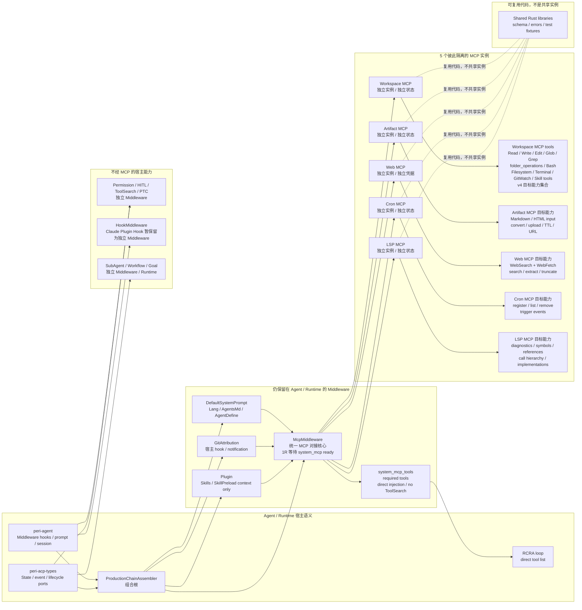

# MCP 适配清单（v4-part-1）

> 状态：已批准目标设计（v4-part-1）
>
> 目的：定义 MCP 适配的目标架构、System MCP 启动依赖、一等工具注入契约、隔离与复用边界，以及 middleware 拆分分类。本文件是 MCP 迁移范围与验收语义的唯一事实源；代码、协议和契约测试是当前实现行为的事实源，若与本文件冲突，必须先修正实现或明确记录本文件的变更。
>
> 规范性用语：**必须**表示不可违反的契约，**不得**表示禁止行为，**可以**表示实现选择。本文描述目标契约，不把尚未完成的迁移写成已实现能力；“目标：完全下放”等状态表示 v4 目标归属，不表示当前代码已经完成迁移。
>
> 版本范围：本文件只覆盖 v4 的 part-1。part-1 解决 MCP 实例划分、启动准入、工具注入和 middleware 归属；具体迁移批次、实现提交和现场验收不得回填到本文件，另以对应 issue 或验收记录为准。
>
> 完整性口径：下表只统计具体 `impl Middleware for ...` 类型，不统计 `ChainSlot`、目录名、目标包分组或仅被 adaptor 接入的类型。当前清单中的 `WorkflowMiddleware` 本身由 `WorkflowMiddlewareAdaptor` 包装，因此不重复列为 middleware。

## 事实源与实现状态

本文件的设计结论以以下事实源为边界：

- Agent 层链序：`peri-agent/src/session/factory.rs::ChainSlot` 与 `production_blueprint`。
- MCP 对接与工具 bridge：`peri-middlewares/src/mcp/`，生产装配入口为 `peri-middlewares/src/assembly.rs`。
- MCP 配置与协议行为：`peri-middlewares/src/mcp/config.rs`、`peri-middlewares/src/mcp/client/transport.rs` 及其契约测试。
- 当前实现验证优先级：代码与契约测试 > `docs/standards/` > 本设计文档 > 对应 active issue。本文作为 v4 目标架构文档，不替代当前实现的事实记录。

## MCP 运行形态

v4 允许两种运行形态，但不改变 MCP 实例的隔离契约：

- **Builtin MCP**：由 Peri 内部装配和调用；可以使用 `rmcp` 的内存 transport，使 client/server 在同一进程内通过内存通道通信，不启动外部 MCP 进程。
- **External MCP**：通过现有配置接入外部 stdio 或 HTTP transport。是否提供独立的宿主 CLI 暴露入口不属于本 part-1 的已实现承诺，不能把未存在的命令写成当前用法。

当前客户端缺省配置使用 `rmcp` 的 `Auto` lifecycle；显式配置 `protocolVersion` 时使用对应的严格 discovery 路径。System MCP 不得绕过协议初始化、能力协商或 transport 生命周期；协议版本策略必须与 `peri-middlewares/src/mcp/client/transport.rs` 及测试保持一致，不得在本文中把所有 MCP 连接概括为固定的单一握手版本。

无论使用 builtin 还是 external transport，每个 MCP 实例都必须保持独立的 transport、状态、凭据和 capability root；复用 Rust library、schema、错误类型或测试 fixture 不构成运行时实例复用。

## System MCP 启动依赖

v4 MCP 配置定义 `system_mcp` 标识，用于声明该 MCP 是 react loop 的启动依赖，而不是普通的延迟可用工具源：

- `system_mcp = true` 的 MCP 必须在 react loop 启动前完成 transport、initialize、能力协商和必要的健康检查。
- `McpMiddleware` 在 **1R 阶段**负责等待所有 system MCP ready；等待期间阻塞后续 loop 启动。
- 等待超过配置的 timeout 必须返回明确错误并终止本次启动，不得降级、跳过或把未知状态当作 ready。
- `system_mcp = false` 或未标识的 MCP 可以按普通 MCP 生命周期建立，不阻塞 react loop 启动。
- `system_mcp` 只表达启动依赖等级，不改变 MCP 的隔离边界；每个 MCP 仍拥有独立 transport、运行时实例、状态、凭据和 capability root。

### `system_mcp_tools` 一等工具注入

与 `system_mcp` 配套增加一等配置 key：`system_mcp_tools`，值为该 System MCP 必须提供的工具名数组。它描述的是启动期必需工具，不是普通工具搜索提示。

```json
{
  "mcpServers": {
    "workspace": {
      "system_mcp": true,
      "system_mcp_tools": ["Read", "Write", "Edit", "Glob", "Grep"]
    }
  }
}
```

契约如下：

- `system_mcp_tools` 只能与 `system_mcp = true` 配合使用；没有 `system_mcp` 时配置非法。
- MCP 完成协议初始化、能力协商和 `tools/list` 后，`McpMiddleware` 必须逐项确认数组中的工具存在；具体协商版本遵循当前 transport 配置和客户端 lifecycle 契约。
- 所有必需工具确认 ready 后，直接把对应 tool declaration/bridge 注入 RCRA loop 的工具列表；这些工具不是 deferred tool，不经过 `ToolSearchMiddleware`，也不需要模型先搜索。
- 工具名应在所属 MCP 的命名空间内匹配；对 Agent 暴露时继续使用现有 MCP effective tool name，避免不同 MCP 的同名工具冲突。
- 任一必需工具缺失、工具 schema 无法解析、initialize 失败或等待超时，都必须在 1R 返回明确错误并阻止 react loop 启动。
- `system_mcp_tools` 为空数组表示该 System MCP 只要求连接 ready，不向 RCRA 直接注入工具。

## 最小 MCP 隔离设计

**最小合理数量：5 个相互隔离的 MCP 实例**，而不是让每个 middleware 各自实现一套 MCP 协议：

1. **Workspace MCP**：复用现有 `side-projects/local-mcp-server`，提供本地 workspace/process 能力。
2. **Artifact MCP**：单独提供 HTML/Markdown 内容发布、转换、TTL 和公开 URL 能力。
3. **Web MCP**：将 `WebSearch` 与 `WebFetch` 合并，提供外部网页搜索和抓取能力。
4. **Cron MCP**：提供定时任务注册、查询、删除和触发事件能力。
5. **LSP MCP**：提供代码智能、诊断、符号、引用和调用关系能力。

MCP 是最小隔离单位：这 5 个 MCP 可以复用 Rust library、schema、错误类型和测试工具，但不能复用运行时实例、进程、状态、凭据、capability root 或 client pool。不同 MCP 之间不互相调用；如果需要传递内容、文件变更或触发事件，由 Agent/Runtime 分别调用 MCP，并通过宿主端口接收结果。


### 复用边界

| 能力 | 目标 MCP | 说明 |
| --- | --- | --- |
| 文件读取、目录扫描、文件写入 | Workspace MCP | `AgentsMd`、`AgentDefine`、Filesystem、Terminal、GitWatch 等文件/进程/工作区观察能力的 v4 目标归入 Workspace MCP；每个 MCP 实例拥有独立的 capability root 和状态。 |
| Skills 工具 | Workspace MCP | `SkillTool` / `DiscoverSkillsTool` 下放到 Workspace MCP 工具包；`SkillsMiddleware` / `SkillPreloadMiddleware` 只保留宿主侧 prompt/context、冻结摘要和预加载语义，不再直接提供 Skill 工具。 |
| 本地命令与 Git 查询 | Workspace MCP | `FilesystemMiddleware`、`TerminalMiddleware`、`GitWatchMiddleware` 的工具/工作区观察能力目标归入 Workspace MCP；`GitAttribution` 只复用 Workspace MCP 的查询能力，hook、notification 和归属注入仍由宿主持有。 |
| Default system prompt | 部分复用 Workspace MCP | 当前基础段通过 `include_str!` 在编译期嵌入，不能简单改成 MCP `Read`；只有运行时 persona、language、项目指引等文件读取适合调用 Workspace MCP，prompt 合并、优先级、冻结和缓存仍属于 middleware/Agent。 |
| Artifact 发布 | Artifact MCP | Agent/Runtime 显式准备内容后调用 Artifact MCP；Artifact MCP 只处理显式传入的内容，不能访问 Workspace MCP 的文件系统，也不能共享 Workspace MCP 的 capability root。 |
| Web 搜索与抓取 | Web MCP | `WebSearch` 与 `WebFetch` 可以共享代码和协议面，但运行时使用独立的 Web MCP 进程、网络策略和凭据。 |
| Cron 调度 | Cron MCP | `CronMiddleware` 可迁移为独立 Cron MCP；注册表和触发器留在 Cron MCP 内，Agent 只通过工具请求和宿主事件端口接入。 |
| LSP 代码智能 | LSP MCP | `LspMiddleware` 可迁移为独立 LSP MCP；LSP server pool 和诊断状态留在 LSP MCP 内，文件变更同步由 Agent/Runtime 显式发送。 |
| Plugin MCP/Skills 配置 | Workspace MCP + 宿主语义 | 可以调用 Workspace MCP 读取 manifest 和配置文件，但来源合并、命名空间、去重和插件生命周期仍属于 Plugin/MCP adapter。 |
| Approval、Question、Hook、SubAgent、Workflow、Goal | 不经这 5 个 MCP | 这些需要交互 broker、Agent state、外部 runtime 或宿主生命周期，强行映射为 MCP 会损失契约并扩大权限。 |

因此“最小合理数量”是**5 个彼此隔离、互不调用的 MCP 实例**，不是 28 个 middleware 对应 28 个 MCP server；代码可以复用，MCP 运行时不能复用：Workspace MCP 负责本地能力，Artifact MCP 负责发布，Web MCP 负责外部信息读取，Cron MCP 负责调度，LSP MCP 负责代码智能，其余 middleware 通过 `peri-agent` / `peri-acp-types` 的宿主 seam 直接实现。

## 完整列表

状态标识：**目标：完全下放** = v4 目标是将该 middleware 的能力整体归入目标 MCP；**目标：部分下放** = 只有文件/工具等子能力进入 MCP，Agent hook、prompt、state 或生命周期仍保留；**宿主保留** = 继续由 Agent / Runtime 直接持有。这里的“目标”不表示当前实现已经完成迁移。

| 顺序 | Middleware 类型 | 当前源码 | 迁移状态 | 一句话说明 |
| ---: | --- | --- | --- | --- |
| 1 | `DefaultSystemPromptMiddleware` | `peri-middlewares/src/default_system_prompt/mod.rs` | 部分下放 | 文件载体可由 Workspace MCP 读取，但 prompt contribution、合并、优先级、冻结和缓存仍由 Agent 持有。 |
| 2 | `LangMiddleware` | `peri-middlewares/src/default_system_prompt/mod.rs` | 宿主保留 | 语言段落属于 Agent prompt 装配语义，不应下放为 Workspace MCP 工具。 |
| 3 | `ImageMiddleware` | `peri-middlewares/src/middleware/image/mod.rs` | 宿主保留 | 图片输入解析直接依赖 Agent message/content 类型，属于消息处理而非 Workspace MCP 能力。 |
| 4 | `AgentsMdMiddleware` | `peri-middlewares/src/agents_md/mod.rs` | 部分下放 | 文件读取可由 Workspace MCP 完成，但文档优先级、session 冻结和 prompt contribution 仍由 Agent 持有。 |
| 5 | `AgentDefineMiddleware` | `peri-middlewares/src/agent_define/mod.rs` | 部分下放 | 定义文件可由 Workspace MCP 读取，但 Agent 定义解析和 SubAgent/Plugin 语义仍由宿主持有。 |
| 6 | `AtMentionMiddleware` | `peri-middlewares/src/at_mention/mod.rs` | 宿主保留 | `@mention` 输入转换依赖 Agent 消息内容和工具上下文，不是 Workspace MCP 工具。 |
| 7 | `GitWatchMiddleware` | `peri-middlewares/src/git_watch/mod.rs` | 目标：完全下放 → Workspace MCP | Git 状态观察、分支变化检测、采样和工作区 watcher 统一进入 Workspace MCP，Agent 侧不再保留 GitWatch middleware。 |
| 8 | `GitAttributionMiddleware` | `peri-middlewares/src/attribution/mod.rs` | 部分下放 | Git/file 查询由 Workspace MCP 提供，但 before/after tool hook 和归属注入仍由 Agent 持有。 |
| 9 | `ArtifactMiddleware` | `peri-middlewares/src/artifact/mod.rs` | 目标：完全下放 → Artifact MCP | Artifact 的读取输入、格式转换、上传、TTL 和 URL 统一进入 Artifact MCP，Agent 侧只保留 MCP 对接。 |
| 10 | `WebMiddleware` | `peri-middlewares/src/middleware/web.rs` | 目标：完全下放 → Web MCP | `WebSearch` 与 `WebFetch` 统一进入 Web MCP，Agent 侧只保留 MCP 对接。 |
| 11 | `TodoMiddleware` | `peri-middlewares/src/middleware/todo.rs` | 部分下放 | Todo 文件/工具操作可由 Workspace MCP 执行，但 todo channel 与 session/UI 状态回写仍由宿主注入。 |
| 12 | `CronMiddleware` | `peri-middlewares/src/cron/middleware.rs` | 目标：完全下放 → Cron MCP | scheduler、后台 tick、取消、注册/查询/删除和触发事件统一进入 Cron MCP，Agent 侧只保留 MCP 对接和事件接收。 |
| 13 | `LspMiddleware` | `peri-middlewares/src/lsp/middleware.rs` | 目标：完全下放 → LSP MCP | LSP server pool、诊断状态、符号/引用查询和文件变更同步统一进入 LSP MCP，Agent 侧只保留 MCP 对接。 |
| 14 | `WorkflowMiddlewareAdaptor` | `peri-middlewares/src/workflow/mod.rs` | 独立 Middleware | Workflow executor、progress、通知、kill/resume 和 session 生命周期属于 Runtime，不下放到 MCP。 |
| 15 | `FilesystemMiddleware` | `peri-middlewares/src/middleware/filesystem.rs` | 目标：完全下放 → Workspace MCP | filesystem 工具、workspace path 解析、读写和目录操作统一进入 Workspace MCP，Agent 侧只保留 MCP 对接。 |
| 16 | `TerminalMiddleware` | `peri-middlewares/src/middleware/terminal.rs` | 目标：完全下放 → Workspace MCP | terminal/Bash 工具、进程执行和任务输出统一进入 Workspace MCP，Agent 侧只保留 MCP 对接。 |
| 17 | `PtcMiddleware` | `peri-middlewares/src/ptc/mod.rs` | 独立 Middleware | JS runtime、session-local tool bridge、权限和 effective tool dispatch 必须由 Agent/Runtime 持有，不下放到 MCP。 |
| 18 | `HumanInTheLoopMiddleware` | `peri-middlewares/src/hitl/mod.rs` | 独立 Middleware | Question broker、工具注册、取消和 ACP/TUI 交互通道属于宿主交互生命周期，不下放到 MCP。 |
| 19 | `PermissionMiddleware` | `peri-middlewares/src/permission/mod.rs` | 独立 Middleware | Permission mode、effective tool name、ToolSearch、Hook 和 broker 构成宿主安全边界，不下放到 MCP。 |
| 20 | `HookMiddleware` | `peri-middlewares/src/hooks/middleware.rs` | 独立 Middleware | Claude Plugin Hook 暂时继续作为 Middleware 执行，不定义为 MCP；hook loader、executor、Permission、Plugin、Agent event/state 和 command 执行端口属于宿主。 |
| 21 | `SkillsMiddleware` | `peri-middlewares/src/skills/mod.rs` | 部分下放 | Skill 文件发现和读取进入 Workspace MCP，但 skill roots、Plugin 来源、冻结摘要和 MCP registry 仍由宿主持有。 |
| 22 | `SkillPreloadMiddleware` | `peri-middlewares/src/subagent/skill_preload.rs` | 部分下放 | Skill 文件读取进入 Workspace MCP，但 SubAgent 输入、预加载顺序和取消生命周期仍由宿主持有。 |
| 23 | `PluginMiddleware` | `peri-middlewares/src/plugin/middleware.rs` | 部分下放 | Plugin manifest 文件可由 Workspace MCP 读取，但来源合并、命名空间、hooks、agents、commands 和生命周期仍由宿主持有。 |
| 24 | `ToolSearchMiddleware` | `peri-middlewares/src/tool_search/middleware.rs` | 独立 Middleware | deferred tool、MCP、Permission、PTC 和 SubAgent 的工具目录属于 Agent 工具编排，不下放到 MCP。 |
| 25 | `McpMiddleware` | `peri-middlewares/src/mcp/middleware.rs` | 独立 Middleware | 它是统一 MCP 对接核心，并在 1R 阶段等待 `system_mcp` 完成 ready；超时必须报错并阻止 react loop 启动。 |
| 26 | `DynamicMcpMiddleware` | `peri-middlewares/src/mcp/dynamic/tool.rs` | 独立 Middleware | session-scoped registry、动态工具目录、取消、权限和 projection lease 属于 MCP 对接宿主。 |
| 27 | `SubAgentMiddleware` | `peri-middlewares/src/subagent/mod.rs` | 独立 Middleware | parent/child session、fork/resume、取消、事件、frozen context、hooks、skills、tools 和 MCP activation 属于 Runtime，不下放到 MCP。 |
| 28 | `GoalMiddleware` | `peri-middlewares/src/goal_middleware.rs` | 独立 Middleware | controller、Goal tool、system prompt steering 和 session 生命周期属于 Agent/Runtime，不下放到 MCP。 |

## 不属于实际 Middleware 实现、但迁移时会受影响的类型

以下类型没有自己的 `impl Middleware for ...`，因此不计入上表，但会影响对应 middleware 的拆包：

- `WorkflowMiddleware`：`peri-middlewares/src/workflow/mod.rs`，由 `WorkflowMiddlewareAdaptor` 接入链。
- `CronScheduler`：`peri-middlewares/src/cron/`，迁移后应成为 Cron MCP 内部状态，Agent 只通过 MCP 工具和宿主事件端口接入。
- `LspServerPool`：由 `peri-resources` 提供，迁移后应成为 LSP MCP 内部状态，Agent/Runtime 通过 MCP 请求与文件变更同步端口接入。
- `McpClientPool`、`McpTaskOwner`、`DynamicMcpRegistry`：`peri-middlewares/src/mcp/`，由 `McpMiddleware` 和 `DynamicMcpMiddleware` 使用。
- `SkillTool`、`DiscoverSkillsTool`、`SubAgentTool`、各类 filesystem/web/terminal 工具：由对应 middleware 的 `collect_tools` 提供，不是单独的 middleware。
- `ProductionChainAssembler`：`peri-middlewares/src/assembly.rs`，是所有 middleware 的组合根，不是 middleware；迁移时应保留为装配层。

## v4-part-1 验收契约

实现 v4-part-1 时，至少必须验证以下可观察结果；测试应在 MCP transport、宿主装配和 RCRA 工具视图的实际 seam 上断言，不以静态清单代替运行时验证：

1. 配置解析拒绝没有 `system_mcp = true` 却声明 `system_mcp_tools` 的配置，并保留明确错误。
2. System MCP 在 transport、协议初始化、能力协商和必需工具检查完成前，不得进入可启动的 react loop；任一失败或 timeout 都返回错误，不发布 ready。
3. `system_mcp_tools` 的每个工具都经过所属 MCP namespace 解析，工具 schema 可构造为 bridge，并直接出现在 RCRA 工具列表；普通 deferred tool 仍走既有 `ToolSearchMiddleware` 路径。
4. 必需工具为空数组时只验证 System MCP ready，不注入额外工具。
5. 五个目标 MCP 的 transport、状态、凭据、capability root 和 client pool 不共享；MCP 之间不得通过隐式调用建立依赖。
6. 对宿主保留的 Permission、HITL、Hook、SubAgent、Workflow、Goal 和 PTC 能力，迁移设计不得绕过既有 cancel、审批、事件、session 或 effective tool name 契约。
7. v4 目标归属未完成迁移前，当前实现和文档必须能区分“目标归属”与“已落地能力”，不得以绿色的局部单测宣告整体迁移完成。

验证范围由对应实现 issue 记录；本文件只定义必须满足的行为契约，不保存某一次执行的勾选状态、耗时或提交号。

## 完整性依据

完整性依据为：

- Agent 层链序事实源：`peri-agent/src/session/factory.rs::ChainSlot` 与 `production_blueprint`。
- 实际实现搜索：`peri-middlewares/src/**/*.rs` 中的 `impl Middleware for ...`。
- 生产装配入口：`peri-middlewares/src/assembly.rs`。
- MCP 协议与配置事实源：`peri-middlewares/src/mcp/config.rs`、`peri-middlewares/src/mcp/client/transport.rs` 及其测试。
