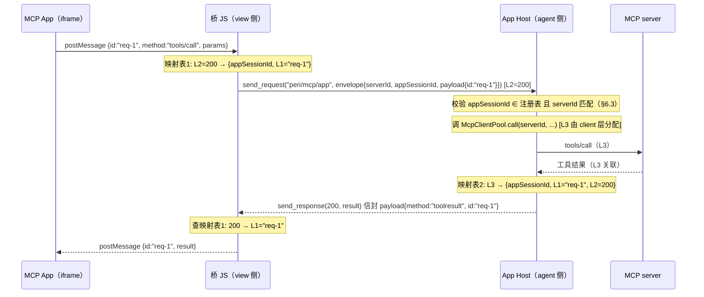
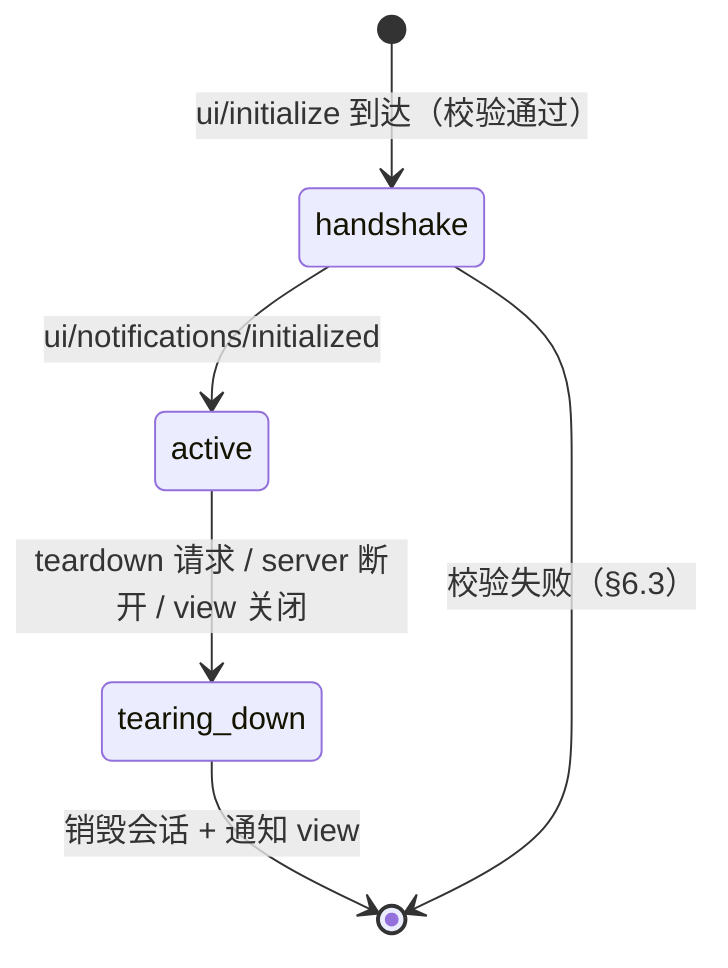

# MCP 透传信道设计（单 ACP 连接上的多路数据分离）· 定稿

> 本文件是「外部 MCP server ↔ view 层」透传信道的设计定稿，回答一个问题：**ACP 只有一条连接，多个 MCP server 的数据（App 交互、工具结果、通知）如何在这条信道上分离路由，保证数据正确送达正确的接收方。**
>
> 最后核对：2026-08-14
> 状态：**设计定稿但无实施计划**——本文为 MCP Apps 专属设计（guide §6、§9.2）；MCP Apps 当前搁置（guide §9.6 决策），实施与否随其评估结果
> 关联文档：`docs/design/mcp-connector-guide-v2.md`（MCP 生态定位，§6 MCP Apps、§9 内部落地、§9.6 支持度矩阵）；`docs/design/peri-acp-protocol.md`（ACP 协议）
> 本文是设计说明，不是规范；不搬运规范原文。

## 目录

- [1. 目标与范围](#1-目标与范围)
- [2. 信道现状（代码事实）](#2-信道现状代码事实)
- [3. 设计决策总览](#3-设计决策总览)
- [4. 信封与消息类型](#4-信封与消息类型)
- [5. id 映射：数据正确性的核心](#5-id-映射数据正确性的核心)
- [6. App 会话生命周期与鉴权](#6-app-会话生命周期与鉴权)
- [7. 分流规则（防双写）](#7-分流规则防双写)
- [8. 错误语义](#8-错误语义)
- [9. 可靠性：超时 / 背压 / 协议版本](#9-可靠性超时--背压--协议版本)
- [10. 落地清单与前置依赖](#10-落地清单与前置依赖)
- [11. 未决问题](#11-未决问题)

## 1. 目标与范围

### 1.1 要解决的问题

- ACP 连接**只有一条**（TUI ↔ ACP Server 为 `MpscTransport`，外部 IDE 为 `StdioTransport`），传输层是纯 JSON-RPC 2.0（Request / Notification / Response）。
- 需要在这条信道上承载**多个 MCP server** 的数据：MCP App（SEP-1865）的 `ui/*` 握手与 `tools/call` 回调、`ui://` 资源读取、Host → App 的推送（`host-context-changed` / `teardown`）。
- 目标：**任意时刻、任意并发 App 之间的数据互不串扰**——一个 App 发起的 `tools/call` 的结果只回到该 App，且只能调用**它所属 server** 的工具。

### 1.2 范围

- **在**：透传帧的信封结构、id 映射、会话注册与鉴权、分流规则、错误语义、可靠性。
- **不在**：MCP Apps 协议本身（`ui/initialize` 等 7 个方法，见 guide §6.3）；iframe 渲染与桥 JS 内部实现细节；HITL 权限机制（共用现有执行路径，不重新设计）。

### 1.3 设计原则（沿用 guide §6.2/§9.2 既有结论）

1. **payload 保留 MCP 原始消息**：view 侧剥掉信封即得协议原文，与 App 的 postMessage 层直接对接，两端都不二次序列化。
2. **透传不绕过安全模型**：App 发起的 `tools/call` 与 agent 发起的工具调用共用同一执行路径与 HITL 权限。
3. **view 不接触 MCP**：view 不持有 MCP 连接、不猜测协议版本；所有 MCP 侧信息由 agent 侧填充。

## 2. 信道现状（代码事实）

设计必须基于以下已验证事实，避免「设计落不了地」：

| 事实 | 位置 | 含义 |
| --- | --- | --- |
| `AcpTransport` 是**双向**的：`send_request` / `send_notification` / `recv` / `send_response` | `peri-acp/src/transport/mod.rs` | 传输层已具备 view → agent 的 request/response 能力，无需新传输 |
| `RequestRouter`：全局递增 i64 id + pending map（oneshot 匹配 Response） | `peri-acp/src/transport/router.rs` | 传输层 id 空间是**单一共享**的；String id 不参与匹配（落 unmatched 转发路径） |
| 事件链是 agent → view **单向 notification**（`session/update`、`peri/agent_event*`、`peri/unstable-event`） | `peri-acp/src/session/event_sink.rs` | 事件链不能承载「需要响应的请求」；透传请求必须走 `send_request`/`send_response` |
| `McpClientPool` 以 `server_name`（String）为 key | `peri-middlewares/src/mcp/client.rs` | `server_name` 是 MCP 侧唯一路由键 |
| 订阅通知（server → agent）默认**进 agent inbox、不进 view** | guide §9.1，`McpSubscriptionPort` | 已避开通知风暴；本文不改变该决策 |
| 工具名 `mcp__<server>__<tool>` 携带 server 前缀 | guide §3.4 | view 可从工具名解析 `serverId`，事件链无需新增字段即可关联 server |
| 现有 ACP 方法名空间：`session/*`、`plugin/*`、`peri/agent_event*`、`mcp/oauth_*`、`marketplace/*`、`elicitation/create` | guide §9.2 | 新方法名必须避开全部既有前缀 |
| 代码中**不存在** `serverId` / `appSessionId` 字段 | 全仓 grep | 透传信封与会话注册表是全新代码，无既有约定可破坏 |

## 3. 设计决策总览

| # | 决策点 | 选择 | 理由 |
| --- | --- | --- | --- |
| D1 | 外层方法名 | **包装**：`peri/mcp/app`、`peri/mcp/resource`（否决定稿前 guide §9.2 的「倾向裸传」） | 见 3.1 |
| D2 | 信封字段 | `serverId` + `appSessionId` + `protocolVersion` + `payload` | 见第 4 章 |
| D3 | id 空间 | 三层（App 原始 id / ACP 传输层 id / MCP server id），**payload.id 恒为 App 原始 id** | 见第 5 章 |
| D4 | 请求-响应关联 | 外层 request 用传输层 id（`RequestRouter` 机制），agent 侧维护 `server 请求 → (appSessionId, 原始 id)` 映射 | 见 5.2 |
| D5 | App 会话 | agent 侧进程级注册表 `appSessionId → {serverId, resourceUri, state}`，握手时创建 | 见第 6 章 |
| D6 | 防双写 | agent 发起的调用走事件链；App 发起的调用只走透传 | 见第 7 章 |
| D7 | 错误分界 | envelope 校验错用 ACP 层错误码（`-32000` 系列）；MCP 协议错误原样透传 | 见第 8 章 |
| D8 | 背压 | App 事件天然低频 + 同类通知 coalesce；不做硬隔离（列为未决） | 见 9.2 |
| D9 | 协议版本 | `protocolVersion` 由 agent 侧从 server 协商结果填充，view 不猜 | 见 9.3 |

### 3.1 D1：为什么包装，而不是裸传（对 §9.2 的修订）

guide §9.2 原方案倾向「外层方法名直接用 MCP 原文（`toolresult`、`ui/initialize`）」。定稿改为**包装一层**，理由基于代码事实：

1. **方法名空间平铺共享**：`session/*`、`plugin/*`、`marketplace/*`、`mcp/oauth_*` 都在同一信道。裸传 `tools/call`、`ui/initialize` 与 ACP 原生方法名无结构性区分——view 侧桥 JS 必须维护一份「MCP 方法名白名单」才能分辨「剥信封」与「正常处理」，而白名单会随 MCP 规范演进失效。
2. **`mcp/` 前缀已被占用**：`mcp/oauth_*` 占用了 `mcp/` 前缀（guide §6.2 已知冲突点）。裸传方案必须与 `mcp/oauth_*` 共存或改名，包装用 `peri/mcp/` 天然避让。
3. **参照系一致**：grok-build 选择 `x.ai/mcp/*` 包装（guide §9.2 记录），非裸传。
4. **成本为零**：包装只是信封——`payload` 仍是 MCP 原始消息（原则 1 不破），view 剥信封即得原文。

**取舍代价**：view 侧桥 JS 多一次信封编解码（约 10 行），换来方法名空间的确定性隔离。值。

## 4. 信封与消息类型

### 4.1 信封结构（双向通用）

```jsonc
{
  "method": "peri/mcp/app",        // 透传方法（App 交互）
  "id": 100,                       // 仅 request 携带；notification 省略（JSON-RPC 2.0）
  "params": {
    "serverId": "github",          // 路由键：McpClientPool 的 key
    "appSessionId": "app_01H4X...",// 路由键：App 会话（握手后存在，见第 6 章）
    "protocolVersion": "2026-07-28", // 该 server 协商的 MCP 协议版本（agent 填充）
    "payload": {                   // MCP 原始 JSON-RPC 消息，不做任何改写
      "method": "tools/call",
      "params": { "name": "list_issues", "arguments": {} },
      "id": "req-1"                // App 侧原始 id（L1），见第 5 章
    }
  }
}
```

资源读取（view 拉 `ui://` HTML 渲染）不依赖 App 会话，单独方法：

```jsonc
{
  "method": "peri/mcp/resource",
  "id": 101,
  "params": {
    "serverId": "github",
    "uri": "ui://get-time/mcp-app.html"
  }
}
```

### 4.2 消息类型矩阵

| 方向 | 类型 | 方法 | 对应 MCP Apps 语义 |
| --- | --- | --- | --- |
| view → agent | request | `peri/mcp/app` | App 的 `ui/initialize`、`tools/call` 等请求 |
| view → agent | notification | `peri/mcp/app` | App 的 `ui/notifications/*`（size-changed 等） |
| view → agent | request | `peri/mcp/resource` | view 拉取 `ui://` HTML |
| agent → view | response | —（以传输层 id 关联） | 上述 request 的响应；`payload.id` 为 App 原始 id |
| agent → view | notification | `peri/mcp/app` | Host → App 推送：`ui/notifications/host-context-changed`、`teardown` 等 |

**方向识别**：JSON-RPC 连接上同一方法名双向可用，接收方按「自己是谁」解析 `payload.method`（view 收到 `peri/mcp/app` 一定是 Host → App 推送；agent 收到一定是 App → Host 消息），无需额外方向字段。

### 4.3 约束

- `peri/mcp/*` 前缀**保留**：未来新增透传能力（如 `resources/read` 回调）只在 `peri/mcp/` 下加方法名，不与既有命名空间冲突。
- envelope 未知字段忽略（JSON-RPC 宽容原则），但 `serverId` / `payload` 必填，缺失按 §8 错误处理。

## 5. id 映射：数据正确性的核心

### 5.1 三层 id 空间

| 层 | id 由谁分配 | 形态 | 用途 |
| --- | --- | --- | --- |
| L1 | App（iframe 内） | string 或 number，App 自选 | postMessage 层的请求 id |
| L2 | ACP `RequestRouter` | 全局递增 i64 | 单信道上的请求-响应关联 |
| L3 | rmcp client（McpClientPool 内部） | client 层管理 | agent ↔ server 的请求-响应关联 |

**不变量**：`payload.id` 恒为 **L1（App 原始 id）**。L2、L3 只存在于外层信封与 agent 内部映射表中，永不出现在 payload 里。这是「payload 保留 MCP 原始消息」原则的直接推论——view 与 agent 都不改写 payload，两端各自维护自己的外层映射，避免双重映射错误。

### 5.2 一次 `tools/call` 的完整旅程



### 5.3 映射表规则

- **view 侧（桥 JS）**：`L2 → {appSessionId, L1}`。request 发出时写入，response 到达时取出并还原 L1，随后删除。表项带 TTL（与 agent 侧一致，见 §9.1），超时视为信道错误。
- **agent 侧（App Host）**：`L3 → {appSessionId, L1, L2}`。向 server 发请求时写入，server 响应到达时取出，构建响应信封（`payload.id` 还原为 L1），经 `transport.send_response(L2)` 返回。
- 两个方向**互不共享映射表**：view 侧映射与 agent 侧映射是各自独立的（中间隔着 L2 关联），这是单信道多路复用不串扰的结构保证。

### 5.4 并发正确性

- 多个 App 并发时：L2 全局唯一（RequestRouter 递增），L1 可能重复（两个 App 都用 `"req-1"`）——**L1 重复不冲突**，因为每个 App 的请求绑定唯一 L2，agent 侧映射表 key 是 L3（唯一），view 侧映射表 key 是 L2（唯一）。
- 同一 App 内并发多个请求：L2 不同，互不干扰。
- `payload.id` 为 string 时同样成立（L2 是数字，映射表 key 与 payload 内容无关）。

## 6. App 会话生命周期与鉴权

### 6.1 会话注册表（agent 侧，进程级）

```rust
struct AppSession {
    app_session_id: String,      // 握手时由 agent 生成（uuid）
    server_id: String,           // McpClientPool key
    resource_uri: String,        // ui:// 资源 URI（创建依据）
    state: AppSessionState,      // handshake / active / tearing_down
    created_at: Instant,
}
```

- 存储：进程级 `RwLock<HashMap<String, AppSession>>`（与 `McpClientPool` 同生命周期）。
- 与 `McpSubscriptionPort` 的 inbox 注册**不同**：透传不按 session 注册，App 会话是进程级（server 是进程级共享的）。

### 6.2 状态机



### 6.3 鉴权校验（防跨 server 冒充的关键）

agent 侧收到 `peri/mcp/app` 时按序校验，任一失败按 §8 返回：

1. **会话存在**：`appSessionId` 在注册表中（`ui/initialize` 之前没有会话 → 仅 `ui/initialize` 允许「无会话」状态）。
2. **归属一致**：信封 `serverId` == 会话注册的 `server_id`。**这一步防止恶意 App（或被劫持的桥 JS）伪造 `serverId` 调用别的 server 的工具。**
3. **状态合法**：`tools/call` 要求 `state == active`；`ui/initialize` 要求无既有会话。
4. **server 存在**：`serverId` 在 `McpClientPool` 中（`peri/mcp/resource` 也校验此项）。

`ui/initialize` 握手校验（对齐 guide §6.3 实验事实）：

- `payload.params.appInfo` 必含 `name` + `version`（缺 version 报 `-32603`）。
- 会话创建依据：`appInfo.name` 应能在该 server 的 `ui://` 资源列表中匹配（宽松校验，列表缓存于握手前一次 `resources/list`）；匹配失败仅警告不拒绝（资源列表可能未刷新），但 `serverId` 必须属于已知 server。
- 成功后 response 携带 `appSessionId` 与 `protocolVersion`，view 侧桥 JS 保存用于后续透传。

### 6.4 teardown 触发

| 触发源 | agent 侧动作 | view 侧动作 |
| --- | --- | --- |
| App 主动 teardown（notification） | 销毁会话 | 关闭 iframe |
| server 断开 / 重连失败（`McpClientPool` 状态变化） | 销毁该 server 全部会话，发 `teardown` 推送 | 关闭 iframe 并提示 |
| view 关闭（连接断开） | 按连接清理会话 | — |

## 7. 分流规则（防双写）

| 数据 | 通道 | 依据 |
| --- | --- | --- |
| agent 发起的工具调用结果（带 `ui.resourceUri`） | 事件链（现状，不变） | guide §9.4；view 从工具名 `mcp__<server>__<tool>` 解析 serverId |
| App 发起的 `tools/call` 结果 | 透传 response（**不进事件链**） | 双写会致 view 收两份结果 |
| `ui://` HTML 内容 | `peri/mcp/resource` 响应（**不进事件链**） | 渲染数据不是事件 |
| 订阅通知（`resources/updated` 等） | agent inbox（现状，不变） | guide §9.1 已定：通知默认进 agent 不进 view |
| server 上下线 | 事件链 `SystemNotification`（现状，不变） | `event_sink.rs` 已有该通道 |

**唯一的新增双写风险点**：App 发起的 `tools/call` 若同时走「共用执行路径」的事件链发射与透传 response，view 会收到两份。定稿规则：**执行路径共用（含 HITL），发射路径分流——App 发起的调用只走透传，不进事件链**。

## 8. 错误语义

| 类别 | 错误码 | 说明 |
| --- | --- | --- |
| envelope 校验失败（§6.3 任一） | `-32001` invalid_app_session / `-32002` forbidden / `-32003` unknown_server | ACP 层错误，`data` 携带原因；payload 不执行 |
| 透传请求超时（§9.1） | `-32000` timeout | agent 侧（server 无响应）与 view 侧（agent 无响应）各自计时 |
| MCP 协议错误（`-32602` 参数错等） | **原样透传** | 封装进 response 的 error 字段，view 不拦截 |
| 工具执行错误（`isError: true` 结果） | **原样透传** | 属正常业务结果，模型/App 自纠 |

**view 侧桥 JS 分界规则**：response 的 error code 在 `-32000` ~ `-32099` 视为**信道错误**（提示/重试/关闭 App）；其余（含 `-32600` 系列）视为 MCP 侧错误，透传给 App 原样处理。

## 9. 可靠性：超时 / 背压 / 协议版本

### 9.1 超时

- 两侧 pending 表统一 TTL：**60s**（App 交互场景足够；agent 发起的工具调用走事件链，不受此限）。
- 超时处理：agent 侧回 `-32000` 并清理映射表与（可能的）server 侧挂起请求；view 侧按信道错误提示。
- 不做重试（业务语义由 App 决定），避免重复执行副作用。

### 9.2 背压

- **现状**：透传 response/notification 与事件链共用 transport（同一条 mpsc/stdio）。App 事件由用户交互驱动（低频），host-context-changed 等推送量小，共用通道不会挤占事件链。
- **缓解**：同类推送 coalesce——同一 `appSessionId` 的连续同类型 notification（如 size-changed）合并最近一条。
- **未决**：若未来出现高频 App 事件（流式图表等），需要硬隔离（App 事件改走独立 notification 方法 + view 侧独立队列），见 §11。

### 9.3 协议版本

- `protocolVersion` 由 agent 侧从该 server 的协商结果填充（`McpClientPool` 持有），view 不猜、不存。
- 桥 JS 按版本分支解析 payload（当前两版在透传相关方法上差异小：`ui/*`、`tools/call`、`toolresult` 基本一致；字段差异集中在握手与订阅，未来版本演进时此字段是唯一判断依据）。
- `peri/mcp/resource` 响应不需要版本字段（内容是 MCP 原文 content）。

## 10. 落地清单与前置依赖

| # | 改动 | 位置 | 依赖 |
| --- | --- | --- | --- |
| 0 | **MCP Apps 能力声明**：client 初始化声明 `enable_extensions_with({"io.modelcontextprotocol/ui": {"mimeTypes": ["text/html;profile=mcp-app"]}})` | `peri-middlewares/src/mcp/channel_handler.rs`（当前 `ClientCapabilities::default()`） | **无——所有 App 生态的前提**：不声明则 server 不下发 `ui://` 资源 |
| 1 | `peri/mcp/app`、`peri/mcp/resource` 方法分发（view → agent 方向） | ACP 命令分发处（与 `session/*` 同入口） | 无 |
| 2 | App Host：会话注册表 + 握手校验 + teardown | `peri-middlewares/src/mcp/`（新模块，与 `McpClientPool` 同层） | 1 |
| 3 | App Host：id 映射（L3 → L1/L2）与 `tools/call` 路由（复用 `McpClientPool` + HITL） | 同上 | 1、2 |
| 4 | `peri/mcp/resource`：`resources/read` 透传（复用 `resource_tool.rs`） | 同上 | 1 |
| 5 | 桥 JS：信封编解码 + L2 → L1 映射 + 版本分支 | TUI webview 方案（guide §9.5 方案 A） | 2、3 |
| 6 | 工具结果事件携带 `ui.resourceUri`（**确认未落地**：`tool_bridge.rs` 未读取 `Tool._meta`） | 事件链 tool_result | guide §9.4 |

**rmcp 侧支持情况（已调查，rmcp 3.1.2）**：无 MCP Apps 专用 handler（`ui/*` 消息在规范上不走 MCP 连接，由宿主侧 App Host 逻辑处理，见 §6）；但全部透传基础已在——第 0 项能力声明（`ExtensionCapabilities`）、`on_custom_request` / `on_custom_notification` 扩展点（默认 `-32601` 拒绝，安全）、`send_custom_notification`（`mcp_notify.rs` 已用）、`Tool._meta`（`_meta.ui.resourceUri` 可透传）、`resources/read`（`resource_tool.rs` 已用）。

**前置依赖确认**：guide §9.4 的「工具执行结果携带 `ui.resourceUri`」若尚未落地，需先行（本次设计不改变事件链结构——server 关联靠工具名解析，无需新增事件字段）。

## 11. 未决问题

1. **高频 App 事件的硬隔离**（§9.2）：透传与事件链共用通道的容量上限未量化；流式 App 出现时需评估独立队列方案。
2. **多 view 连接共存**：当前 TUI 与 ACP Server 一对一（MpscTransport）。未来 stdio 外部 IDE 与 TUI 并存时，App 会话注册表按连接隔离还是全局？（`peri/mcp/*` 信封暂不带 sessionId，届时需评估。）
3. **teardown 与重连的竞态**：server 重连期间 App 会话的处理策略（销毁重来 vs 挂起等待）未定。
4. **`appInfo.name` ↔ `ui://` 资源匹配的严格度**：§6.3 当前取宽松校验，是否需要缓存资源列表做严格校验，取决于多 server 同名 App 的实际冲突概率。
