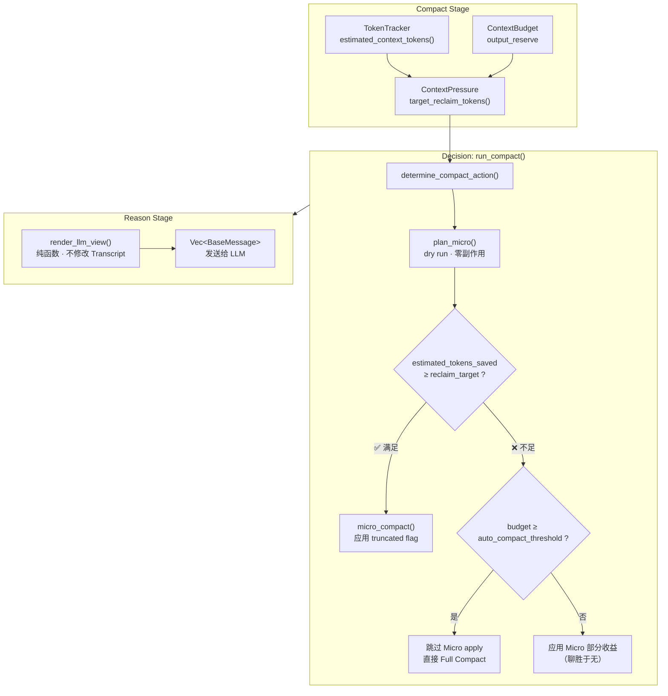
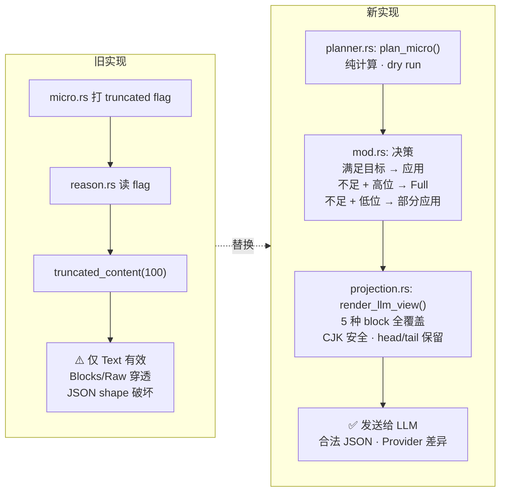
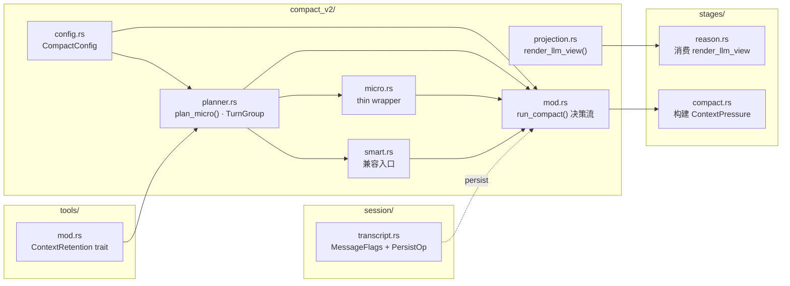
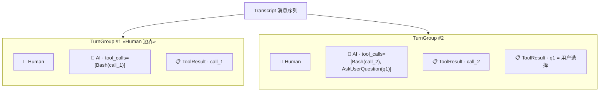

# Micro Compact 改进实施文档

> 状态：实施完成  
> 日期：2026-07-25  
> 范围：`peri-agent` v2 Compact pipeline 的 Micro Compact 全面重写。

## 1. 摘要

原建议稿（2026-07-25 同日提出）识别了 Micro Compact 在三个阶段未形成闭环的问题——选择、投影、效果度量。经过 8 个 Task 的完整实施，所有 P0/P1/P2 问题已修复，4 个 Phase 全部完成。核心变化：

1. **投影引擎**：`render_llm_view()` 纯函数，不修改 Transcript，按 `ProjectionTarget` 粒度（Message / ContentBlock / ToolCall）应用投影动作；
2. **TurnGroup/ToolExchange**：显式消息分组，Human 边界 + tool_use↔ToolResult 配对；
3. **ContextPressure**：替换百分比触发，用 `target_reclaim_tokens()` 的 `saturating_sub` 作为回收目标；
4. **Dry-run 决策**：`plan_micro()` 先运行（零副作用），`estimated_tokens_saved >= reclaim_target` 决定是否应用；
5. **ContextRetention**：`BaseTool::context_retention()` trait 方法，四种分类替代集中式黑名单；
6. **ProviderCapabilities**：OpenAI/Anthropic 差异化投影规则；
7. **批量持久化**：`PersistOp::ApplyCompactionBatch` 单次 cache invalidation；
8. **Shadow mode**：`config.shadow_mode_enabled` 估算不应用；
9. **Cache-aware**：高缓存命中 + 充足 headroom 时跳过 compact。

## 2. 实际实现架构

### 2.1 整体数据流



### 2.2 新旧对比：投影 pipeline



### 2.3 文件职责

| 文件 | 职责 |
|------|------|
| `agent/compact_v2/projection.rs` | 投影类型定义 + `render_llm_view()` 纯函数 + `project_message/project_block/project_tool_input` |
| `agent/compact_v2/planner.rs` | `ContextPressure` + `TurnGroup/ToolExchange` + `plan_micro()` 纯函数 + `CompactPolicy` + `ApplyReport` |
| `agent/compact_v2/mod.rs` | `run_compact()` 决策流（dry-run + skip-Micro-when-Full + cache-aware） |
| `agent/compact_v2/micro.rs` | `micro_compact()` 收缩为 thin wrapper，调用 `plan_micro()` + 应用 truncated flag |
| `agent/compact_v2/smart.rs` | `smart_compact()` 通过 `plan_micro()` 生成计划 + 应用，返回 `(affected, estimated_tokens_saved)` |
| `agent/compact_v2/config.rs` | 新增 `tool_retention_map`、`shadow_mode_enabled`、`cache_aware_enabled` |
| `session/transcript.rs` | `MessageFlags.projection` 字段 + `PersistOp::ApplyCompactionBatch` + 批量恢复 |
| `thread/sqlite_store.rs` | `projection TEXT` 列迁移 + 读写 |
| `agent/stages/reason.rs` | 替换 `truncated_content(100)` → `render_llm_view()` |
| `agent/stages/compact.rs` | 构建 `ContextPressure` → `run_compact` → 填充新事件字段 |
| `agent/token.rs` | `ContextBudget.output_reserve` 字段 |
| `tools/mod.rs` | `ContextRetention` enum + `BaseTool::context_retention()` |
| `llm/mod.rs` + `react.rs` | `ProviderCapabilities` trait chain |



### 2.4 关键类型（实际实现）

**`ContextPressure`**（`planner.rs`）：

```rust
pub struct ContextPressure {
    pub estimated_tokens: u64,
    pub context_window: u32,
    pub output_reserve: u32,
    pub predicted_growth: u32,
    pub safety_buffer: u32,
    pub cache_hit_rate: f64,
}

impl ContextPressure {
    pub fn target_reclaim_tokens(&self) -> u64 {
        self.estimated_tokens.saturating_sub(self.target_tokens())
    }
}
```

**`ProjectionTarget`**（`projection.rs`）：

```rust
pub enum ProjectionTarget {
    Message,
    ContentBlock { index: usize },
    ToolCall { tool_call_id: String },
}
```

**`ProjectionAction`**（`projection.rs`）：

```rust
pub enum ProjectionAction {
    Keep,
    CompactText { max_chars: usize },
    CompactToolResult { keep_head: usize, keep_tail: usize, preserve_recovery_handle: bool },
    CompactToolInput { fields: Vec<String>, preserve_shape: bool },
    ReplaceMedia { placeholder: String },
    Exclude,
}
```

**`MessageProjectionDirective`**（`projection.rs`，存储于 `MessageFlags.projection`）：

```rust
pub struct MessageProjectionDirective {
    pub policy_version: u32,
    pub entries: Vec<ProjectionActionEntry>,
}
```

**`MicroCompactPlan`**（`projection.rs`）：

```rust
pub struct MicroCompactPlan {
    pub policy_version: u32,
    pub target_reclaim_tokens: u64,
    pub actions: Vec<ProjectionActionEntry>,
    pub estimated_before_tokens: u64,
    pub estimated_after_tokens: u64,
    pub estimated_tokens_saved: u64,
}
```

**`ProviderCapabilities`**（`projection.rs`）：

```rust
pub struct ProviderCapabilities {
    pub protocol: ProviderProtocol,  // OpenAI / Anthropic / Generic
    pub signed_reasoning_must_be_whole: bool,  // Anthropic=true
}
```

**`ContextRetention`**（`tools/mod.rs`，trait 方法）：

```rust
pub enum ContextRetention { Preserve, StateBearing, SideEffectReceipt, Recomputable }
// BaseTool::context_retention() -> ContextRetention  // 默认 Preserve
```

### 2.4 API seam（实际函数签名）

```rust
// planner.rs — 纯函数，零副作用
pub fn plan_micro(transcript: &MessageTranscript, config: &CompactConfig) -> MicroCompactPlan;

// projection.rs — 纯函数，不修改 Transcript
pub fn render_llm_view(
    transcript: &MessageTranscript,
    plan: &MicroCompactPlan,
    caps: &ProviderCapabilities,
) -> AgentResult<Vec<BaseMessage>>;

// micro.rs — thin wrapper，应用 truncated flag
pub fn micro_compact(transcript: &mut MessageTranscript, config: &CompactConfig) -> usize;

// smart.rs — 通过 plan_micro 兼容入口
pub fn smart_compact(transcript: &mut MessageTranscript, config: &CompactConfig) -> (usize, u64);
```

### 2.5 新增事件字段

`CompactCompleted` / `ObserveEvent::MessagesCompacted` 新增 9 字段：
- `affected_count`、`estimated_tokens_saved`、`estimated_tokens_before`、`estimated_tokens_after`
- `changed_messages`、`changed_fields`、`no_op_candidates`
- `full_escalation_reason`、`cache_hit_rate_before`

### 2.6 持久化变更

- `MessageFlags` 新增 `projection: Option<MessageProjectionDirective>` 字段（`#[serde(default)]`）
- SQLite schema 新增 `projection TEXT` 列（ALTER TABLE 幂等迁移）
- `PersistOp::ApplyCompactionBatch { updates: Vec<(MessageId, MessageFlags)> }` 单次 cache invalidation
- `set_flags_batch()` 用于 session 恢复时加载持久化标记

### 2.7 投影 pipeline：从 Transcript 到 LLM View

```mermaid
sequenceDiagram
    participant T as MessageTranscript
    participant PM as plan_micro()
    participant P as project_message()
    participant PB as project_block()
    participant V as validate_projected_view()

    T->>PM: 读取 all messages
    PM->>PM: TurnGroup::collect()<br/>Human 边界分组
    PM->>PM: estimate_tokens() per block
    PM-->>PM: 生成 MicroCompactPlan

    Note over P: 对 plan 中每条消息

    P->>P: 按 ProjectionTarget 分发

    alt Message 级
        P->>P: Human/System → Keep<br/>Tool → CompactToolResult<br/>AI → 投影 tool_calls
    else ContentBlock 级
        P->>PB: project_block()
        PB->>PB: Image → ReplaceMedia<br/>Document → ReplaceMedia<br/>Text → head/tail 截断<br/>ToolUse → 与 tool_calls 同步
    else ToolCall 级
        P->>P: project_tool_input()<br/>保持 JSON object 根
    end

    P-->>V: Vec&lt;BaseMessage&gt;
    V->>V: tool use/result 配对检查<br/>JSON 根类型检查<br/>signed reasoning 完整性
    V-->>V: ✅ 或 warning
```

### 2.8 TurnGroup 分组模型



## 3. 问题清单（全部已修复）

### P0-1：Blocks/Raw 消息会被标记但不会被投影 ✅ 已修复

**修复方式**：
- `project_content()` / `project_block()` 处理所有 ContentBlock 变体（`projection.rs`）
- Image/Document → `ReplaceMedia` action → 移除 Base64 payload，替换为 Text 占位符
- Raw → 保留原样（无法逐块投影）
- Reason 阶段替换 `truncated_content(100)` → `render_llm_view()`
- 测试：`projection_test.rs` 8 个协议测试（Image/Document Base64 移除、Raw passthrough 等）

### P0-2：`affected_count` 不是实际压缩收益 ✅ 已修复

**修复方式**：
- `plan_micro()` 使用 `estimate_tokens()`（chars/4 保守估算）计算 `estimated_tokens_saved`
- `run_compact()` 决策用 `estimated_tokens_saved >= reclaim_target` 替代 `affected_count >= micro_min_affected`
- `smart_compact()` 返回 `(usize, u64)` 同时提供两个指标
- `CompactResult` 包含 `estimated_tokens_saved`
- 测试：`trigger_test.rs` 的 `test_estimated_tokens_saved_reflected_in_result`、`test_estimated_tokens_saved_increases_with_more_rounds`

### P0-3：混合 tool calls 会连带截断受保护工具 ✅ 已修复

**修复方式**：
- `ProjectionTarget::ToolCall { tool_call_id }` 实现 per-tool_call 粒度
- `project_message()` 的 Ai 分支按 `tool_call_id` 查找 action
- `project_ai_content()` 确保 ContentBlock::ToolUse 与 projected tool_calls 同步
- 同一条 AI 消息中 Bash 可 CompactToolInput，AskUserQuestion 可 Keep
- 测试：`micro_test.rs` 的 `test_protected_by_retention_map_not_selected`

### P0-4：Tool input 的 JSON shape 被破坏 ✅ 已修复

**修复方式**：
- `project_tool_input()` 保留 JSON object 根类型（`preserve_shape=true` 时写入 `_compact_note`）
- `project_ai_content()` 确保 ContentBlock::ToolUse 块与 projected tool_calls 同步（避免 Anthropic adapter 看到旧数据）
- Anthropic adapter：`signed_reasoning_must_be_whole=true` 标记
- `validate_projected_view()` 检查 tool call 配对和 input 类型
- 测试：`projection_test.rs` 的 ToolInput 根类型测试、`openai_test.rs`/`anthropic_test.rs` 适配器测试

### P1-1：固定保留前 100 字符会丢失恢复入口 ✅ 已修复

**修复方式**：
- `apply_head_tail()` 使用 CJK-safe 的 `chars()` 截断（head + tail + 省略提示）
- `CompactToolResult { keep_head, keep_tail, preserve_recovery_handle }` 保留 head/tail
- Reason 阶段统一使用 `render_llm_view()` 替代 `truncated_content(100)`
- 测试：`projection_test.rs` CJK 安全测试、ToolResult head/tail 截断测试

### P1-2：round 分组是简化模型 ✅ 已修复

**修复方式**：
- `TurnGroup::collect()` 显式分组：Human 边界 → AI → ToolResults → 直到下一条 Human
- `ToolExchange`：显式配对 tool_use id 与 ToolResult
- 替换了原 `micro.rs` 中的 `compute_round_starts()` 和 `find_tool_name_for_result()`
- 测试：`planner_test.rs` TurnGroup 和 ToolExchange 测试

### P1-3：Micro 后立即 Full 时，Micro 只是额外写入 ✅ 已修复

**修复方式**：
- Dry-run：`plan_micro()` 先运行（纯函数，零副作用）
- 若 `estimated_tokens_saved < reclaim_target` 且 `budget >= auto_compact_threshold`：跳过 Micro apply，直接 Full
- 若不足但未达 Full 阈值：应用 Micro 部分收益
- 代码：`mod.rs` 中 Micro 分支的三路决策

### P1-4：百分比触发没有显式的 headroom 目标 ✅ 已修复

**修复方式**：
- `ContextPressure::target_reclaim_tokens()` 用 `saturating_sub` 计算回收目标
- `ContextPressure::target_tokens()` 减去 `output_reserve`、`predicted_growth`、`safety_buffer`
- `ContextBudget` 新增 `output_reserve` 字段（默认 ~4% context_window）
- 百分比阈值保留为触发门，但决策以 `target_reclaim_tokens()` 为准

### P2-1：逐消息持久化造成 N 次更新和 N 次 cache invalidation ✅ 已修复

**修复方式**：
- 新增 `PersistOp::ApplyCompactionBatch` 批量更新变体
- Writer task 处理：循环内逐条 `update_message_flags`，循环外单次 `invalidate_context_cache`
- 旧的 `UpdateFlags` 变体保留兼容（不再多次 invalidate cache）
- SQLite `update_message_flags` 接收 `&MessageFlags` 引用

```mermaid
flowchart LR
    subgraph P0["P0 · 数据正确性"]
        direction TB
        P01["P0-1: Blocks/Raw 穿透 ✅"]:::fixed
        P02["P0-2: affected_count 无效 ✅"]:::fixed
        P03["P0-3: 混合 tool call 误伤 ✅"]:::fixed
        P04["P0-4: JSON shape 破坏 ✅"]:::fixed
    end

    subgraph P1["P1 · 效果优化"]
        direction TB
        P11["P1-1: 100 字符丢失恢复入口 ✅"]:::fixed
        P12["P1-2: round 分组简化 ✅"]:::fixed
        P13["P1-3: Micro+Full 浪费写 ✅"]:::fixed
        P14["P1-4: 无 headroom 目标 ✅"]:::fixed
    end

    subgraph P2["P2 · 性能"]
        direction TB
        P21["P2-1: N 次 cache invalidation ✅"]:::fixed
    end

    P0 --> P1 --> P2

    classDef fixed fill:#4caf50,stroke:#2e7d32,color:#fff
```



## 4. 设计原则与不变量（保持不变）

原建议稿中的 5 条不变量在实施中全部遵守：
1. **System Prompt 不变**：Compact 只操作对话消息
2. **选择、投影、应用、报告分离**：`plan_micro()`（纯）→ `render_llm_view()`（纯）→ `micro_compact()`（应用）→ `CompactResult`（报告）
3. **tool use/result 配对**：`validate_projected_view()` 检查，`project_ai_content()` 保证 ToolUse block 同步
4. **用户意图和控制状态不可压缩**：Human 默认保留；`ContextRetention::Preserve/StateBearing` 工具受保护
5. **幂等、可恢复、可观测**：重复 plan 不重复标记；projection 字段持久化；事件 9 字段完整

## 5. 实际数据模型与代码位置

| 类型 | 文件 | 用途 |
|------|------|------|
| `ProjectionTarget` | `projection.rs` | Message / ContentBlock / ToolCall 三级投影目标 |
| `ProjectionAction` | `projection.rs` | Keep / CompactText / CompactToolResult / CompactToolInput / ReplaceMedia / Exclude |
| `ProjectionActionEntry` | `projection.rs` | (message_id, target, action) 三元组 |
| `MessageProjectionDirective` | `projection.rs` | 存储于 MessageFlags.projection，含 policy_version + entries |
| `MicroCompactPlan` | `projection.rs` | 纯数据计划，含 estimated_tokens_saved 等 |
| `ProviderCapabilities` | `projection.rs` | protocol + signed_reasoning_must_be_whole |
| `ProviderProtocol` | `projection.rs` | OpenAI / Anthropic / Generic |
| `ContextPressure` | `planner.rs` | 替换百分比触发，含 target_reclaim_tokens() |
| `CompactPolicy` | `planner.rs` | 策略配置（stale_steps, excluded_tools, target_headroom 等） |
| `ApplyReport` | `planner.rs` | 候选数/变更数/节省量/no-op 统计 |
| `FullEscalationReason` | `planner.rs` | InsufficientReclaim / ManualForce / ForceThresholdExceeded |
| `TurnGroup` / `ToolExchange` | `planner.rs` | 显式消息分组 |
| `ContextRetention` | `tools/mod.rs` | trait 方法：Preserve / StateBearing / SideEffectReceipt / Recomputable |
| `CompactConfig` 新增字段 | `config.rs` | tool_retention_map, shadow_mode_enabled, cache_aware_enabled, target_headroom_tokens |
| `CompactStrategy::Skip` | `events.rs` | 新增变体 |
| `ContextBudget.output_reserve` | `token.rs` | 新增字段 |

## 6. 投影策略（实际实现）

按语义损失从低到高排序：

1. **Keep**：默认，Human/System/错误消息/ContextRetention=Preserve 工具
2. **ReplaceMedia**：Image/Document → 移除 Base64 → Text 占位符（含标题信息）
3. **CompactToolResult**：head/tail 截断，CJK-safe，保留省略数提示
4. **CompactToolInput**：保留 JSON object 根类型 + `_compact_note` 占位
5. **CompactText**：按 max_chars 截断 + `[内容已压缩]` 标记
6. **Exclude**：整块替换为 `[已排除]`

工具分类使用 `BaseTool::context_retention()` trait 方法（默认 `Preserve`），配合 `config.tool_retention_map` 集中配置覆盖。不再依赖 `micro_excluded_tools` 黑名单列表。

## 7. 分阶段落地（全部已完成）

### Phase 1：修复投影正确性 ✅ 已完成

- ✅ `render_llm_view()` + `project_message()` + `project_content()` + `project_block()`
- ✅ Text / Blocks / Raw / Image / Document 五种 ContentBlock 全覆盖
- ✅ `ProjectionTarget::ToolCall` 实现 per-tool_call 投影
- ✅ `project_tool_input()` 保持 JSON object 根类型
- ✅ `apply_head_tail()` CJK 安全截断 + recovery handle 保留
- ✅ `project_ai_content()` 确保 ContentBlock::ToolUse 与 projected tool_calls 同步（P0-4）
- ✅ Human / 状态工具 / 错误输出不变

### Phase 2：从消息数量改为 token 目标 ✅ 已完成

- ✅ `ContextPressure` 替代百分比触发
- ✅ `plan_micro()` dry run 生成 `MicroCompactPlan`
- ✅ `estimate_tokens()` (chars/4) 估算投影前后 token
- ✅ `estimated_tokens_saved >= reclaim_target` 决定是否升级 Full
- ✅ Skip-Micro-when-Full：不足时跳过 Micro apply
- ✅ 候选数和实际节省量分别上报

### Phase 3：统一 Transcript 与持久化 ✅ 已完成

- ✅ `PersistOp::ApplyCompactionBatch` 批量更新
- ✅ 单次 `invalidate_context_cache`
- ✅ `MessageFlags.projection` 持久化（SQLite projection TEXT 列）
- ✅ `set_flags_batch()` session 恢复时加载
- ✅ ancestor boundary 保护不变

### Phase 4：缓存感知与长期策略 ✅ 已完成

- ✅ `cache_aware_enabled`：高 cache hit + headroom > 20% → Skip
- ✅ `shadow_mode_enabled`：只估算不应用
- ✅ `ContextRetention` trait 方法 + `tool_retention_map` 配置
- ✅ `ProviderCapabilities` OpenAI/Anthropic 差异化

## 8. 测试覆盖

### 8.1 各模块测试概览

| 模块 | 测试文件 | 测试数 | 覆盖内容 |
|------|---------|--------|---------|
| projection | `projection_test.rs` | 8 | Image/Document Base64 移除、ToolInput 根类型、ToolResult head/tail、CJK 安全、signed reasoning、Human/System 不变、空 plan、Raw passthrough |
| planner | `planner_test.rs` | 8 | token 估算、TurnGroup 收集、retention map 保护、并行 tool exchange、estimate_tokens 边界 |
| micro | `micro_test.rs` | 9 | 基本场景 + 错误保护 + retention map 保护 |
| trigger | `trigger_test.rs` | 9 | estimated_tokens_saved 反映在结果中、多轮次增长、完整 compact → 事件 pipeline |
| smart | `smart.rs`（内联） | 8 | 空 transcript、stale 窗口内、旧轮次截断、错误保留、ancestor 边界、重复 idempotent、System 消息 |
| compact v2 | `_test.rs` | 4 | CompactResult 经济字段填充、Full escalation reason、空 plan 无副作用、plan 有变更 |
| transcript | `transcript_test.rs` | 多 | 批量 flags 恢复、projection 持久化 |
| sqlite_store | `sqlite_store_test.rs` | 1 | `update_message_flags` 持久化 projection |
| openai/anthropic adapters | `openai_test.rs` / `anthropic_test.rs` | 多 | Provider 协议序列化测试 |

### 8.2 集成测试

- ✅ Compact → Reason → render_llm_view 完整链路
- ✅ Micro → Full 升级路径
- ✅ Full 失败后 flags 清理
- ✅ 重复执行幂等性
- ✅ ancestor 消息不受影响

## 9. 可观测性

`CompactCompleted` 事件现包含完整 metrics：
- 策略（Micro / Smart / Full / Skip）
- `affected_count`、`estimated_tokens_saved`
- `before_visible_len`、`after_visible_len`
- `full_escalation_reason`
- Langfuse `CompactEnded` 同步上报 5 个遥测字段

Shadow mode 可通过 `config.shadow_mode_enabled = true` 启用：生成 plan 和估算，不应用，日志记录估算值。用于校准 chars→tokens 估算模型。

## 10. 实施差异与设计决策

### 与原建议的差异

1. **`plan_micro()` 签名简化**：原建议接收 `&ContextPressure` + `&CompactPolicy`，实际仅需 `&CompactConfig`（从 transcript 和 config 推导所有必要信息）；
2. **`ApplyReport` 简化**：原建议包含 `persistence_batch_size` 等字段，实际通过 `CompactResult` 和事件字段自然覆盖；
3. **`smart_compact()` 兼容入口**：通过 `plan_micro()` 生成计划而非独立策略，未来可在 `CompactPolicy` 中扩展排序模式；
4. **`render_llm_view()` 额外参数**：接收 `&ProviderCapabilities`（原建议已包含），用于 Anthropic signed reasoning 保护；
5. **保留 `CompactStrategy::Skip` 变体**：cache-aware 和 shadow mode 需要明确 Skip 语义。

### 关键设计决策

- **Planner 纯函数**：`plan_micro()` 零副作用，读 transcript + config，返回纯数据计划
- **Micro 收缩为 wrapper**：`micro_compact()` 从 ~120 行缩减为 thin wrapper，核心逻辑在 planner
- **不引入 `apply_plan()` 独立 API**：Micro/Smart 各自 thin wrapper 直接调用 planner + 应用 flag
- **ContextRetention 默认 Preserve**：安全优先，显式声明才压缩
- **估计 token 保守策略**：chars/4，不使用复杂 tokenizer

## 11. 后续方向

当前实施覆盖了建议稿的全部 P0/P1/P2 问题和 4 个 Phase。后续可考虑：

1. **shadow mode 校准**：收集 shadow mode 估算值与真实 `input_tokens` 对比，校准 chars→tokens 转换系数
2. **语义摘要**：作为独立可选层（不改变 Micro 的零 LLM 特性）
3. **provider cache-edit API**：不改变核心投影逻辑
4. **更多工具的 `context_retention()` 实现**：当前仅 `Bash` 等有明确分类，其他默认 Preserve
