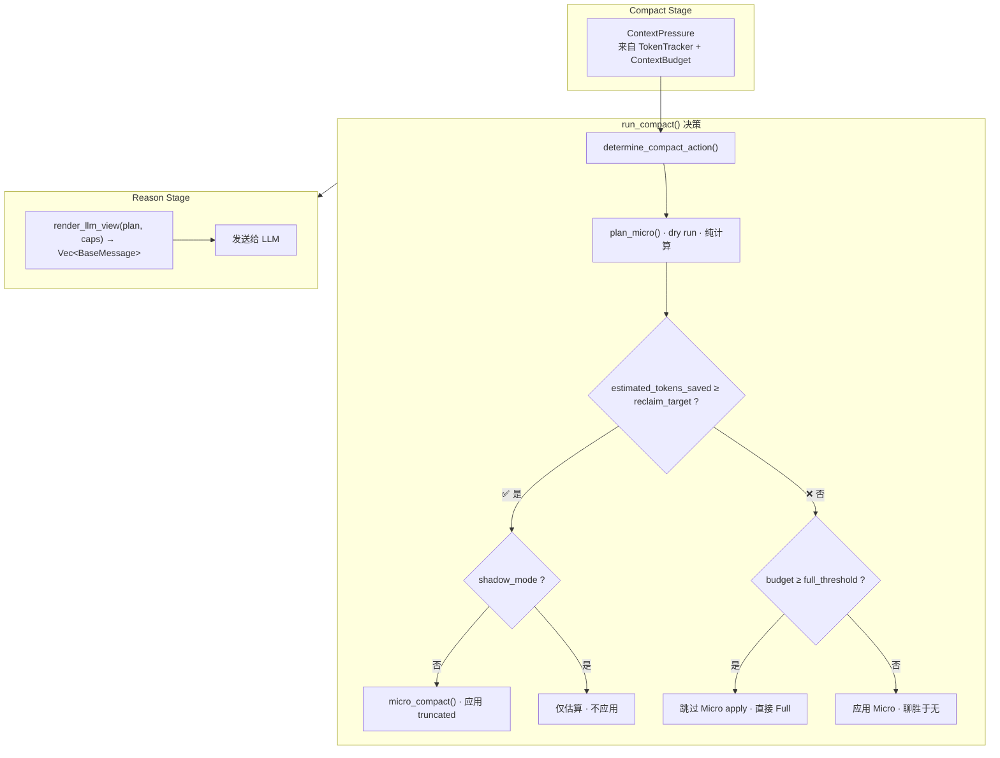
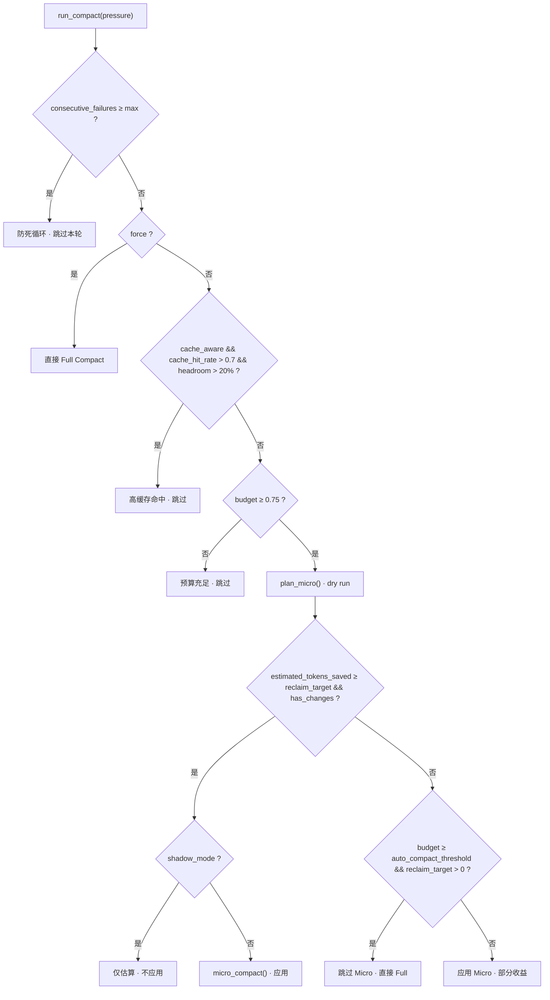

# peri-agent v2 Micro Compact 投影引擎设计

> 全新实施，覆盖旧版 Micro Compact | 日期：2026-07-25 | 修订：v1.0

## 1. 设计目的

旧版 Micro Compact 有两个根本缺陷：（1）标记和投影脱节——`truncated` flag 打了，但 Reason 阶段只对 Text 做 100 字符截断，Image/Document 的 Base64 payload 原样穿透给 LLM；（2）效果以"标记了几条消息"衡量，一条 10KB 的工具输出和一条 10 字节的工具输出权重相同。

新版围绕四个独立阶段重建：

```text
分析压力 → 生成计划（纯函数，零副作用）→ 构造投影视图（纯函数）→ 应用并报告
```

核心原则：**规划阶段不写盘，投影阶段不改 Transcript，应用阶段是唯一修改 flags 和 cache 的阶段。**

---

## 2. 总体架构



### 2.1 新旧对比

| 维度 | 旧实现 | 新实现 |
|------|--------|--------|
| 标记粒度 | AI message id | `ProjectionTarget::ToolCall { tool_call_id }` |
| 投影逻辑 | `truncated_content(100)`——仅 Text | `render_llm_view()`——5 种 ContentBlock 全覆盖 |
| 效果度量 | `affected_count`（标记几条消息） | `estimated_tokens_saved`（chars/4 估算） |
| JSON 保护 | 无——tool input 被截成字符串 | `project_tool_input()` 保持 object 根 |
| 分组模型 | 简化 round（单条消息视为 1 round） | `TurnGroup`（Human 边界 + ToolExchange 配对） |
| 缓存失效 | 每条 UpdateFlags 单独 invalidate | `ApplyCompactionBatch` 批量 · 单次 invalidate |
| 触发方式 | 仅百分比 `≥ 0.75` | `ContextPressure::target_reclaim_tokens()` 显式目标 |
| Micro+Full | 先提交 Micro flag 再跑 Full（浪费写） | dry-run → 不足时跳过 Micro apply |

### 2.2 文件夹结构

```
peri-agent/src/agent/compact_v2/
├── projection.rs     # 投影类型 + render_llm_view() 纯函数 + validate
├── planner.rs        # plan_micro() 纯函数 + TurnGroup + ContextPressure
├── mod.rs            # run_compact() 决策流入口
├── micro.rs          # thin wrapper（调用 planner + 应用 flag）
├── smart.rs          # 兼容入口（通过 plan_micro 生成计划）
├── config.rs         # CompactConfig 新增字段
├── full.rs           # Full Compact（不变）
├── _test.rs          # CompactResult 集成测试
├── trigger_test.rs   # 触发链路测试
├── micro_test.rs     # Micro 场景测试
├── planner_test.rs   # Planner 单元测试
├── projection_test.rs# 投影协议测试
└── full_test.rs      # Full Compact 测试
```

---

## 3. 关键数据结构

### 3.1 ProjectionTarget —— 投影粒度

```rust
pub enum ProjectionTarget {
    Message,                        // 整条消息
    ContentBlock { index: usize },  // 消息内第 index 个 block
    ToolCall { tool_call_id: String }, // 单个工具调用
}
```

三条理由解释了为什么需要三级粒度：

1. **Message 级**：ToolResult 消息整体做 head/tail 截断
2. **ContentBlock 级**：AI 消息中的 Image/Document block 单独替换为占位符，不影响同消息里的 Text block
3. **ToolCall 级**：同一条 AI 消息调用 Bash + AskUserQuestion 时，Bash 可以 `CompactToolInput`，AskUserQuestion 保持 `Keep`

### 3.2 ProjectionAction —— 投影动作

```rust
pub enum ProjectionAction {
    Keep,
    CompactText { max_chars: usize },
    CompactToolResult {
        keep_head: usize,
        keep_tail: usize,
        preserve_recovery_handle: bool,
    },
    CompactToolInput {
        fields: Vec<String>,
        preserve_shape: bool,
    },
    ReplaceMedia { placeholder: String },
    Exclude,
}
```

| 动作 | 触发对象 | 效果 |
|------|---------|------|
| `Keep` | Human / System / 错误消息 / Preserve 工具 | 原样保留 |
| `CompactText` | 旧轮次的普通文本 | CJK 安全截断，追加 `[内容已压缩]` |
| `CompactToolResult` | 可重建的工具输出 | head + tail 截断，中间省略 |
| `CompactToolInput` | 已完成副作用工具的 input | 保留 JSON object 根，写 `_compact_note` |
| `ReplaceMedia` | Image / Document block | 移除 Base64，替换为文本占位符 |
| `Exclude` | 整块替换为 `[已排除]` |

### 3.3 MicroCompactPlan —— 压缩计划

```rust
pub struct MicroCompactPlan {
    pub policy_version: u32,          // 策略版本号
    pub target_reclaim_tokens: u64,   // 目标回收量
    pub actions: Vec<ProjectionActionEntry>, // 动作列表
    pub estimated_before_tokens: u64, // 投影前估算
    pub estimated_after_tokens: u64,  // 投影后估算
    pub estimated_tokens_saved: u64,  // 估算节省量
}
```

计划由 `plan_micro()` 纯函数生成，不包含消息内容副本——只有 `(message_id, target, action)` 三元组。生成时不写数据库、不修改 Transcript。可序列化后通过 `MessageFlags.projection` 持久化。

### 3.4 ContextPressure —— 上下文压力

```rust
pub struct ContextPressure {
    pub estimated_tokens: u64,   // 当前估算 token 数
    pub context_window: u32,     // 模型上下文窗口
    pub output_reserve: u32,     // 输出预留（~4%）
    pub predicted_growth: u32,   // 预测增长
    pub safety_buffer: u32,      // 安全余量
    pub cache_hit_rate: f64,     // 缓存命中率
}

impl ContextPressure {
    pub fn target_reclaim_tokens(&self) -> u64 {
        self.estimated_tokens.saturating_sub(self.target_tokens())
    }
}
```

替换旧版的百分比阈值。`target_reclaim_tokens()` 直接回答"需要回收多少 token"，而不是"当前用了百分之几"。百分比仍用于 Compact 触发判断，但决策以显式回收量为准。

### 3.5 ProviderCapabilities —— Provider 差异

```rust
pub struct ProviderCapabilities {
    pub protocol: ProviderProtocol,  // OpenAI / Anthropic / Generic
    pub signed_reasoning_must_be_whole: bool, // Anthropic=true
}
```

| Provider | protocol | signed_reasoning | 影响 |
|----------|----------|-----------------|------|
| OpenAI | `OpenAI` | `false` | reasoning 可局部截断 |
| Anthropic | `Anthropic` | `true` | 带签名的 reasoning 块不得截断 |
| 其他 | `Generic` | `false` | 默认行为 |

`ProviderCapabilities` 通过 `BaseModel::provider_capabilities()` trait 方法获取，经 `ReactLLM` → `BaseModelReactLLM` → `ChatAnthropic` / `ChatOpenAI` 链路传递。

### 3.6 ContextRetention —— 工具保留策略

```rust
pub enum ContextRetention {
    Preserve,            // 不可压缩——用户回答、goal、Todo 状态
    StateBearing,        // 后续控制流依赖的状态
    SideEffectReceipt,   // 副作用已完成，只需收据
    Recomputable,        // 可从磁盘/网络重建
}
```

`BaseTool::context_retention() -> ContextRetention` 默认返回 `Preserve`（安全优先）。`plan_micro()` 内 `should_preserve_tool()` 先查 `config.tool_retention_map`，再回退到 trait 方法。替代旧版不断膨胀的 `micro_excluded_tools` 黑名单。

---

## 4. 核心流程

### 4.1 plan_micro() —— 计划生成

```
plan_micro(transcript, config)
    │
    ├─ 1. 跳过 ancestor 消息（只读祖先边界）
    │
    ├─ 2. TurnGroup::collect()
    │       Human 为边界 → AI → ToolResults → 直到下一条 Human
    │       每个 ToolExchange 显式配对 tool_use id 与 ToolResult
    │
    ├─ 3. 跳过最近 micro_compact_stale_steps 个 TurnGroup
    │
    ├─ 4. 对每个旧 TurnGroup:
    │       ├─ AI 消息:
    │       │   └─ 每个 tool_call: should_preserve_tool() ? Keep : CompactToolInput
    │       ├─ ToolResult 消息:
    │       │   └─ 错误 → Keep
    │       │   └─ 非错误: should_preserve_tool() ? Keep : CompactToolResult
    │       └─ 其他消息: 含 Image/Document → ReplaceMedia
    │
    ├─ 5. estimate_tokens() 估算前后 token（chars/4）
    │
    └─ 6. 返回 MicroCompactPlan
```

### 4.2 render_llm_view() —— 投影渲染

```
render_llm_view(transcript, plan, caps)
    │
    ├─ 1. transcript.visible_messages() → 排除 excluded
    │
    ├─ 2. plan.actions 按 message_id 索引
    │
    ├─ 3. 逐消息 project_message():
    │       ├─ Human/System: 应用 ContentBlock 级 ReplaceMedia
    │       ├─ AI: project_tool_input() per tool_call
    │       │      + project_ai_content() 同步 ToolUse block
    │       ├─ Tool: project_tool_result_content()
    │       │      apply_head_tail() CJK 安全截断
    │       └─ 无 action → 原样保留
    │
    └─ 4. validate_projected_view()
            ├─ tool use/result 配对检查
            ├─ JSON 根类型检查
            └─ signed reasoning 完整性（Anthropic）
```

### 4.3 run_compact() —— 决策流



### 4.4 TurnGroup 分组模型

```text
Transcript 消息序列 → TurnGroup::collect()

TurnGroup #1  «Human 边界»
  ├─ 👤 Human: "帮我查文件"
  ├─ 🤖 AI: tool_calls=[Bash(call_1)]
  └─ 📋 ToolResult: call_1 = output

TurnGroup #2  «Human 边界»
  ├─ 👤 Human: "再改一下"
  ├─ 🤖 AI: tool_calls=[Bash(call_2), AskUserQuestion(q1)]
  ├─ 📋 ToolResult: call_2
  └─ 📋 ToolResult: q1 = 用户选择
```

`TurnGroup` 确保：（1）同一轮内的 tool use/result 不拆分；（2）Human 消息永远不被选中压缩；（3）跨轮次的顺序关系不变。

---

## 5. 数据流

### 5.1 从 Compact 判定到 Reason 阶段

```
Compact 阶段                              Reason 阶段
    │                                         │
    ├─ context_usage < 0.75 → 跳过             │
    │                                         │
    └─ context_usage ≥ 0.75                    │
         │                                    │
         ▼                                    │
    plan_micro() · dry run · 零副作用           │
         │                                    │
         │  estimated_tokens_saved ≥ target?   │
         ├── 是 → micro_compact() 应用 ──────►│
         │                                    │
         └── 否                                │
             ├─ budget ≥ full_threshold?       │
             │   └─ 是 → 跳过 Micro → Full     │
             └─ 否 → 应用 Micro ──────────────►│
                                               │
                                        render_llm_view()
                                               │
                                               ▼
                                        Vec<BaseMessage>
                                               │
                                               ▼
                                             LLM
```

### 5.2 投影 pipeline：从 Transcript 到 LLM View

```mermaid
sequenceDiagram
    participant T as MessageTranscript
    participant PM as plan_micro()
    participant P as project_message()
    participant PB as project_block()
    participant V as validate_projected_view()

    T->>PM: 读取 all messages
    PM->>PM: TurnGroup::collect() · Human 边界分组
    PM->>PM: estimate_tokens() per block
    PM-->>PM: 生成 MicroCompactPlan · 零副作用

    Note over P: 对 plan 中每条消息

    P->>P: 按 ProjectionTarget 分发

    alt Message 级
        P->>P: Human/System → Keep<br/>Tool → CompactToolResult<br/>AI → 投影 tool_calls
    else ContentBlock 级
        P->>PB: project_block()
        PB->>PB: Image → ReplaceMedia<br/>Document → ReplaceMedia<br/>Text → head/tail 截断<br/>ToolUse → 与 tool_calls 同步
    else ToolCall 级
        P->>P: project_tool_input() · 保持 JSON object 根
    end

    P-->>V: Vec&lt;BaseMessage&gt;
    V->>V: tool use/result 配对 · JSON 根类型 · signed reasoning
    V-->>V: ✅ 或 warning
```

### 5.3 持久化链路

```
micro_compact() 中:
  transcript.set_truncated(id, true)
      │  更新内存 HashMap<MessageId, MessageFlags>
      │
      ▼
  MessageTranscript::set_truncated()
      │  flags.truncated = true
      │  flags.projection = Some(MessageProjectionDirective { ... })
      │
      └── persist_tx.send(PersistOp::ApplyCompactionBatch { updates })
               │
               ▼
          ThreadStore writer task · 异步 · 不阻塞 compact
               │
               ├─ 逐条 update_message_flags(id, &MessageFlags)
               │       │
               │       ▼
               │   SQLite: UPDATE truncated, excluded, projection
               │
               └─ store.invalidate_context_cache() · 仅一次
```

旧版每条 `UpdateFlags` 单独 `invalidate_context_cache`，N 条消息 N 次。新版 `ApplyCompactionBatch` 批量处理，循环外只做一次 invalidate。

### 5.4 Session 恢复

```
Session 恢复时:
  store.load_message_flags(thread_id)
      │
      ▼
  HashMap<MessageId, MessageFlags>
      │  flags.projection 从 SQLite projection TEXT 列反序列化
      │
      ▼
  transcript.set_flags_batch(flags_map)
      │  恢复 truncated / excluded / projection
      │
      ▼
  下一轮 Reason 阶段:
      plan_micro() → render_llm_view() · 投影语义与 compact 时一致
```

---

## 6. 配置

`CompactConfig` 新增字段（`config.rs`）：

| 字段 | 类型 | 默认值 | 用途 |
|------|------|--------|------|
| `target_headroom_tokens` | `u64` | `0` | 目标 headroom token 数 |
| `tool_result_keep_chars` | `usize` | `200` | ToolResult head/tail 保留字符数 |
| `shadow_mode_enabled` | `bool` | `false` | 仅估算不应用 |
| `cache_aware_enabled` | `bool` | `false` | 高缓存命中时延迟 compact |
| `tool_retention_map` | `HashMap<String, ContextRetention>` | `{}` | 工具名 → 保留策略映射 |

---

## 7. 问题修复记录

旧版 Micro Compact 的 9 个已知问题全部在新版中修复。

| 编号 | 问题 | 修复方式 | 代码位置 |
|------|------|---------|---------|
| P0-1 | Blocks/Raw 被标记但不会投影 | `project_content()` / `project_block()` 处理所有 ContentBlock 变体 | `projection.rs` |
| P0-2 | `affected_count` 不是实际收益 | `estimate_tokens()` 估算 + `estimated_tokens_saved` 决策 | `planner.rs` + `mod.rs` |
| P0-3 | 混合 tool call 连带截断 | `ProjectionTarget::ToolCall { tool_call_id }` per-call 粒度 | `projection.rs` |
| P0-4 | JSON shape 被破坏 | `project_tool_input()` 保持 object 根 + `project_ai_content()` 同步 | `projection.rs` |
| P1-1 | 固定 100 字符丢失恢复入口 | `apply_head_tail()` CJK 安全截断 + head/tail 保留 | `projection.rs` |
| P1-2 | round 分组简化 | `TurnGroup::collect()` + `ToolExchange` 显式配对 | `planner.rs` |
| P1-3 | Micro+Full 浪费写 | dry-run → 不足时跳过 Micro apply | `mod.rs` |
| P1-4 | 无 headroom 目标 | `ContextPressure::target_reclaim_tokens()` | `planner.rs` |
| P2-1 | N 次 cache invalidation | `ApplyCompactionBatch` 单次 invalidate | `transcript.rs` |

---

## 8. 事件与可观测性

`CompactCompleted` / `ObserveEvent::MessagesCompacted` 新增字段：

| 字段 | 类型 | 说明 |
|------|------|------|
| `strategy` | `CompactStrategy` | 新增 `Skip` 变体 |
| `affected_count` | `usize` | 标记条数（保留兼容） |
| `estimated_tokens_saved` | `u64` | **主要指标**——估算节省量 |
| `estimated_tokens_before` | `u64` | 投影前 token 估算 |
| `estimated_tokens_after` | `u64` | 投影后 token 估算 |
| `changed_messages` | `usize` | 实际产生内容变化的消息数 |
| `changed_fields` | `usize` | 实际变化的字段数 |
| `no_op_candidates` | `usize` | 候选但无实际变化的条目数 |
| `full_escalation_reason` | `Option<FullEscalationReason>` | 升级 Full 的原因 |
| `cache_hit_rate_before` | `Option<f64>` | 压缩前缓存命中率 |

Langfuse 同步：`CompactEnded` 上报 5 个遥测字段。

**Shadow mode** 通过 `config.shadow_mode_enabled = true` 启用——生成 plan 和估算，不应用，日志记录估算值。用于校准 chars→tokens 估算模型。

---

## 9. API 契约

| 函数 | 位置 | 签名 | 副作用 |
|------|------|------|--------|
| `plan_micro` | `planner.rs` | `(&MessageTranscript, &CompactConfig) → MicroCompactPlan` | **无**——纯函数 |
| `render_llm_view` | `projection.rs` | `(&MessageTranscript, &MicroCompactPlan, &ProviderCapabilities) → AgentResult<Vec<BaseMessage>>` | **无**——纯函数 |
| `micro_compact` | `micro.rs` | `(&mut MessageTranscript, &CompactConfig) → usize` | 写 `truncated` flag + `projection` |
| `smart_compact` | `smart.rs` | `(&mut MessageTranscript, &CompactConfig) → (usize, u64)` | 同上 |
| `run_compact` | `mod.rs` | `(&mut MessageTranscript, Option<&dyn BaseModel>, &CompactConfig, &ContextPressure, bool, &mut u32, &str) → CompactResult` | 完整决策 + 应用 |

---

## 10. 测试覆盖

| 模块 | 测试文件 | 测试数 | 覆盖重点 |
|------|---------|--------|---------|
| projection | `projection_test.rs` | 8 | Image/Document Base64 移除、ToolInput 根类型保护、ToolResult head/tail、CJK 安全、signed reasoning、Human/System 不变、空 plan passthrough |
| planner | `planner_test.rs` | 8 | estimate_tokens 边界、TurnGroup 分组、retention_map 保护、并行 tool exchange |
| micro | `micro_test.rs` | 9 | 基本截断、错误保护、retention_map 排除 |
| trigger | `trigger_test.rs` | 9 | estimated_tokens_saved 反映、多轮次增长、完整 pipeline |
| smart | `smart.rs`（内联） | 8 | 空 transcript、stale 窗口、错误保留、幂等、ancestor 边界 |
| compact v2 | `_test.rs` | 4 | CompactResult 字段填充、Full escalation reason |
| transcript | `transcript_test.rs` | - | 批量 flags 恢复、projection 持久化 |
| sqlite_store | `sqlite_store_test.rs` | 1 | update_message_flags 持久化 projection |
| adapters | `openai_test.rs` / `anthropic_test.rs` | - | Provider 协议序列化 |

---

## 11. 与 v2 其他模块的关系

| 模块 | 关系 |
|------|------|
| **Reason Stage** | 消费方——`render_llm_view()` 替换旧版 `truncated_content(100)`。不再直接感知 `truncated` flag |
| **Compact Stage** | 触发方——构建 `ContextPressure` → `run_compact()` → 填充事件字段 |
| **MessageTranscript** | 存储——`MessageFlags.projection` 持久化投影指令；`visible_messages()` 提供原始消息给投影引擎 |
| **ThreadStore** | 持久化——`update_message_flags()` 写三列 + `ApplyCompactionBatch` 单次 invalidate |
| **LLM Adapters** | `ProviderCapabilities` 区分 OpenAI/Anthropic，signed reasoning 保护 |
| **Tool System** | `ContextRetention` trait 方法 + `tool_retention_map` 配置 |
| **TokenTracker** | `ContextPressure` 数据源，`output_reserve` 来自 `ContextBudget` |

---

## 12. 设计决策记录

1. **Planner 纯函数**：`plan_micro()` 零副作用。这是 dry-run、shadow mode、Skip-Micro-when-Full 的前提。
2. **Micro 收缩为 wrapper**：`micro_compact()` 从 ~120 行缩减为 ~20 行，核心逻辑在 planner。Smart 同样通过 planner 兼容入口。
3. **不引入独立 `apply_plan()` API**：Micro/Smart 各自 thin wrapper 直接调用 planner + 应用 flag——层次已足够薄，不需要额外抽象层。
4. **ContextRetention 默认 Preserve**：安全优先——没有显式声明的工具一律不压缩。这避免了旧版"黑名单为空=全压缩"的激进策略。
5. **Token 估算用 chars/4**：不使用复杂 tokenizer。预留 shadow mode 校准路径——对比估算值与真实 `input_tokens`。
6. **保留 `CompactStrategy::Skip`**：cache-aware 和 shadow mode 需要明确的 Skip 语义，不能用 `Micro` + `affected_count=0` 代替。
