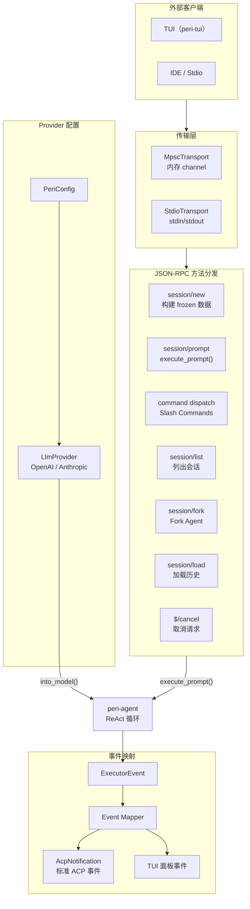

# peri-agent v2 ACP 服务层设计

> 全新设计，不考虑向后兼容 | 日期：2026-06-24 | 修订：v1.0

## 1. 设计原则

1. **薄适配层**：ACP（Agent Client Protocol）是 peri-agent 与外界的桥梁。它不持有 Session 逻辑、不定义 Agent 结构——只负责协议转换和事件路由。
2. **传输无关**：同一套 JSON-RPC 2.0 方法分发逻辑同时服务于内存通道（MpscTransport，TUI）和标准输入输出（StdioTransport，IDE）。传输层只做帧编解码，不参与业务。
3. **事件两类分路**：Agent 产出的 ExecutorEvent 分为三条路——标准 ACP 流式事件（IDE 消费）、TUI 专用事件（面板更新）、以及过滤事件（内部噪音）。一条 event pipeline，三个消费方向。
4. **命令即契约**：Slash Command 通过 `AgentCommand` trait 统一注册。三种 CommandKind（Immediate / Passthrough / Transform）决定命令在 Agent 循环中的执行位置。
5. **Provider 配置独立**：LLM Provider 的构建（API Key、模型别名、Base URL）由 ACP 层负责，peri-agent 只接收已构建好的 `BaseModel` trait object。

---

## 2. 总体架构

### 2.1 传输层

两条通道，同一个方法分发入口：

| 传输 | 实现 | 协议 | 消费者 |
|------|------|------|--------|
| **MpscTransport** | 内存 `tokio::mpsc` channel | JSON-RPC 2.0 对象（不序列化） | peri-tui |
| **StdioTransport** | stdin/stdout 行分隔 | JSON-RPC 2.0 文本帧（`\n` 分隔） | IDE / 外部进程 |

- JSON-RPC 帧结构：`{ "jsonrpc": "2.0", "id": N, "method": "session/prompt", "params": {...} }`
- 通知（无 id）用于单向事件（如 `$/cancel`）
- StdioTransport 使用后台 pump task 持续读取 stdin，写入 stdout

### 2.2 方法分发

JSON-RPC `method` 字段路由到 dispatch 函数。核心方法：

| 方法 | 用途 | 阶段 |
|------|------|------|
| `session/new` | 新建会话，构建 frozen 数据（System Prompt、CLAUDE.md、Skills 摘要） | 初始化 |
| `session/prompt` | 提交用户输入，执行 `execute_prompt()` → ReAct 循环 | 运行时 |
| `$/cancel` | 取消当前请求 | 运行时 |
| `session/load` | 加载已有会话的消息历史 | 恢复 |
| `session/fork` | 从当前会话 Fork 新 Agent（继承 Transcript） | 分支 |
| `session/list` | 列出所有会话 | 管理 |
| `initialize` | 客户端握手，返回能力列表 | 连接 |

dispatch 函数是纯函数——接收输入参数，返回结果。不持有 session 状态。

### 2.3 Slash Commands

通过 `AgentCommand` trait 注册。三种执行模式：

| CommandKind | 执行时机 | 示例 |
|-------------|---------|------|
| **Immediate** | 绕过 Agent 循环，直接执行后返回 Done | `/compact`、`/rewind`、`/bg`、`/clear` |
| **Passthrough** | 原样传入 Agent 循环作为用户消息 | 未使用（预留） |
| **Transform** | 修改消息后传入 Agent 循环 | 未使用（预留） |

关键规则：
- Immediate 命令绕过 `execute_prompt()` 的 event pump——必须手动调用 `sink.push_done()`
- CommandRegistry 支持前缀匹配——`/rew` 匹配 `/rewind`
- 命令参数通过空格分隔——`/rewind <message_id>`

### 2.4 Event 映射

`ExecutorEvent` → `MappedEvent`，三条消费路径：

| 路径 | 事件类型 | 消费者 | 转发方式 |
|------|---------|--------|---------|
| **① 标准 ACP** | TextChunk、ThinkingChunk、ToolStart、ToolEnd 等流式事件 | IDE / Stdio | SessionUpdate 序列化 |
| **② HITL 审批** | HITLPending | 审批通道（TUI / Channel） | Multiplex Broker 广播 |
| **③ TUI 专用** | StateSnapshot、SubAgent 事件、Compact 事件（MessagesCompacted, CompactStarted, CompactCompleted）、ContextWarning / BudgetWarning、TurnError | peri-tui | `peri/agent_event` 通知 |
| **④ 观测层** | AgentLifecycle（SubAgentStart/Stop）、TurnCompleted | 外部监听器 | broadcast 事件流 |
| **过滤** | MessageAdded、LlmCallStart | — | 丢弃（TUI 不关心） |

`ToolKind` 映射：工具名称 → ToolKind 枚举（用于 TUI 图标和简称显示）。

### 2.5 Provider 配置

`LlmProvider` 负责：

- **从环境变量构建**：`MODEL_PROVIDER` 决定类型，`ANTHROPIC_API_KEY` / `OPENAI_API_KEY` 读取密钥
- **从 PeriConfig 构建**：`settings.json` 中的 providers 列表 + active_alias 决定模型
- **模型别名解析**：`sonnet` / `haiku` / `opus` → 对应实际模型名
- **Thinking 配置**：extended thinking budget + effort 透传
- **into_model()**：LlmpProvider → `Box<dyn BaseModel>`，peri-agent 不接触 API Key

Provider 快照：`session/new` 时捕获当前 Provider 配置——会话内不随用户切换模型而变化。

---

## 3. Session 管理

### 3.1 frozen 数据构建

`session/new` 阶段一次性构建并冻结的数据：

| 数据 | 构建方式 | 用途 |
|------|---------|------|
| frozen_system_prompt | `build_system_prompt()` | 会话内每轮复用 |
| frozen_claude_md | 读盘 `CLAUDE.md` + `CLAUDE.local.md` | 透传给 SubAgent，不重复读盘 |
| frozen_skill_summary | 扫描插件 + 项目 Skills | 透传给 SubAgent |
| frozen_date | `chrono::Local::now()` | 保证 System Prompt 日期稳定 |

### 3.2 每轮构建

每轮 `session/prompt` 重新计算的数据（可变）：

- `is_git_repo`：Git 仓库检测（可能变化）
- PermissionMode：用户可实时切换
- Cancel Token：每轮新建
- Provider 快照：模型切换只在 `session/new` 时生效

---

## 4. 与 v2 其他模块的关系

| 模块 | 关系 |
|------|------|
| **peri-agent** | ACP 是 agent 的唯一调用入口。`execute_prompt()` 接收 frozen 数据 + 可变配置，返回事件流 |
| **Session** | v2 中 Session 迁移到 peri-agent 后，ACP 仅持有 Session 句柄，不管理生命周期 |
| **Transport** | `MpscEventSink` / `StdioEventSink` 将 ExecutorEvent 转换为协议帧后推送给客户端 |
| **Middleware** | 中间件链在 `build_agent()` 中构建，ACP 传入配置但不过问中间件内部 |
| **LLM** | Provider 配置由 ACP 层管理，构建 `dyn BaseModel` 后注入 agent |
| **System Prompt** | `session/new` 时 ACP 调用 `build_system_prompt()`，产出 frozen_prompt |
