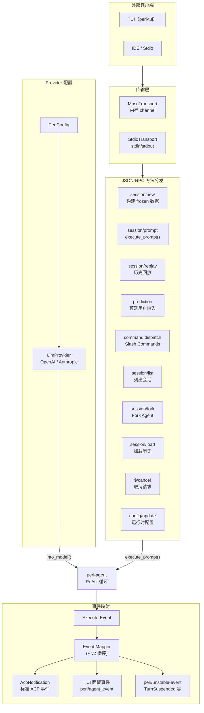

# peri-agent v2 ACP 服务层设计

> 全新设计，不考虑向后兼容 | 日期：2026-07-15 | 修订：v2.0

## 1. 设计原则

1. **薄适配层**：ACP（Agent Client Protocol）是 peri-agent 与外界的桥梁。它不持有 Session 逻辑、不定义 Agent 结构——只负责协议转换和事件路由。
2. **传输无关**：同一套 JSON-RPC 2.0 方法分发逻辑同时服务于内存通道（MpscTransport，TUI）和标准输入输出（StdioTransport，IDE）。传输层只做帧编解码，不参与业务。
3. **事件五路分路**：Agent 产出的 ExecutorEvent 分为五条路——标准 ACP 流式事件（IDE 消费）、HITL 审批（预留）、TUI 专用事件（面板更新）、观测层（预留）、以及 unstable-event（peri/unstable-event）。一条 event pipeline，五个消费方向。
4. **命令即契约**：Slash Command 通过 `AgentCommand` trait 统一注册。三种 CommandKind（Immediate / Passthrough / Transform）决定命令在 Agent 循环中的执行位置。
5. **Provider 配置独立**：LLM Provider 的构建（API Key、模型别名、Base URL）由 ACP 层负责，peri-agent 只接收已构建好的 `BaseModel` trait object。

---

## 2. 总体架构

### 2.1 传输层

两条通道，同一个方法分发入口：

| 传输 | 实现 | 协议 | 消费者 |
|------|------|------|--------|
| **MpscTransport** | 内存 `tokio::mpsc` channel | JSON-RPC 2.0 对象（不序列化） | peri-tui |
| **StdioTransport** | stdin/stdout 行分隔 | JSON-RPC 2.0 文本帧（`\n` 分隔） | IDE / 外部进程 |

- JSON-RPC 帧结构：`{ "jsonrpc": "2.0", "id": N, "method": "session/prompt", "params": {...} }`
- 通知（无 id）用于单向事件（如 `$/cancel`）
- StdioTransport 使用后台 pump task 持续读取 stdin，写入 stdout
- **StdioEventSink 仅发送标准 ACP `session/update`**（通过 SDK `ConnectionTo<Client>`），不发送 `peri/agent_event` 等 TUI 专用通道

### 2.2 方法分发

JSON-RPC `method` 字段路由到 dispatch 函数。核心方法：

| 方法 | 用途 | 阶段 |
|------|------|------|
| `session/new` | 新建会话，构建 frozen 数据（System Prompt、CLAUDE.md、Skills 摘要） | 初始化 |
| `session/prompt` | 提交用户输入，执行 `execute_prompt()` → ReAct 循环 | 运行时 |
| `session/replay` | 加载历史会话，通过 `session/update` 回放完整消息流（UserMessageChunk/AgentMessageChunk/ToolCall/ToolCallUpdate） | 恢复 |
| `prediction` | 基于现有对话历史预测用户下一步输入（1 轮无工具无中间件最小 LLM 调用，30s 超时） | 运行时 |
| `$/cancel` | 取消当前请求 | 运行时 |
| `session/load` | 加载已有会话的消息历史 | 恢复 |
| `session/fork` | 从当前会话 Fork 新 Agent（继承 Transcript） | 分支 |
| `session/list` | 列出所有会话 | 管理 |
| `initialize` | 客户端握手，返回能力列表 | 连接 |
| `config/update` | 运行时配置变更通知（如切换模型/语言等） | 运行时 |

dispatch 函数是纯函数——接收输入参数，返回结果。不持有 session 状态。

### 2.3 Slash Commands

通过 `AgentCommand` trait 注册。三种执行模式：

| CommandKind | 执行时机 | 示例 |
|-------------|---------|------|
| **Immediate** | 绕过 Agent 循环，直接执行后返回 Done | `/compact`、`/rewind`、`/bg`、`/clear` |
| **Passthrough** | 原样传入 Agent 循环作为用户消息 | 未使用（预留） |
| **Transform** | 修改消息后传入 Agent 循环 | 未使用（预留） |

命令别名机制：`AgentCommand` trait 提供 `aliases()` 方法，每个命令可注册一组别名。CommandRegistry 同时匹配命令名和别名：

| 命令 | 别名 |
|------|------|
| `/bg` | `/background` |
| `/compact` | `/compress` |
| `/clear` | `/cls`、`/reset` |
| `/rewind` | `/undo` |

关键规则：
- Immediate 命令绕过 `execute_prompt()` 的 event pump——必须手动调用 `sink.push_done()`
- CommandRegistry 支持前缀匹配——`/rew` 匹配 `/rewind`
- 命令参数通过空格分隔——`/rewind <message_id>`

### 2.4 Event 映射

`ExecutorEvent` → `MappedEvent`（含 5 个布尔标志：`updates`/`forward_to_tui`/`hitl_pending`/`observable`/`source_agent_id`），五路分路：

| 路径 | 事件类型 | 消费者 | 转发方式 |
|------|---------|--------|---------|
| **① 标准 ACP** | TextChunk、AiReasoning（v2 内部 ThinkingChunk 经 mapper_v2 转换）、ToolStart、ToolEnd、TodoUpdate、LlmCallEnd(usage)、**MessageAdded**（合成用户消息如 bg agent 回调） | IDE / Stdio | SessionUpdate 序列化 |
| **② HITL 审批** | *(预留)* | 审批通道（TUI / Channel） | Multiplex Broker 广播 |
| **③ TUI 专用** | StateSnapshot、StateSnapshotMeta、SubAgent 事件、Compact 事件（CompactStarted, CompactCompleted, CompactError）、ContextWarning / BudgetWarning、AiReasoningChunk、AgentExecutionFailed、TurnStarted/TurnEnded/StageStarted/StageEnded/MiddlewareStarted/MiddlewareEnded（langfuse v2 生命周期）、RewindCompleted、BackgroundTaskCompleted、BgToolStep、LspDiagnostics、MessageQueueDrained、WorkflowStarted/WorkflowEnded/WorkflowProgress | peri-tui | `peri/agent_event` 通知 |
| **④ 观测层** | *(预留)* | 外部监听器 | broadcast 事件流 |
| **⑤ unstable-event** | TurnSuspended | peri-tui | `peri/unstable-event`（通过 router.rs 投递） |
| **过滤** | LlmCallStart、LlmCallEnd(usage:None)、LlmRequestPayload | — | 丢弃 |

**关于 HITL 审批（Category ②）**：当前 `ExecutorEvent` 中无 `HitlPending` 变体。HITL 审批通过 `UserInteractionBroker`（含 MultiplexBroker 包装）的 `ask/confirm` 直接交互，不经过事件管道。Category ② 路由位已预留但未启用。

**关于 MessageAdded**：映射为 Category ① 的 `UserMessageChunk` session/update（合成用户消息注入，如 bg agent 回调等场景）。同时经 `executor_helpers` 发送 `BgCallbackBubble` unstable event 做 turn 分割——session/update 通道负责推送气泡内容，unstable event 通道负责切分 visual turn。

**关于 SubAgent 事件**：归入 Category ③ + ④（`MappedEvent::tui_and_observable()`）。

`ToolKind` 映射：工具名称 → ToolKind 枚举（用于 TUI 图标和简称显示）。

#### v2 事件桥接（mapper_v2 + forwarder）

v2 ReAct 循环产出三层事件（`RenderEvent`/`StateEvent`/`ObserveEvent`），经桥接层转换为统一的 `ExecutorEvent`：

- **mapper_v2**（`peri_agent::agent::events_v2_mapper`，peri-acp re-export）：纯函数将 `RenderEvent`→`render_event_to_executor()`、`StateEvent`→`state_event_to_executor()`、`ObserveEvent`→`observe_event_to_executor()` 桥接为 ExecutorEvent
- **forwarder**（`event/forwarder.rs`）：封装 `EventBus` 转发器 task，消费三层 v2 事件 channel。使用 `biased select!` 保证 render 通道（含 TurnCompleted）先于 state 通道被消费，避免跨迭代事件乱序导致渲染错乱

### 2.5 Provider 配置

`LlmProvider` 负责：

- **从环境变量构建**：`MODEL_PROVIDER` 决定类型，`ANTHROPIC_API_KEY` / `OPENAI_API_KEY` 读取密钥
- **从 PeriConfig 构建**：`settings.json` 中的 providers 列表 + active_alias 决定模型
- **模型别名解析**：`sonnet` / `haiku` / `opus` → 对应实际模型名
- **Thinking 配置**：extended thinking budget + effort 透传
- **into_model()**：LlmpProvider → `Box<dyn BaseModel>`，peri-agent 不接触 API Key

Provider 快照：`session/new` 时捕获当前 Provider 配置——会话内不随用户切换模型而变化。

---

## 3. Session 管理

### 3.1 frozen 数据构建

`session/new` 阶段一次性构建并冻结的数据。v2 迁移后，ACP 层的 `FrozenSessionData` 内部委托给 `peri_agent::session::FrozenContext`：

| 数据 | 构建方式 | 用途 |
|------|---------|------|
| frozen_system_prompt | `build_system_prompt()` | 会话内每轮复用 |
| frozen_claude_md | 读盘 `CLAUDE.md` | 透传给 SubAgent，不重复读盘 |
| frozen_skill_summary | 扫描插件 + 项目 Skills | 透传给 SubAgent |
| frozen_date | `chrono::Local::now()` | 保证 System Prompt 日期稳定 |
| frozen_language | 从 `PeriConfig` 捕获 | 会话级语言设置，透传给 SubAgent |
| claude_local_md | 读盘 `CLAUDE.local.md`（`Option<Arc<str>>`） | 项目本地指令，v2 FrozenContext 未包含，ACP 层单独保留 |
| is_git_repo | 会话创建时 git 仓库检测 | 会话级不可变快照 |

### 3.2 每轮构建

每轮 `session/prompt` 构建的 `PromptExecutionContext`，按四层组织：

**Session-level identity & transport**：
- `provider`：当前 LLM provider 快照（每轮从 `Arc<RwLock<>>` 克隆）
- `peri_config`：全局 peri 配置快照
- `cwd` / `session_id`：会话工作目录和 ID
- `cancel`：取消令牌（由 SessionManager 管理）
- `event_sink`：事件出口（TUI 用 TransportEventSink，stdio 用 StdioEventSink）
- `broker`：用户交互 broker（HITL/AskUser 通道）
- `permission_mode`：权限模式共享句柄

**Per-turn content**：
- `content`：用户本轮输入
- `frozen`：会话级 frozen 数据（§3.1）
- `history`：现有历史消息
- `incoming_recalls`：上一轮 recall 注入项
- `session_start_source`：startup / resume / clear / compact
- `bg_results`：后台任务结果（注入合成的 AgentResult tool_use/tool_result）

**Middleware chain resources**：
- `plugin_skill_roots` / `plugin_agent_dirs` / `plugin_loaded`：插件相关
- `hook_groups`：Hook 组（全局/项目/本地分层）
- `cron_scheduler`：Cron 调度器（跨轮次复用）
- `mcp_pool`：MCP client 池
- `channel_state`：Channel broker 共享状态
- `tool_search_index` / `shared_tools`：工具搜索与共享工具表
- `lsp_servers`：LSP server 配置
- `langfuse_session`：Langfuse 会话级句柄

**Session-scoped caches & persistence**：
- `pool`（AgentPool）：session 级 LLM 实例缓存（`CachedLlmInstances`），避免每轮重建 `reqwest::Client`。`build_agent` 接收 `cached_llm` 参数跨 prompt 复用
- `thread_store` / `thread_id` / `session_manager`：持久化与会话管理
- `workflow_executor` / `workflow_middleware`：Workflow 功能
- `allow_await_wake`：传输层分流标志。TUI 路径设 `true` → `run_react_loop` 在 queue 空时阻塞等异步事件续跑；stdio/print 路径设 `false` → 直接退出

### 3.3 异步事件续跑（AsyncRouter + SessionInbox）

v2 通过 `AsyncRouter`（`session/async_router.rs`）统一路由后台异步结果到 Session inbox，替代 executor 直接操作 raw `v2_message_queue` 的方式。

两条路由目标：
- **Background SubAgent 结果**（`route_bg_result`）：`/bg` fork agent 完成通知，push 为 `Defer` + `MessageSource::SubAgentComplete`
- **Workflow 事件**（`route_workflow_event`）：workflow middleware 订阅者的完成通知，push 为 `Defer` + `MessageSource::WorkflowComplete`

`SessionInbox`（`peri_agent::agent::session::SessionInbox`）是 `AcpSession` 的 `session_inbox` 字段，lazy-init（首次通过 `SessionManager::session_inbox_for` 创建）。内部持有 `InboxHandle`（包装 `MessageQueue` + wake `Notify`），`AsyncRouter` 每次 route 调用后触发 wake，使 idle 的 `run_session_loop` 通过 `await_wake` 恢复执行。

`BackgroundTaskRegistry`（`session/mod.rs`）是 session 级后台任务注册中心（`Arc<BackgroundTaskRegistry>`），跨 prompt 存活，取代 per-prompt 创建。

### 3.4 Goal 状态管理

`GoalState`（`session/goal_state/mod.rs`）是并发安全的目标状态机（基于 `Arc<RwLock<GoalStateInner>>` + `parking_lot::RwLock`），提供：
- `set_goal` / `edit_goal` / `clear_goal` / `set_status` / `flush_progress`
- 只读快照 `GoalSnapshot`（goal_id / objective / status / token_budget / tokens_used / time_used_seconds）
- 实现 `GoalController` trait

通过 `GoalMiddleware` 注入到中间件链末尾。store 写入失败时退化为纯内存模式（snapshot 读仍可用），不阻塞 agent。

---

## 4. 与 v2 其他模块的关系

| 模块 | 关系 |
|------|------|
| **peri-agent** | ACP 是 agent 的唯一调用入口。`execute_prompt()` 接收 frozen 数据 + 可变配置，返回事件流 |
| **Session** | v2 中 ACP 层持有 `AcpSession` 句柄并管理 session 级共享状态（`active_agents`、`goal_state`、`v2_message_queue`、`session_inbox`、`background_registry`、`permission_mode`、`thinking` 等），核心 agent 状态（transcript、frozen）委托给 `peri_agent::session::Session` |
| **Transport** | `MpscEventSink` / `StdioEventSink` 将 ExecutorEvent 转换为协议帧后推送给客户端 |
| **Middleware** | 中间件链在 `build_agent()` 中构建，ACP 传入配置但不过问中间件内部 |
| **LLM** | Provider 配置由 ACP 层管理，构建 `dyn BaseModel` 后注入 agent |
| **System Prompt** | `session/new` 时 ACP 调用 `build_system_prompt()`，产出 frozen_prompt |
