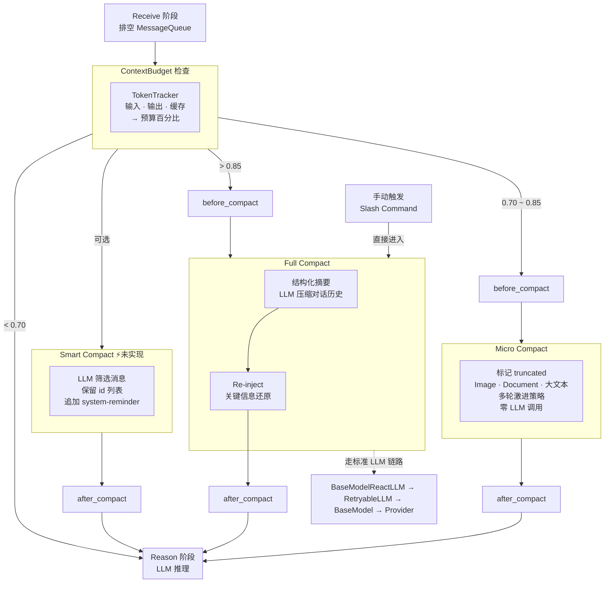

# peri-agent v2 Compact 上下文压缩架构设计

> 全新设计，不考虑向后兼容 | 日期：2026-06-24 | 修订：v2.1

## 1. 设计原则

1. **System Prompt 不可变**：Compact 仅操作对话消息，不触碰顶层 System Prompt。摘要注入方式为 Human 消息或 SystemReminder，禁止 System 角色——防止 hoist 污染 FrozenContext。
2. **Compact 重建 Transcript**：Compact 不修改现有 Transcript，而是读取后**重建新 Transcript**。正常 ReAct 循环中消息仅尾部追加，Compact 是唯一重建 Transcript 的场景。重建后角色类型、顺序不变。Micro 数量不变，Full 追加摘要，Smart 筛选保留并追加 system-reminder。
3. **阈值驱动**：Compact 非每轮必行。由 ContextBudget 决定是否自动触发——低于阈值时跳过，逼近阈值时启动对应策略。此外支持**手动触发**——用户通过 Slash Command 主动请求 Full Compact，不论当前阈值。
4. **渐进式压缩**：三级策略——Micro（轻量截断，零 LLM 调用）→ Full（结构化摘要）→ Smart（LLM 筛选保留消息）。按资源消耗递进，预算不紧张时不启动更重的策略。
5. **走标准 LLM 链路**：Full Compact 通过 `BaseModelReactLLM` 统一入口，和 Reason 阶段共用重试、缓存、流式策略。不再存在独立的 LLM 调用路径。
6. **不中断循环**：Compact 是 ReAct 循环内的条件性步骤。压缩后循环自然继续，不改变控制流、不要求外部干预。
7. **降级优先**：Compact 自身可能失败——摘要 LLM 出错、连续失败后跳过。保证 Compact 失败不影响 Agent 正常工作——大不了上下文满，LLM 仍可运行。

---

## 2. 总体架构

### 2.1 ContextBudget 与 TokenTracker

TokenTracker 随每轮 LLM 调用更新，追踪三个维度决定 Compact 是否触发：

| 维度 | 来源 | 用途 |
|------|------|------|
| 输入 token | `last_usage.input_tokens` | 估算当前上下文大小 |
| 输出 token | `last_usage.output_tokens` | 监控单轮响应膨胀 |
| 缓存 token | `last_usage.cache_read_tokens` / `cache_creation_tokens` | 感知缓存命中/失效 |

`ContextBudget = 当前上下文 token / 模型上下文窗口`。工具结果 token 单独隔离追踪，避免大工具输出污染阈值计算的基准。

- **Micro 阈值（0.70）**：预算紧张。标记 `truncated`，LLM 请求时截断输出，不调用 LLM。
- **Full 阈值（0.85）**：逼近上限。LLM 压缩 + 关键信息还原。
- **阈值以下**：跳过 Compact，正常推理。

### 2.2 Micro Compact

零 LLM 调用。读取 Transcript，对符合条件的消息标 `truncated`，重建新 Transcript。目的：以最小成本回收 token。

- **截断对象**：Image / Document 块替换为文本占位符；大文本块按字符级截断并标注省略量
- **白名单工具**：仅截断高频大输出工具的输出。白名单外工具（如 Agent）不参与——其输出对 LLM 决策关键
- **多轮保护**：同一工具被连续截断的轮次越多，截断越激进——早期保留更多内容供 LLM 参考，后期大幅截断以腾出空间
- **结构不变**：新 Transcript 消息数量、角色不变，仅部分消息带 `truncated` 标记。不影响后续消息的 cache_control 标记

### 2.3 Full Compact

调用 LLM 将完整对话历史压缩为结构化摘要，然后重建 Transcript。目的：在预算严重不足时保住核心信息。

- **分组压缩**：对话按轮次分组，每轮保留 tool_call 名称和 tool_result 关键片段，丢弃完整参数和输出
- **关键信息覆盖**：结构化摘要保留用户意图、技术决策、文件变更、错误修复、未完成事项等关键信息。去重冗余，保留判断依据
- **走标准 LLM 链路**：通过 `BaseModelReactLLM` 发出摘要请求，和 Reason 阶段共用重试策略、Provider 能力查询、Prompt Cache 注入。强制非流式——摘要无需实时推流
- **重建方式**：新 Transcript = 摘要作为 Human 消息（带 `CONTINUATION_HINT`，新 id）+ 旧消息标 `excluded`。非 System 消息——保证不被 hoist 污染 FrozenContext

### 2.4 Smart Compact ⚡未实现

由 LLM 决策每条消息的保留或删除。目的：比摘要更精准——LLM 知道哪些消息对后续决策有价值，直接剔除冗余。

- **输入**：将 Transcript 消息序列化为 JSON 数组，每条带唯一 id、角色类型和文本内容。不含 Image / Document 等非文本块。
- **LLM 决策**：LLM 输出保留的 id 列表——不在列表中的消息丢弃。LLM 可在保留的消息上附带 `content` 字段，修改该消息的文本内容（如合并、改写、精简）。
- **执行**：系统根据 id 列表重建 Transcript——保留消息不变，未选中消息标 `excluded` + 追加一条 system-reminder 消息告知 LLM 被移除的内容概要。
- **与 Full Compact 的区别**：Full 用二次 LLM 生成 Human 摘要 + 旧消息标 excluded；Smart 让 LLM 在原对话上筛选，保留的消息不变、未选中的标 excluded，追加 system-reminder。更保真、更省 token。

### 2.5 Re-inject

Full Compact 后关键信息可能丢失。Re-inject 将必要信息补回对话。

- **文件还原**：从摘要中提取被压缩工具引用的关键文件路径，重新读取内容，作为 Human 消息注入
- **Skills 还原**：从摘要中提取引用的 skill 名称，将对应 skill 摘要重新注入
- **预算控制**：文件数量、单文件 token、Skills token 均有上限。超出上限按优先级截断
- **注入顺序**：Human 摘要 → 文件内容 → Skills 摘要。Human 消息优先保证 `CONTINUATION_HINT` 最先被 LLM 感知

### 2.6 失败保护与降级

Compact 自身非关键路径——失败不阻止 Agent 继续工作。

- **摘要 LLM 失败**：原始消息保留在 Transcript 不变，ReAct 循环继续。下次 ContextBudget 检查时重新尝试
- **防死循环**：连续 N 次 Full Compact 失败后，强制跳过本轮，标记"Compact 降级"，让 LLM 在满上下文中继续。降级状态在 AgentEvent 中通知外部
- **Re-inject 失败**：文件读取失败或超出预算时，该文件被跳过但不影响整体 Compact 流程。摘要本身已包含文件名和关键内容片段

### 2.7 与 v2 其他模块的关系

| 模块 | 关系 |
|------|------|
| **Session** | Compact 不触碰 FrozenContext（System Prompt / CLAUDE.md / Skills 摘要）。摘要以 Human 消息注入，不被 hoist |
| **LLM 适配器** | Full Compact 走 `BaseModelReactLLM` 标准链路，和 Reason 阶段共用量、缓存、能力查询。Micro Compact 零 LLM 调用 |
| **ReAct 循环** | Compact 位于 Receive 之前。Receive 阶段排空 MessageQueue 之前先检查并执行 Compact——保证 LLM 看到的是压缩后上下文 + 最新用户输入。上下文低于阈值时跳过 |
| **MessageTranscript** | Compact 读取 Transcript 后重建新 Transcript——Micro 标 truncated、Full 追加摘要并标 excluded、Smart 未选中标 excluded 并追加 system-reminder。下一轮 LLM 请求基于新 Transcript 构造 |
| **Hook 系统** | `before_compact` / `after_compact` 两个钩子。外部可监听压缩进行中和完成事件 |
| **事件流** | Compact 产生 `MessagesCompacted` 事件（观测层 broadcast），TUI 可据此刷新上下文条指示 |

Compact 跨 turn 持久——压缩后的 Transcript 跨 turn 保留，后续 turn 的 LLM 看到的是压缩后上下文。
