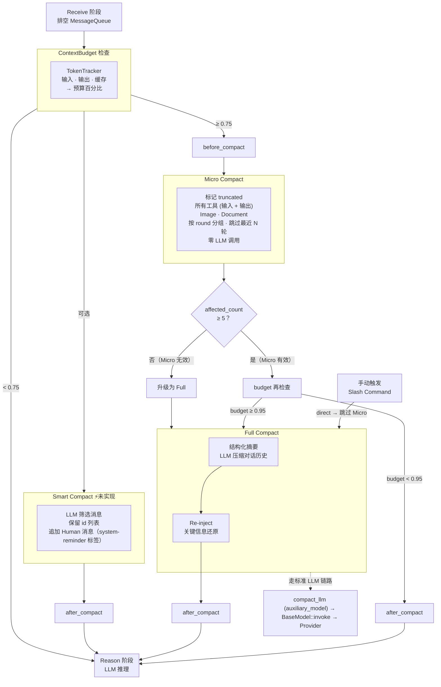

# peri-agent v2 Compact 上下文压缩架构设计

> 全新设计，不考虑向后兼容 | 日期：2026-07-15 | 修订：v2.3

## 1. 设计原则

1. **System Prompt 不可变**：Compact 仅操作对话消息，不触碰顶层 System Prompt。摘要注入方式为 Human 消息或 SystemReminder，禁止 System 角色——防止 hoist 污染 FrozenContext。
2. **Compact 重建 Transcript**：Compact 不修改现有 Transcript，而是读取后**重建新 Transcript**。正常 ReAct 循环中消息仅尾部追加，Compact 是唯一重建 Transcript 的场景。重建后角色类型、顺序不变。Micro 数量不变，Full 追加摘要，Smart 筛选保留并追加 system-reminder。
3. **阈值驱动**：Compact 非每轮必行。由 ContextBudget 决定是否自动触发——低于阈值时跳过，逼近阈值时启动对应策略。此外支持**手动触发**——用户通过 Slash Command 主动请求 Full Compact，不论当前阈值。
4. **渐进式压缩**：三级策略——Micro（轻量截断，零 LLM 调用）→ Full（LLM 结构化摘要）→ Smart（LLM 筛选保留消息）。**Micro 优先执行，执行后根据压缩量判定是否升级为 Full**——压缩量不足时说明 Micro 已无法有效回收 token，系统直接升级为 Full Compact（truncated 标记无需清理——Full 的 excluded 会覆盖同一批旧消息）。
5. **走标准 LLM 链路**：Full Compact 通过 `BaseModel::invoke` 发出摘要请求，`compact_llm` 为独立 `BaseModel` 实例（由 ACP 层通过 `auxiliary_model` 注入），不与 Reason 阶段共用 LLM 实例。强制非流式——摘要无需实时推流。
6. **不中断循环**：Compact 是 ReAct 循环内的条件性步骤。压缩后循环自然继续，不改变控制流、不要求外部干预。
7. **降级优先**：Compact 自身可能失败——摘要 LLM 出错、连续失败后跳过。保证 Compact 失败不影响 Agent 正常工作——大不了上下文满，LLM 仍可运行。

---

## 2. 总体架构



### 2.1 ContextBudget 与 TokenTracker

TokenTracker 随每轮 LLM 调用更新，追踪三个维度决定 Compact 是否触发：

| 维度 | 来源 | 用途 |
|------|------|------|
| 输入 token | `last_usage.input_tokens` | 估算当前上下文大小 |
| 输出 token | `last_usage.output_tokens` | 监控单轮响应膨胀 |
| 缓存 token | `last_usage.cache_read_tokens` / `cache_creation_tokens` | 感知缓存命中/失效 |

`ContextBudget = 当前上下文 token / 模型上下文窗口`。工具结果 token 单独隔离追踪，避免大工具输出污染阈值计算的基准。

- **Micro 阈值（0.75）**：预算紧张。先执行 Micro Compact 标记 `truncated`。执行后检查压缩量（`affected_count`）：若 ≥ 5 条消息则 Micro 有效，预算仍 ≥ 0.95 时叠加 Full；若 < 5 条则 Micro 无效，直接**升级为 Full Compact**。这种 "Micro 优先 + 压缩量不足时升级" 的设计避免了 Micro 流于形式——当对话中可压缩的白名单工具输出已经很少时，说明 Micro 策略已到头，应切换到摘要压缩。
- **Full 阈值（0.95）**：逼近上限。LLM 压缩 + 关键信息还原。
- **阈值以下**：跳过 Compact，正常推理。

`CompactConfig` 可配参数（`compact/config.rs`）：

| 字段 | 默认值 | 用途 |
|------|--------|------|
| `auto_compact_enabled` | `true` | 是否启用自动 Compact |
| `auto_compact_threshold` | `0.95` | Full Compact 阈值 |
| `micro_compact_threshold` | `0.75` | Micro Compact 触发阈值 |
| `micro_min_affected` | `5` | Micro 压缩量下限——低于此值判定 Micro 无效，升级为 Full |
| `micro_compact_stale_steps` | `5` | Micro 截断跳过最近 N 轮 |
| `micro_excluded_tools` | `[]` | 黑名单工具——这些工具的消息不参与 Micro 截断（占位，暂不填充） |
| `summary_max_tokens` | `16000` | 摘要最大 token |
| `max_consecutive_failures` | `3` | 连续失败上限 |
| `ptl_max_retries` | `3` | PTL 重试次数 |

### 2.2 Micro Compact

零 LLM 调用。对符合条件的消息标 `truncated`。目的：以最小成本回收 token。

**触发策略（Micro 优先 + 压缩量不足时升级）**：

1. 当 `budget ≥ 0.75` 时触发 Micro Compact
2. 执行 `micro_compact()` 后检查 `affected_count`（实际被标记 truncated 的消息数）
3. 若 `affected_count ≥ micro_min_affected`（默认 5）：Micro 有效——若此时 `budget ≥ 0.95` 则继续叠加 Full Compact
4. 若 `affected_count < micro_min_affected`：Micro 无效——直接**升级为 Full Compact**（truncated 标记无需回滚——Full Compact 的 excluded 标记会覆盖同一批旧消息，`visible_messages()` 过滤 excluded 后 truncated 对 LLM 不可见）

这种设计的原因：Micro Compact 只能截断白名单工具的输出和 Image/Document 块。当对话中这类内容已经很少时（先前轮次的 Micro 已经清理过），继续跑 Micro 只是空转。此时应切换到 Full Compact 生成结构化摘要。

**压缩规则**：

- **截断对象**：对每条自有消息检查是否应标 truncated
  - `BaseMessage::Tool`（工具输出/tool_result）→ 若工具名不在 `micro_excluded_tools` 黑名单中，则标 truncated
  - `BaseMessage::Ai { tool_calls }`（工具输入/tool_use arguments）→ 若任一 tool_call 的工具名不在黑名单中，则标 truncated。如 Write 的文件内容、Edit 的 old_string 等大体积 arguments 通过此路径截断
  - 其他消息 → 检查是否含 Image / Document 块，有则标 truncated
- **黑名单设计**：`micro_excluded_tools: Vec<String>`，默认空数组——即默认截断所有工具。黑名单是预留的排他机制：如果某个工具的输出/输入对 LLM 特别关键（如 Agent 的任务描述），未来可将其加入黑名单排除截断。**当前不填充任何工具**

### 2.3 Full Compact

调用 LLM 将完整对话历史压缩为结构化摘要，然后重建 Transcript。目的：在预算严重不足时保住核心信息。

- **分组压缩**：对话按轮次分组，每轮保留 tool_call 名称和 tool_result 关键片段，丢弃完整参数和输出
- **关键信息覆盖**：结构化摘要保留用户意图、技术决策、文件变更、错误修复、未完成事项等关键信息。去重冗余，保留判断依据
- **走标准 LLM 链路**：通过 `BaseModel::invoke` 发出摘要请求，`compact_llm` 为 ACP 层通过 `auxiliary_model` 注入的独立 `BaseModel` 实例，不与 Reason 阶段共用 LLM。强制非流式——摘要无需实时推流
- **重建方式**：新 Transcript = 摘要作为 Human 消息（带 `CONTINUATION_HINT`，新 id）+ 旧消息标 `excluded`。非 System 消息——保证不被 hoist 污染 FrozenContext

### 2.4 Smart Compact ⚡未实现

由 LLM 决策每条消息的保留或删除。目的：比摘要更精准——LLM 知道哪些消息对后续决策有价值，直接剔除冗余。

- **输入**：将 Transcript 消息序列化为 JSON 数组，每条带唯一 id、角色类型和文本内容。不含 Image / Document 等非文本块。
- **LLM 决策**：LLM 输出保留的 id 列表——不在列表中的消息丢弃。LLM 可在保留的消息上附带 `content` 字段，修改该消息的文本内容（如合并、改写、精简）。
- **执行**：系统根据 id 列表重建 Transcript——保留消息不变，未选中消息标 `excluded` + 追加一条 Human 消息（带 `system-reminder` 标签包裹）告知 LLM 被移除的内容概要。使用 Human 消息而非 System 消息，防止 hoist 污染 FrozenContext。
- **与 Full Compact 的区别**：Full 用二次 LLM 生成 Human 摘要 + 旧消息标 excluded；Smart 让 LLM 在原对话上筛选，保留的消息不变、未选中的标 excluded，追加 Human 消息（带 `system-reminder` 标签）。更保真、更省 token。

### 2.5 Re-inject

Full Compact 后关键信息可能丢失。Re-inject 将必要信息补回对话。

- **文件还原**：从摘要中提取被压缩工具引用的关键文件路径，重新读取内容，作为 Human 消息注入
- **Skills 还原**：从摘要中提取引用的 skill 名称，将对应 skill 摘要重新注入
- **预算控制**：文件数量、单文件 token、Skills token 均有上限。超出上限按优先级截断
- **注入顺序**：Human 摘要 → 文件内容 → Skills 摘要。Human 消息优先保证 `CONTINUATION_HINT` 最先被 LLM 感知

### 2.6 失败保护与降级

Compact 自身非关键路径——失败不阻止 Agent 继续工作。

- **禁用机制**：`DISABLE_COMPACT` / `DISABLE_AUTO_COMPACT` 环境变量或 `CompactConfig.auto_compact_enabled = false` 可完全禁用 Compact。Stage 入口显式检查此条件（`stages/compact.rs:49-51`），禁用时直接跳过。
- **Cancel 感知**：Full Compact 的 LLM 调用包在 `tokio::select! biased` 中（`stages/compact.rs:100-108`），cancel 信号优先于长 LLM 调用——用户中断时立即退出，transcript 正确放回避免消息遗失。

- **摘要 LLM 失败**：原始消息保留在 Transcript 不变，ReAct 循环继续。下次 ContextBudget 检查时重新尝试
- **防死循环**：连续 N 次 Full Compact 失败后，强制跳过本轮，标记"Compact 降级"，让 LLM 在满上下文中继续。降级状态在 AgentEvent 中通知外部
- **Re-inject 失败**：文件读取失败或超出预算时，该文件被跳过但不影响整体 Compact 流程。摘要本身已包含文件名和关键内容片段
- **Full Compact 后 token_tracker 重置**：Full Compact 成功后调用 `token_tracker_mut().reset()`（`stages/compact.rs:157-160`），防止下轮 ContextBudget 计算基于 compact 前的累积 token 数导致每轮都触发 compact
- **失败后清除残留 excluded 标记**：Full Compact 失败重跑时清除上轮残留的 `excluded` 标记——仅清 `excluded`，保留 `truncated`（`compact_v2.rs:140-153`），防止 `visible_messages()` 误判消息已压缩

### 2.7 与 v2 其他模块的关系

| 模块 | 关系 |
|------|------|
| **Session** | Compact 不触碰 FrozenContext（System Prompt / CLAUDE.md / Skills 摘要）。摘要以 Human 消息注入，不被 hoist |
| **LLM 适配器** | Full Compact 通过 `BaseModel::invoke` 发出摘要请求，`compact_llm` 为 ACP 层通过 `auxiliary_model` 注入的独立 `BaseModel` 实例（`stages/mod.rs:96`），不与 Reason 阶段共用 LLM。Micro Compact 零 LLM 调用 |
| **ReAct 循环** | Compact 位于 Receive 之前。Receive 阶段排空 MessageQueue 之前先检查并执行 Compact——保证 LLM 看到的是压缩后上下文 + 最新用户输入。上下文低于阈值时跳过 |
| **MessageTranscript** | Compact 读取 Transcript 后重建新 Transcript——Micro 标 truncated、Full 追加摘要并标 excluded、Smart 未选中标 excluded 并追加 Human 消息（带 system-reminder 标签）。下一轮 LLM 请求基于新 Transcript 构造 |
| **Hook 系统** | 中间件层：`before_compact` / `after_compact` 两个钩子，外部可监听压缩进行中和完成事件。插件层：`PreCompact` / `PostCompact` 回调（`StageContext.compact_pre_hook` / `compact_post_hook`），由 ACP 层注入，在 Compact 阶段首尾触发 |
| **事件流** | Compact 产生 `CompactStarted` + `MessagesCompacted` 两个成对事件（Start→End 成对原则，修复 Langfuse compact_span 断裂），TUI 可据此刷新上下文条指示 |
| **Compact LLM 注入** | `compact_llm` 由 ACP 层通过 `auxiliary_model` 注入（`builder_v2.rs:79-84`），优先取 `cfg.auxiliary_model`，否则回落到 `cached_llm.auxiliary_model`。是独立的 `BaseModel` 实例，不与 Reason 阶段共用 |

Compact 跨 turn 持久——压缩后的 Transcript 跨 turn 保留，后续 turn 的 LLM 看到的是压缩后上下文。

## 3. 数据流：从 Compact 判定到 Reason 阶段

### 3.1 整体数据流

```
Compact 阶段                          Reason 阶段
    │                                     │
    ├─ budget < 0.75 → skip               │
    │                                     │
    └─ budget ≥ 0.75                      │
         │                                │
         ▼                                │
    micro_compact(transcript, config)      │
         │                                │
         │  返回 affected_count            │
         ├── ≥ 5（有效）                    │
         │   └─ budget ≥ 0.95?            │
         │       ├─ Yes → full_compact()   │
         │       └─ No  → done ──────────►│
         │                                │
         └── < 5（无效）                    │
             └─ full_compact() ──────────►│
                                           │
                                    visible_messages()
                                           │   ↓ 过滤 excluded
                                    messages_snapshot
                                           │   ↓ 截断 truncated
                                    [100 字符截断版] → LLM
```

### 3.2 Micro Compact 的数据操作

**读写 transcript 的方式**：

```
transcript.entries()        ← 读（完整消息列表，包含 staged 未提交消息）
    │
    ├─ [0..ancestor_len)     ← 只读祖先消息，不操作
    └─ [ancestor_len..]      ← 自有消息，按 round 分组
         │
         ├─ 最近 N 轮（stale_steps=5）→ 跳过
         └─ 更早的轮次
              │
              ├─ 工具消息（tool_result）→ 工具名不在黑名单中 → 标 truncated
              ├─ Ai 消息（含 tool_use）→ 任一 tool_call 不在黑名单中 → 标 truncated
              └─ 其他消息 → 含 Image/Document → 标 truncated
```

**truncated 标记的持久化路径**：

```
micro_compact() 中:
  transcript.set_truncated(id, true)
      │
      ▼
  MessageTranscript::set_truncated()
      │  更新内存 HashMap<MessageId, MessageFlags>
      │
      ├── persist_tx.send(PersistOp::UpdateFlags(id, flags))
      │        │
      │        ▼
      │   ThreadStore writer task（异步，不阻塞 compact）
      │        │
      │        ▼
      │   持久存储（SQLite）
      │
      └── 返回 affected_count
          （idempotent：已 truncated 的不重复计入）
```

**truncated 跨 turn 持久性**：

- truncated 写入 `MessageTranscript.flags: HashMap<MessageId, MessageFlags>`，随 transcript 对象存活
- Session restore 时通过 `set_flags_batch()` 从 ThreadStore 恢复所有标记
- 跨 turn 持久——上一 turn 的 Micro Compact 标记在下一 turn 的 Reason 阶段继续生效

### 3.3 Full Compact 如何消费 Micro 的结果

**数据读取**：

```rust
// full.rs:57
let visible: Vec<&BaseMessage> = transcript.visible_messages();
```

`visible_messages()` 返回**所有非 excluded 消息的完整内容引用**（`&BaseMessage`），不做截断。

| 消息状态 | visible_messages() 行为 | Full Compact 看到的内容 |
|----------|------------------------|----------------------|
| 无标记 | 通过 | 完整内容 |
| truncated | **通过**（truncated 不影响可见性） | **完整内容**——截断仅在 Reason 阶段发生 |
| excluded | 跳过 | 不可见 |
| truncated + excluded | 跳过（excluded 优先） | 不可见 |

**两种叠加场景**：

1. **Micro 有效（≥5）→ 预算 ≥ 85% → 叠加 Full**：
   - Micro 已截断的消息仍出现在 `visible_messages()` 的完整形式中
   - Full Compact 读取**完整内容**生成摘要 → 摘要质量不受 truncated 影响
   - Full Compact 标记旧消息为 excluded → truncated 被 excluded 覆盖

2. **Micro 无效（<5）→ 升级 Full**：
   - Micro 已标记少数（<5）条消息为 truncated
   - Full Compact 仍读取完整内容生成摘要
   - Full Compact 标记旧消息为 excluded
   - 结论：**不需要回滚 truncated**——excluded 过滤后 truncated 自动不可见

### 3.4 Reason 阶段如何消费 Compact 结果

**数据读取**：

```rust
// reason.rs:71
let mut messages_snapshot = ctx.visible_messages();
```

**两段处理**：

```
visible_messages()
    │
    ▼  过滤 excluded（Micro/Full 标记的消息消失）
messages_snapshot: Vec<BaseMessage>
    │
    ▼  截断 truncated（仅 Micro 标记的非 excluded 消息受影响）
for msg in &mut messages_snapshot:
    if transcript.flags(msg.id()).truncated:
        msg.truncated_content(100)  // 前 100 字符 + "[truncated: ...]"
    │
    ▼
LLM.generate_reasoning(messages_snapshot, tools)
```

**三种标记在 LLM 请求中的最终表现**：

| 消息标记 | visible_messages | Reason 截断后 | LLM 看到 |
|----------|:---:|------|------|
| 无标记 | 通过 | 不截断 | 完整内容 |
| truncated | 通过 | 截断为 100 字符 | `"...\n\n[truncated: content shortened by Micro Compact]"` |
| excluded | 不通过 | 不进入 snapshot | 不可见 |
| excluded + truncated | 不通过 | 不进入 snapshot | 不可见 |

### 3.5 完整生命周期示例

假设一轮对话有 20 条自有消息，budget 达到 78%：

```
Turn N，compact 阶段:
  budget = 0.78 → ≥ 0.75 → 跑 Micro
  Micro: 标 truncated 到 8 条白名单工具旧输出
  affected_count = 8 → ≥ 5 → Micro 有效
  budget = 0.78 → < 0.95 → 不跑 Full
  结束 → 进入 Reason

Turn N，reason 阶段:
  visible_messages() → 20 条（无 excluded）
  messages_snapshot → 12 条完整 + 8 条截断到 100 字符
  LLM 请求 → 20 条消息，token 消耗降低

Turn N+1，append → 23 条消息:
  budget = 0.82 → ≥ 0.75 → 再跑 Micro
  Micro: 已有 8 条 truncated（跳过），新检查更早轮次 → 标 2 条
  affected_count = 2 → < 5 → Micro 无效
  升级为 Full

Turn N+1，Full Compact:
  visible_messages() → 23 条（truncated 消息仍以完整内容可见）
  LLM 生成摘要
  旧 20 条标 excluded（8 条 truncated + 10 条 正常 + 2 条 刚 truncated）
  追加摘要消息

Turn N+1，reason 阶段:
  visible_messages() → 3 条（摘要 + 最近 2 条新消息）
  messages_snapshot → 3 条完整
  LLM 请求 → 仅 3 条消息，大幅压缩
```

### 3.6 关键设计决策

| 决策 | 理由 |
|------|------|
| truncated 不影响 `visible_messages()` | Full Compact 需要读取完整内容生成高质量摘要。截断仅在 Reason 阶段对 LLM 请求生效 |
| excluded 优先于 truncated | `visible_messages()` 只检查 excluded。excluded 的消息不必再关心 truncated |
| Micro→Full 升级时不回滚 truncated | Full 的 excluded 会覆盖同一批消息，truncated+excluded 消息被 excluded 优先过滤，对 LLM 不可见 |
| 持久化异步，不阻塞 compact | `PersistOp::UpdateFlags` 通过 unbounded_channel 发送，不阻塞 compact 阶段的 ReAct 循环 |
| affected_count 仅统计新增 truncated | 幂等性保证：已 truncated 的消息跳过计数。避免 Micro 永远"无效"的退化——第一轮标了 8 条，之后每轮都只标几条新的，最终靠 Full 清理
