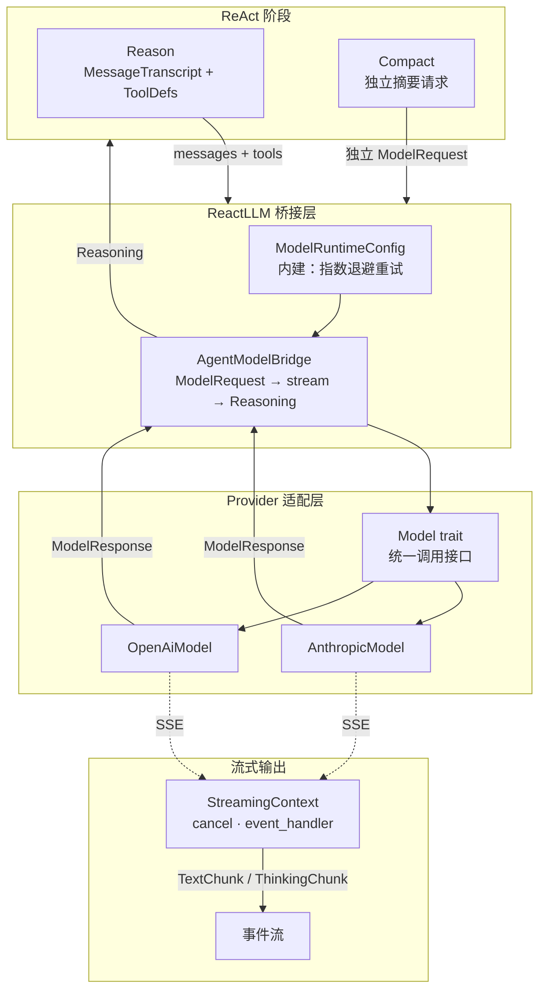

# peri-agent v2 LLM 适配器架构设计

> 全新设计，不考虑向后兼容 | 日期：2026-07-15 | 修订：v1.2

## 1. 设计原则

1. **Provider 无关**：ReAct 循环不感知下游是 Anthropic 还是 OpenAI。所有 Provider 差异封装在适配层内，对外暴露统一接口。换模型只需换实现，上层零改动。
2. **System Prompt 冻结**：System Prompt 会话开始即固化，全生命周期不可变。传递方式依 Provider 而定——Anthropic 走顶层 `system` 字段，OpenAI 兼容协议走 messages 数组首位。任何 System Prompt 变化导致 Prompt Cache 失效，等价于延迟和成本惩罚。
3. **流式优先，非流式降级**：默认走 SSE 流式路径，推理过程实时推送。非流式作为降级——Provider 声明不支持流式时自动回退为一次性调用。上层不感知流式/非流式差异。
4. **ContentBlock 为唯一消息表示**：所有 Provider 的消息内容统一用 `ContentBlock` 枚举表示。适配层负责 ContentBlock → Provider 特定格式的转换，上层只操作 ContentBlock，不接触 Provider 协议细节。
5. **重试透明**：LLM 调用失败时自动指数退避重试，上层不感知重试发生。仅可重试错误（限流、服务端异常、连接超时）触发重试；认证/权限类错误直接返回失败。

---

## 2. 总体架构

### 2.1 Model trait

Provider 的统一抽象。ReAct 循环不直接调用 Provider API——它通过 `ReactLLM` trait 发出推理请求，`ReactLLM` 的实现再委托给 `Model`。

核心职责：
- **请求规范化为 ModelRequest**：将 MessageTranscript 的全量消息、ToolDefinition 列表、System Prompt 打包为统一的请求结构。所有 Provider 接受相同格式的输入。
- **响应规范化为 ModelResponse**：将不同 Provider 的响应格式统一为 `StopReason`（结束原因）、`TokenUsage`（输入/输出/缓存 token 统计）。上层消费统一语义，不解析 Provider 特有字段。
- **能力查询**：Provider 通过 `Model::capabilities() -> ModelCapabilities` 字段声明自身能力（`peri-model/src/protocol/types.rs:484`），上层据此自适应行为：

  | 能力 | 字段 | 说明 |
  |------|------|------|
  | 流式支持 | `supports_streaming` | Reason 阶段据此选择流式或非流式路径，默认 false |
  | 工具调用 | `supports_tools` | 模型是否支持工具调用 |
  | 推理支持 | `supports_reasoning` | 扩展思考支持 |
  | 视觉输入 | `supports_vision` | 图像输入支持 |

  上下文窗口**不在** `ModelCapabilities` 中——由装配侧按 provider 快照计算（`effective_context_window`，`peri-agent/src/session/exec/executor.rs:292`，含 `context_1m` 调整），TokenTracker 据此计算 compact 阈值。

  其余 Provider 差异行为（扩展思考、Prompt 缓存、System 传递方式等）由各 Provider 构造器字段决定，不作为 trait 能力查询暴露：
  - **扩展思考**：`AnthropicModel.extended_thinking` + `thinking_budget` + `thinking_effort`；`OpenAiModel.reasoning_effort`（o1/o3 系列）+ `thinking_enabled`（deepseek-v4-pro）
  - **Prompt 缓存**：`AnthropicModel.enable_cache`
  - **Thinking Content**：`OpenAiModel.supports_thinking_content`（自动检测，目前始终 false）

### 2.2 ReactLLM 桥接

`AgentModelBridge` 是 LLM 调用的统一入口。Reason 阶段的推理请求和 Compact 阶段的摘要请求均走此桥接——前者传入 MessageTranscript 全量消息和工具定义，后者传入独立摘要请求。统一链路保证重试、流式、缓存等策略对两种调用者一致生效。

- **输入**：ModelRequest（含消息列表和可选的工具定义）。Reason 传入 MessageTranscript 全量 + 工具定义；Compact 传入独立摘要请求，不含工具定义。`ModelRequest` 还携带 `session_id`（会话级 ID，用于 LiteLLM 等代理按 session 聚合多次请求——Anthropic 透传为 `x-session-id` 请求头，OpenAI 透传为 `metadata.session_id` 请求体字段）。
- **输出**：`Reasoning` 结构，各字段按用途分组：

  | 字段 | 用途 |
  |------|------|
  | `thought` | 工具调用前的 AI 文本；最终回答场景下为空字符串 |
  | `tool_calls` | 并行工具调用列表 |
  | `final_answer` | 纯回答文本（无工具调用时产出），包含完整回答文本 |
  | `source_message` | 原始 LLM 响应，写入 Transcript 用 |
  | `usage` | Token 统计（输入/输出/缓存） |
  | `model` | 实际使用的模型名称 |
  | `streamed` | 是否已流式推送，避免 TUI 双重渲染 |
  | `stop_reason` | ToolUse / EndTurn / MaxTokens |

  > **最终回答场景语义**：代码将最终回答文本放入 `final_answer` 字段，`thought` 设为空字符串（`Reasoning::with_answer("", text)`），而非将文本放入 `thought`。

  Reason 调用可能产出 ToolUse 或最终回答；Compact 调用仅产出文本摘要。

**两种产出模式**：

- **ToolUse**：LLM 返回了工具调用请求。Reasoning.tool_calls 非空。ReAct 循环进入 Act 阶段，并发执行工具。
- **最终回答**：LLM 返回了文本回答。Reasoning.tool_calls 为空。ReAct 循环进入 End 阶段，emit TextChunk + TurnCompleted。

**防御处理**：部分 Provider（如 DeepSeek）可能返回 `stop_reason` 与实际内容不一致——内容含 tool_use 但标记为 end_turn。桥接层强制执行一致性检查，避免产生孤儿 tool_use。

**Langfuse 请求体构建**：`AgentModelBridge` 通过 `observed_provider_request_body` 共享同源逻辑，确保 Langfuse Generation input 与实际 invoke 请求体完全一致。`ReactLLM::build_provider_request_body` 和 `Model::prepare_request` 两条路径共享同一份 `ModelRequest` 构造——避免分叉导致 raw body 与实际请求体不一致（validate agent 风险点 #3）。Provider 适配器（`OpenAiModel` / `AnthropicModel`）均返回 Provider-native 完整请求体（含正确工具格式和 system 位置）。

### 2.3 ContentBlock → Provider 格式

适配层的核心转换职责。上层统一用 `ContentBlock` 枚举（Text / Image / ToolUse / ToolResult / Reasoning / Document）表示消息内容，适配层将其映射为各 Provider 的原生 JSON 格式。

**转换差异**：

| ContentBlock | Anthropic | OpenAI |
|-------------|-----------|--------|
| Text | `{"type":"text","text":"..."}` | `{"type":"text","text":"..."}` |
| Image | `{"type":"image","source":{...}}` | `{"type":"image_url","image_url":{...}}` |
| Document | `{"type":"document","source":{...}}` | `{"type":"document",...}` |
| ToolUse | `{"type":"tool_use"}` 块 | assistant 消息的 `tool_calls` 数组 |
| ToolResult | `{"type":"tool_result","id":"...","tool_use_id":"...","content":[...],"is_error":...}` 块（无显式 id 时自动生成 UUID v7） | tool 角色消息 |
| Reasoning | 透传（带 signature） | 发送时过滤，接收时回传 `reasoning_content` |
| Unknown | 透传原始 JSON | 透传原始 JSON |

**System hoist**：system 角色消息不进入 messages 数组，独立传递。Anthropic 协议走顶层 `system` 字段；OpenAI 协议走 messages 首位 System 消息。这保证 frozen system prompt 独立于对话消息，且为 Anthropic 的 cache_control 提供确定的注入位置。

`PromptTemplate::render` 用 `peri_model::prompt_cache::SYSTEM_PROMPT_DYNAMIC_BOUNDARY` 把 cached/uncached zone seam 跨 `String` handoff 传给 provider。Anthropic 的 `messages_to_anthropic` 按原 `ModelMessage::System` 顺序拼接后再由 `split_system_blocks` 拆分静态块（`cache_control=true`）与动态块（`cache_control=false`），因此 template dynamic suffix 和后续 request-time middleware contribution 保持原顺序且不污染缓存前缀。OpenAI-compatible 仅剥离控制字，不改变其他 system bytes；任一 provider wire 都不得泄漏控制字。重复控制字视为不可信输入：全部剥离且整个 system 不缓存；无控制字 legacy 输入保留最后 block fallback。

**Prompt Cache 标记**（Anthropic）：`apply_cache_to_messages` 在 messages 数组的指定位置注入 `cache_control: { type: "ephemeral" }` 标记。缓存断点策略（最多 3 个断点）：
1. **第一条 user 消息**：system + 首条 user 构成稳定缓存段
2. **倒数第二条 user 消息**：上一轮的 user+assistant+tool 整段可被缓存
3. **最后一条 user 消息**：当前轮次的完整前缀可被缓存

目标 user message 的可缓存 block 为非空 text 或 `tool_result`；array 从后向前标记最后一个 eligible block。目标没有 eligible block 时沿 user 索引向前回退。这样 append-only 工具循环能把断点推进到最新 result，同时在新 Human prompt 到来时保留上一 result 为倒数第二断点。user 消息不足 3 条时按实际数量设置断点（不重复）。system 数组中由 `system_blocks_to_json` 处理：显式静态块保留 `cache_control`；仅无 boundary 的 legacy 输入允许最后 block fallback，显式 uncached-only 或重复 boundary 均禁止 fallback。

### 2.4 重试与容错

重试已由 `ModelRuntimeConfig`（`peri_model::ModelRuntimeConfig`）内建——调用 `Model::stream` 时传入 `ModelRuntimeConfig` 配置 retry 参数，不在 Agent 侧通过装饰器包装重试逻辑。

- **指数退避 + 随机抖动**：base_delay × 2^(attempt+1)，上限封顶（默认 32000ms），附加 25% 抖动避免雷群效应。attempt 从 0 开始，首次重试（attempt=0）使用 base_delay × 2（默认 500 × 2 = 1000ms）
- **错误分类**：可重试（429 限流、5xx 服务端错误、连接超时）→ 自动重试；不可重试（401/403 认证权限错误）→ 直接返回失败
- **流式重试语义**：仅首次尝试走流式路径，重试时降级为非流式——避免同一 message_id 被双重流式发射。循环执行 `max_retries` 次（默认 5 次），每次失败若可重试则延迟后继续；循环结束后还有 1 次最终调用（不重试）。总计 `max_retries+1` 次调用（默认 6 次）。
- **可观测**：重试通过 `RetryObserver`（`peri-agent/src/session/retry_events.rs:31`，`retry_observer_for` 将 `AgentEventHandler` 包装为 observer）通知外部——每次重试触发 `ExecutorEvent::LlmRetrying { attempt, max_attempts, delay_ms, error }`，TUI 据此显示"正在重试…"。

### 2.5 流式输出

流式路径由 Executor 在 Reason 阶段注入 `StreamingContext` 开启。非流式路径走一次性 invoke，上层通过 `streaming` 参数的有无区分路径，不感知 Provider 差异。

- **StreamingContext** 携带三个控制要素：cancel token（用户取消时中断 HTTP 请求）、event handler（SSE 解析时实时推送 TextChunk / ThinkingChunk）、message_id（TUI 聚合同一条消息的增量 chunk）
- **降级路径**：Provider 声明 `supports_streaming = false` 时，`invoke_streaming` 自动回退为 `invoke`——一次性请求、一次性返回
- **中断保留**：流式生成被 cancel 时，已产出的内容保留并写入 Transcript，标记中断原因

**SseParser 有状态解析器**（`peri-model/src/transport/sse.rs`）：两个 Provider 的流式路径共用同一 SSE 解析器。实现要点：字节级拼接（`pending_bytes` 保留跨 chunk 不完整行，避免多字节 UTF-8 截断）、行协议边界检测（以 `\n` 为分隔符，先拆分再解码）、`[DONE]` 检测、event type 累积（支持 Anthropic `event: content_block_delta` 格式）。

### 2.6 Thinking 块处理

Anthropic 的 extended thinking 产出 `ContentBlock::Reasoning`，含模型内部思考过程和 signature。与工具调用前的 AI 文本（`thought`）不同：

- **Reasoning 块**：仅 Anthropic 产出，携带 signature 用于后续请求的缓存引用。Reason 阶段通过 ThinkingChunk 事件流式推送。在 AssistantMessage 中以独立 ContentBlock 存在。
- **Thought 文本**：所有 Provider 通用的"工具调用前 AI 说的文本"，在 AssistantMessage 中作为 Text 块存在。
- **跨 Provider 处理**：OpenAI 适配层根据 `supports_thinking_content` 字段分两条路径：
  - `supports_thinking_content = false`（默认，目前始终 false）：过滤 Reasoning block 不发送（`block_to_openai_part` 返回 None）；`reasoning_content` 顶层字段在所有 assistant 消息中回传（包括空字符串）；接收时同时检查 `reasoning_content` 和 `reasoning` 两个字段名（GLM 系列用 `reasoning`），非空时构造 ContentBlock
  - `supports_thinking_content = true`：Reasoning block 以 `{"type":"thinking","thinking":"...","signature":"..."}` 形式在 content 数组中发送和接收

- **Anthropic 占位注入**（`ensure_thinking_blocks`）：为所有不含 thinking block 的 assistant 消息注入空占位 thinking block（`thinking: "", signature: ""`），解决 DeepSeek Anthropic 兼容端口的 400 错误（`"The content[].thinking in the thinking mode must be passed back to the API"`）。对真实 Anthropic API 也无害——未启用 extended thinking 时 API 会忽略。

---

## 附录：新增 Provider 检查清单

1. 实现 `Model` trait
2. 实现 ContentBlock → Provider JSON 转换
3. 实现 System hoist（system 消息 → 顶层字段）
4. StopReason 映射（Provider 特定字符串 → 统一枚举）
5. TokenUsage 规范化（Provider 特定字段 → 统一字段）
6. 可选：SSE 流式解析
7. 可选：Prompt Cache 标记注入
8. 注册到 `LlmProvider`：在 `peri-acp/src/provider/mod.rs` 的 `LlmProvider` enum 添加新变体，在 `from_config` / `from_config_for_alias` 中添加匹配分支，在 `into_model` 中构造对应 `Model` 实例。当前 `from_config` 对非 `"anthropic"` 类型走 `_` 通配符（全部落入 OpenAI 路径），新增 Provider 需在此通配符前添加专属分支。
