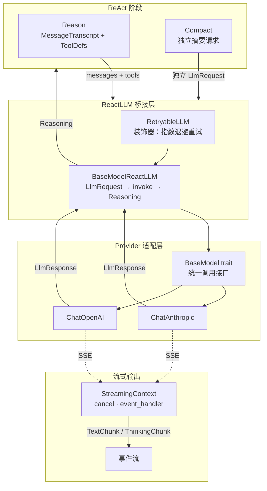

# peri-agent v2 LLM 适配器架构设计

> 全新设计，不考虑向后兼容 | 日期：2026-06-24 | 修订：v1.1

## 1. 设计原则

1. **Provider 无关**：ReAct 循环不感知下游是 Anthropic 还是 OpenAI。所有 Provider 差异封装在适配层内，对外暴露统一接口。换模型只需换实现，上层零改动。
2. **System Prompt 冻结**：System Prompt 会话开始即固化，全生命周期不可变。传递方式依 Provider 而定——Anthropic 走顶层 `system` 字段，OpenAI 兼容协议走 messages 数组首位。任何 System Prompt 变化导致 Prompt Cache 失效，等价于延迟和成本惩罚。
3. **流式优先，非流式降级**：默认走 SSE 流式路径，推理过程实时推送。非流式作为降级——Provider 声明不支持流式时自动回退为一次性调用。上层不感知流式/非流式差异。
4. **ContentBlock 为唯一消息表示**：所有 Provider 的消息内容统一用 `ContentBlock` 枚举表示。适配层负责 ContentBlock → Provider 特定格式的转换，上层只操作 ContentBlock，不接触 Provider 协议细节。
5. **重试透明**：LLM 调用失败时自动指数退避重试，上层不感知重试发生。仅可重试错误（限流、服务端异常、连接超时）触发重试；认证/权限类错误直接返回失败。

---

## 2. 总体架构

### 2.1 BaseModel trait

Provider 的统一抽象。ReAct 循环不直接调用 Provider API——它通过 `ReactLLM` trait 发出推理请求，`ReactLLM` 的实现再委托给 `BaseModel`。

核心职责：
- **请求规范化为 LlmRequest**：将 MessageTranscript 的全量消息、ToolDefinition 列表、System Prompt 打包为统一的请求结构。所有 Provider 接受相同格式的输入。
- **响应规范化为 LlmResponse**：将不同 Provider 的响应格式统一为 `StopReason`（结束原因）、`TokenUsage`（输入/输出/缓存 token 统计）。上层消费统一语义，不解析 Provider 特有字段。
- **能力查询**：Provider 声明自身能力集合，上层据此自适应行为：

  | 能力 | 说明 |
  |------|------|
  | 上下文窗口 | TokenTracker 据此计算 compact 阈值 |
  | 流式支持 | Reason 阶段据此选择流式或非流式路径 |
  | 扩展思考 | 是否支持 extended thinking / reasoning_effort |
  | Prompt 缓存 | 是否支持 Prompt Cache（决定是否注入 cache_control） |
  | System 传递 | 顶层 `system` 字段还是 messages 首位 System 消息 |

  能力集合集中暴露，上层通过能力查询而非类型匹配做决策。换模型时只需 Provider 声明新能力集，上层自动适应，无需改调用代码。

### 2.2 ReactLLM 桥接

`BaseModelReactLLM` 是 LLM 调用的统一入口。Reason 阶段的推理请求和 Compact 阶段的摘要请求均走此桥接——前者传入 MessageTranscript 全量消息和工具定义，后者传入独立摘要请求。统一链路保证重试、流式、缓存等策略对两种调用者一致生效。

- **输入**：LlmRequest（含消息列表和可选的工具定义）。Reason 传入 MessageTranscript 全量 + 工具定义；Compact 传入独立摘要请求，不含工具定义。
- **输出**：`Reasoning` 结构，各字段按用途分组：

  | 字段 | 用途 |
  |------|------|
  | `thought` | 工具调用前的 AI 文本 |
  | `tool_calls` | 并行工具调用列表 |
  | `stop_reason` | ToolUse / EndTurn / MaxTokens |
  | `final_answer` | 纯回答文本（无工具调用时产出） |
  | `source_message` | 原始 LLM 响应，写入 Transcript 用 |
  | `usage` | Token 统计（输入/输出/缓存） |
  | `model` | 实际使用的模型名称 |
  | `streamed` | 是否已流式推送，避免 TUI 双重渲染 |

  Reason 调用可能产出 ToolUse 或最终回答；Compact 调用仅产出文本摘要。

**两种产出模式**：

- **ToolUse**：LLM 返回了工具调用请求。Reasoning.tool_calls 非空。ReAct 循环进入 Act 阶段，并发执行工具。
- **最终回答**：LLM 返回了文本回答。Reasoning.tool_calls 为空。ReAct 循环进入 End 阶段，emit TextChunk + TurnCompleted。

**防御处理**：部分 Provider（如 DeepSeek）可能返回 `stop_reason` 与实际内容不一致——内容含 tool_use 但标记为 end_turn。桥接层强制执行一致性检查，避免产生孤儿 tool_use。

### 2.3 ContentBlock → Provider 格式

适配层的核心转换职责。上层统一用 `ContentBlock` 枚举（Text / Image / ToolUse / ToolResult / Reasoning / Document）表示消息内容，适配层将其映射为各 Provider 的原生 JSON 格式。

**转换差异**：

| ContentBlock | Anthropic | OpenAI |
|-------------|-----------|--------|
| Text | `{"type":"text","text":"..."}` | `{"type":"text","text":"..."}` |
| Image | `{"type":"image","source":{...}}` | `{"type":"image_url","image_url":{...}}` |
| Document | `{"type":"document","source":{...}}` | `{"type":"document",...}` |
| ToolUse | `{"type":"tool_use"}` 块 | assistant 消息的 `tool_calls` 数组 |
| ToolResult | `{"type":"tool_result"}` 块 | tool 角色消息 |
| Reasoning | 透传（带 signature） | 发送时过滤，接收时回传 `reasoning_content` |
| Unknown | 透传原始 JSON | 透传原始 JSON |

**System hoist**：system 角色消息不进入 messages 数组，独立传递。Anthropic 协议走顶层 `system` 字段；OpenAI 协议走 messages 首位 System 消息。这保证 frozen system prompt 独立于对话消息，且为 Anthropic 的 cache_control 提供确定的注入位置。

**Prompt Cache 标记**（Anthropic）：在 system 数组和 messages 数组的尾部注入 `cache_control` 标记。静态区域（CLAUDE.md / Skills / 工具定义）的缓存位置固定，动态区域在边界标记之后。

### 2.4 重试与容错

`RetryableLLM` 装饰任意 `ReactLLM` 实现，提供透明重试。

- **指数退避 + 随机抖动**：base_delay × 2^attempt，上限封顶，附加 25% 抖动避免雷群效应
- **错误分类**：可重试（429 限流、5xx 服务端错误、连接超时）→ 自动重试；不可重试（401/403 认证权限错误）→ 直接返回失败
- **流式重试语义**：仅首次尝试走流式路径，重试时降级为非流式——避免同一 message_id 被双重流式发射。共 N+1 次尝试（N 次重试 + 1 次最终调用）。
- **可观测**：重试发生时通过事件流通知外部（TUI 显示"正在重试…"）

### 2.5 流式输出

流式路径由 Executor 在 Reason 阶段注入 `StreamingContext` 开启。非流式路径走一次性 invoke，上层通过 `streaming` 参数的有无区分路径，不感知 Provider 差异。

- **StreamingContext** 携带三个控制要素：cancel token（用户取消时中断 HTTP 请求）、event handler（SSE 解析时实时推送 TextChunk / ThinkingChunk）、message_id（TUI 聚合同一条消息的增量 chunk）
- **降级路径**：Provider 声明 `supports_streaming = false` 时，`invoke_streaming` 自动回退为 `invoke`——一次性请求、一次性返回
- **中断保留**：流式生成被 cancel 时，已产出的内容保留并写入 Transcript，标记中断原因

### 2.6 Thinking 块处理

Anthropic 的 extended thinking 产出 `ContentBlock::Reasoning`，含模型内部思考过程和 signature。与工具调用前的 AI 文本（`thought`）不同：

- **Reasoning 块**：仅 Anthropic 产出，携带 signature 用于后续请求的缓存引用。Reason 阶段通过 ThinkingChunk 事件流式推送。在 AssistantMessage 中以独立 ContentBlock 存在。
- **Thought 文本**：所有 Provider 通用的"工具调用前 AI 说的文本"，在 AssistantMessage 中作为 Text 块存在。
- **跨 Provider 处理**：OpenAI 不支持 Reasoning 类型，适配层过滤 Reasoning block 不发送；OpenAI 的 `reasoning_content` 顶层字段回传但不构造 ContentBlock。

---

## 附录：新增 Provider 检查清单

1. 实现 `BaseModel` trait
2. 实现 ContentBlock → Provider JSON 转换
3. 实现 System hoist（system 消息 → 顶层字段）
4. StopReason 映射（Provider 特定字符串 → 统一枚举）
5. TokenUsage 规范化（Provider 特定字段 → 统一字段）
6. 可选：SSE 流式解析
7. 可选：Prompt Cache 标记注入
8. 注册到 LlmProvider
