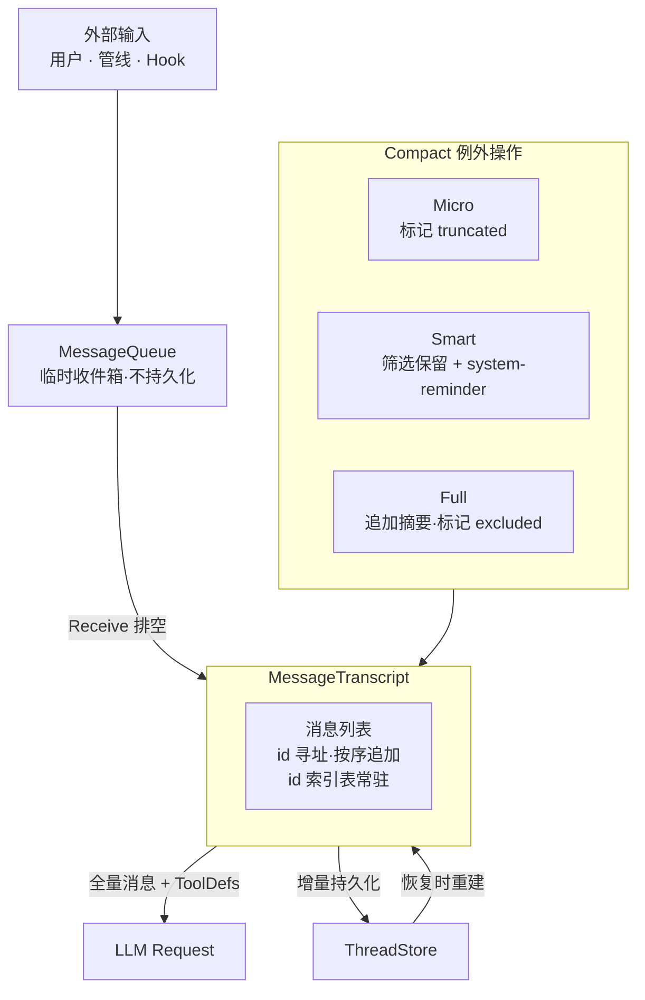

# peri-agent v2 会话消息存储架构设计

> 全新设计，不考虑向后兼容 | 日期：2026-06-24 | 修订：v1.2

## 1. 设计原则

1. **永远 id 寻址**：每条消息拥有唯一 `MessageId`（UUID v7，时间有序）。所有外部操作——rewind、compact、持久化恢复——一律按 id 定位消息。禁止使用 Vec 下标定位——下标可因消息标记漂移而引入隐性错误。
2. **只追加优先**：正常 ReAct 循环中消息仅尾部追加，禁止 prepend 或中间插入。保证 Prompt Cache 前缀稳定，LLM 请求构造路径简单无分支。Compact 是唯一例外——读取后重建新 Transcript，非增量追加。
3. **修改即新消息**：消息内容不可原地修改。需要变更时，正常路径产生新消息（新 id）。Compact 在重建 Transcript 时通过标记实现——Micro 标 `truncated`（LLM 请求时截断输出）、Full 标 `excluded`（LLM 请求时跳过）——标记不改变消息内容本身。
4. **Transcript 为权威源**：Transcript 是会话全部消息的唯一真相源。持久化是 Transcript 的镜像——落后时以 Transcript 为准重建。不持久化 MessageQueue——Queue 是临时收件箱。
5. **持久化不阻塞循环**：消息追加到 Transcript 后异步触发持久化。持久化失败不阻塞 Agent 循环——仅记录错误，内存 Transcript 始终可用。
6. **标记代替删除**：Compact 不删除、不修改消息内容。Micro 标 `truncated`（LLM 请求时截断输出），Full 和 Smart 标 `excluded`（LLM 请求时跳过该消息）。标记可撤销，消息本体不变。仅 rewind 允许真删除。

---

## 2. 总体架构

### 2.1 MessageId 寻址

每条消息拥有唯一 `MessageId`（UUID v7，按时间单调递增）。

- **唯一寻址方式**：所有操作一律通过 id 定位消息。Transcript 内部维护 id→消息的索引表，常驻内存。不存在通过 Vec 下标定位的路径——下标会因 Compact 移除消息而漂移，后果严重。
- **去重保证**：同一 Session 内 MessageId 绝不重复。持久化恢复时执行 id 碰撞检测——碰撞意味着数据损坏。
- **时间有序**：UUID v7 自带时间戳，天然按创建时间排序——Transcript 的消息列表与 id 排序一致。

### 2.2 Transcript 存储

核心容器为消息列表，顺序即对话时间线。尾部追加是唯一正常写入路径。内部通过 id 索引表支持 O(1) 按 id 查找。

- **BaseMessage**：统一消息类型。`content` 为 `MessageContent`（纯文本、ContentBlock 列表、Provider 原生格式）。`content_blocks()` 懒解析，Provider 按需选择最优格式。
- **ContentBlock**：七种变体——Text、Image、Document、ToolUse、ToolResult、Reasoning、Unknown。Transcript 存储完整 ContentBlock。
- **只追加规则**：
  - ✅ Reason 产出的 AI 消息、Act 产出的 ToolResult、SystemReminder → 尾部追加
  - ❌ 禁止 prepend 或中间插入——破坏 Prompt Cache 前缀
  - ❌ 禁止删除或修改——Compact 通过重建 Transcript 实现，标记不改变消息内容本身
- **ancestor 边界**：Fork/Background Agent 从父 Agent 继承消息时，Transcript 维护 `ancestor_len` 边界。继承的祖先消息只读——Compact 仅操作边界之后的自有消息，祖先消息不可压缩、不可删除。
- **Staging 两阶段写入**：Reason 阶段产出的 AI 消息（含 tool_calls）不直接追加到 Transcript——先 Staging。Act 阶段收集所有 ToolResult 后，AI 消息 + ToolResult 作为一组原子提交到 Transcript。Staging 期间的消息 LLM 请求不可见。提交后触发持久化。若 Act 阶段异常终止（Cancel/Error），staging 消息丢弃——Transcript 回到本轮开始前的状态，不留半个 AI 消息。

### 2.3 MessageQueue

临时收件箱，独立于 Transcript，**不持久化**。Session 重建时 Queue 从空开始。

### 2.4 持久化

ThreadStore 负责 Transcript 的完整持久化。

- **触发时机**：消息追加到 Transcript 后**异步**触发持久化——Transcript 先更新，持久化随后跟进。不阻塞 Agent 循环。
- **增量持久化**：仅持久化新消息（按 id 对比）。Transcript 中已持久化的消息跳过，只写增量。Compact 重建 Transcript 后，持久化层同步变更——标记变更 UPDATE、新增消息 INSERT。rewind 触发 DELETE。
- **Compact 标记**：Micro 标记 `truncated`、Full 和 Smart 标记 `excluded`。标记持久化同步（UPDATE 标记字段，不修改 content）。Full 追加新 Human 消息（INSERT），Smart 追加 system-reminder（INSERT）。
- **崩溃保护**：Transcript 始终是权威源。恢复时检测 Transcript 与持久化的差异——Transcript 有而持久化无的消息从 Transcript 补写，持久化有而 Transcript 无的消息视为脏数据丢弃。

### 2.5 Rewind

按 MessageId 将会话回滚到指定消息，撤销其后所有操作。

- **操作**：指定目标 id → Transcript 截断至该消息（含）→ id 索引表同步收缩 → 持久化层删除该 id 之后的所有记录 → MessageQueue 清空。
- **文件系统回滚**：rewind 到某消息时，该消息之后产生的临时文件（如输出落盘文件）同步清理。仅保留回滚点之前的文件系统状态。
- **恢复**：回滚后的会话从该点继续，ReAct 循环正常启动。

### 2.6 与 Compact 的交互

Compact 不修改现有 Transcript，而是读取后**重建新 Transcript**。旧 Transcript 被替换，非增量操作。三种模式的重建策略：

| Compact 模式 | 重建策略 | 持久化影响 |
|-------------|---------|-----------|
| Micro | 保留全部消息，部分标 `truncated: true` | UPDATE 标记字段 |
| Full | 追加新摘要消息，旧消息标 `excluded: true` | INSERT 摘要 + UPDATE 旧消息标记 |
| Smart | 保留 LLM 选中的消息，未选中标 `excluded: true`，追加 system-reminder | UPDATE 标记 + INSERT system-reminder |

- 三种模式均通过标记实现——Micro 标 `truncated`，Full 和 Smart 标 `excluded`。消息不删，标记可撤销。rewind 清标记恢复原状
- Smart 追加 system-reminder 告知 LLM 被移除的内容概要
- Full 追加新 Human 消息（新 id），摘要和旧消息并存于新 Transcript

### 2.7 与 v2 其他模块的关系

| 模块 | 关系 |
|------|------|
| **Session** | Transcript 是 Session 核心实体之一。Session 创建时 Transcript 为空，销毁时丢弃 |
| **LLM 适配器** | Reason 阶段从 Transcript 读取全量消息构造 LlmRequest |
| **ReAct 循环** | Receive 将 Queue 消息写入 Transcript。Act 将工具结果写入 Transcript |
| **AgentGroup** | Fork Agent 创建时 Transcript 全量 Copy |
| **Hook 系统** | Hook 不能直接写 Transcript——通过 MessageQueue 注入 |
| **事件流** | Transcript 变更产生事件，外部据此刷新 UI |
