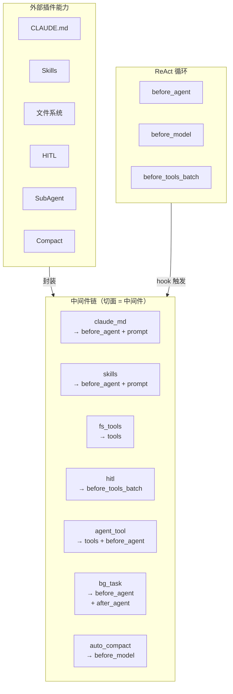

# peri-agent v2 Middleware 中间件系统设计

> 全新设计，不考虑向后兼容 | 日期：2026-06-24 | 修订：v1.1

## 1. 设计原则

1. **切面即中间件**：一个切面就是一个中间件。每个切面封装一个独立的外部能力——hook 实现 + 工具声明 + System Prompt 贡献的自包含单元。不再有「中间件容器套切面」的嵌套结构。
2. **单一职责**：每个切面只做一件事。Agent 注册和 Background 任务是两个独立切面，各自排在链中，可独立复用、独立测试。
3. **声明式注册**：切面通过声明方式注册 hooks、tools、依赖关系。声明在编译期可检查完整性。
4. **固定顺序，不可重排**：切面在链中的排列顺序是契约。同一 hook 点上多个切面按声明顺序执行。[TRAP]
5. **State 为唯一共享上下文**：切面间不直接通信——所有状态变更通过 State 传递。

---

## 2. 总体架构



### 2.1 切面（中间件）——能力的封装单元

一个切面是单一能力的声明。它即是一个中间件：

| 声明项 | 说明 |
|--------|------|
| **Hook 挂载** | 声明在哪些生命周期点上执行什么逻辑。完整 hook 清单见 [Hook 注册表面板](peri-agent-hook-registry-v2.md)——中间件切面使用其中 10 个 hook（before_agent、before_model、after_model、before_tool、after_tool、before_tools_batch、after_tools_batch、after_agent、on_error、on_permission_request） |
| **工具声明** | 声明提供哪些工具，Executor 统一收集注册 |
| **System Prompt 贡献** | 声明需要追加到 System Prompt 的文本片段 |
| **条件守卫** | 声明注册条件（如「仅当权限模式非 Bypass 时注册」） |

切面可以不挂载任何 hook——纯工具提供者（如 Filesystem）只需声明 tools，零 hook。

### 2.2 执行模型

链是扁平的——直接遍历切面：

```
Hook 触发（如 before_model）
  → 遍历链中的切面（声明顺序）
    → 执行切面在该 hook 上的挂载逻辑
```

- 遇错即停——后续切面跳过，错误向上传播
- 批量处理（before_tools_batch）：切面声明支持批量模式时 Engine 自动批量化，否则退化为逐条调用

### 2.3 工具收集

Executor 遍历链中所有切面的 `tools` 声明，统一注册：

```
for aspect in chain:
  for tool in aspect.tools:
    register(tool.create(cwd))
```

- 工具工厂接收 cwd 参数动态创建
- 同名工具后者覆盖前者（链顺序决定优先级）

---

## 3. 切面注册表

链中的 21 个切面，每个即是一个中间件：

| 切面 | 挂载 Hook | 提供工具 | Prompt 贡献 | 条件 |
|------|----------|---------|------------|------|
| claude_md | before_agent | — | CLAUDE.md 摘要 | — |
| agent_define | before_agent | — | AgentOverrides | — |
| skills | before_agent | — | Skills 摘要 | — |
| skill_preload | before_agent | — | — | — |
| at_mention | before_agent | — | — | — |
| filesystem | — | Read/Write/Edit/Glob/Grep/folder | — | — |
| git_attribution | — | — | Co-Authored-By | — |
| terminal | — | Bash | — | — |
| web | — | WebFetch/WebSearch | — | — |
| todo | — | TodoWrite | — | — |
| cron | — | Cron 工具组 | — | — |
| user_hook | before_agent | — | — | hook_groups 非空 |
| hitl | before_tools_batch | AskUserQuestion | — | — |
| agent_tool | before_agent | Agent | — | — |
| background_task | before_agent, after_agent | — | — | — |
| mcp_bridge | after_agent | MCP 工具（动态） | — | mcp_pool 非空 |
| workflow | — | Workflow 编排工具 | — | workflow_executor 非空 |
| tool_search | — | SearchExtraTools/ExecuteExtraTool | — | — |
| lsp | — | LSP 工具 | — | lsp_servers 非空 |
| goal_tracking | before_model | — | — | goal_controller 非空 |

---

## 4. 顺序约束

链中切面的排列顺序即依赖关系。不需要单独的 `requires` 字段——排在前面的先执行，排在后面的依赖前面的产出：

- `claude_md` 排在 `hitl` 之前——先注入上下文，再审批
- `hitl` 排在 `agent_tool` 之前——Agent 工具调用需先经审批
- 信息注入切面（claude_md、skills）排在 `goal_tracking` 之前——goal 追踪需要上下文已就绪
- 工具切面（filesystem、terminal、web 等）排在 `tool_search` 之前——工具索引需完整工具列表

顺序即契约。新增切面时按依赖关系插入对应位置。

---

## 5. System Prompt 贡献

切面通过声明替代 prepend_message 模式：

- 切面声明 prompt_contribution 文本片段
- Executor 在 `before_agent` 完成后收集所有切面的贡献
- 拼接后追加到 frozen system prompt 之后
- 不再进入 `state.messages`

---

## 6. 与 v2 其他模块的关系

| 模块 | 关系 |
|------|------|
| **Session** | `session/new` 时决定切面注册集合，链按此构建 |
| **ReAct 循环** | hook 点嵌入 ReAct 循环固定检查点 |
| **System Prompt** | 切面通过声明贡献，不通过 prepend_message |
| **工具系统** | 切面声明 tools，Executor 统一收集 |
