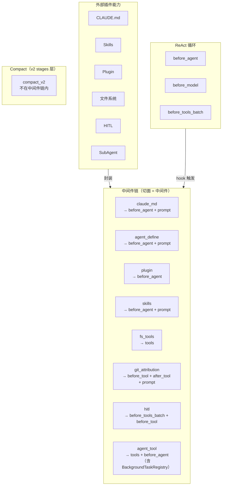

# peri-agent v2 Middleware 中间件系统设计

> 全新设计，不考虑向后兼容 | 日期：2026-07-15 | 修订：v2.0

## 1. 设计原则

1. **切面即中间件**：一个切面就是一个中间件。每个切面封装一个独立的外部能力——hook 实现 + 工具声明 + System Prompt 贡献的自包含单元。不再有「中间件容器套切面」的嵌套结构。
2. **单一职责**：每个切面只做一件事。Agent 注册是独立切面；Background 任务通过 `BackgroundTaskRegistry` 嵌入 `SubAgentMiddleware`（`with_background_registry()`），不作为独立切面存在。
3. **声明式注册**：切面通过声明方式注册 hooks、tools、依赖关系。声明在编译期可检查完整性。
4. **固定顺序，不可重排**：切面在链中的排列顺序是契约。同一 hook 点上多个切面按声明顺序执行。[TRAP]
5. **State 为唯一共享上下文**：切面间不直接通信——所有状态变更通过 State 传递。

---

## 2. 总体架构



### 2.1 切面（中间件）——能力的封装单元

一个切面是单一能力的声明。它即是一个中间件：

| 声明项 | 说明 |
|--------|------|
| **Hook 挂载** | 声明在哪些生命周期点上执行什么逻辑。完整 hook 清单见 [Hook 注册表面板](peri-agent-hook-registry-v2.md)——`Middleware` trait 定义了 19 个生命周期 hook，按功能分为四层：**Session 级**（on_session_start、on_session_end、on_user_prompt）、**Agent/ReAct 级**（before_agent、before_model、after_model、before_tools_batch、before_tool、after_tool、after_tools_batch、after_agent、on_turn_end）、**Compact 观测层**（before_compact、after_compact）、**事件/子对象观测层**（on_permission_request、on_subagent_start、on_subagent_stop、on_notification、on_error） |
| **工具声明** | 声明提供哪些工具，Executor 统一收集注册 |
| **System Prompt 贡献** | 声明需要追加到 System Prompt 的文本片段 |
| **条件守卫** | 声明注册条件（如「仅当权限模式非 Bypass 时注册」） |

切面可以不挂载任何 hook——纯工具提供者（如 Filesystem）只需声明 tools，零 hook。

### 2.2 执行模型

链是扁平的——直接遍历切面：

```
Hook 触发（如 before_model）
  → 遍历链中的切面（声明顺序）
    → 执行切面在该 hook 上的挂载逻辑
```

- 遇错即停——后续切面跳过，错误向上传播
- 批量处理（before_tools_batch）：切面声明支持批量模式时 Engine 自动批量化，否则退化为逐条调用

### 2.3 工具收集

Executor 遍历链中所有切面的 `collect_tools` 声明，统一收集：

```
for aspect in chain:
  for tool in aspect.collect_tools(cwd):
    collect(tool)
```

- 工具工厂接收 cwd 参数动态创建
- `collect_tools` 阶段仅收集不做去重；去重在后续 merge 到 `shared_tools`（`HashMap`）时按后注册覆盖先注册的语义完成
- `AskUserQuestion` 工具例外——由 builder 直接 insert 到 `shared_tools`，不经过 `collect_tools`

---

## 3. 切面注册表

链中的 20 个切面（15 基础 + 5 条件），每个即是一个中间件：

> 注：Compact 已从中间件链移除，由 v2 stages/compact.rs 在 ReAct 循环每轮开头处理。详见 §6。

| # | 切面 | 挂载 Hook | 提供工具 | Prompt 贡献 | 条件 |
|---|------|----------|---------|------------|------|
| 1 | claude_md | before_agent | — | CLAUDE.md 摘要 | — |
| 2 | agent_define | before_agent | — | AgentOverrides | — |
| 3 | plugin | before_agent | — | — | — |
| 4 | skills | before_agent | — | Skills 摘要 | — |
| 5 | skill_preload | before_agent | — | — | — |
| 6 | at_mention | before_agent | — | — | — |
| 7 | filesystem | — | Read/Write/Edit/Glob/Grep/folder | — | — |
| 8 | git_attribution | before_tool, after_tool | — | Git Attribution | — |
| 9 | terminal | — | Bash | — | — |
| 10 | web | — | WebFetch/WebSearch | — | — |
| 11 | todo | — | TodoWrite | — | — |
| 12 | cron | — | Cron 工具组 | — | — |
| 13 | user_hook | before_agent 等 | — | — | hook_groups 非空 |
| 14 | hitl | before_tools_batch, before_tool | — | — | — |
| 15 | agent_tool | before_agent | Agent（+AgentResultTool） | — | — |
| 16 | mcp_bridge | — | MCP 工具（动态） | — | mcp_pool 非空 |
| 17 | workflow | — | Workflow 编排工具（deferred tool） | — | workflow_executor 非空 |
| 18 | tool_search | — | SearchExtraTools/ExecuteExtraTool | — | — |
| 19 | lsp | — | LSP 工具 | — | lsp_servers 非空 |
| 20 | goal_tracking | after_agent | Goal（deferred tool） | — | goal_controller 非空 |

**脚注**：
- **#3 plugin**：`PluginMiddleware` 在 `before_agent` hook 中执行插件兼容性校验（name/version/manifest 字段完整性）。
- **#8 git_attribution**：`before_tool` 暂存 Write/Edit 旧文件内容，`after_tool` 计算贡献字符数。Prompt 贡献通过 `prompt_contribution()` 声明（Co-Authored-By 指令）。
- **#14 hitl**：`AskUserQuestion` 工具由 builder 直接 insert 到 `shared_tools`（不经过 `collect_tools`），原因是 `HumanInTheLoopMiddleware` 不实现 `collect_tools`——工具需使用原始 `permission_broker` 而非 `MultiplexBroker`。
- **#15 agent_tool**：`SubAgentMiddleware` 通过 `with_background_registry()` 嵌入 `BackgroundTaskRegistry`。当 registry 存在时，`collect_tools()` 额外注册 `AgentResultTool`（后台任务完成回调）。后台完成事件通过独立 unbounded channel（`bg_event_rx`）通知，不随 executor 生命周期销毁。
- **#20 goal_tracking**：`GoalTool` 通过 `is_deferred_tool` 过滤器从 LLM 可见列表移除，仅通过 `SearchExtraTools` → `ExecuteExtraTool` 访问。`after_agent` hook 注入递增紧迫感 steering + 设 `block_continue` 触发自驱续跑。

---

## 4. 顺序约束

链中切面的排列顺序即依赖关系。不需要单独的 `requires` 字段——排在前面的先执行，排在后面的依赖前面的产出：

- `claude_md` 排在 `hitl` 之前——先注入上下文，再审批
- `hitl` 排在 `agent_tool` 之前——hitl 的 `before_tools_batch` 拦截 SubAgent 提供的 Agent 工具调用，在工具实际执行前完成审批
- 信息注入切面（claude_md、skills）排在 `goal_tracking` 之前——goal 追踪需要上下文已就绪
- 工具切面（filesystem、terminal、web 等）排在 `tool_search` 之前——工具索引需完整工具列表

顺序即契约。新增切面时按依赖关系插入对应位置。

---

## 5. System Prompt 贡献

切面通过声明替代 prepend_message 模式：

- 切面声明 `prompt_contribution()` 文本片段（返回 `Option<String>`）
- 链构建完成后，`builder.rs` 调用 `chain.collect_prompt_contributions()` 收集所有切面的贡献
- 拼接后追加到 frozen system prompt 之后（`format!("{system_prompt}\n\n{contributions}")`）
- 不再进入 `state.messages`

**当前贡献者列表**（`prompt_contribution()` 返回 `Some` 的中间件）：
| 中间件 | 贡献内容 |
|--------|---------|
| agents_md (#1) | CLAUDE.md 摘要 |
| skills (#4) | Skills 摘要 |
| git_attribution (#8) | Co-Authored-By 指令 |
| tool_search (#18) | 工具索引说明 |

> `with_system_prompt()` 在链尾将合并后的 prompt prepend 到 LLM——链顺序决定贡献拼接顺序。

---

## 6. 与 v2 其他模块的关系

| 模块 | 关系 |
|------|------|
| **Session** | `session/new` 时决定切面注册集合，链按此构建 |
| **ReAct 循环** | hook 点嵌入 ReAct 循环固定检查点 |
| **System Prompt** | 切面通过声明贡献，不通过 prepend_message |
| **工具系统** | 切面声明 tools，Executor 统一收集 |
| **Compact** | 已从中间件链移除（`CompactMiddleware` 已删除）。自动 compact 由 `peri-agent::agent::stages::compact` 在 RCRA 循环中处理；旧版固定阈值仅是历史实现参数，不作为当前约束。当前策略与回收目标以 `docs/design/micro-compact-improvement-proposals.md` 和 `ContextPressure::target_reclaim_tokens()` 为事实源。Compact 不再作为切面参与链执行 |
| **Plugin** | `PluginMiddleware`（#3）是基础中间件，在 `before_agent` hook 中执行插件兼容性校验。插件扩展的 Skills 通过 `SkillsMiddleware.with_plugin_roots()` 注入，Hooks 通过 `HookMiddleware`（#13，可多实例）注入 |
