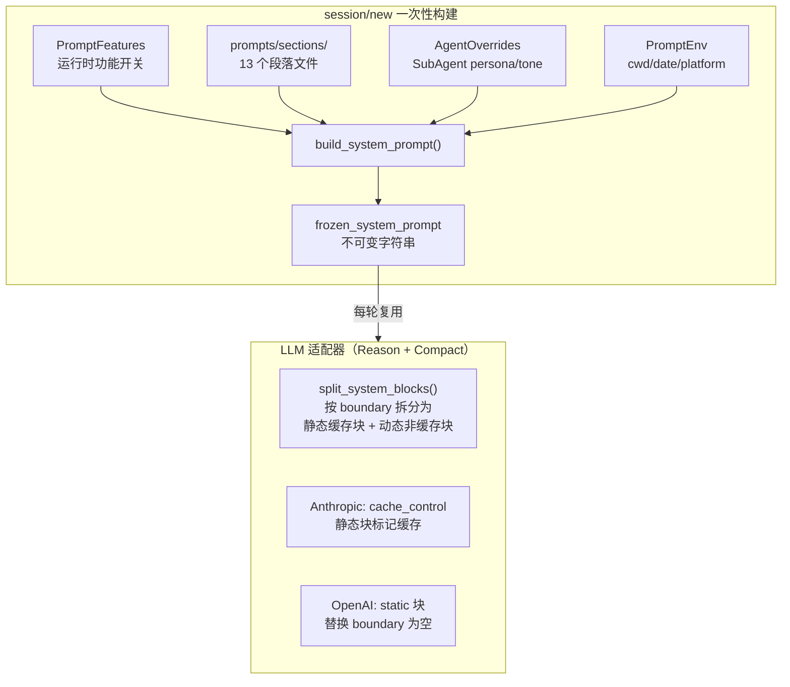

# peri-agent v2 System Prompt 构建系统设计

> 全新设计，不考虑向后兼容 | 日期：2026-07-15 | 修订：v1.1

## 1. 设计原则

1. **会话冻结**：System Prompt 在 `session/new` 时构建一次，产出 `frozen_system_prompt`。会话内后续所有轮次直接复用，禁止重新构建。保证 Prompt Cache 前缀绝对稳定。
2. **静态/动态分离**：`__SYSTEM_PROMPT_DYNAMIC_BOUNDARY__` 边界标记将 System Prompt 分为静态区域（跨会话不变）和动态区域（会话语境可变）。仅静态区域参与 Anthropic Prompt Cache。
3. **Feature-gated 注入**：HITL、SubAgent、Cron、Skills、Channel 等运行时功能通过 `PromptFeatures` 开关控制是否注入对应段落。未启用的功能不占用上下文。
4. **编译期嵌入**：所有提示词段落通过 `include_str!` 编译期嵌入二进制。运行时不读盘——SubAgent 创建时复用 frozen 数据，不重新 I/O。
5. **不与 Messages 耦合**：System Prompt 独立于 Transcript 中的对话消息。注入方式为 LLM 适配器层的顶层 System Prompt，不进入 `AgentState.messages`。

---

## 2. 总体架构



### 2.1 段落文件组织

13 个 Markdown 段落文件位于 `peri-acp/prompts/sections/`，通过 `include_str!` 编译期嵌入。编号即拼接顺序：

| 编号 | 文件 | 区域 | 内容 | Feature Gate |
|------|------|------|------|-------------|
| 01 | `01_intro.md` | 静态 | 角色定义、安全边界 | — |
| 02 | `02_system.md` | 静态 | 编码规范、主动性 | — |
| 03 | `03_doing_tasks.md` | 静态 | 任务执行流程 | — |
| 04 | `04_actions.md` | 静态 | 操作原则、Git 安全 | — |
| 05 | `05_using_tools.md` | 静态 | 工具使用策略 | — |
| 06 | `06_tone_style.md` | 静态 | 语气与风格 | — |
| 16 | `16_workflow.md` | 静态 | Workflow 编排 | — |
| — | `__SYSTEM_PROMPT_DYNAMIC_BOUNDARY__` | 边界 | 缓存放行分界 | — |
| 07 | `07_env.md` | 动态 | 环境变量占位符 | — |
| 14 | `14_system_reminder.md` | 动态 | System Reminder 协议 | — |
| 10 | `10_hitl.md` | 动态 | HITL 审批模式 | `hitl_enabled` |
| 11 | `11_subagent.md` | 动态 | SubAgent 委派 | `subagent_enabled` |
| 13 | `13_skills.md` | 动态 | Skills 系统 | `skills_enabled` |
| 15 | `15_channel.md` | 动态 | 频道消息 | `channel_enabled` |
| — | — | 动态 | Language 指示 | `language` 参数 |

规则：
- 静态段落（01-06, 16）跨会话、跨项目、跨日期完全稳定，始终参与 Prompt Cache
- 动态段落（07-15）包含环境占位符（`{{cwd}}`、`{{date}}` 等）或 feature-gated 内容，不参与缓存
- 段落文件只增不减——删除段落会改变静态区域导致全量缓存失效。废弃段落保留空文件即可
- **定时任务（原 `12_cron.md`）已迁移为 builtin skill `cron`**（见 `peri-middlewares/src/skills/builtin/skills/cron/SKILL.md`）：指导内容按需加载（SkillTool），不再常驻系统提示词；`cron_register/list/remove` 工具与 HITL 审批不变

### 2.2 构建流程

```
build_system_prompt(overrides, cwd, features, extra_agent_dirs, frozen_date, language)
│
├─ 1. 构造 PromptEnv（cwd/date/platform/os_version/is_git_repo）
│     └─ frozen_date 存在时跳过 chrono::Local::now()
│
├─ 2. 拼接静态段落（01→02→03→04→05→06→16）
│     └─ include_str! 直接嵌入，无运行时 I/O
│
├─ 3. 插入边界标记 __SYSTEM_PROMPT_DYNAMIC_BOUNDARY__
│
├─ 4. 注入 AgentOverrides 覆盖块（persona/tone/proactiveness）
│     └─ 放边界之后——不同 SubAgent 的 persona 不同，放静态区域会导致缓存全失效
│
├─ 5. 按序拼接动态段落
│     ├─ 07_env（始终包含）
│     ├─ 14_system_reminder（始终包含）
│     └─ feature-gated：10/11/13/15（按 PromptFeatures 开关）
│
├─ 6. 注入 Language 指示（动态区域尾部）
│
└─ 7. 占位符替换
      └─ {{cwd}} → cwd, {{date}} → date, {{is_git_repo}} → Yes/No
         {{platform}} → OS, {{os_version}} → macOS 26.5.1
         {{available_agents}} → agent 列表（来自 11_subagent.md，feature-gated 段落）

frozen_system_prompt 构建完成。

> **步骤 8 不属于 `build_system_prompt()` 内部流程**，而是 `build_agent()` 中的独立步骤，
> 发生在 `build_system_prompt()` 返回之后：

├─ 8. 追加中间件切面贡献（build_agent() 中执行）
│     └─ 遍历链中所有切面的 prompt_contribution 声明
│        拼接后合并：format!("{system_prompt}\n\n{contributions}")
│        如：CLAUDE.md 摘要、Skills 摘要、Git Co-Authored-By 行等
│        不同 Agent（主 Agent vs SubAgent）的切面集合不同，贡献也不同
│        合并结果通过 AgentModelBridge::with_system() 传入 LLM
```

### 2.3 PromptFeatures

控制 feature-gated 段落的注入，4 个布尔开关：

```rust
pub struct PromptFeatures {
    pub hitl_enabled: bool,      // YOLO_MODE="false" 时启用（非 YOLO 模式）
    pub subagent_enabled: bool,  // 始终 true
    pub skills_enabled: bool,    // 始终 true
    pub channel_enabled: bool,   // 始终 true
}
```

- `detect()`：检查环境变量 `YOLO_MODE`，当 `YOLO_MODE="false"` 时 `hitl_enabled=true`（即非 YOLO 模式时启用 HITL）
- `none()`：测试用，全部关闭
- 关闭的段落完全不出现在 System Prompt 中，节省上下文

### 2.4 Process overrides

`AgentOverrides` 来自 `.claude/agents/{agent_id}.md` 的 frontmatter 字段（`persona`/`tone`/`proactiveness`）。主 Agent 无 overrides（`None`），SubAgent 有。

- 覆盖块放在 `__SYSTEM_PROMPT_DYNAMIC_BOUNDARY__` 之后——不同 SubAgent 的 persona 不同，放静态区域之前会导致每个 agent 的缓存前缀完全不同
- 覆盖块非空时才注入，主 Agent 不产生额外 token 开销
- 覆盖块已有 `# Tone and style` / `# Proactiveness` 标题时，不重复注入默认段落

## 3. 与 v2 其他模块的关系

- **Session / FrozenContext**：`session/new` 调用 `build_system_prompt()` 产出 `frozen_system_prompt`，封装进 `FrozenContext`（`peri-agent/src/session/store.rs`）。FrozenContext 由 `FrozenContextBuilder` 构建，包含 5 个字段：`system_prompt`（完整提示词）、`claude_md`（项目级+用户级 CLAUDE.md 合并）、`skill_summary`（Skills 摘要）、`date`（会话日期）、`language`（语言偏好）。所有字段均为 `Arc<str>` 以避免跨 Agent/Turn 复制大字符串。后续轮次直接复用，禁止重新构建
- **LLM 适配器**：`split_system_blocks()` 按 boundary 拆分为静态/动态块，Provider 各自处理。Anthropic 适配器（`invoke.rs`）中 `messages_to_anthropic()` 还会执行 System 消息分离——将含边界标记的 System 消息（来自 `build_system_prompt()`）排在最前面作为可缓存前缀，不含边界标记的 middleware 注入内容排在边界之后。这确保 middleware contributions 变化不会破坏 Anthropic prompt cache 前缀。详见 LLM 适配器文档
- **中间件系统**：切面通过 `prompt_contribution` 声明贡献 System Prompt 片段。Executor 在 Agent 构建时收集并追加到 `frozen_system_prompt` 尾部。详见中间件设计文档
- **SubAgent**：复用 main agent 的 frozen 数据，仅 AgentOverrides 不同，禁止重新读盘
- **Compact**：不触碰 System Prompt。摘要以 Human 消息注入，不被 hoist
