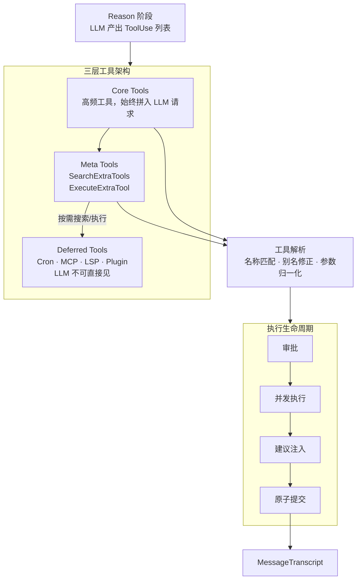

# peri-agent v2 工具系统架构设计

> 全新设计，不考虑向后兼容 | 日期：2026-06-24 | 修订：v1.2

## 1. 设计原则

1. **工具无状态**：工具实例不持有可变状态。同一工具实例可被多个 Agent 并发调用，互不干扰。执行所需上下文（cwd、对话历史）通过只读引用传入，不写回。
2. **渐进式可见性**：工具分三层——Core（高频，始终对 LLM 可见）、Meta（桥接层，2 个）、Deferred（按需发现，LLM 不可直接见）。避免 context 膨胀，同时保持工具可发现性。
3. **原子提交**：一轮工具调用的 AI 消息和全部 ToolResult 一同写入 MessageTranscript。不产生孤儿 tool_use——任何时候，所有 ToolUse 都有配对的 ToolResult。
4. **工具失败不中断循环**：工具执行失败不终止 ReAct 循环。错误结果写入 Transcript 后，由 LLM 在下一轮自行判断后续。
5. **审批在调用前**：编辑类工具在真正执行前完成 HITL 审批。审批拒绝产生结果记录而非跳过，保持 Transcript 完整。

---

## 2. 总体架构

### 2.1 BaseTool 契约

所有工具的根 trait。定义工具对外暴露的接口，不约束内部实现。

- 工具向 LLM 暴露三要素：名称、描述、参数 Schema。LLM 依据这三要素决定是否调用及如何传参
- 工具执行入口接收 LLM 生成的输入和只读上下文，返回执行结果
- 工具不能直接修改 AgentState——所有副作用通过返回值表达，由 dispatch 层统一写入 Transcript

**只读上下文**：工具可感知对话历史和工作目录，但不能修改。只读约束保证工具无法绕过原子事务写入。

**别名契约**：LLM 的调用请求常有偏差。工具可声明别名，让系统在调用前透明纠正，而非报错。

- **参数别名**：工具声明常见参数名的别名映射。LLM 使用别名传参时，系统自动映射到正名再调用工具。典型场景：LLM 常混淆 `path` 和 `file_path`，工具声明后系统自动纠正。
- **名称别名**：工具声明常用名称的别名映射。LLM 使用别名调用时，系统自动路由到正确工具。典型场景：LLM 可能把 Agent 叫 task、Bash 叫 shell。
- **Meta 展开**：通过 Meta 工具调用的 Deferred 工具时，从参数中提取真实工具名和参数，路由到目标。

别名是契约的一部分——工具声明"我接受这些别名"，系统据此纠正 LLM 错误。不声明则不纠正。

**输出控制**：工具可声明输出处理偏好，系统据此优化资源使用。

- **截断**：工具声明输出长度限制，超出部分自动截断并标注省略量。避免大体积输出撑爆上下文、淹没其他工具结果。
- **落盘**：产生大输出的工具（如 Bash、WebFetch）可声明落盘偏好，结果写入临时文件，Transcript 仅保留引用。Read 工具无需此能力——文件内容本就从磁盘读取。

### 2.2 三种工具类型

Skills 不是工具——它们通过 System Prompt 注入行为指令，不走工具系统。以下分类仅针对工具。

| 层级 | LLM 可见性 | 职责 | 原因 |
|------|-----------|------|------|
| Core | 始终可见 | 高频通用工具 | 控制数量上限，避免 context 膨胀 |
| Meta | 始终可见 | 桥接 Deferred——搜索和按名执行 | 统一发现入口，LLM 知道"可搜索"即可 |
| Deferred | LLM 不可直接见 | 低频或动态注册的工具 | 数量不可控，全部暴露浪费 token |

### 2.3 工具执行生命周期

- **审批**：编辑类工具执行前走 HITL，阻断整批工具直到用户决策。只读工具跳过。拒绝不跳过——生成结果记录一同提交。
  - **决策类型**：Approve（放行）、Edit（修改参数后放行）、Reject（拒绝）、Respond（拒绝 + 自定义消息）
  - **权限模式**：Default（逐个审批）、AcceptEdit（自动批准编辑类）、Auto（LLM 自动分类审批）、Bypass（全部跳过）
- **并发执行**：全部工具同时启动，互不等待。
- **AskUserQuestion**：阻断自身等待用户输入，其他工具照常并发。用户回答作为 ToolResult 一同提交。
- **建议注入**：工具执行失败后、写入 Transcript 前，系统预留注入点。具体建议逻辑由业务侧实现——工具系统只提供扩展机制，不实现建议内容。
  - **注入时机**：建议追加到错误输出末尾，不改变 `is_error` 标记——LLM 看到增强后文本自行判断，错误事实不被掩盖。
  - **扩展点**：业务侧注册建议器，按类型匹配错误并生成建议，可独立增删。
- **原子提交**：一轮工具调用的提交是不可分割的整体。
  - **事务范围**：本轮 AI 消息 + 全部 ToolResult。
  - **异常保证**：cancel、超时、审批拒绝——所有路径下，每个 ToolUse 都有配对的 ToolResult。
  - **永不产生孤儿**：成功、失败、拒绝、中断——各有明确的结果记录。

### 2.4 工具搜索

Meta 工具（SearchExtraTools / ExecuteExtraTool）是 LLM 发现和调用 Deferred 工具的通道。

- **SearchExtraTools**：按关键词搜索可用 Deferred 工具，返回匹配列表。LLM 据此判断是否有合适工具再决定调用。
- **ExecuteExtraTool**：按工具名和参数直接执行 Deferred 工具。LLM 先搜索、再执行——两步走而非一步到位。
- **搜索范围**：Deferred 工具来自多个来源——Cron 定时任务、MCP 外部服务、LSP 语言服务、Plugin 插件。各来源独立注册，搜索时合并结果。
