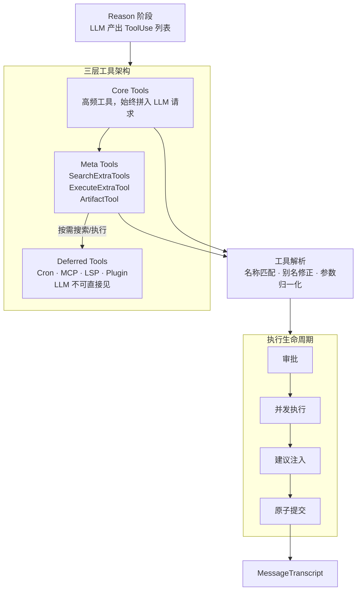

# peri-agent v2 工具系统架构设计

> 全新设计，不考虑向后兼容 | 日期：2026-07-15 | 修订：v1.3

## 1. 设计原则

1. **工具无状态**：工具实例不持有可变状态。同一工具实例可被多个 Agent 并发调用，互不干扰。执行所需上下文（cwd、对话历史）通过只读引用传入，不写回。
2. **渐进式可见性**：工具分三层——Core（高频，始终对 LLM 可见）、Meta（桥接层，2 个）、Deferred（按需发现，LLM 不可直接见）。避免 context 膨胀，同时保持工具可发现性。
3. **原子提交**：一轮工具调用的 AI 消息和全部 ToolResult 一同写入 MessageTranscript。不产生孤儿 tool_use——任何时候，所有 ToolUse 都有配对的 ToolResult。
4. **工具失败不中断循环**：工具执行失败不终止 ReAct 循环。错误结果写入 Transcript 后，由 LLM 在下一轮自行判断后续。
5. **审批在调用前**：编辑类工具在真正执行前完成 HITL 审批。审批拒绝产生结果记录而非跳过，保持 Transcript 完整。

---

## 2. 总体架构



### 2.1 BaseTool 契约

所有工具的根 trait。定义工具对外暴露的接口，不约束内部实现。

- 工具向 LLM 暴露三要素：名称、描述、参数 Schema。LLM 依据这三要素决定是否调用及如何传参
- 工具执行入口接收 LLM 生成的输入和只读上下文，返回执行结果
- 工具不能直接修改 AgentState——所有副作用通过返回值表达，由 dispatch 层统一写入 Transcript

**只读上下文**：工具可感知对话历史和工作目录，但不能修改。只读约束保证工具无法绕过原子事务写入。

**别名契约**：LLM 的调用请求常有偏差。工具可声明别名，让系统在调用前透明纠正，而非报错。

- **参数别名**：工具声明常见参数名的别名映射。LLM 使用别名传参时，系统自动映射到正名再调用工具。典型场景：LLM 常混淆 `path` 和 `file_path`，工具声明后系统自动纠正。
- **名称别名**：工具声明常用名称的别名映射。LLM 使用别名调用时，系统自动路由到正确工具。典型场景：LLM 可能把 Agent 叫 task、Bash 叫 shell。
- **Meta 展开**：通过 Meta 工具调用的 Deferred 工具时，从参数中提取真实工具名和参数，路由到目标。

别名是契约的一部分——工具声明"我接受这些别名"，系统据此纠正 LLM 错误。不声明则不纠正。

**输出控制**：工具可声明输出处理偏好，系统在 `post_process_result` 中据此优化资源使用。

- **超时**：`timeout()` 默认 120s，适用于 Read/Edit/Glob 等快速操作。Agent/Bash 等长时间运行工具返回 `None`，由内部自行管理超时。外层 dispatch 以此超时包裹工具执行。
- **截断**：`output_char_limit()` 声明输出字符数上限（`None` 表示不截断）。超出部分自动截断并标注省略量。避免大体积输出撑爆上下文、淹没其他工具结果。
- **落盘**：`prefers_persist()` 返回 `true` 时，系统倾向于将结果写入临时文件，Transcript 仅保留引用。产生大输出的工具（如 Bash、WebFetch）适用此能力。Read 工具无需——文件内容本就从磁盘读取。

### 2.2 三种工具类型

Skills 不是工具——它们通过 System Prompt 注入行为指令，不走工具系统。以下分类仅针对工具。

| 层级 | LLM 可见性 | 职责 | 原因 |
|------|-----------|------|------|
| Core | 始终可见 | 高频通用工具 | 控制数量上限，避免 context 膨胀 |
| Meta | 始终可见 | 桥接 Deferred——搜索和按名执行 | 统一发现入口，LLM 知道"可搜索"即可 |
| Deferred | LLM 不可直接见 | 低频或动态注册的工具 | 数量不可控，全部暴露浪费 token |

**Meta 工具实际注册的工具**：ToolSearchMiddleware 的 `collect_tools()` 除注册 SearchExtraTools 和 ExecuteExtraTool 外，还注册 **ArtifactTool**（工具名 `"artifact"`，将本地 HTML 文件上传到 CCB Artifacts 服务，返回公开 URL，支持 7d/30d TTL）。虽然 ArtifactTool 本质上是 deferred tool（不在 `META_TOOLS` 常量集合中），但它由中间件直接注册到 LLM 可见列表中。

**Deferred 工具来源**：Cron 定时任务、MCP 外部服务（`mcp__{server}__{tool}`）、LSP 语言服务、Plugin 插件（`plugin:{name}:{server}` 前缀命名空间）、Workflow 工具。各来源独立注册到 `shared_tools`，搜索时合并结果。

### 2.3 工具执行生命周期

- **审批**：编辑类工具执行前走 HITL，通过 `before_tools_batch` 批量处理接口一次性收集所有需审批的项，弹出一个多工具审批弹窗（而非逐个阻断）。只读工具跳过。拒绝不跳过——生成结果记录一同提交。
  - **决策类型**：Approve（放行）、Edit（修改参数后放行）、Reject（拒绝）、Respond（拒绝 + 自定义消息）
  - **权限模式**：Default（逐个审批）、AcceptEdit（自动批准编辑类）、AutoMode（LLM 自动分类审批）、Bypass（全部跳过）。模式通过 `SharedPermissionMode`（`Arc<AtomicU8>` 封装）跨线程共享，支持运行时动态切换（`cycle()` 按 Default → AcceptEdit → AutoMode → Bypass 循环）。
- **并发执行**：全部工具同时启动，互不等待。
- **AskUserQuestion**：阻断自身等待用户输入，其他工具照常并发。用户回答作为 ToolResult 一同提交。
- **建议注入**：工具执行失败后、写入 Transcript 前，系统通过 `post_process_result` 注入建议。已在 `ToolEnd` 事件 emit 之后执行。
  - **注入时机**：仅当 `is_error = true` 时触发。建议文本追加到错误输出末尾，不改变 `is_error` 标记——LLM 看到增强后文本自行判断，错误事实不被掩盖。
  - **已实现的建议器注册表**：`build_default_registry()` 按短路顺序注册 7 个 suggester——参数语法类（廉价）在前、IO/查询类在后：
    1. `JsonSchemaSuggester`：参数 JSON Schema 校验错误
    2. `GlobPatternSuggester`：Glob 模式语法错误
    3. `RegexSuggester`：正则表达式语法错误
    4. `RangeSuggester`：数值/索引越界错误
    5. `PathSuggester`：文件路径不存在或模糊匹配建议（需 IO）
    6. `BashCommandSuggester`：Bash 命令拼写错误建议（需 PATH 扫描）
    7. `SubagentSuggester`：SubAgent 名称拼写错误建议（需 registry 查询）
  - **扩展点**：`ErrorSuggester` trait 可独立增删，按短路匹配顺序——首个返回 `Some(Suggestion)` 的 suggester 生效。
- **原子提交**：一轮工具调用的提交是不可分割的整体。
  - **事务范围**：本轮 AI 消息 + 全部 ToolResult。
  - **异常保证**：cancel、超时、审批拒绝——所有路径下，每个 ToolUse 都有配对的 ToolResult。
  - **永不产生孤儿**：成功、失败、拒绝、中断——各有明确的结果记录。

### 2.4 工具搜索

Meta 工具（SearchExtraTools / ExecuteExtraTool）是 LLM 发现和调用 Deferred 工具的通道。

- **SearchExtraTools**：按关键词搜索可用 Deferred 工具，返回匹配列表。LLM 据此判断是否有合适工具再决定调用。
- **ExecuteExtraTool**：按工具名和参数直接执行 Deferred 工具。LLM 先搜索、再执行——两步走而非一步到位。
- **搜索范围**：Deferred 工具来自多个来源——Cron 定时任务、MCP 外部服务、LSP 语言服务、Plugin 插件、Workflow 工具。各来源独立注册到 `shared_tools`，搜索时合并结果。

#### 2.4.1 搜索算法

`ToolSearchIndex` 实现了 TF-IDF + 关键词混合搜索引擎（`tool_index.rs` + `keyword_search.rs`），评分公式：

```
score = keyword_score × 0.4 + tfidf_score × 0.6
```

**查询语法**：
- `select:CronCreate,Snip` —— 按精确名称查找，逗号分隔，直接返回匹配工具
- `+slack message` —— `+` 前缀词为必选词（`required`），其余为可选关键词（`optional`）。必选词缺失时该工具硬过滤为 0 分
- `slack message` —— 纯关键词搜索

**分词策略**（`tokenize`）：
- CJK 字符逐字分割（每个汉字/日文/韩文字符为独立 token）
- ASCII 按空格/下划线/连字符分割，全部转小写

**关键词评分**（`keyword_score`）：
- 必选词全部匹配 → 基础分 1.0，任一缺失 → 硬过滤 0.0
- 可选词匹配 → 每个 +0.3
- 工具名精确匹配 → +0.5
- 描述精确匹配 → +0.2（匹配长度 ≥ 3）
- 子串匹配要求双方长度 ≥ 2

**工具名分词**（用于关键词匹配）：
- CamelCase 分词：`CronCreate` → `["cron", "create"]`
- MCP 前缀拆解：`mcp__slack__send_message` → `["slack", "send_message"]`（跳过 `mcp` 前缀）

**TF-IDF 评分**：
- 加权分词：name 权重 3.0，description 权重 2.5
- IDF 公式：`ln(N / (df + 1))`，N 为文档总数，df 为包含该词的文档数
- 向量余弦相似度计算最终 TF-IDF 分数

#### 2.4.2 索引构建与缓存失效

`ToolSearchIndex` 使用 `content_version`（`AtomicU64`）追踪索引变更：

- 每次 `build()` 全量重建时，`content_version` 原子递增（`fetch_add`）
- `set_cached_prompt()` 记录当前 `content_version` 到 `cached_prompt_version`
- 中间件在 `before_agent` 中比对 `content_version()` 与 `cached_prompt_version()`：
  - 二者不一致 → cached_prompt 已 stale，触发重新构建
  - 一致但 `total_count()` 与实际 deferred 工具数不匹配 → 也触发重建

此机制解决"同 count 但不同 content"场景——例如 MCP 重连后工具数量相同但描述/schema 已更新，单纯数量比对会漏掉变化。

#### 2.4.3 Core 列表与 Prompt Cache 保护

`CORE_TOOLS` 使用 `LazyLock<HashSet<&'static str>>` 存储 12 个核心工具名。因为 `HashSet` 迭代序不稳定，通过 `core_tools_sorted_csv()` 生成字典序排列的逗号分隔字符串，用于动态嵌入 Meta 工具（SearchExtraTools）的 description 中。

```rust
// core_tools_sorted_csv() 示例输出：
// "Agent, AskUserQuestion, Bash, Edit, Glob, Grep, Read, TodoWrite, WebFetch, WebSearch, Write, folder_operations"
```

排序保证跨调用的字符串前缀稳定，保护 LLM prompt cache 命中率。
