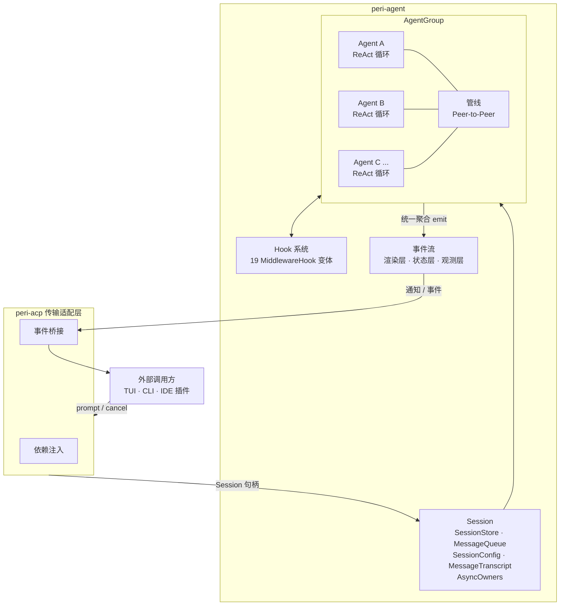

# peri-agent v2 架构设计

> 全新设计，不考虑向后兼容 | 日期：2026-07-15 | 修订：v2.4（第四轮审计修订）

## 1. 设计原则

1. **自主性优先**：Agent 自主驱动执行，不等待外部轮询或指令。所有外部输入均为推入式——消息推入 MessageQueue 即触发循环，Agent 自行决定何时响应、何时执行、何时结束。不存在拉取式交互。
2. **Agent 平等**：AgentGroup 内所有 Agent 地位平等，不区分主从或父子。任一 Agent 可向任一 Agent 派发任务或订阅结果。Agent 间通过管线通讯，不存在直接持有或控制关系。
3. **上下文缓存可靠性**：System Prompt 会话开始即冻结，全生命周期不可变。Compact 等其他操作均走独立 LLM 调用，永不触碰主会话 System Prompt。消息仅尾部追加，禁止 prepend 或中间插入。动态占位符置于缓存边界标记之后。任何前缀变化导致 Prompt Cache 失效，等价于延迟和成本惩罚。
4. **阶段契约**：ReAct 循环拆为独立阶段，每阶段有明确的类型契约（StageInput → StageOutput），可脱离完整 Agent 单独测试。阶段间依赖通过输入结构体声明，不读全局状态。
5. **原子事务**：工具阶段的 AI 消息和全部 ToolResult 必定全提交——不丢弃、不产生孤儿 tool_use。发生意外（cancel、超时、审批拒绝）时，对应工具必须生成 error ToolResult 标明结束原因，其余工具正常提交。
6. **显式注入**：外部数据进入 Agent 只有两条通道——MessageQueue（异步：goal steering、SubAgent 完成、Cron 触发、Workflow 完成等）和 ChannelBroker（同步：MCP Channel 权限审批）。HITL 审批通过 `MiddlewareHook::OnPermissionRequest` 在 `BeforeTool` 阶段同步阻塞实现。禁止隐式副作用写，谁注入谁负责生命周期。
7. **结构化可观测**：状态变更产生事件，事件携带 `turn_id` 统一纽带——从 LLM 调用到工具执行全程可追踪。事件分层发送，严重级别结构化区分。

---

## 2. 总体架构



### 2.1 Session

归属 `peri-agent`。外部通过 Session API 创建和交互，不持有内部实现。

**生命周期**

```
外部创建 Session → 注入外部依赖（持久化 / FrozenContext / Hook 集）
  → AgentGroup 随 Session 创建
  → 用户 prompt 驱动 ReAct 循环，turn 反复执行
  → 外部销毁 Session → AgentGroup 销毁 → 全部 Agent 终止
```

**核心实体**

- **SessionStore**：会话生命周期数据，构建后不可变。内含 FrozenContext（CLAUDE.md / Skills / System Prompt，会话开始即冻结）
- **MessageQueue**：收件箱，独立于 SessionStore，会话内持续可变。每条消息带 `MessageKind`（Prompt / Defer / Info）和 `MessageSource`（9 种来源），控制循环唤醒和消费行为
- **SessionConfig**：可变配置（权限模式、Cancel Token、超时）。Arc 共享，外部写入，循环读取
- **MessageTranscript**：对话笔录，只追加不篡改。Reason 读取构造 LLM 请求，Act 写入 ToolResult。内置 token 计数和 staging 事务写

**TurnContext**：一次"用户输入 → Agent 处理 → 回答"为一个 turn。含 step、cwd、cancel 引用。turn 结束即销毁。**注意**：TurnContext 不是 Session 的持久字段，而是通过 `Session::start_turn()` 按需创建，随后传入 `StageContext` 驱动 ReAct 循环。

**MessageSource 枚举**（`MessageQueue::QueuedMessage` 携带）

| 枚举值 | 说明 |
|--------|------|
| `UserInput` | 外部用户输入 |
| `SubAgentComplete` | SubAgent 完成回调 |
| `GoalSteering` | Goal 中途纠正 |
| `CronTrigger` | Cron 定时触发 |
| `StopHookFeedback` | Stop hook 反馈 |
| `ChannelMessage` | Channel 消息（微信/Slack 等） |
| `SystemInjected` | Hook 系统注入 |
| `ToolFailureWarning` | 工具失败警告 |
| `WorkflowComplete` | 工作流完成 |

**异步 Owner（AsyncOwners）**

cron 主路径为 session 级：`CronOwner` 由 `AcpSession.cron_bridge` 持有（跨 turn 存活，turn 结束含 retry Error 不杀死 bridge），`SessionInbox` 为 session 级 lazy-init（`session_inbox_for`），与 executor 的 `await_wake` 共享同一 wake Notify。

Session 侧 `set_async_owners` 注入的 `async_owners: Option<RwLock<Option<AsyncOwners>>>` 仅 print 模式（`-p`，无 SessionManager）fallback 使用。包含三个组件：

- **SessionInbox**：提供 `await_wake` 机制——Agent 在 idle 时通过 `inbox.await_wake()` 阻塞等待异步事件（bg agent / cron / workflow），醒来后继续执行
- **CronOwner**：将 cron 定时触发桥接到 inbox，触发 wake
- **ChannelOwner**：将 channel 通知桥接到 inbox，触发 wake

`None` 表示未启用 async owner 路径（TUI 轮询路径仍有效）。

**Session 与 AgentGroup 的关系**

- Session 创建时自动创建 AgentGroup，销毁时级联销毁
- AgentGroup 内 Agent 按需创建/销毁，生命周期独立于 AgentGroup
- Session 不直接操作 Agent——通过 AgentGroup 间接管理

### 2.2 Message 类型

会话中流转的数据实体，按业务属性分四类。

**Human（对应文档业务类型 UserMessage）** — 外部用户输入，唯一能主动开启新 turn 的源头。路径：外部 → MessageQueue（Prompt）→ Receive → Transcript

**Ai（对应文档业务类型 AssistantMessage）** — Agent 的一轮完整回复。内含 ContentBlock（Text / ToolUse / Thinking）。Thinking 由 Reason 流式产出，提交时聚合。中断保留：已产出内容仍写入 Transcript

**Tool（对应文档业务类型 ToolResult）** — 工具执行结果，与 ToolUse 严格一对一。携带结束原因（Success / Timeout / Rejected / Canceled / ToolInternalError），工具失败不自动重试

**SystemReminder** — 业务概念，映射为 `BaseMessage::Human`（内容用 `<system-reminder>` 包裹）。路径：外部 → MessageQueue（Info）→ Receive → Transcript，跨 turn 保留

**业务类型 → BaseMessage 枚举 → LLM 协议类型**

| 业务类型 | BaseMessage 枚举 | LLM 类型 | 转换规则 |
|---------|-----------------|---------|---------|
| UserMessage | `BaseMessage::Human` | `human` | 文本直出 |
| SystemReminder | `BaseMessage::Human` | `human` | `<system-reminder>` 包裹 |
| AssistantMessage | `BaseMessage::Ai` | `assistant` | 拆为 Text / ToolUse / Thinking 块 |
| ToolResult | `BaseMessage::Tool` | `tool_result` | tool_call_id 对号，is_error → error 标记 |

转换发生在 Reason 阶段内部。Provider 特定字段（如 Anthropic cache_control）在转换层注入。

### 2.3 AgentGroup

随 Session 创建，全生命周期存活。组内 Agent 平等，通过管线通讯。**Agent 间全非阻塞**——创建子 Agent 后立即返回，子 Agent 独立执行 ReAct 循环，结果通过管线 → MessageQueue（Defer）异步投递。系统中不存在 Agent 阻塞等待另一个 Agent 的场景。

```
AgentGroup（会话级）
  ├── Agent（按需创建/销毁）
  │     └── Turn（ReAct 循环）
  └── 管线（跨 Agent 消息通道）
```

**创建时继承规则**：全部 Copy，不共享引用。工具集为源 Agent 工具集的子集；SessionConfig 独立实例；TranscriptPolicy 可选 Empty（SubAgent）或 Copy（Fork Agent）；TurnContext 和 EventBus 不可继承。

**管线**：Agent 间 Peer-to-Peer 消息通道。传递 Message 富类型，最终汇入目标 Agent 的 MessageQueue。外部后台 Agent 可接入管线。

**事件聚合**：AgentGroup 收集组内全部 Agent 的事件，统一向外投递。外部只看到一个事件流，无需区分事件来自哪个 Agent。事件携带 `agent_id` 标识来源。

**外部把手**：`register_agent`（创建 + 注册，返回 AgentId / mailbox_rx / cancel_token） / `destroy_agent`（移除句柄 + 注销管线） / `list_agents` / `get_agent`；`send`（向指定 Agent 发消息） / `broadcast`（向全部 Agent 广播） / `cancel_agent` / `cancel_all` / `event_sender`（获取事件发送端克隆）。

**Cancel 策略**：创建时指定——Independent（子 Agent 独立 Cancel Token，父取消不影响子）或 Cascade（父取消级联取消全部子 Agent）。Background Agent 默认 Independent。

### 2.4 ReAct 循环

**StageContext**：ReAct 循环实际通过 `StageContext` 驱动，而非 Agent 直接持有 Session。StageContext 聚合了 Turn、Transcript、Queue、AgentId、LLM、Tools、MiddlewareChain、EventBus、ContextBudget、CompactConfig、TokenTracker 等运行时依赖。各阶段通过 `StageContext` 访问 Session 实体，不直接持有 Session。

- 消息分三类，控制循环唤醒和消费行为
  - **Prompt**：外部主动请求。Receive 消费，End 可唤醒。循环结束后到达同样激活
  - **Defer**：延迟到达的结果。Receive 跳过，End 可唤醒。循环结束后到达同样激活
  - **Info**：通知性数据。仅 Receive 消费，被 Prompt 带出或单独消费。永不唤醒循环
- 5 阶段闭环
  - **Compact** 上下文压缩
  - **Receive** 排空收件箱
  - **Reason** LLM 推理
  - **Act** 工具执行或回答
  - **End** 交还控制权
    - Act 有工具调用时跳过 End，直接回到 Compact
    - 队列有 Prompt 或 Defer → 回到 Compact
    - 队列空或仅有 Info → 退出，emit TurnCompleted

**边界约束**：End 阶段退出意味着本轮 ReAct 循环已终结。循环外部（`run_session_loop` / executor）**禁止**在 ReAct 循环返回后再加阻塞等待——`LoopResult` 返回后应立即产出 `PromptResult`，由调用方（TUI / stdio）决定是否发起新一轮。在 executor 层加 `await_wake` 等阻塞点会破坏协议响应性（stdio 路径的 `responder.respond()` 永远不执行，IDE 客户端无限 loading）。

**idle await_wake 机制**：`run_react_loop` 在 End 阶段判定队列空后，检查 `idle_should_wait` 闭包。若返回 true（主 Agent 有未完成异步任务，如 bg subagent），先 emit `TurnSuspended` 通知 TUI 停止 loading spinner，再通过 `idle_inbox.await_wake()` 阻塞等待，同时用 `tokio::select!` 监听 cancel token。醒来后执行 `drain_for_end` 消费已推送的 Defer/Prompt 写入 transcript，然后 `continue` 启动新一轮。若 `idle_inbox` 为 `None`（stdio/print 路径）或 `idle_should_wait` 返回 false（无未完成异步任务），直接退出循环返回 `Completed`。

### 2.5 Hook 系统

统一的钩子体系，`MiddlewareHook` 枚举（19 个变体）按 ReAct 阶段和 Agent 生命周期触发。完整清单与分类见 [Hook 注册表面板](peri-agent-hook-registry-v2.md)。不在 Hook 系统内的走 MessageQueue 注入。HITL 审批通过 `OnPermissionRequest` 在 `BeforeTool` 阶段同步阻塞实现。

- `OnSessionStart` — setup 后、首轮循环前
- `OnUserPrompt` — 每次用户 prompt 提交后
- `BeforeCompact` / `AfterCompact` — Compact 阶段前后
- `BeforeModel` / `AfterModel` — LLM 推理前后
- `BeforeTool` / `AfterTool` — 工具执行前后（HITL 审批在 BeforeTool 中同步阻塞）
- `BeforeToolsBatch` / `AfterToolsBatch` — 批量工具调用前后（HITL 批量审批在 BeforeToolsBatch 中同步阻塞）
- `BeforeAgent` / `AfterAgent` — Agent 循环前后
- `OnPermissionRequest` — HITL 审批弹窗时
- `OnNotification` — Agent 等待用户输入时
- `OnSubagentStart` / `OnSubagentStop` — 子 Agent 创建/退出
- `OnTurnEnd` — Act 后、End 前（防止死循环守卫）
- `OnError` — 异常中断
- `OnSessionEnd` — 会话退出

### 2.6 事件流

状态变更驱动，按消费者视角分三层，所有事件携带 `turn_id`。

| 层级 | 通道 | 事件 | 消费者 |
|------|------|------|--------|
| 渲染层 | critical 同步 | TextChunk, ThinkingChunk, ToolStarted/Ended, BudgetWarning, HitlPending, **TurnCompleted** | TUI / 门户 |
| 状态层 | critical 同步 | StateSnapshot, SyntheticUserMessage, **TurnSuspended** | 外部状态同步 |
| 观测层 | broadcast | LlmCallStart/End, CompactStarted, MessagesCompacted, TurnError, SubagentStart/Stop | 遥测 / 持久化 |

TurnError 原因枚举：Interrupted / Timeout / LlmFailure / ToolFailure / RateLimit / MaxIterations

**TurnCompleted 迁移说明**：`TurnCompleted` 从状态层迁移到渲染层，原因是必须与同迭代的 TextChunk / ToolStarted / ToolEnded 保持严格 FIFO 顺序。渲染层和状态层使用独立通道，`biased select!` 无法保证跨通道顺序——把 TurnCompleted 放到 render_tx 同一通道可避免跨迭代渲染错乱。

**TurnSuspended**：Agent 在 idle await_wake 路径中 emit，通知 TUI flush current_turn + 停止 loading spinner。bg callback 到达时新 turn 的 TextChunk/ToolStarted 事件自动恢复 loading。

**SyntheticUserMessage**：Defer 消息写入 transcript 时 emit，通过 mapper_v2 映射到 TUI 用户气泡，保证气泡位于已归档的 turn 之后、当前 turn 之前。

**EventBus 实现**

v2 实现三层分级 EventBus 架构：

| 组件 | 类型 | 说明 |
|------|------|------|
| `Event` | 统一事件枚举 | `Render(RenderEvent)` / `State(StateEvent)` / `Observe(ObserveEvent)` |
| `EventBus` | 生产端 | 持有三个通道 Sender |
| `EventHandles` | 消费端 | 持有三个通道 Receiver |

通道机制：

| 层级 | 通道类型 | 发送方式 | 满时行为 | 默认容量 |
|------|---------|---------|---------|---------|
| 渲染层 | `tokio::sync::mpsc` 有界 | `try_send` | 降级丢弃 | 256 |
| 状态层 | `tokio::sync::mpsc` 有界 | `try_send` | 降级丢弃 | 64 |
| 观测层 | `tokio::sync::broadcast` | `send` | 慢消费者自动 lagging | 128 |

约束：critical 通道有界 + 超时降级，慢消费者不阻塞循环。事件由 AgentGroup 统一聚合后投递，事件携带 `agent_id` 标识来源 Agent。

### 2.7 模块边界

```
外部（TUI / CLI / IDE 插件）
    │  传输协议（ACP / Mpsc / Stdio）
    ▼
peri-acp
    │  收集外部依赖 → 创建 Session → 桥接事件流到传输协议
    ▼
peri-agent
    Session → AgentGroup → Agent → ReAct 循环
```

- **peri-agent**：Session、Agent、AgentGroup、ReAct 循环的全部定义和生命周期管理
- **peri-acp**：薄适配层，将传输协议的 prompt 请求转换为 Session API 调用，将 Agent 事件流映射为协议通知。不定义自己的 Session 结构，仅持有 Session 句柄
