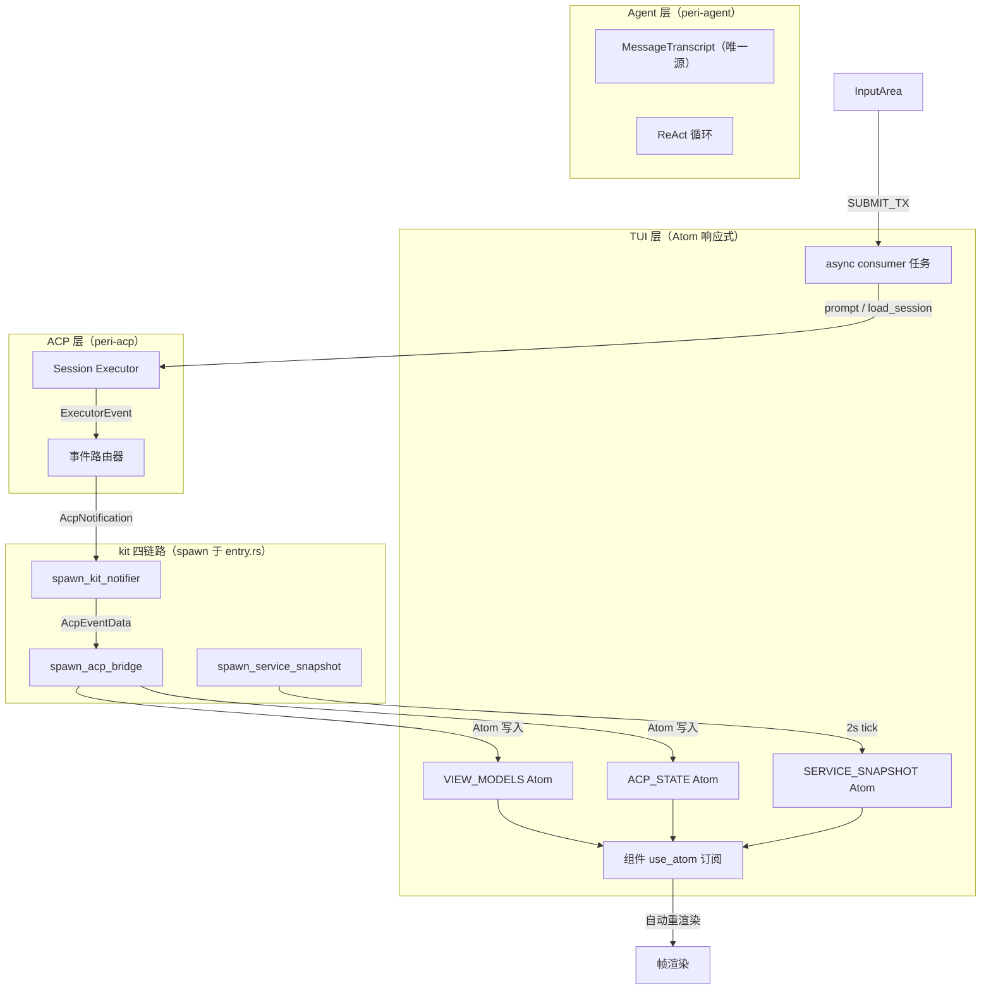

# peri-tui 架构设计 v2

> 全新设计，不考虑向后兼容 | 日期：2026-07-15 | v2.3（同步 Atom 响应式架构演进）

## 1. 设计原则

1. **事件驱动**：系统在架构层面是纯粹的事件驱动。crossterm 在底层不得不轮询，但轮询结果立即转换为事件推入通道——轮询是平台适配器的实现细节，不是系统架构。
2. **Atom 响应式**：全局状态通过 `ratatui-kit` 的 `AtomStatic<T>` / `AtomState<T>` 容器管理（`atoms.rs` 定义 60+ atoms）。组件通过 `use_atom(&ATOM)` 订阅状态，写入自动唤醒订阅组件重渲染。副作用由 spawn 的 async consumer 任务执行——`submit_consumer` / `rewind_consumer` / `ask_user_consumer` / `hitl_response_consumer` / `cancel_consumer` / `thread_load_consumer` / `workflow_poll`。面板通过共享 `Arc` 句柄直接修改配置（如 `PERI_CONFIG_HANDLE.write()`）。
3. **副作用主循环执行**：状态机只输出指令，主循环是唯一执行者。状态机可脱离终端和 Agent 做纯函数测试。
4. **TUI 不引入 Agent 类型**：TUI 只消费为屏幕渲染设计的视图结构（ViewModel）。Agent 消息语义的转换在 peri-acp 完成。pre-commit 钩子自动阻断违规 import。
5. **Panel 能力受限**：面板不持会话可变引用。读通道——通过 `hooks.use_atom(&ATOM)` 订阅全局 Atom 直接读状态。写通道——面板通过共享 `Arc` 句柄直接修改（如 `PERI_CONFIG_HANDLE`、`CRON_SCHEDULER_HANDLE`、`ACP_CLIENT_HANDLE`），或产出 `EventResult` 返回值（5 种：Consumed / NotConsumed / ClosePanel / OpenPanel / OpenThread）。
6. **累积列表 + TurnDone 归档**：VIEW_MODELS = `{ items: im::Vector<TuiRenderUnit>, generation: u64 }` 是唯一数据源。`committed` 列表逐条累积（push_back），当前轮增量追加在 `current_turn` 中。TurnDone 时 `current_turn` 归档到 `committed`。ACP 层内部做增量缓存——不重复转换历史消息。`BRIDGE_RESET_COUNTER` 在 /clear 和 thread 切换时递增，acp_bridge 检测变更后重置 committed/current_turn/phase/popup_kind，防止旧 session 残留污染新 session。
7. **直接重做，不并存**：不搞新旧系统共存。以设计文档为准，直接重写 v1 代码。保证功能不退化——全部已有测试通过即视为正确。不要害怕犯错，错了就修。

---

## 2. 总体架构

### 2.1 三层模型

从用户视角看，系统分三层——用户直接交互的前端、透明的协议适配层、不可见的 Agent 运行时。

**TUI 层 — Atom 响应式渲染前端**

用户看到的每个像素都由这一层产出。状态管理基于 `ratatui-kit` 的 Atom 容器体系（`atoms.rs` 定义 60+ 全局 Atom）。核心数据源为 `VIEW_MODELS` Atom（`{ items: im::Vector<TuiRenderUnit>, generation: u64 }`），组件通过 `use_atom` 订阅自动重渲染。后台任务通过 `BG_TASKS` / `BG_DISPLAY` / `BG_AGENT_IDS` 三个 Atom 管理后台 Agent 状态。渲染心跳通过 `RENDER_HEARTBEAT` Atom（每 5 秒递增）防止 event loop 永久阻塞。

**ACP 层（peri-acp）— 协议适配**

TUI 和 Agent 之间的翻译层。持有会话管理句柄、事件路由器（ExecutorEvent → AcpNotification）、配置快照。上行方向——Agent 原始事件经 kit notifier 解码为 AcpEventData，经 acp_bridge 维护 BridgeState 后写入全局 Atom。下行方向——TUI 通过 async consumer 任务（submit_consumer 等）调用 Session API。

**Agent 层（peri-agent）— 运行时**

用户的 prompt 在这里被处理、推理、执行。持有 MessageTranscript（唯一消息源）、ReAct 循环、定时调度器、技能扫描结果。不感知屏幕布局、ViewModel 格式、终端渲染。

### 2.2 架构图

### 2.3 v1 越界与 v2 归位

v1 中有五处职责越界，v2 逐一修正：

- **TUI 扫描 Skills**：v1 在 TUI 启动时扫描技能目录，与 ACP Server 重复扫描。v2——Agent 层扫描一次，ACP 层缓存摘要，TUI 通过 `SKILL_NAMES` Atom 订阅。
- **TUI 管理 Cron**：v1 的 Cron 调度器 Tick、队列 drain、触发评估全在 TUI 侧。v2——Agent 层持有调度器（TUI 持 `CRON_SCHEDULER_HANDLE: Arc<Mutex<CronScheduler>>`），面板直接 toggle/remove，service_snapshot 定期刷新 `CRON_JOBS` Atom。
- **双源消息列表**：v1 同时维护 `transcript`（替换语义）和 `origin_messages`（extend 累积），语义冲突导致历史恢复 bug。v2——Agent 层 MessageTranscript 为唯一源，TUI 只持 `VIEW_MODELS` Atom 作为渲染数据源。
- **TUI 持有后端资源**：v1 的 ServiceRegistry 在 TUI 侧持有 MCP 连接池、插件数据、资源监控器。v2——通过 `PERI_CONFIG_HANDLE` / `PERMISSION_MODE_HANDLE` / `ACP_CLIENT_HANDLE` 等 `Arc` 共享句柄桥接，面板直接操作配置，ACP server 持同一 `Arc` 立即可见。
- **Pipeline 职责过重**：v1 的 MessagePipeline 同时管渲染缓存、SubAgent 栈、流式节流。v2——拆为 acp_bridge（事件→Atom 写入）+ message_area（直接消费 VIEW_MODELS 做视口裁剪 + ScrollThrottle 16ms 节流）。

---

## 3. 屏幕概览

用户打开 peri-tui 后看到五个视觉区域。从上到下依次为消息区、后台 Agent 栏、输入区、状态栏；弹窗层覆盖在消息区之上。

- **消息区** — 占据屏幕主体。可滚动的消息列表。用户消息气泡右对齐，Agent 回复气泡左对齐（Markdown 渲染），工具调用卡片穿插其中，系统通知横条居中。顶部有 Sticky Header——滚动时固定显示最近一条用户消息。右侧有滚动条。
- **输入区** — 固定在屏幕底部。多行文本输入框（textarea）。上方有附件预览栏（粘贴图片时出现）。@ 和 / 补全弹窗浮在输入框上方。Agent 完成后的输入预测以灰色占位符形式显示在输入框内。
- **状态栏** — 屏幕最底部，双行高度。Row1：权限模式 → cwd basename → provider/model → CPU% → MEM。Row2：快捷键 hints（popup/mention/slash/默认 4 态切换）+ 瞬时状态提示（如"已复制 N 字符"）。颜色区分不同权限模式。高亮计时器控制闪烁（`MODEL_HIGHLIGHT_UNTIL` 等 Atom 1.5s 消失）。
- **后台 Agent 栏** — 状态栏上方，仅当有后台子 Agent 运行时出现。通过 `BG_TASKS` / `BG_DISPLAY` / `BG_AGENT_IDS` 三个 Atom 管理后台任务状态。显示任务名、当前工具、工具计数、运行时长。完成后进入 3 秒倒计时缓冲，到期后渲染层移除。
- **弹窗层** — 面板或交互弹窗激活时覆盖消息区。面板半屏显示，消息区仍可滚动；交互弹窗居中显示。弹窗独占键盘输入。

---

## 4. 消息流渲染

### 4.1 渲染原子：TuiRenderUnit

TUI 不消费 Agent 层的消息类型（BaseMessage），只消费为屏幕渲染设计的视图结构（TuiRenderUnit）。转换在 acp_bridge 中由 `push_view_models()` 等函数完成。

八种 TuiRenderUnit 变体（定义在 `peri-tui/src/kit/tui_render_unit.rs`）：

- **TuiUserBubble** — 用户消息气泡。纯文本内容、右对齐。自动检测 `<system-reminder>` 标签并提取 ReminderInfo（10 种分类）。
- **TuiAssistantBubble** — Agent 回复气泡。Markdown 文本 + 可选推理内容（折叠显示）。工具调用的参数和结果不嵌在气泡内，而是作为同级的 TuiToolCard 排列。
- **TuiToolCard** — 工具调用卡片。工具名称（format_tool_name 映射）、输入参数摘要、执行结果、错误标记、运行时长、子工具调用计数。Write 和 Edit 工具的结果内嵌 diff 视图。
- **TuiSystemNote** — 系统通知文本。居中横条样式，Info/Warning/Error 三级。用于模型切换、上下文压缩、会话恢复等系统事件。
- **TuiSubAgentGroup** — 子 Agent 消息组。由 SubAgentStarted 和 SubAgentStopped 事件划定边界。子 Agent 的流式事件通过 agent_id 标识归属，TUI 路由到对应组内渲染。组可折叠展开。
- **TuiCollapsedGroup** — 通用可折叠组。用于工具调用的批量折叠。
- **TuiDivider** — 分割线。标记不同迭代轮次之间的边界。可选 label。
- **TuiAskUserBlock** — AskUser 问答渲染块。包含问答对（TuiAskUserItem：header + answer），用于渲染 AskUser 工具的问答结果。

TuiRenderUnit 定义在 `peri-tui/src/kit/tui_render_unit.rs`，是 TUI 内部类型，不共享给 ACP 层。每个变体包含 `content_hash` 字段，用于按 VM 分片的渲染缓存 key——hash 不变时直接 `Arc::clone` 复用渲染结果。

### 4.2 累积列表 + TurnDone 归档

`VIEW_MODELS` Atom 是消息区唯一数据源，结构为 `{ items: im::Vector<TuiRenderUnit>, generation: u64 }`。acp_bridge 内部维护 `committed`（已确认列表）和 `current_turn`（当前轮增量）两部分：

- **committed** — 已完成轮次的 TuiRenderUnit 列表，逐条累积（push_back），非全量替换。每条 ViewCommit 事件到达时追加新条目到 committed 末尾。
- **current_turn** — 当前轮次尚未确认的增量（文本片段 + 工具卡片 + spinner），追加在 committed 之后。

`push_view_models()` 函数将 `committed` + `current_turn` 合并写入 `VIEW_MODELS` Atom，generation 递增触发订阅组件重渲染。TurnDone 时 `current_turn` 归档到 `committed`。

`BRIDGE_RESET_COUNTER` 机制：/clear 和 thread 切换时递增此 Atom，acp_bridge 检测到 counter 变更后重置 committed / current_turn / generation / phase / popup_kind，防止旧 session 残留污染新 session。

### 4.3 增量转换（acp_bridge 内部）

acp_bridge 的 `dispatch_and_notify` 函数内部做增量——维护 BridgeState 状态。新一批 ACP 事件到达时，根据事件类型更新 current_turn（追加文本/创建工具卡片/填充结果），前 N 条 committed 直接复用。TUI 不感知这个优化——它通过 `VIEW_MODELS` Atom 只看到 `committed` + `current_turn` 的合并视图。

### 4.4 流式增量

Agent 在 Streaming 期间不是一次给出完整回答，而是逐 token 产出。acp_bridge 将这些增量事件处理后写入 BridgeState：

- TextChunk — 在当前 AssistantBubble 末尾追加文本片段
- ReasoningChunk — 在推理区域追加文本片段
- ToolStarted — 创建新的 TuiToolCard，状态标记为"执行中"
- ToolEnded — 填充 TuiToolCard 的执行结果，状态标记为完成或失败

这些事件不带完整 TuiRenderUnit 结构。acp_bridge 在 BridgeState 内部维护 `current_turn` 结构——累积文本、管理工具卡片列表。

渲染时从两部分派生最终视图：

- 基础列表——`BridgeState.committed`（已确认的 TuiRenderUnit 列表）
- CurrentTurn——`BridgeState.current_turn`（当前轮次尚未确认的增量），追加在基础列表之后

TurnDone 到达时 current_turn 归档到 committed——ViewCommit 事件携带的最终内容追加到 committed 末尾。

ACP_STATE Atom 的 `variant` 字段（0=Idle/1=Streaming/2=Modal）和 `phase` 字段（SessionPhase：Idle/PromptRunning/ReplayingHistory）通过 atom 写入控制渲染行为。无 Streaming/Idle 状态枚举切换——组件通过读 atom 判断当前阶段。

### 4.5 帧率节流

消息区渲染使用 ScrollThrottle 16ms 节流（约 60fps 上限）。鼠标滚轮事件在 16ms 内合并为一次绘制，键盘事件不节流。

渲染心跳通过独立的 `RENDER_HEARTBEAT` Atom 实现——后台任务每 5 秒递增一次，确保 ratatui-kit render loop 的 `futures::select` 周期性唤醒。即使终端窗口切换导致 EventStream 阻塞，心跳也能在 5 秒内恢复渲染。

### 4.6 特殊渲染行为

**代码围栏块模式**：流式输出进入 Markdown 代码围栏时，渲染层检测围栏边界，在围栏内部缓冲段落，等闭合标记到达后一次性渲染。避免代码块逐字出现造成的闪烁。此逻辑是渲染层内部实现，状态机不感知。

**Spinner 动画**：spinner 帧完全基于壁钟计算（`start_time.elapsed() / 50 → raw_tick → frame`），不依赖外部计数器。重渲染由 TUI 侧独立 50ms tick 驱动——仅在 loading 态（`ACP_STATE.is_loading`）时递增 `RENDER_HEARTBEAT` atom，触发 AppShell 级联渲染。token 计数通过 `SPINNER_TOKEN_COUNT` Atom 写入（由 acp_bridge 在收到 TokenUsage 事件时更新），MessageArea 的 build_footer_lines 读取后显示 `↓ X.Xk tokens`。

**Sticky Header**：消息区顶部固定显示最近一条用户消息。滚动到顶部时自动消失，向下滚动后重新出现。

**滚动跟随**：Streaming 期间自动滚到底部。用户手动上滚后脱离跟随，按 End 键恢复。

### 4.7 已完成迁移

legacy `runtime/main_loop` / `state_machine` / `command/` / `panel/` / `ui/` / `render/` / `event/` 已全部物理删除（净减 ~18000 行）。当前走 `use-kit` 单路径：`main.rs` → `kit::entry::run_kit_fullscreen` → `element!(AppShell).fullscreen().await`。渲染管道：ACP 事件 → acp_bridge → VIEW_MODELS Atom → message_area 直接消费（vm_to_lines → wrap_map_cache → 视口裁剪 → ScrollThrottle 16ms 节流）。

---

## 5. 输入系统

### 5.1 输入框

多行文本输入框（`#[component]` 组件，自管 EditorState）是用户与 Agent 交互的主要入口。InputArea 通过 `use_atom` 订阅相关 Atom：

- 文本缓冲区 + 光标——InputArea 自管 EditorState（text + cursor）
- 输入历史——`INPUT_HISTORY` / `INPUT_HISTORY_INDEX` / `DRAFT` Atom，最近 1000 条持久化到 `~/.peri/input_history.json`
- 输入预测——`PREDICTION` Atom，Agent 完成后的下一步建议，以灰色占位符显示在输入框内

行为规则：

- Enter 提交当前内容，清空输入框。提交检查 `ACP_STATE.is_loading`：非 loading → `SUBMIT_TX.send(text)`；loading 中 → push 到 `INPUT_BUFFER`（上限 32，FIFO），TurnDone 时 `drain_input_buffer()` 顺序重新提交
- Shift+Enter / Alt+Enter 插入换行（注：编码规范禁止 Shift+字母快捷键，但 Shift+Enter 作为换行是允许的）
- ↑/↓ 在空输入框时浏览历史，进入历史模式时 `DRAFT` Atom 保存当前草稿，Esc 或回到底部恢复
- Tab 接受输入预测
- 自动折行，超出屏幕宽度时正确换行
- IME 支持——Windows 下终端光标定位跟随输入法合成窗口；macOS/Linux 下修复 REVERSED buffer 光标偏移

### 5.2 @ 文件提及

输入框中实时检测 `@` 前缀，触发文件路径搜索补全弹窗。弹窗浮在输入框上方，列出匹配的文件路径候选。

内部机制：

- 惰性缓存——`FILE_LIST` Atom（service_snapshot 定期扫描，深度=2，MAX_FILES=500）
- 实时过滤——`SkimMatcherV2` 模糊匹配过滤（大小写不敏感）
- Tab 导航候选，Enter 确认，Esc 关闭
- 选中后 `@path/to/file` 替换为带引号的完整路径

状态通过 `AT_MENTION_ACTIVE` / `MENTION_PREFIX` / `MENTION_SELECTED_INDEX` 等 Atom 管理。

### 5.3 / 命令补全

实时检测 `/` 前缀（输入框行首或仅前有空格的 `/`），触发命令补全弹窗。候选列表来自 `AVAILABLE_SLASH_COMMANDS` Atom（ACP 下发 + 内置命令 + skills），由 kit notifier 在收到 `SessionUpdate::AvailableCommandsUpdate` 后写入。

行为和 @ 补全相同——Tab 导航、Enter 确认、Esc 关闭。命令确认后不提交——仅填充输入框，用户可继续编辑参数。状态通过 `SLASH_HINT_ACTIVE` / `SLASH_PREFIX` / `SLASH_SELECTED_INDEX` 等 Atom 管理。

### 5.4 附件

Ctrl+V 粘贴剪贴板图片时，图片以 base64 编码存储，缩略图显示在输入框上方附件栏。Delete 键删除最后一个待发送附件。提交时附件随文本一起发往 ACP。

### 5.5 输入状态的 Atom 分布

以上所有状态分布在全局 Atom 中：`INPUT_HISTORY` / `INPUT_HISTORY_INDEX` / `DRAFT`（历史浏览）、`PREDICTION`（预测）、`AT_MENTION_ACTIVE` / `MENTION_PREFIX` / `MENTION_SELECTED_INDEX`（@ 补全）、`SLASH_HINT_ACTIVE` / `SLASH_PREFIX` / `SLASH_SELECTED_INDEX`（/ 补全）、`PENDING_ATTACHMENTS`（附件）。InputArea 组件通过 `use_atom` 订阅这些 Atom。编辑器内部状态（text + cursor）由 InputArea 自管。

### 5.6 已完成迁移

legacy `keyboard/normal_keys.rs` / `keyboard/shortcuts.rs` / `UiState` 已删除。当前走 `#[component]` 组件模式，InputArea 自管 EditorState + 全局 Atom 订阅。

---

## 6. 弹窗与面板

### 6.1 面板与弹窗

通过 `POPUP_KIND` Atom 路由激活的面板和交互弹窗。它们的共同点是独占键盘输入、覆盖消息区。区别在于触发者和目的。

**面板** — 用户主动打开，用于配置和管理。16 种面板（`PanelKind` 枚举），通过快捷键或 / 命令触发。面板栈互斥组（MutexGroup）：Settings / Agent / Tools / Info / Thread。打开新面板按栈压入；关闭弹栈。打开期间消息区仍可见可滚动（面板半屏显示）。

**交互弹窗** — Agent 主动发起，需要用户决策。ACP 事件通过 `dispatch_and_notify` 写入 `POPUP_KIND` Atom 及对应 payload atom（如 `HITL_PENDING` / `ASK_USER_PENDING` / `OAUTH_INFO`）。弹窗激活时输入框置灰，粘贴和 IME 路由到弹窗内部。`close_popup()` 关闭时根据 kind 统一清空 payload atom，避免陈旧数据残留。

**SetupWizard** — 独立于 PanelKind 的首次配置向导流程（`App.global_ui`）。首次启动未配置 Provider 时触发（`WIZARD_ACTIVE` Atom）。支持 Esc/q 退出。

### 6.2 面板的能力边界

面板不持会话可变引用——这是 v2 与 v1 最关键的差异。v1 的 PanelContext 包含 `&mut ChatSession`，面板可以修改任意字段。v2 通过 Atom 订阅 + Arc 句柄替代。

**读通道**：面板通过 `hooks.use_atom(&ATOM)` 订阅全局 Atom（如 `SERVICE_SNAPSHOT`、`THREAD_LIST`、`CRON_JOBS` 等）。

**写通道**：面板通过共享 Arc 句柄直接修改配置（如 `PERI_CONFIG_HANDLE.write()`、`CRON_SCHEDULER_HANDLE.lock()`、`ACP_CLIENT_HANDLE`），或通过 `THREAD_LOAD_TX` channel 触发 session 切换。

**EventResult 返回值**（5 种）：面板按键处理函数的返回值，表示事件是否被消费及面板栈操作：

- **Consumed** — 事件已被消费，无需进一步处理
- **NotConsumed** — 事件未被消费，继续传递给后续处理器
- **ClosePanel** — 请求关闭当前面板
- **OpenPanel(PanelKind)** — 请求打开另一个面板（用于面板间导航）
- **OpenThread(String)** — 请求打开指定 Thread（ThreadBrowser 专用）

### 6.3 16 种面板（PanelKind 枚举）

所有面板为 `#[component]` 组件，通过 `panel_shell!` 宏构建。按数据生命周期分两类：

**跨会话面板（14 种）**——会话切换后保持打开：

- ConfigPanel — 多层级设置表单，通过 `PERI_CONFIG_HANDLE` + `PERMISSION_MODE_HANDLE` 直接切换 + 持久化
- ModelPanel — 模型别名选择与自定义模型，通过 `PERI_CONFIG_HANDLE.active_alias` 修改
- LoginPanel — 多 Provider 认证，通过 `PROVIDER_LIST` Atom + `PERI_CONFIG_HANDLE` 切换 `active_provider_id`
- McpPanel — MCP 服务器管理与工具浏览
- PluginPanel — 插件安装与卸载
- HooksPanel — Hook 列表与启用开关
- CronPanel — 定时任务管理，通过 `CRON_SCHEDULER_HANDLE` 直接 toggle/remove
- StatusPanel — 系统状态总览，Service + Context 双 Tab
- MemoryPanel — 进程资源实时监控，Enter 调用 `$EDITOR` 打开文件
- BetasPanel — Beta 功能开关（构建期 feature flags）
- WorkflowPanel — Workflow 运行进度，VIEW_MODELS SubAgent 计数 + 外部 CLI 说明
- ThreadBrowser — 多会话切换列表，Enter 通过 `THREAD_LOAD_TX` 调用 `load_session`
- AskUserPanel — AskUser 问答表单，支持 Tab 切问题、上下导航、Space 选、Enter 下一题/提交、Esc 取消
- ThemePanel — 主题面板，Tab 切 Dark/Light、上下导航、Enter 应用+持久化、Esc 恢复原主题。可触发 Download 弹窗下载主题。支持每日自动换色（daily_color 配置项，启动时根据日期 hash 确定性选取同 mode 主题）

**会话级面板（2 种）**——会话切换时自动关闭：

- TasksPanel — Agent 当前 Todo 列表
- AgentPanel — Agent 定义查看器

### 6.4 面板的数据获取

面板通过两种途径获取数据：

1. **Atom 订阅**：`service_snapshot` 后台任务每 2 秒 tick 一次，将最新数据写入全局 Atom（`SERVICE_SNAPSHOT` / `THREAD_LIST` / `CRON_JOBS` / `FILE_LIST` / `HOOK_LIST` / `PLUGIN_LIST` / `MCP_SERVERS` / `PROVIDER_LIST` / `SUBAGENT_LIST` / `MEMORY_LIST`）。面板通过 `hooks.use_atom(&ATOM)` 订阅，数据变化时自动重渲染。

2. **直接 ACP 请求**：面板通过 `ACP_CLIENT_HANDLE`（`Arc<AcpTuiClient>`）直接发送 `send_raw_request`。如 PluginPanel 的搜索功能通过此路径获取远程数据。

不存在 PanelReadContext 概念——面板直接读 Atom，不需要状态机注入只读快照。

### 6.5 交互弹窗

六种弹窗（`PopupKind` 枚举），由 ACP 事件触发，统一通过 `POPUP_KIND` Atom 路由。`dispatch_and_notify` 在写入 `POPUP_KIND` 的同时把完整 payload 写入对应 Atom。

| Popup | 触发源 | payload Atom | 功能 |
|-------|--------|-------------|------|
| **HITL** | `AcpEventData::HitlPending` | `HITL_PENDING` | 显示真实 tool_name + tool_input + batch；Enter approve / Esc reject |
| **AskUser** | `AcpEventData::AskUser` | `ASK_USER_PENDING` | Tab 切问题、上下导航、Space 选、Enter 下一题/提交、Esc 取消 |
| **Rewind** | `AcpEventData::RewindPreview` 或双击 Esc | `REWIND_PREVIEW` | 回退预览 + 确认；REWIND_ACTION_TX → /rewind RPC |
| **OAuth** | `AcpEventData::OauthNeeded` | `OAUTH_INFO` | 显示 server_name + auth_url；Ctrl+O 开浏览器、Enter 关闭 |
| **Confirm** | AskUser Panel 内 Elicitation 二次确认 / ThreadBrowser 切线程 | `CONFIRM_PAYLOAD` | 通用确认对话框；Enter/Esc 通过 consumer 回发 ACP 响应 |
| **Download** | Theme Panel 下载主题 | `DOWNLOAD_PROGRESS` | 显示下载进度 + 完成提示；Esc 可关闭 |

**冲突策略**：`POPUP_KIND` 为 `Option<PopupKind>`，同一时刻最多一个弹窗激活。交互请求事件由 acp_bridge 的 `dispatch_and_notify` 顺序处理——当前已有弹窗激活时，后续交互请求被丢弃或排队（由 BridgeState 逻辑控制）。v1 的 OAuth > AskUser > HITL 硬编码优先级链被消除。

### 6.6 已完成迁移

legacy PanelManager / PanelContext / `session_mut` 已删除。当前 16 种面板全部为 `#[component]` 组件，通过 `panel_shell!` 宏构建，面板栈互斥组管理。6 种弹窗统一通过 `POPUP_KIND` Atom 路由。

---

## 7. 事件循环

### 7.1 从输入到事件

用户每次按键、鼠标点击、粘贴、窗口缩放由 ratatui-kit 框架的 EventStream 统一采集。ratatui-kit 内部轮询 crossterm，结果立即转换为事件。

> 特异点：ratatui-kit event loop 内部轮询 crossterm——终端无异步 API，poll 结果直接驱动 `element!` 组件事件分发。

**ACP 通知任务（spawn_kit_notifier）**：监听传输通道。Agent 产出的 AcpNotification 到达时解码为 AcpEventData，推入 bridge_tx 通道供 acp_bridge 消费。

**服务快照任务（spawn_service_snapshot）**：每 2 秒 tick 一次，从 `SnapshotSource` 采集系统状态写入全局 Atom（`SERVICE_SNAPSHOT` / `THREAD_LIST` / `CRON_JOBS` / `FILE_LIST` 等）。

### 7.2 事件来源

事件来源非穷举，主要包括：

- 用户输入（Key / Mouse / Paste / Resize）— ratatui-kit EventStream
- ACP 事件（AcpNotification → AcpEventData）— spawn_kit_notifier → bridge_tx → spawn_acp_bridge
- 周期脉冲（RENDER_HEARTBEAT，每 5 秒）— 独立心跳任务
- 本地事件通道（LOCAL_EVENT_TX）— input_area 本地提交（如 LocalUserBubble），经 mini bridge task 转发到 bridge_tx
- 窗口缩放事件（RESIZE_TX）— resize 通知
- async consumer 任务回调（submit_consumer / rewind_consumer / ask_user_consumer / hitl_response_consumer / cancel_consumer / thread_load_consumer / workflow_poll）— 通过 Atom 写入或 channel 回传结果

### 7.3 主循环

ratatui-kit 框架驱动的事件循环——`element!(AppShell).fullscreen().await`。框架内部使用 `futures::select` 监听 EventStream（用户输入）和 Atom 变更通知，自动调度组件重渲染。

后台 async 任务独立运行：

- **spawn_kit_notifier**：AcpNotification → AcpEventData → bridge_tx
- **spawn_acp_bridge**：bridge_rx → BridgeState → 全局 Atom 写入（VIEW_MODELS / ACP_STATE / POPUP_KIND 等）
- **spawn_submit_consumer**：SUBMIT_TX → acp_client.prompt()
- **spawn_cancel_consumer**：CANCEL_TX → 清理 + BRIDGE_RESET_COUNTER 递增
- **spawn_rewind_consumer**：REWIND_ACTION_TX → session/execute-command
- **spawn_ask_user_consumer**：ASK_USER_RESPONSE_TX → session/execute-command
- **spawn_hitl_response_consumer**：HITL_RESPONSE_TX → session/execute-command
- **spawn_thread_load_consumer**：THREAD_LOAD_TX → acp_client.load_session()
- **spawn_service_snapshot**：2s tick → Atom 写入
- **workflow_poll**：定期轮询 workflow 运行状态
- **渲染心跳**：每 5 秒递增 RENDER_HEARTBEAT

### 7.4 已完成迁移

legacy `poll_agent()` 及所有手动 drain 函数已删除。当前走 kit 四链路 + ratatui-kit event loop 架构。所有 async 任务通过 `CancellationToken` 统一管理 shutdown。

---

## 8. Atom 响应式状态管理

### 8.1 要解决的问题

v1 的 `App` 有 50+ 个方法，任意方法可调终端、改配置、发 RPC——状态转换逻辑和 I/O 执行混在一起，无法脱离终端和 Agent 做测试。v2 设计稿描述的纯函数状态机 `(State, Event) → (State, Vec<Effect>)` 在实际实现中已演变为基于 `ratatui-kit` 的 Atom 响应式架构。

### 8.2 Atom 架构核心

全局状态通过 `ratatui-kit` 的 `AtomStatic<T>` / `AtomState<T>` 容器管理（`atoms.rs` 定义 60+ atoms）。关键容器：

- **`VIEW_MODELS`** — `{ items: im::Vector<TuiRenderUnit>, generation: u64 }`，消息流唯一数据源
- **`ACP_STATE`** — `AcpStateSnapshot { variant, is_loading, ... }`，控制渲染行为（variant: 0=Idle/1=Streaming/2=Modal）
- **`SERVICE_SNAPSHOT`** — CPU/MEM/MCP/Cron/provider/model_name/permission_mode/cwd 投影
- **`POPUP_KIND`** — `Option<PopupKind>`，当前激活弹窗
- **`OPEN_PANELS` / `ACTIVE_PANEL`** — 面板栈 + 激活面板

组件通过 `hooks.use_atom(&ATOM)` 订阅。写入 Atom 自动唤醒订阅组件重渲染——无需手动调度。

### 8.3 BridgeState（acp_bridge 内部）

acp_bridge 后台任务维护 `BridgeState` 内部状态，不在全局 Atom 中暴露：

- **committed** — `im::Vector<TuiRenderUnit>`，已确认的渲染单元列表（逐条累积）
- **current_turn** — 当前轮次增量（文本 + 工具卡片 + spinner）
- **phase** — `SessionPhase`（Idle / PromptRunning / ReplayingHistory）
- **generation** — u64 计数器
- **active_session_id** — 当前活跃 session ID，用于过滤陈旧事件

`push_view_models()` 将 `committed` + `current_turn` 合并写入 `VIEW_MODELS` Atom。TurnDone 时 `current_turn` 归档到 `committed`。

`BRIDGE_RESET_COUNTER`：/clear 和 thread 切换时递增此 Atom，acp_bridge 检测到变更后重置全部内部状态（committed / current_turn / generation / phase / popup_kind / INPUT_BUFFER），防止旧 session 残留污染新 session。

### 8.4 三种运行阶段（通过 Atom 字段控制，非状态枚举）

- **Idle**（`ACP_STATE.variant == 0`）— 等待用户输入或 Agent 异步触发。用户可通过 InputArea 输入文本，Enter 提交到 SUBMIT_TX。
- **Streaming**（`ACP_STATE.variant == 1`）— Agent 产出中。acp_bridge 持续更新 BridgeState.current_turn，写入 VIEW_MODELS。用户仍可在 InputArea 中输入（提交文本缓存在 INPUT_BUFFER，上限 32，TurnDone 时自动重发）。
- **Modal**（`ACP_STATE.variant == 2` 或 `POPUP_KIND.is_some()`）— 弹窗激活。面板（16 种）或交互弹窗（6 种）独占键盘。

新增面板只需实现 `#[component]` + `panel_shell!` 宏，新增弹窗只需在 `PopupKind` 枚举添加变体 + 对应 payload Atom。无需修改核心调度逻辑。

### 8.5 异步 Consumer 任务

副作用由 spawn 的 async consumer 任务执行，每个任务监听独立 channel：

| Consumer | Channel | 功能 |
|----------|---------|------|
| submit_consumer | SUBMIT_TX | InputArea Enter → acp_client.prompt() |
| cancel_consumer | CANCEL_TX | Ctrl+C → 清理 + BRIDGE_RESET_COUNTER 递增 |
| rewind_consumer | REWIND_ACTION_TX | RewindPopup → session/execute-command |
| ask_user_consumer | ASK_USER_RESPONSE_TX | AskUserPopup → session/execute-command |
| hitl_response_consumer | HITL_RESPONSE_TX | HITL Popup → session/execute-command |
| thread_load_consumer | THREAD_LOAD_TX | ThreadBrowser → acp_client.load_session() |
| workflow_poll | — | 定期轮询 workflow 运行状态 |

### 8.6 已完成迁移

legacy State / Effect 枚举和纯函数 handle 签名未实现。实际代码已走 Atom 响应式 + async consumer 架构。legacy `App` 50+ 方法 / `ChatSession` 六组件 / `handle_agent_event` 200+ 行 match 已全部删除。

---

## 9. ACP 协议

TUI 与 Agent 之间的通信分两层——标准 ACP 方法和自定义事件。

**标准 ACP 方法（TUI → Agent）**：TUI 通过 async consumer 任务调用 ACP。覆盖会话生命周期（`session/new`、`session/load`）、交互（`session/prompt`、`session/cancel`）、命令执行（`session/execute-command`）、应答（`session/approve`、`session/answer`）。请求-响应语义。面板通过 `ACP_CLIENT_HANDLE` 可直接发送 `send_raw_request`。

**自定义事件（Agent → TUI）**：Agent 产出后经 ACP 事件路由器转换为 AcpNotification，通过 `pump_notifications()` 推入 TUI。覆盖流式输出（TextChunk / ToolStarted 等）、边界（ViewCommit / TurnDone）、状态（TokenUsage）、交互请求（HitlPending / AskUser 等）。推送语义——Agent 侧发起，TUI 被 kit notifier 接收后解码为 AcpEventData。

完整的方法定义、事件目录、data 结构、路由器映射见独立文档——**[peri-acp 协议设计](../design/peri-acp-protocol.md)**。

核心设计决策：

- 有标准走标准，标准不覆盖的走自定义事件——不在自定义事件里重新发明 `session/prompt`
- 事件路由器（ACP 层）将 ExecutorEvent 转换为 AcpNotification，kit notifier 解码为 AcpEventData
- acp_bridge 的 `dispatch_and_notify` 负责将 AcpEventData 转换为 TuiRenderUnit 并写入 VIEW_MODELS Atom
- Slash 命令统一走 `session/execute-command`

### 9.1 已完成迁移

legacy `handle_agent_event` 已删除。当前走 AcpNotification → kit notifier → acp_bridge → Atom 写入路径。

---

## 10. 异步回路

### 10.1 用户感知

Agent 不只在用户按 Enter 后才干活。有时候 Agent 突然开始输出——用户没有按任何键。用户不关心为什么，只看到流式输出照常渲染。

### 10.2 机制（Agent 层闭合）

这种"自动干活"的背后是一组 Agent 层内部的触发机制——定时调度、外部渠道消息、后台子 Agent 完成、工作流推进。这些触发源的共同点是最终都往 Session 收件箱（MessageQueue）推一条 Prompt 消息。TUI 不感知触发源的存在。

Session 内的 ReAct 循环空闲时阻塞等待收件箱。新 Prompt 到达时自动醒来，走 Reason → Act → End 正常流程，产出 `{event, data}` 自定义事件。ACP 推入 TUI 事件通道，状态机切到 Streaming 开始渲染——和用户手动提交走完全相同的路径。

**两阶段闭合**：

- Agent 运行中：新 Prompt 推入收件箱 → End 阶段检测到待消费消息 → 跳过退出，回到 Compact 开始下一轮。
- Agent 空闲时：新 Prompt 推入收件箱 → Session 异步 waker 触发 → ACP executor 的 run_session_loop 从 await 点恢复 → 启动新一轮。全程在 Agent + ACP 层闭合——TUI 在 Streaming 开始后才收到第一个事件。

### 10.3 TUI Atom 架构视角

组件不区分"是否用户手动触发"——只关心 `VIEW_MODELS` Atom 和 `ACP_STATE` Atom 的值。

- 收到首个流式事件 → acp_bridge 将 ACP_STATE.variant 设为 1（Streaming），维护 BridgeState.current_turn，写入 VIEW_MODELS
- Streaming 下持续接收流式事件 → 累积 current_turn，VIEW_MODELS 持续更新，组件自动重渲染
- 收到 TurnDone → current_turn 归档到 committed，variant 恢复为 0（Idle）
- Idle 下再次收到流式事件 → 重复

所有状态转换通过 Atom 写入驱动，无需显式状态枚举切换。

### 10.4 已完成迁移

legacy `poll_agent` / `poll_cron_triggers` / `poll_background_events` 已删除。当前 Cron/Channel/SubAgent 触发全部在 Agent + ACP 层闭合，TUI 只接收推入的 AcpNotification。

---

## 11. 模块边界

### 11.1 Crate 依赖方向

自上而下，不反向：

- **peri-tui** — Atom 响应式组件 + async consumer 任务 + ratatui-kit 渲染。类型依赖包括 `peri-acp-types`（DTO）和 `peri-widgets`（组件库）。运行时通过 MpscTransport（进程内内存通道）与 peri-acp 通信。代码禁止 `use peri_agent::` 和 `use peri_middlewares::`——pre-commit 钩子阻断。TuiRenderUnit 定义在 `peri-tui/src/kit/tui_render_unit.rs`，是 TUI 内部类型。
- **peri-acp** — 会话管理 + 事件路由器 + 配置快照。依赖 `peri-acp-types`、`peri-agent`、`peri-middlewares`。系统唯一的"全知"层。事件路由器将 ExecutorEvent 转换为 AcpNotification，TUI 侧 kit notifier 解码并写入 Atom。
- **peri-agent** — Session → ReAct 循环 → 事件产出。不依赖 `peri-acp-types`。Agent 运行时完全不知道 ViewModel、`{event, data}` 通道等前端概念的存在。
- **peri-acp-types** — 仅依赖 serde。包含各事件对应的 data 结构体定义、各类摘要结构。不包含 ViewModel/TuiRenderUnit 类型（该类型定义在 peri-tui 内部）。不包含命令枚举——事件名是字符串，不需要类型化。TUI 和 ACP 的共同数据结构基础。

### 11.2 运行时通信

TUI 和 ACP 在运行时通过 MpscTransport（进程内内存通道）通信。async consumer 任务通过 `acp_client` 发送请求，kit notifier 通过 `pump_notifications()` 接收响应。本地状态变更（如 ModelPanel 切 alias）通过共享 `Arc<RwLock<PeriConfig>>` 直接 write，ACP server 持同一 Arc。

---

## 12. 迁移策略（已完成）

五个阶段的迁移已全部完成。实际实现演变为 Atom 响应式架构（ratatui-kit），与 v2 设计稿描述的纯函数状态机模式有显著差异：

- **Phase 1（事件循环）** — legacy `poll_agent` 删除。新建 kit notifier + acp_bridge + async consumer 任务。主循环改为 `element!(AppShell).fullscreen().await`（ratatui-kit 框架驱动）。
- **Phase 2（状态管理）** — 未引入 State/Effect 枚举，实际走 Atom 响应式架构。`atoms.rs` 定义 60+ 全局 Atom，组件通过 `use_atom` 订阅。
- **Phase 3（面板）** — 16 种面板全部重写为 `#[component]` 组件。6 种弹窗统一通过 `POPUP_KIND` Atom 路由。legacy PanelManager / PanelContext / `session_mut` 删除。
- **Phase 4（ACP 层）** — 事件路由器重写为 ExecutorEvent → AcpNotification。视图映射在 acp_bridge 的 `dispatch_and_notify` 中完成。legacy `handle_agent_event` 删除。
- **Phase 5（渲染）** — 双线程渲染删除。改为主线程同步渲染 + ScrollThrottle 16ms 节流。legacy MessagePipeline / RenderCache / RenderEvent 删除。

---

## 13. 不变式

这些约束在 v2 全生命周期内不可违反，每条对应 v1 中实际发生过的 bug 或架构退化。

- Atom 是唯一状态源——组件通过 `use_atom` 订阅，写入自动唤醒。render body 禁止写 Atom（`write_no_update` 除外）。
- VIEW_MODELS 是消息区唯一数据源——`{ items: im::Vector<TuiRenderUnit>, generation: u64 }`。不存在 TUI 侧独立消息列表。
- BRIDGE_RESET_COUNTER 必须递增——/clear 和 thread 切换前必须递增，仅 Atom 重置不足。acp_bridge 检测变更后重置全部内部状态。
- TUI 不引入 peri-agent 或 peri-middlewares 运行时类型——pre-commit 自动阻断。
- 面板不直接操作会话状态——通过共享 Arc 句柄修改配置，不存在 `&mut ChatSession` 路径。
- 渲染只读快照——render body 只接受不可变引用。`use_state` 写入必须用 `write_no_update()`，不是 `write()`。
- `use_*` 顺序必须一致——`hooks.use_*` 必须在 `if`/`match`/`return` 之前，顺序/数量变化 → `"Hook type mismatch"` panic。
- Streaming 期间可输入——用户可在 Agent 运行期间输入，提交文本缓存在 INPUT_BUFFER，TurnDone 时自动重发。
- overlay 空态返回 `Positioned(width:0, height:0)`——不要 `View()`/`Fragment` → 白屏。
- 事件边界严格——消息区只处理鼠标滚轮，编辑区只处理键盘。
