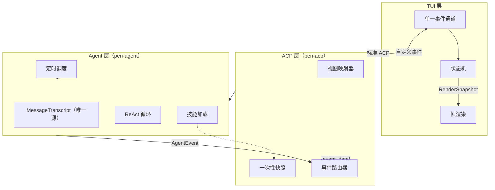

# peri-tui 架构设计 v2

> 全新设计，不考虑向后兼容 | 日期：2026-06-28

## 1. 设计原则

1. **事件驱动**：系统在架构层面是纯粹的事件驱动。crossterm 在底层不得不轮询，但轮询结果立即转换为事件推入通道——轮询是平台适配器的实现细节，不是系统架构。
2. **状态机纯函数**：两个输入（当前状态 + 到达事件）→ 一个新状态 + 一组副作用指令。状态机无 I/O、无后端数据访问。副作用仅四种——渲染、发 ACP 命令、复制剪贴板、退出。
3. **副作用主循环执行**：状态机只输出指令，主循环是唯一执行者。状态机可脱离终端和 Agent 做纯函数测试。
4. **TUI 不引入 Agent 类型**：TUI 只消费为屏幕渲染设计的视图结构（ViewModel）。Agent 消息语义的转换在 peri-acp 完成。pre-commit 钩子自动阻断违规 import。
5. **Panel 能力受限**：面板不持会话可变引用。读通道——状态机注入只读快照。写通道——面板产出受限指令，状态机转换为标准副作用。
6. **全量替换，内部增量**：迭代边界用全量快照同步——TUI 侧逻辑最简。ACP 层内部做增量缓存——不重复转换历史消息。
7. **直接重做，不并存**：不搞新旧系统共存。以设计文档为准，直接重写 v1 代码。保证功能不退化——全部已有测试通过即视为正确。不要害怕犯错，错了就修。

---

## 2. 总体架构

### 2.1 三层模型

从用户视角看，系统分三层——用户直接交互的前端、透明的协议适配层、不可见的 Agent 运行时。

**TUI 层 — 纯渲染前端**

用户看到的每个像素都由这一层产出。它持有 ViewModel 列表（渲染缓存）、面板局部状态、输入框内容与光标位置、滚动偏移量、单调 ID 计数器。它不持有 Agent 消息、技能列表、定时调度器、文件系统访问、MCP 连接池、插件数据、资源监控值。跨会话的后端数据全部走 ACP 协议查询，面板发查询后异步等待返回。

**ACP 层（peri-acp）— 协议适配**

TUI 和 Agent 之间的翻译层。持有会话管理句柄、视图映射器（BaseMessage → ViewModel）、事件路由器（AgentEvent → `{event, data}`）、一次性配置快照。上行方向——Agent 原始事件转换为 `{event, data}` 上行事件，内部事件丢弃。下行方向——TUI 的下行事件转换为 Session API 调用。

**Agent 层（peri-agent）— 运行时**

用户的 prompt 在这里被处理、推理、执行。持有 MessageTranscript（唯一消息源）、ReAct 循环、定时调度器、技能扫描结果。不感知屏幕布局、ViewModel 格式、终端渲染。

### 2.2 架构图

### 2.3 v1 越界与 v2 归位

v1 中有五处职责越界，v2 逐一修正：

- **TUI 扫描 Skills**：v1 在 TUI 启动时扫描技能目录，与 ACP Server 重复扫描。v2——Agent 层扫描一次，ACP 层缓存摘要，TUI 按需查询。
- **TUI 管理 Cron**：v1 的 Cron 调度器 Tick、队列 drain、触发评估全在 TUI 侧。v2——Agent 层持有调度器，触发后经 ACP 事件通道到达 TUI。
- **双源消息列表**：v1 同时维护 `transcript`（替换语义）和 `origin_messages`（extend 累积），语义冲突导致历史恢复 bug。v2——Agent 层 MessageTranscript 为唯一源，TUI 只持 ViewModel 派生缓存。
- **TUI 持有后端资源**：v1 的 ServiceRegistry 在 TUI 侧持有 MCP 连接池、插件数据、资源监控器。v2——全部走 ACP 协议查询，面板异步获取。
- **Pipeline 职责过重**：v1 的 MessagePipeline 同时管渲染缓存、SubAgent 栈、流式节流。v2——拆为 ViewStore（状态机内部）和主循环帧率节流。

---

## 3. 屏幕概览

用户打开 peri-tui 后看到五个视觉区域。从上到下依次为消息区、后台 Agent 栏、输入区、状态栏；弹窗层覆盖在消息区之上。

- **消息区** — 占据屏幕主体。可滚动的消息列表。用户消息气泡右对齐，Agent 回复气泡左对齐（Markdown 渲染），工具调用卡片穿插其中，系统通知横条居中。顶部有 Sticky Header——滚动时固定显示最近一条用户消息。右侧有滚动条。
- **输入区** — 固定在屏幕底部。多行文本输入框（textarea）。上方有附件预览栏（粘贴图片时出现）。@ 和 / 补全弹窗浮在输入框上方。Agent 完成后的输入预测以灰色占位符形式显示在输入框内。
- **状态栏** — 屏幕最底部，三行高度。快捷键提示行、模型与 Provider 信息行、上下文窗口与 token 用量行。颜色区分不同权限模式。
- **后台 Agent 栏** — 状态栏上方，仅当有后台子 Agent 运行时出现。显示子 Agent 名称、已执行工具数、运行时长。可聚焦进入只读模式，将输入路由给子 Agent。
- **弹窗层** — 面板或交互弹窗激活时覆盖消息区。面板半屏显示，消息区仍可滚动；交互弹窗居中显示。弹窗独占键盘输入。

---

## 4. 消息流渲染

### 4.1 渲染原子：ViewModel

TUI 不消费 Agent 层的消息类型（BaseMessage），只消费为屏幕渲染设计的视图结构（ViewModel）。转换在 ACP 层由视图映射器完成。

七种 ViewModel 变体：

- **UserBubble** — 用户消息气泡。纯文本内容、右对齐。
- **AssistantBubble** — Agent 回复气泡。Markdown 文本 + 可选推理内容（折叠显示）。工具调用的参数和结果不嵌在气泡内，而是作为同级的 ToolCard 排列。
- **ToolCard** — 工具调用卡片。工具名称、输入参数摘要、执行结果、错误标记。Write 和 Edit 工具的结果内嵌 diff 视图。
- **SystemNote** — 系统通知文本。居中横条样式，用于模型切换、上下文压缩、会话恢复等系统事件。
- **SubAgentGroup** — 子 Agent 消息组。由 `"subagent-started"` 和 `"subagent-stopped"` 事件划定边界。子 Agent 的流式事件通过 `agent_id` 字段标识归属，TUI 路由到对应组内渲染。组可折叠展开。TUI 不持有 SubAgent 栈概念——只看到一组消息和一个折叠/展开按钮。
- **CollapsedGroup** — 通用可折叠组。用于工具调用的批量折叠。
- **Divider** — 分割线。标记不同迭代轮次之间的边界。

ViewModel 类型定义在 `peri-acp-types` crate，仅依赖 serde。TUI 和 ACP 共同依赖，Agent 层不感知。

### 4.2 全量替换

迭代边界处——Agent 一轮推理 + 工具执行完成后——ACP 发送 `"view-commit"` 事件，data 携带完整的 ViewModel 列表。TUI 用赋值替换来更新消息列表——不合并、不 diff、不追踪索引。旧的 ViewModel 列表被整个丢弃。

`"view-commit"` 事件跳过节流，立即触发渲染——用户不应感知到"提交延迟"。

### 4.3 增量转换（ACP 内部）

ACP 层的视图映射器内部做增量——缓存上次转换结果的 ViewModel 数量。新一批 BaseMessage 到达时，只转换数量之后的新增消息，前 N 条直接复用缓存的 ViewModel。TUI 不感知这个优化——它收到的永远是全量列表。

### 4.4 流式增量

Agent 在 Streaming 期间不是一次给出完整回答，而是逐 token 产出。ACP 将这些增量打包为 `{event, data}` 事件推入 TUI：

- `"text-chunk"` — 在当前 AssistantBubble 末尾追加文本片段
- `"reasoning-chunk"` — 在推理区域追加文本片段
- `"tool-started"` — 创建新的 ToolCard，状态标记为"执行中"
- `"tool-ended"` — 填充 ToolCard 的执行结果，状态标记为完成或失败

这些流式事件的 data 只带原始数据（文本片段、工具名称），不带完整 ViewModel 结构。TUI 在 Streaming 状态内部维护一个 CurrentTurn 结构——累积文本、管理工具卡片列表、追踪 spinner 旋转帧。

渲染时从两部分派生最终视图：

- 基础列表——最后一次 `"view-commit"` 吸收的已确认 ViewModel 列表
- CurrentTurn——当前轮次尚未确认的增量，追加在基础列表之后

`"view-commit"` 到达时 CurrentTurn 被清空——`"view-commit"` 携带的全量列表中已包含此轮最终内容。

### 4.5 帧率节流

同一帧内可能到达多个 ACP 事件（流式输出每秒数十次）。主循环在两个条件下执行实际渲染：

- 距上次渲染超过 16ms——约 60fps 上限。期间的多个事件合并为一次绘制。
- `"view-commit"` / `"turn-done"` / `"turn-interrupted"` 事件——跳过节流，立即渲染。这些事件标志语义边界完成，延迟会给用户"卡顿"感。

Tick 事件的渲染行为取决于状态——Idle 下 Tick 不触发渲染（省电），Streaming 下 Tick 推进 spinner 帧并触发渲染。

### 4.6 特殊渲染行为

**代码围栏块模式**：流式输出进入 Markdown 代码围栏时，渲染层检测围栏边界，在围栏内部缓冲段落，等闭合标记到达后一次性渲染。避免代码块逐字出现造成的闪烁。此逻辑是渲染层内部实现，状态机不感知。

**Spinner 动画**：Streaming 下 Tick 推进帧。格式为"✻ 当前操作描述 (已用时间 · token 数)"。动画状态（帧序号、运行时长）由状态机维护，渲染层只读当前帧字符。

**Sticky Header**：消息区顶部固定显示最近一条用户消息。滚动到顶部时自动消失，向下滚动后重新出现。

**滚动跟随**：Streaming 期间自动滚到底部。用户手动上滚后脱离跟随，按 End 键恢复。

### 4.7 v1 现状

双线程渲染——UI 线程布局 + 独立渲染线程做 Markdown 解析和缓存。引入 RenderEvent 枚举、版本号管理、渲染通知通道、一帧延迟。三种流式模式由 AdaptiveChunkingPolicy 运行时切换。ViewModel 转换代码在 MessagePipeline 中，直接依赖 BaseMessage 类型。

### 4.8 迁移

Phase 5——删除渲染线程、RenderCache、RenderEvent、渲染通知通道。在 `terminal.draw()` 回调中同步渲染。主循环增加 16ms 帧率节流。Block 模式保留为渲染层内部细节。ViewModel 转换移到 ACP 层。

---

## 5. 输入系统

### 5.1 输入框

多行文本输入框（tui-textarea）是用户与 Agent 交互的主要入口。状态机在 Idle 和 Streaming 状态下持有输入框的全部状态：

- 文本缓冲区——用户正在编辑的内容
- 光标位置——列号与行号
- 输入历史——上下箭头浏览，最近 1000 条持久化到 `~/.peri/input_history.json`
- 输入预测——Agent 完成后的下一步建议，以灰色占位符显示在输入框内

行为规则：

- Enter 提交当前内容，清空输入框
- Shift+Enter / Alt+Enter 插入换行
- ↑/↓ 在空输入框时浏览历史
- Tab 接受输入预测
- 自动折行，超出屏幕宽度时正确换行
- IME 支持——Windows 下终端光标定位跟随输入法合成窗口；macOS/Linux 下修复 REVERSED buffer 光标偏移

### 5.2 @ 文件提及

输入框中实时检测 `@` 前缀，触发文件路径搜索补全弹窗。弹窗浮在输入框上方，列出匹配的文件路径候选。

内部机制：

- 惰性缓存——首次触发时扫描当前目录，结果缓存直到文件系统变更
- 实时过滤——用户继续输入路径片段时，从缓存中过滤
- Tab 导航候选，Enter 确认，Esc 关闭
- 选中后 `@path/to/file` 替换为带引号的完整路径

状态机持有：弹窗是否激活、候选列表、当前选中索引。

### 5.3 / 命令补全

实时检测 `/` 前缀（输入框行首或仅前有空格的 `/`），触发命令补全弹窗。候选列表包含内置命令、面板命令、会话命令、插件注册的命令、Skills 名称、Agent Command 名称。

行为和 @ 补全相同——Tab 导航、Enter 确认、Esc 关闭。命令确认后不提交——仅填充输入框，用户可继续编辑参数。

### 5.4 附件

Ctrl+V 粘贴剪贴板图片时，图片以 base64 编码存储，缩略图显示在输入框上方附件栏。Delete 键删除最后一个待发送附件。提交时附件随文本一起发往 ACP。

### 5.5 输入状态在状态机中的位置

以上所有状态集中在 State::Idle（和 State::Streaming）的一系列字段中：输入框缓冲区、光标、历史索引、预测文本、@ 补全弹窗状态、/ 补全弹窗状态、附件列表。不存在分散在多个模块中的"输入子系统"——状态机是输入状态的唯一持有者。

### 5.6 v1 现状

输入状态分散在 UiState（textarea、prediction）、at_mention 模块、hint_ops 模块中。按键处理分 12 级优先级管线，分布在 keyboard/normal_keys.rs 和 keyboard/shortcuts.rs 中。

### 5.7 迁移

Phase 2 的一部分——将输入相关字段集中到 State 枚举的 Idle 和 Streaming 变体中。@ 和 / 补全作为 Idle 的子状态。

---

## 6. 弹窗与面板

### 6.1 两种弹窗

State::Modal 状态下有两个子类——面板和交互弹窗。它们的共同点是独占键盘输入、覆盖消息区。区别在于触发者和目的。

**面板** — 用户主动打开，用于配置和管理。14 种面板，通过快捷键或 / 命令触发。Esc 关闭。打开期间消息区仍可见可滚动（面板半屏显示）。

**交互弹窗** — Agent 主动发起，需要用户决策。状态机收到交互请求事件时根据类型注入对应 Handler 并进入 Modal::Interaction。用户操作后 Handler 产出应答副作用指令，状态机切回之前状态。弹窗激活时输入框置灰，粘贴和 IME 路由到弹窗内部。

### 6.2 面板的能力边界

面板不持会话可变引用——这是 v2 与 v1 最关键的差异。v1 的 PanelContext 包含 `&mut ChatSession`，面板可以修改任意字段。v2 通过两条单向通道替代。

**读通道 — PanelReadContext**：状态机在每次按键前构造的只读快照。包含 ViewModel 列表、当前滚动位置、面板区域尺寸、选中消息索引。

**写通道 — PanelEffect**：面板产出的受限指令，仅六种。状态机将 PanelEffect 映射为标准 Effect，交主循环执行。面板不知道自己的指令最终如何执行。

六种 PanelEffect：

- **ShowNotification** — 往消息区注入系统提示文本
- **SendToAcp** — 发 ACP 命令，包括面板数据查询（MCP 工具列表、Cron 任务、插件列表等）
- **Close** — 关闭自己
- **SwitchSession** — 切换到另一会话
- **Copy** — 复制文本到系统剪贴板
- **UpdateConfig** — 更新配置项（即时写盘并同步到 ACP Server）

### 6.3 14 种面板

所有面板实现统一的 PanelState 接口。按数据生命周期分两类：

**跨会话面板（12 种）**——会话切换后保持打开：

- ConfigPanel — 多层级设置表单
- ModelPanel — 模型别名选择与自定义模型
- LoginPanel — 多 Provider 认证
- McpPanel — MCP 服务器管理与工具浏览
- PluginPanel — 插件安装与卸载
- HooksPanel — Hook 列表与启用开关
- CronPanel — 定时任务管理
- StatusPanel — 系统状态总览
- MemoryPanel — 进程资源实时监控
- BetasPanel — Beta 功能开关
- WorkflowPanel — Workflow 运行进度
- ThreadBrowser — 多会话切换列表
- SetupWizard — 首次配置向导

**会话级面板（2 种）**——会话切换时自动关闭：

- TasksPanel — Agent 当前 Todo 列表
- AgentPanel — Agent 定义查看器

### 6.4 面板的数据获取

面板不直接持有数据。流程是：

- 面板打开时产出一个 SendToAcp(PanelEffect) 携带 `"query"` 事件
- 状态机将其转换为标准 SendToAcp 副作用
- 主循环将 `{event: "query", data: ...}` 发到 ACP
- ACP 调 Session API 获取数据
- 结果以 `{event, data}` 形式推回 TUI 事件通道
- 状态机收到结果后更新 ViewModel 列表或注入 SystemNote
- 面板的下一次按键处理中，PanelReadContext 能看到最新数据

### 6.5 交互弹窗

四种弹窗，每种有独立的 Handler 实现。Handler 包含三部分——渲染逻辑（如何在弹窗区域绘制）、按键处理逻辑（如何响应用户输入）、产出逻辑（用户确认后产出什么副作用指令，Approval 产出 Approve、AskUser 产出 Answer 等）。

状态机进入 Modal::Interaction 时，根据交互请求事件的具体类型注入对应的 Handler。按键分发层不需要知道当前是 OAuth 还是 HITL——它只把按键事件交给当前激活的 Handler。

**冲突策略由状态机决定，不硬编码优先级**。交互请求事件逐条到达事件通道，状态机顺序处理。如果当前已有一个交互弹窗激活时到达第二个交互请求，状态机根据场景选择策略：

- 多数情况——拒绝第二个请求（Agent 不会同时发两个交互请求）
- 特殊情况（如 OAuth 授权中断了当前审批流）——状态机保存当前弹窗状态，待 OAuth 完成后恢复
- 极端情况（如会话切换信号）——状态机关闭当前弹窗，优先处理切换

决策逻辑在状态机内部，不在按键分发层。v1 的 OAuth > AskUser > HITL 硬编码优先级链被消除。

### 6.6 v1 现状

PanelManager（双层 Session + Global）、PanelComponent trait、PanelContext（含 `session_mut: &mut ChatSession`）。14 种面板分两层作用域，通过 `session_mut` 可修改任意字段。交互弹窗分散在 hitl_prompt、ask_user_prompt、rewind_prompt、oauth_prompt 四个独立模块中。

### 6.7 迁移

Phase 3——14 种面板逐一按 PanelState + PanelReadContext + PanelEffect 重写。交互弹窗按 Handler trait 重写。删除旧 PanelManager、PanelContext、`session_mut` 可变引用。验证：全部已有测试通过。

---

## 7. 事件循环

### 7.1 从输入到事件

用户每次按键、鼠标点击、粘贴、窗口缩放进入系统边界时立即转换为事件枚举值。转换发生在两个后台任务中——系统的唯二输入源。

**键盘采集任务**：内部轮询 crossterm（终端无异步 API，平台约束）。每次 poll 返回的按键、鼠标事件、粘贴内容、窗口尺寸变化立即转换为对应事件，推入事件通道。同时维护 50ms 定时器，到期推入 Tick 事件。

> 特异点：键盘采集任务内部需轮询 crossterm——终端无异步 API，poll 结果立即转为事件推入通道。

**ACP 通知任务**：监听传输通道。Agent 产出的自定义事件（`{event, data}` 格式）到达时接收并推入 TUI 事件通道。TUI 不需要知道 Agent 内部状态——只知道"有新的 ACP 事件到了"。

### 7.2 事件五种来源

- 用户输入（Key / Mouse / Paste / Resize）— 键盘采集任务
- ACP 事件（自定义事件，`{event, data}` 格式）— ACP 通知任务
- 周期脉冲（Tick，每 ~50ms）— 键盘采集任务
- 系统信号（AcpDisconnected / SessionLoaded / Shutdown）

### 7.3 主循环

从通道接收一个事件，交给状态机处理，执行产出的副作用指令，然后回到接收。通道空时阻塞等待，零 CPU 占用。

执行流程分四步：取事件 → 调状态机得新状态和副作用清单 → 逐条执行副作用（Render 调终端绘制、SendToAcp 调传输发送、CopyToClipboard 写剪贴板、Quit 退出）→ 回到第一步。

主循环不做决策——不检查标志位、不判断当前状态、不跳过事件。所有决策都在状态机内部。

### 7.4 v1 现状

`poll_agent()` 按固定优先级手动扫描 9 个队列——cancel 超时、渲染节流、continuation、pending 消息、v2 queue、ACP 通知、后台事件、Channel、Cron。命令式编排，非事件驱动。`poll_cron_triggers()`、`poll_background_events()` 散落在 App 多处。

### 7.5 迁移

Phase 1——删除 `poll_agent` 及所有手动 drain 函数。新建键盘采集和 ACP 通知两个后台 task。主循环改为 `recv → handle → apply effects → loop`。验证：全部已有测试通过。

---

## 8. 状态机

### 8.1 要解决的问题

v1 的 `App` 有 50+ 个方法，任意方法可调终端、改配置、发 RPC——状态转换逻辑和 I/O 执行混在一起，无法脱离终端和 Agent 做测试。`ChatSession` 六个组件散落（UiState、MessageState、AgentComm、CommandSystem、SessionMetadata、PanelManager），通过 `&mut ChatSession` 自由访问，无统一控制。

### 8.2 为什么是应用层状态机

这是应用层状态机，不是纯视图状态机。TUI 没有独立后端——收 ACP 事件后就是 ViewModel 数据的唯一持有者，没有"需要时从外部拉取"的路径。数据所有权必须在状态机里。

状态机持有三类数据：

- **数据**：ViewModel 列表（从 ACP Commit 事件吸收的全量快照）
- **UI 控制状态**：输入框内容与光标、滚动偏移量、激活的面板/弹窗、选中索引
- **暂存数据**：当前轮次的流式增量（文本片段 + 工具卡片），下一次 Commit 时被全量替换

渲染函数只读快照，不持有数据。

### 8.3 纯函数签名

`(State, Event) → (State, Vec<Effect>)`。两个输入，零外部依赖。不调终端、不发网络、不读文件、不访剪贴板——只做计算。

副作用指令四种：

- **Render** — 携带只读快照。主循环调 `terminal.draw()`。
- **SendToAcp** — 携带 `{event, data}` 消息。主循环调 `acp_client.send()`。
- **CopyToClipboard** — 主循环写系统剪贴板。
- **Quit** — 主循环退出。

主循环持有 `acp_client` 和 `terminal`。状态机不碰二者。

### 8.4 四种顶层状态

- **Idle** — 等待用户输入。持有输入框缓冲区、光标、输入历史索引、预测文本、@ 补全弹窗状态、/ 补全弹窗状态、附件列表、滚动位置、双击 Esc 计时器。可测试：向 Idle 状态喂按键事件，验证产出的文本缓冲区变化。
- **Streaming** — Agent 产出中。持有当前轮增量（CurrentTurn：文本片段 + 工具卡片列表），同时持有输入框——用户可在 Agent 运行时打字。提交的文本暂存，当前轮 Done 后自动发送。收到 Done 事件切回 Idle，收到 Commit 替换 ViewModel 列表并清空 CurrentTurn。
- **Modal** — 弹窗激活。面板（14 种，实现 PanelState 接口）或交互弹窗（4 种，各自实现 Handler trait）。状态机在进入 Modal 时注入对应的接口实现——面板注入 PanelState，交互弹窗注入 Handler。弹窗独占键盘。若从 Streaming 切入，保存 CurrentTurn 增量，弹窗关闭后恢复。Esc 关闭弹窗。
- **Switching** — 会话切换过渡。清空视图，显示加载指示，首批 ViewModel 到达后切到 Idle。

Modal 子类型不写死在顶层枚举——新增面板只需实现 PanelState，新增交互弹窗只需实现 Handler。都不改状态机核心代码。

### 8.5 v1 现状

`App` 50+ 方法自由调终端/配置/网络。`handle_agent_event` 200+ 行 match 分发 25 种事件。`ChatSession` 六组件散落。无纯函数边界——状态转换和 I/O 执行无法分离测试。

### 8.6 迁移

Phase 2——引入 State 和 Effect 枚举。重写 handle 函数为 `(State, Event) → (State, Vec<Effect>)` 纯函数。副作用统一收敛到 Effect 分支。输入状态集中到 State。验证：全部已有测试通过。

---

## 9. ACP 协议

TUI 与 Agent 之间的通信分两层——标准 ACP 方法和自定义事件。

**标准 ACP 方法（TUI → Agent）**：TUI 通过标准 JSON-RPC 方法调用 ACP。覆盖会话生命周期（`session/new`、`session/load`）、交互（`session/prompt`、`session/cancel`）、命令执行（`session/execute-command`）、应答（`session/approve`、`session/answer`）、面板查询（`session/query`）、配置更新（`config/update`）。请求-响应语义。

**自定义事件（Agent → TUI）**：Agent 产出后经 ACP 事件路由器转换为 `{event, data}` 自定义事件，通过 `peri/unstable-event` 通道推入 TUI。覆盖流式输出（`"text-chunk"`、`"tool-started"` 等）、边界（`"view-commit"`、`"turn-done"`）、状态（`"token-usage"`）、交互请求（`"hitl-pending"`、`"ask-user"` 等）。推送语义——Agent 侧发起，TUI 被动接收。

两层共享同一传输通道——传输层根据消息格式自动分流：有 `method` 字段走标准 RPC，有 `event` 字段走自定义事件。

完整的方法定义、事件目录、data 结构、路由器映射见独立文档——**[peri-acp 协议设计](../design/peri-acp-protocol.md)**。

核心设计决策：

- 有标准走标准，标准不覆盖的走自定义事件——不在自定义事件里重新发明 `session/prompt`
- 自定义事件名是 kebab-case 字符串，不在 Rust 类型系统中定义枚举
- 事件路由器（ACP 层）将 AgentEvent 映射为自定义事件，SubAgent 事件转换为结构事件，其余内部事件丢弃
- 视图映射器在 TurnCompleted 时做增量 BaseMessage → ViewModel 转换
- Slash 命令四路径合并为标准方法 `session/execute-command`

### 9.1 v1 现状

AgentEvent 25+ 变体平铺在 `handle_agent_event` 200+ 行 match 中。Slash 命令四条路径。事件列表和命令枚举各自为政，无统一分层。

### 9.2 迁移

按新分层直接重写 ACP 层。实现标准 ACP 方法路由和自定义事件路由。删除 TUI 的 `handle_agent_event`。

---

## 10. 异步回路

### 10.1 用户感知

Agent 不只在用户按 Enter 后才干活。有时候 Agent 突然开始输出——用户没有按任何键。用户不关心为什么，只看到流式输出照常渲染。

### 10.2 机制（Agent 层闭合）

这种"自动干活"的背后是一组 Agent 层内部的触发机制——定时调度、外部渠道消息、后台子 Agent 完成、工作流推进。这些触发源的共同点是最终都往 Session 收件箱（MessageQueue）推一条 Prompt 消息。TUI 不感知触发源的存在。

Session 内的 ReAct 循环空闲时阻塞等待收件箱。新 Prompt 到达时自动醒来，走 Reason → Act → End 正常流程，产出 `{event, data}` 自定义事件。ACP 推入 TUI 事件通道，状态机切到 Streaming 开始渲染——和用户手动提交走完全相同的路径。

**两阶段闭合**：

- Agent 运行中：新 Prompt 推入收件箱 → End 阶段检测到待消费消息 → 跳过退出，回到 Compact 开始下一轮。
- Agent 空闲时：新 Prompt 推入收件箱 → Session 异步 waker 触发 → ACP executor 的 run_session_loop 从 await 点恢复 → 启动新一轮。全程在 Agent + ACP 层闭合——TUI 在 Streaming 开始后才收到第一个事件。

### 10.3 TUI 状态机视角

状态机不区分"是否用户手动触发"——只关心当前有没有流在到达。

- Idle 下收到 `"text-chunk"` → 切 Streaming，维护 CurrentTurn
- Streaming 下持续接收流式事件 → 累积渲染
- 收到 `"turn-done"` → 切回 Idle
- Idle 下再次收到 `"text-chunk"` → 重复

### 10.4 v1 现状

TUI 的 `poll_agent` 手动 drain Cron、Channel、后台 SubAgent 队列。TUI 感知触发源类型，主动调 `evaluate_cron()` / `submit_message()`。异步回路在 TUI 侧闭合——Agent 层不推不动。

### 10.5 迁移

Cron 触发、Channel 接收、后台 SubAgent 完成回调全部移到 Agent 层——触发后直接推 Session 收件箱。删除 TUI 侧全部异步 drain。Session 实现空闲时 await 收件箱唤醒。

---

## 11. 模块边界

### 11.1 Crate 依赖方向

自上而下，不反向：

- **peri-tui** — 事件通道 + 状态机 + 帧渲染。类型依赖仅 `peri-acp-types`（纯 DTO）和 `peri-widgets`（纯组件）。运行时通过 transport 与 peri-acp 通信。代码禁止 `use peri_agent::` 和 `use peri_middlewares::`——pre-commit 钩子阻断。
- **peri-acp** — 会话管理 + 视图映射器 + 事件路由器 + 配置快照。依赖 `peri-acp-types`、`peri-agent`、`peri-middlewares`。系统唯一的"全知"层。
- **peri-agent** — Session → ReAct 循环 → 事件产出。不依赖 `peri-acp-types`。Agent 运行时完全不知道 ViewModel、`{event, data}` 通道等前端概念的存在。
- **peri-acp-types** — 新增 crate，仅依赖 serde。包含 ViewModel 枚举、各事件对应的 data 结构体定义、各类摘要结构（SkillSummary、CronSummary 等）。不包含命令枚举——事件名是字符串，不需要类型化。TUI 和 ACP 的共同数据结构基础。

### 11.2 运行时通信

TUI 和 ACP 在运行时通过 transport 通信。开发阶段用 MpscTransport（进程内内存通道），生产环境可换 StdioTransport（跨进程 JSON-RPC）。状态机通过 SendToAcp 副作用发命令，通过 ACP 通知任务收响应。TUI 代码不关心 transport 实现。

---

## 12. 迁移策略

不搞新旧并存，五个阶段直接重写。每阶段的验收标准——全部已有测试通过。设计文档就是规格，按规格写代码，不要怕犯错。

- **Phase 1（2–3 周）** — 事件循环重写。删除 `poll_agent` 及所有手动轮询函数。新建键盘采集和 ACP 通知两个后台 task。主循环改为 `recv → handle → apply effects → loop`。验证：全部已有测试通过。
- **Phase 2（2–3 周）** — 状态机重写。新建 State 和 Effect 枚举。重写 handle 函数为 `(State, Event) → (State, Vec<Effect>)` 纯函数。删除 App 50+ 方法中的 I/O 调用，副作用统一收敛到 Effect 分支。输入状态集中到 State。验证：全部已有测试通过。
- **Phase 3（3–4 周）** — 面板重写。14 种面板逐一按 PanelState + PanelReadContext + PanelEffect 重写。交互弹窗按 Handler trait 重写。删除旧 PanelManager、PanelContext、`session_mut` 可变引用。验证：全部已有测试通过。
- **Phase 4（2–3 周）** — ACP 层重写。创建 `peri-acp-types` crate。重写事件路由器（AgentEvent → `{event, data}`）和视图映射器（增量缓存 + 全量产出）。建立 `peri/unstable-event` 双向通道。TUI 删除所有 Agent 类型 import，pre-commit 钩子阻断回退。验证：全部已有测试通过。
- **Phase 5（2–3 周）** — 渲染重写。删除双线程渲染、RenderCache、RenderEvent、渲染通知通道。改为主线程序同步渲染 + 16ms 帧率节流。删除旧 MessagePipeline。Block 模式保留为渲染层内部细节。验证：全部已有测试通过。

---

## 13. 不变式

这些约束在 v2 全生命周期内不可违反，每条对应 v1 中实际发生过的 bug 或架构退化。

- 主循环不做决策——只 `recv → handle → apply effects → loop`。不检查标志位、不跳过事件。
- 状态机 `(State, Event) → (State, Vec<Effect>)`——零外部依赖、零 I/O。可脱离终端和 Agent 做纯函数测试。
- 渲染只读快照——渲染函数只接受不可变引用，不持有数据。
- 唯一消息源在 Agent 层——TUI ViewModel 是派生缓存，不存在 TUI 侧独立消息列表。
- TUI 不引入 peri-agent 或 peri-middlewares 运行时类型——pre-commit 自动阻断。
- 终端输入轮询隔离在单一后台任务——crossterm 无异步 API，平台约束。轮询代码不扩散。
- 面板不直接操作会话状态——读通道只读快照，写通道六种受限指令。不存在 `&mut ChatSession` 路径。
- 迭代边界全量替换——Commit 携带完整 ViewModel 列表，TUI 赋值替换。ACP 内部增量优化。
- Streaming 状态持有输入框——用户可在 Agent 运行期间输入。
- Streaming→Modal 保存增量——弹窗关闭后恢复，不丢失未提交的流式内容。
