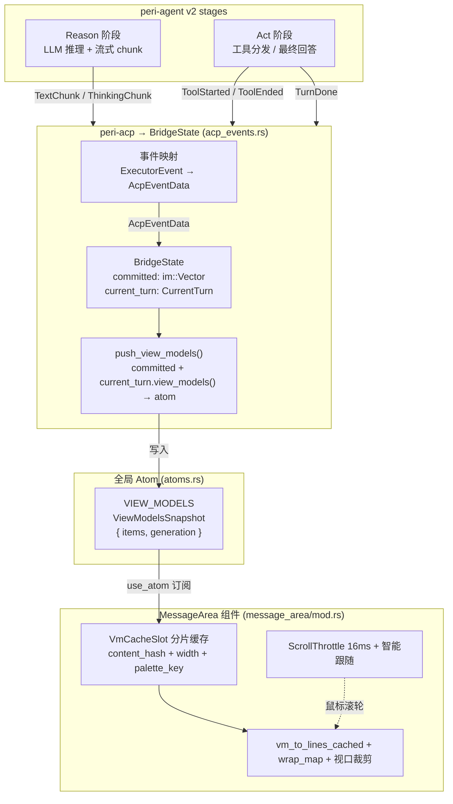
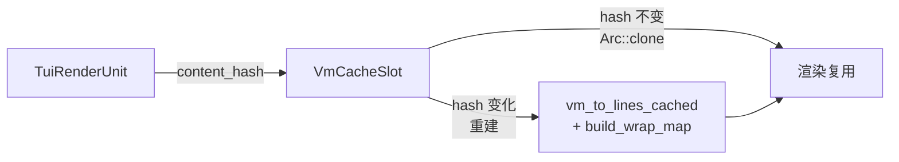

# peri-tui v2 消息渲染架构设计

> 日期：2026-07-15 | 修订：v3.0 | uncheck by KonghaYao

## 1. 设计原则

1. **单一数据源**：`VIEW_MODELS` atom（`ViewModelsSnapshot { items: im::Vector<TuiRenderUnit>, generation: u64 }`）是消息流唯一数据源。`BridgeState` 在中间持有 `committed`（已归档历史）与 `current_turn`（当前轮次增量），通过 `push_view_models()` 统一写入 atom。视图组件直接读 atom 渲染，不存在第二份消息副本。
2. **追加归档语义**：轮次结束（`TurnDone`/`TurnInterrupted`/`TurnSuspended`）时将 `current_turn.view_models()` **逐条追加**到 `committed`，然后 `reset()` current_turn。追加而非全量替换——因为 committed 内部已包含历史归档，只需追加本轮增量。
3. **视图派生是方法**：`CurrentTurn::view_models()` 从内部 `segments` 派生 `im::Vector<TuiRenderUnit>`（`sync_cache` 增量修补——冻结段只构建一次，仅变化部分重建），`push_view_models()` 将 `committed + current_turn.view_models()` 拼接写入 atom。不存在独立的纯函数或 transcript 切片。
4. **段交叉时序保证**：`CurrentTurn.segments`（`Vec<TurnSegment>`）记录文本/工具/SubAgent 的时序交叉，`sync_cache()` 遍历 segments 产生正确时序的 VM 序列。单 turn 内多迭代的内容通过 segments 自然排序。
5. **SubAgent 状态内聚**：SubAgent 的流式状态由 `SubAgentAccumulator` 在 `CurrentTurn.subagents` 内管理，事件按 `agent_id` 路由。TurnCommitted 在 TUI 层统一处理不区分 SubAgent。
6. **渲染性能按 VM 分片缓存**：`VmCacheSlot` 按 `content_hash + width + palette_key` 缓存每个 VM 的 lines/wrap_map/visual_rows/markdown_cache。流式期间仅最后一个气泡的 hash 变化触发重建，其余 `Arc::clone` 复用，单次成本从 O(N×W) 降至 O(W)。

---

## 2. 总体架构



### 2.1 两类状态（committed + current_turn）

`BridgeState`（`acp_events.rs`）维护两类状态，每条 ACP 事件到达时同步更新：

| 状态 | 类型 | 生命周期 | 写入时机 |
|------|------|---------|---------|
| `committed` | `im::Vector<TuiRenderUnit>` | 跨轮次持久（直到 rewind/compact） | TurnDone/TurnInterrupted/TurnSuspended 归档；SystemNotification/BudgetWarning/RewindCompleted/CompactCompleted/LocalUserBubble/BgCallbackBubble/CommittedAssistantText/ReplayToolStarted 等 push |
| `current_turn` | `CurrentTurn`（非 Option） | 单轮次内，轮次结束时 reset() | 流式事件（TextChunk/ThinkingChunk/ToolStarted/ToolEnded/SubagentStarted 等） |

关键不变式：**current_turn 在轮次结束后必须 reset()**。TurnDone/TurnInterrupted/TurnSuspended 归档后清空 current_turn，下一个流式事件自然开始新轮次。

### 2.2 CurrentTurn 内部结构

`CurrentTurn`（`acp_types.rs`）合并了文本/推理/工具/SubAgent 为单一结构，通过 segments 记录时序：

| 字段 | 用途 |
|------|------|
| `text` | 流式 AI 文本（累积，tool call 前后的文本会按 segments 分割为独立气泡） |
| `reasoning` | 推理内容（Anthropic extended thinking） |
| `tool_cards` | `Vec<ToolCardAccumulator>`：工具卡片列表，`output_summary.is_none()` 表示 pending |
| `subagents` | `Vec<SubAgentAccumulator>`：SubAgent 卡片列表 |
| `segments` | `Vec<TurnSegment>`：段交叉时序记录（AssistantText/Tool/SubAgent 三种变体） |
| `cached_view_models` | 增量 VM 缓存（`im::Vector`），由 `sync_cache` 增量修补：冻结段只构建一次，仅变化部分（trailing 气泡、运行中工具卡、内容变化的 subagent 组）重建；`invalidate_cache` 置位后下次 `view_models()` 重同步 |
| `last_text_flush` / `last_reasoning_flush` | 文本/推理的字节偏移追踪，用于检测新文本是否需要新 segment |
| `last_message_id` | 最近 TextChunk 的 messageId，变化时 flush pending 文本为新 segment |

`segments` 是时序核心——Agent 文本、工具调用、SubAgent 启动在协议层交错到达，`sync_cache()` 遍历 segments 产生正确交叉时序的 `TuiRenderUnit` 序列。

### 2.3 追加归档语义

轮次结束时（TurnDone），将 `current_turn.view_models()` 逐条 `push_back` 到 `committed`（追加），然后 `reset()` current_turn。这是追加而非全量替换——committed 已持有全部历史，本轮只需追加增量。

TurnInterrupted 的特殊处理：零产出时（current_turn 为空）回滚 committed 中最后一条用户气泡 + 恢复输入文本；非零产出时与 TurnDone 相同归档。

TurnSuspended：归档但不 drain input buffer（Agent 保持 await_wake 存活）。

---

## 3. 事件契约

### 3.1 TurnCommitted 的实际职责

TurnCommitted 在 TUI 层仅做刷新检查点——在 goal 自驱场景下 TurnDone 只在最终循环退出时触发，TurnCommitted 作为每次 ReAct 迭代边界的刷新检查点，防止 atom 漂移。不解析 `messages_json`，不触发 commit/替换。

### 3.2 三路归档模型

三种 turn 结束事件各有不同归档策略：

| 事件 | 归档行为 | drain_input_buffer | 恢复输入 |
|------|---------|-------------------|---------|
| `TurnDone` | 归档 + reset | 是 | 否 |
| `TurnInterrupted` | 零产出回滚 / 非零产出归档 | 否（清除 INPUT_BUFFER） | 零产出时恢复文本到输入框 |
| `TurnSuspended` | 归档 + reset | 否 | 否 |

### 3.3 回放 / Background 事件

| 事件 | 行为 |
|------|------|
| `BgCallbackBubble` | 触发 current_turn flush 归档到 committed（不 push bg 回调气泡本身，由 LocalUserBubble 负责） |
| `CommittedAssistantText` | 直接 push 到 committed（用于 compact replay 场景） |
| `ReplayToolStarted` / `ReplayToolEnded` | 直接 push/更新 committed 中的工具卡片（历史回放场景） |
| `RewindCompleted` | 清空 committed + 重建（重放全部历史消息） |

---

## 4. 视图派生

### 4.1 CurrentTurn::view_models() — 增量 VM 缓存

`view_models()` 是 `CurrentTurn` 的统一 VM 入口（`&mut self`）：`cache_dirty` 时调用 `sync_cache()` 增量修补缓存，然后返回 `cached_view_models`。`sync_cache()` 从内部 segments/text/reasoning/tool_cards/subagents 对齐 `im::Vector<TuiRenderUnit>`：

1. **遍历 segments**：按时序产生 `TuiAssistantBubble`（文本）、`TuiToolCard`（工具）、`TuiSubAgentGroup`（SubAgent）；冻结的 AssistantText 段只构建一次，未变化的元素直接复用缓存
2. **Trailing 补丁**：segments 之后的残余文本/推理生成最终气泡（长度比对做 O(1) 变化检测）
3. **后处理**：Agent 工具卡片的 `tool_calls_count` 与紧随的 SubAgent 组配对；顶层 turn 额外做折叠归一化（仅最后一个 reasoning 展开，与 push_view_models 折叠 pass 稳态一致，使该 pass 对 current_turn 部分零翻转）

缓存语义为**增量修补**而非清除式重建：流式变更在 mutation 时 eager sync（不置 dirty），每 token 成本 O(变化量 + 段数扫描)；`invalidate_cache`（如 acp_bridge 1s tick 刷新工具时长）置位后在下次调用时重同步。`im::Vector` 持久结构使 `cached_view_models` 可 O(1) 克隆共享（SubAgent 组、push_view_models 快照）。

### 4.2 push_view_models() — 统一 atom 写入

`push_view_models()`（`acp_events.rs`）是唯一的 VIEW_MODELS atom 写入函数：

```
committed.clone() + current_turn.view_models() → 扁平 im::Vector<TuiRenderUnit>
→ reasoning 折叠处理（仅最后一个含 reasoning 的 bubble 展开）
→ generation += 1
→ VIEW_MODELS.state().write() = ViewModelsSnapshot { items, generation }
```

所有路径（流式渲染、turn 归档、历史恢复、system notification）统一走此函数，不存在分支。

### 4.3 TuiRenderUnit 变体体系

`TuiRenderUnit`（`tui_render_unit.rs`）有 8 个变体，替代文档旧版的 MessageViewModel：

| 变体 | 用途 |
|------|------|
| `TuiUserBubble` | 用户输入气泡（含 `ReminderInfo`，从 `system-reminder` 标签自动检测 10 种 ReminderType） |
| `TuiAssistantBubble` | AI 回复气泡（含 text + reasoning） |
| `TuiToolCard` | 工具调用卡片（含运行态/完成态/diff） |
| `TuiSystemNote` | 系统通知（Info/Warning/Error 三级） |
| `TuiSubAgentGroup` | SubAgent 分组（含内部 VM 列表） |
| `TuiCollapsedGroup` | 折叠组（多条 VM 折叠/展开切换） |
| `TuiDivider` | 分隔线 |
| `TuiAskUserBlock` | AskUser 弹窗气泡 |

### 4.4 时序正确性

`segments` 保证时序：每个流式事件（文本 flush / ToolStarted / SubagentStarted）追加一个 TurnSegment，`sync_cache()` 遍历 segments 产生交叉时序的 VM 序列。

v1 的 bug 根因：v1 用独立的跨迭代累积字段（所有文本在一起、所有工具在一起），无法区分迭代边界。v2 通过 segments 记录每段事件的精确时序，sync_cache 直接按 segments 顺序输出。

---

## 5. SubAgent 状态管理

SubAgent 的流式状态由 `SubAgentAccumulator` 在 `CurrentTurn.subagents` 内管理，事件路由按 `agent_id` 分流：

| 事件来源 | 路由目标 |
|---------|---------|
| `ToolStarted` 带 `agent_id` 且 agent 在 `BG_AGENT_IDS` 中 | 更新 `BG_DISPLAY` atom（后台 Agent） |
| `ToolStarted` 带 `agent_id` 且 agent 在 current_turn.subagents 中 | 路由到对应 `SubAgentAccumulator`（同步 SubAgent） |
| `ToolStarted` 无 `agent_id` | `current_turn.start_tool()`（父 Agent 工具） |

`SubagentStarted` 创建 `SubAgentAccumulator` 并追加 SubAgent segment；`SubagentStopped` 关闭 SubAgent 组。

TurnCommitted 在 TUI 层统一处理——`push_view_models()` 不区分 SubAgent。

---

## 6. 渲染管道（message_area/mod.rs）

### 6.1 按 VM 分片缓存（VmCacheSlot）



每个 `VmCacheSlot` 缓存一个 VM 的渲染结果，key = `content_hash + width + palette_key`：

| 字段 | 用途 |
|------|------|
| `content_hash` | VM 的内容哈希，流式文本追加 / 折叠展开 / tool duration 变化时改变 |
| `width` | 视宽，窗口 resize 时改变 |
| `palette_key` | 主题关键色值哈希，主题切换时改变 |
| `lines: Arc<Vec<Line>>` | 解析后的渲染行 |
| `wrap_map: Arc<Vec<WrappedLineInfo>>` | 视觉行→逻辑行映射 |
| `visual_rows: u16` | 该 VM 占据的视觉行数 |
| `markdown_cache` | Markdown 增量渲染缓存 |

### 6.2 Markdown 增量渲染

`vm_to_lines_cached`（`render.rs`）接受 `MarkdownRenderCache`，流式 text 追加时复用 `stable_state` 前缀，只处理新增 block。前缀 blocks（已闭合的 paragraph / list item / code block）完全不变，避免重复解析。

### 6.3 视口裁剪

MessageArea 只 clone + highlight + 渲染视口内约 60 行，通过 `wrap_map` 二分查找定位视口对应的逻辑行范围，避免 O(N) 全量渲染。

---

## 7. 文本选中与复制

`selection.rs` 实现了完整的文本选中系统：

| 组件 | 用途 |
|------|------|
| `WrappedLineInfo` | 折行映射条目（logical_idx + visual_start/end） |
| `build_wrap_map` | 为 lines 构建视觉行→逻辑行映射 |
| `concat_wrap_maps` | 拼接多个 VM 的 wrap_map（累加 visual_offset + lines_start） |
| `highlight_line_in_selection` | 字符级 span 拆分 + 选区高亮（CJK 安全） |
| `extract_visual_range` | 精确提取选中文本到剪贴板（通过 arboard） |

选中通过 `wrap_byte_starts`（CJK 安全的字节偏移数组）实现字符级精度，避免 `&s[..N]` 对中文 panic。

---

## 8. 滚动与视口交互

`scroll.rs` 实现了滚动相关的交互机制：

| 组件 | 用途 |
|------|------|
| `ScrollThrottle` | 鼠标滚轮 16ms 节流（≈60fps），键盘不节流 |
| `ScrollbarDragState` | 滚动条 thumb 拖拽（锁定 thumb_offset 避免跳变） |
| `DragThrottle` | 拖拽选中节流 |
| 智能跟随 | VIEW_MODELS 变化时自动滚底；用户主动上滚时不抢夺滚动位 |

---

## 9. 与 v2 其他模块的关系

| 模块 | 关系 |
|------|------|
| **acp_notifier / acp_bridge** | AcpNotification → AcpEventData → bridge_tx → BridgeState → Atom 写入 |
| **atoms.rs** | `VIEW_MODELS` atom 是消息流单一数据源，`ACP_STATE` 控制加载状态 |
| **message_area/** | 直接消费 VIEW_MODELS atom，VmCacheSlot 分片缓存 + 视口裁剪 |
| **tui_render_unit.rs** | `TuiRenderUnit` 8 变体定义，含 content_hash 用于渲染缓存 key |
| **acp_types.rs** | `CurrentTurn` + `ToolCardAccumulator` + `SubAgentAccumulator` 流式数据类型 |
| **Compact** | `CompactCompleted` 重建 committed；`compact_just_completed` 标记触发 session/load replay |

---

## 10. 关键约束

- **TurnDone 归档用追加语义**——将 current_turn.view_models() 逐条 push_back 到 committed，然后 reset()
- **TurnInterrupted 零产出回滚**——current_turn 为空时移除 committed 最后一条用户气泡 + 恢复输入文本
- **drain_input_buffer 仅在 TurnDone**——Interrupted 表示用户主动打断，不应自动续跑
- **push_view_models 是唯一 atom 写入路径**——不存在分支或独立纯函数
- **VmCacheSlot 按 content_hash 分片**——流式期间仅最后一个气泡 hash 变化触发重建
- **CJK 截断用 chars().take(N)**——禁止 &s[..N]
- **u16 坐标用 saturating_add/sub**——禁止裸 +/-，防止溢出
- **TuiRenderUnit content_hash 必须 recompute**——折叠/展开 reasoning 或 tool duration 变化时

---

## 附录：核心抽象检查清单

1. `BridgeState` 持有 `committed: im::Vector<TuiRenderUnit>` + `current_turn: CurrentTurn`
2. `CurrentTurn.segments`（`Vec<TurnSegment>`）记录文本/工具/SubAgent 的时序交叉
3. `CurrentTurn::view_models()` 从 segments 增量派生 `im::Vector<TuiRenderUnit>`（sync_cache 增量修补）
4. `push_view_models()` 统一将 committed + current_turn.view_models() 写入 VIEW_MODELS atom
5. TurnDone/TurnInterrupted/TurnSuspended 三路归档，各自不同策略
6. `VmCacheSlot` 按 content_hash + width + palette_key 分片缓存，流式单次 O(W)
7. `TuiRenderUnit` 8 变体，含 content_hash 作为渲染缓存 key
8. SubAgent 事件按 agent_id 路由到 `SubAgentAccumulator`，TurnCommitted 在 TUI 统一处理
