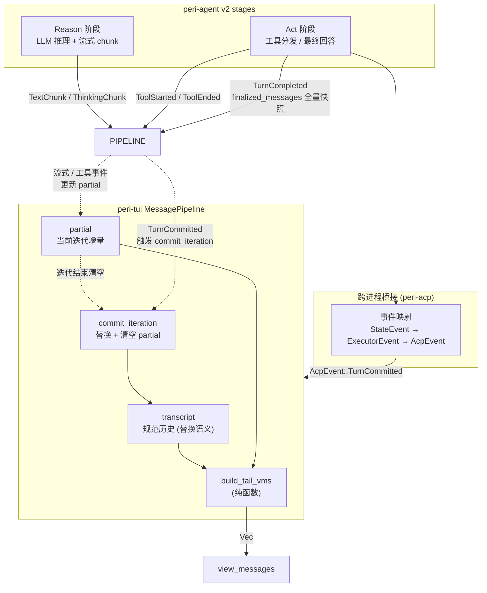

# peri-tui v2 MessagePipeline 渲染架构设计

> 全新设计，不考虑向后兼容 | 日期：2026-06-27 | 修订：v2.0 | uncheck by KonghaYao

## 1. 设计原则

1. **单一数据源**：MessagePipeline 只持有两类状态——规范 `transcript`（会话级权威历史）与 `partial`（当前 ReAct 迭代的流式增量）。视图是状态的纯函数，不存在第二份"流式专用"的消息副本。
2. **迭代边界显式提交**：v2 stages 在每次迭代结束时显式 emit TurnCompleted 事件，**携带全量 transcript 快照**。TUI 收到后用替换语义吸收。迭代边界是低频事件，全量快照的引用计数克隆成本可接受；高频渲染事件继续走轻量路径。
3. **替换而非累积**：每次 commit 用全量快照整体替换 transcript，而非追加。v2 的快照本身就是全量——若用追加会让 transcript 在多次 commit 后无限翻倍，也消除了重复 commit 的隐患。
4. **视图派生是纯函数**：流式渲染和历史恢复走**同一条路径**——历史恢复等价于一次 commit，无分支。这是单一数据源的本质保证。
5. **迭代内 partial 保留至下一边界**：单次 ReAct 迭代中的流式文本、推理、工具调用都累积在 partial 里。commit 到达前 partial 始终存活，确保迭代内文本与工具按时序正确渲染。
6. **SubAgent 状态解耦**：SubAgent 的状态不与父 Agent 的 partial 共享生命周期，由 SubAgent 事件独立管理。子 Agent 的流式/工具事件路由到对应 SubAgentState 的内部 VM 列表，不污染父 Agent 的 partial。
7. **Pipeline 不返回 RebuildAll**：所有事件处理仅更新内部状态。重建动作由外部 agent_ops 显式触发——Pipeline 不持有 VM 索引维度，避免与 BaseMessage 维度混淆。

---

## 2. 总体架构

### 2.1 两类状态的边界

| 状态 | 类型 | 生命周期 | 写入时机 |
|------|------|---------|---------|
| `transcript` | `Vec<BaseMessage>` | 跨迭代持久（直到下一次 commit） | 仅 commit / restore |
| `partial` | `Option<PartialAiMessage>` | 单次迭代内，commit 时整体丢弃 | 流式事件（文本/推理/工具） |

关键不变式：**partial 永远不会跨 commit 存活**。每次 commit 后 partial 被设为 None，下一个流式事件懒初始化。这保证 partial 内的工具调用永远是"当前迭代"的工具调用，不会与上一轮的工具混淆。

### 2.2 PartialAiMessage 内部结构

partial 合并了 v1 散落的五个 `current_ai_*` 字段为单一结构，按职责分组：

| 字段 | 用途 |
|------|------|
| `text` | 流式 AI 文本（工具调用前的回复） |
| `reasoning` | 推理内容（Anthropic extended thinking） |
| `tool_calls` | 已 finalize 的工具调用，按时间顺序——渲染时遍历保证时序 |
| `pending_tools` | ToolStart 后等待 ToolEnd 的工具索引 |
| `completed_tools` | ToolEnd 后等待 commit 的工具索引 |

`tool_calls` 是时间线，`pending_tools` / `completed_tools` 是状态索引。渲染时遍历 `tool_calls` 保持时序，按 id 查 pending 或 completed 取最新状态。

### 2.3 替换语义的必然性

v2 的 TurnCompleted 携带全量 transcript 快照。若用 v1 的 extend 语义追加，单 turn 内多次 ReAct 迭代会让 transcript 翻倍：iter1 commit 后 2 条，iter2 commit 后 4 条（前 2 条重复）……最终爆炸性累积。

替换语义让每次 commit 幂等——同样的全量快照多次 commit 结果一致。这也消除了"v1 set_completed 被多次调用导致消息重复"的隐患。

---

## 3. 事件契约：TurnCompleted 跨层透传

### 3.1 设计张力

**原始 v2 设计**：避免在 StateEvent 中持有 transcript 引用——理由是锁开销 + 拷贝成本，影响高频渲染事件。

**问题**：TUI 是独立进程，无法访问 Agent 内部 MessageTranscript。v2 的轻量 StateSnapshot 只携带元数据（message_count / total_tokens），TUI 无法重建规范状态，只能从渲染事件流自洽推导——而渲染事件流缺少明确的迭代边界，导致单 turn 内多迭代的流式文本与工具调用无法按时序提交。

**决策**：将迭代边界信号与高频渲染信号**分层处理**：

| 信号类型 | 频率 | 携带数据 |
|---------|------|---------|
| 渲染事件（TextChunk / ToolStarted / ToolEnded） | 高频（每秒数十次） | 轻量字段，无 transcript 拷贝 |
| 迭代边界事件（TurnCompleted） | 低频（每秒个位数） | `Arc<Vec<BaseMessage>>` 全量快照 |

`Arc` 克隆仅增加引用计数，无数据拷贝；消费方按需 deref clone。边界判定：迭代边界是低频事件——一次 turn 内通常 1-10 次（取决于工具调用次数），不会成为性能瓶颈。

### 3.2 双路径 emit

v2 stages 的 Act 阶段有两条路径，都必须 emit TurnCompleted：

| 路径 | 触发时机 | transcript 已含 |
|------|---------|---------------|
| 工具调用路径 | 所有工具执行完毕、commit_staged 之后 | AI 消息 + 全部 ToolResult |
| 最终回答路径 | LLM 返回纯文本回答、append 之后 | 最终 AI 回答消息 |

元数据（token 使用率、message_count）继续单独 emit StateSnapshot——但不再承担 transcript 同步职责，仅用于状态栏刷新。

### 3.3 四层贯通

TurnCompleted 跨四个 crate 透传，变体名逐层调整以匹配各层语义：

| 层 | 变体 | 携带字段 |
|----|------|---------|
| peri-agent StateEvent | `TurnCompleted` | `finalized_messages: Arc<Vec<BaseMessage>>` |
| peri-agent ExecutorEvent | `TurnCommitted` | `messages: Vec<BaseMessage>` |
| peri-acp AcpEvent | `TurnCommitted` | `messages_json: String`（跨进程序列化） |
| peri-tui AgentEvent | `TurnCommitted` | `messages: Vec<BaseMessage>` |

命名差异反映语义差异：StateEvent 关注"轮次完成"的状态变化，ExecutorEvent 及下游关注"消息已提交"的指令语义。

---

## 4. 视图派生

### 4.1 build_tail_vms 纯函数

视图派生只读不写。从 transcript 与 partial 派生 MessageViewModel 序列：

1. **已提交的 transcript**：从 round 起点切片，调用唯一的 `messages_to_view_models` 转换
2. **当前迭代 partial**：流式 AssistantBubble + 按 `tool_calls` 时间线追加工具 VMs
3. **SubAgent 合并**：冻结 VM 按 instance_id 精确匹配替换 reconcile 占位符
4. **聚合**：工具组聚合、批次组聚合、思考尾部快照

### 4.2 时序正确性

考虑多迭代场景：

| 阶段 | transcript 含 | partial 含 | 渲染顺序 |
|------|-------------|-----------|---------|
| iter1 流式中 | 空 | T1 bubble, G1 tool | T1 → G1 |
| iter1 commit 后 | T1, G1 | 空 | T1 → G1 |
| iter2 流式中 | T1, G1 | T2 bubble, G2 tool | T1 → G1 → T2 → G2 |
| iter2 commit 后 | T1, G1, T2, G2 | 空 | T1 → G1 → T2 → G2 |

**关键不变式**：partial 内的内容始终追加在 transcript **之后**——因为 partial 是"当前迭代"，transcript 是"已提交历史"，二者天然时序正确。

v1 的 bug 根因：v1 用独立的跨迭代累积字段（所有文本在一起、所有工具在一起），无法区分迭代边界，导致所有文本渲染在所有工具之前。

### 4.3 双路径统一

| 路径 | 入口 | 行为 |
|------|------|------|
| 流式渲染 | commit + partial 流式 | transcript 切片 VMs + partial 气泡 |
| 历史恢复 | restore_completed | transcript 切片 VMs + 空气泡 |

两条路径**完全同构**——历史恢复后开始新一轮流式时，partial 自然附加到 transcript 之后，时序正确。这是单一数据源架构的本质保证。

---

## 5. SubAgent 状态解耦

SubAgent 不与父 Agent 共享 partial。事件路由按 `source_agent_id` 与 subagent 栈状态分流：

| 事件来源 | 路由目标 |
|---------|---------|
| `source_agent_id = Some(aid)` | 按 instance_id 精确路由到对应 SubAgentState |
| `source_agent_id = None` 且在 SubAgent 内 | 路由到栈顶 SubAgentState（顺序执行） |
| `source_agent_id = None` 且在父 Agent 内 | 更新父 Agent partial |

SubAgentEnd 时构建完整 SubAgentGroup VM（含内部消息和最终结果），固化为 frozen VM。下次 build_tail_vms 通过 instance_id 精确匹配替换 reconcile 中的占位符，防止 Done 后 SubAgent 显示退化。

**关键边界**：TurnCommitted 在 SubAgent 内时直接忽略——子 Agent 的迭代提交不应污染父 Agent 的 transcript。

---

## 6. 与 v2 其他模块的关系

| 模块 | 关系 |
|------|------|
| **stages/act.rs** | 双路径 emit TurnCompleted。工具路径在 commit_staged 后 emit，最终回答路径在 append 后 emit。两者共享 `ctx.transcript.read().visible_snapshot()` |
| **stages/tool_dispatch.rs** | commit_staged 原子写入保证 transcript 已含本轮全部消息，act.rs 直接快照即可 |
| **session/transcript.rs** | 新增 `visible_snapshot()` 方法。复用既有 `visible_messages()` 过滤逻辑，仅改返回类型为 `Arc<Vec>` |
| **event mapper** | TurnCompleted → ExecutorEvent::TurnCommitted → AcpEvent::TurnCommitted → AgentEvent::TurnCommitted 四层透传 |
| **agent_ops** | TurnCommitted 分支镜像 StateSnapshot 处理：extend origin_messages + 触发 pipeline commit + request_rebuild。SubAgent 深度 > 0 时忽略 |
| **Compact** | handle_compact_completed 复用 restore_completed 的同构路径——clear + restore + RebuildAll 三步 |
| **RenderThread** | RebuildAll 触发 RenderCache 增量更新。prefix_len 标记不变前缀长度，由外部 agent_ops 显式传递 |

---

## 7. 关键约束

- **commit 必须用替换语义**——v2 的 finalized_messages 是全量快照，extend 会让 transcript 翻倍
- **Pipeline 永远不返回 RebuildAll**——不持有 VM 索引维度，重建由外部 agent_ops 显式触发
- **BaseMessage 维度与 VM 维度非 1:1**——一条 BaseMessage 可能产生 0~N 个 VM。内部切片用 transcript_len，外部 drain 用 vm_idx 且钳位
- **TurnCommitted 在 SubAgent 内必须忽略**——子 Agent 的提交不应污染父 Agent 状态
- **begin_round 不清空 frozen_subagent_vms**——允许 Done → 下一轮之间消费冻结 VM
- **restore_completed 后 system 消息不应渲染**——re_inject 产生的 System 消息由 messages_to_view_models 内部过滤

---

## 附录：核心抽象检查清单

1. `PartialAiMessage` 结构按职责分组（text / reasoning / tool_calls / pending / completed）
2. `commit_iteration` 用替换语义，清空 partial
3. `restore_completed` 与 `commit_iteration` 同构
4. `build_tail_vms` 是纯函数，双路径统一
5. TurnCompleted 在 act.rs 双路径 emit
6. `visible_snapshot` 复用 `visible_messages` 过滤逻辑
7. 事件变体跨四层透传，命名匹配各层语义
8. SubAgent 事件按 source_agent_id 路由，不污染父 Agent
