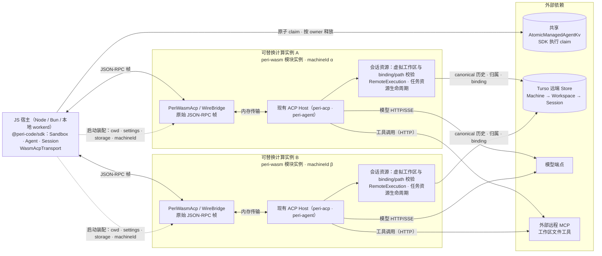

# Serverless 执行环境身份

> 状态：已批准目标设计。Emscripten 目标及 Node、Bun 与本地 `workerd` 宿主已在
> `refactor/wasm` 实现并验收；Cloudflare 托管部署与跨实例接管仍未验收，进度与验收
> 证据见该分支 `spec/history/2026-10.md`（2026-10-02 条目）。
>
> Scope：可替换计算实例中运行 Peri 的 Machine、Workspace 与 Session 身份，以及远端
> Store 与工具环境的执行准入。归属结构以 [存储 v2](storage-v2-machine-workspace-session.md)
> 为基础；按 ID 读历史与执行准入分离遵循[会话身份设计](session-id-environment.md)；
> 跨实例执行所有权与关闭接管边界见 [Session 异步任务统一入口](session-async-tasks.md)。

部署形态与数据流：

一个 JS 宿主可承载多个模块实例，每实例一次 `start` 装配、一个 Machine 身份与一份独立
执行准入；实线为运行时数据流，虚线为启动装配；实例可整体替换——canonical 历史与归属
在远端 Store，SDK 经共享 KV 协调执行权；Peri 只校验绑定与路径并管理本实例的任务资源。

## 1. 部署形态与启动契约

WASM 是兼容性目标，不是第二套 Peri：`wasm32-unknown-emscripten` 模块（`peri-wasm`）
嵌入现有 ACP Host，导出 `PeriWasmAcp`，与宿主只交换原始 JSON-RPC 帧。宿主循环、
请求路由、Agent 执行、模型与会话规则仍由原有 crate 承担，TypeScript 侧不分派 ACP 方法。

已验收宿主为 Node、Bun 与 Wrangler 本地 `workerd`，均按一宿主一模块实例验收。Workers
需要 `nodejs_compat`、独立 ES 模块、预编译 WASM module import 与 `mainScriptUrlOrBlob`
启动参数；托管部署、生产端点、资源限制与 Workers 上的 TypeScript SDK 入口尚未验收。
普通浏览器不能直接使用这条 Node socket 路线。

启动对象由受信部署装配提供，四项均为必填：

| 字段 | 语义 |
| --- | --- |
| `cwd` | 虚拟文件系统中的绝对路径身份；模块建立同名空目录并 canonicalize，使配置作用域与会话归属可解析 |
| `settings` | 整份注入的配置文档，与 stdio 启动同构；替换 Peri 全局配置 |
| `storage` | Turso locator 与凭证来源；写打开直接连接远端 Store |
| `machineId` | 宿主持久化的 UUID 执行身份，供跨模块重启的会话恢复 |

虚拟目录只承载路径身份，不代表真实文件系统事实。Emscripten 编译闭包排除 SQLx、
进程执行、stdio transport 与全部 builtin MCP；模型、远程 MCP 与 Turso
复用 HTTP 路径。工作区文件工具必须由外部 MCP 提供。

## 2. 身份与所有权

| 身份 | 稳定范围 | 权威来源 |
| --- | --- | --- |
| Machine ID | 一份可跨实例持续使用的**逻辑执行环境**，可供多个 Workspace 共用；与计算实例、Wasm 实例和冷启动无关 | 宿主部署装配为启动配置注入的持久 UUID；本地 CLI 保留 `PERI_MACHINE_ID`／身份文件来源 |
| Workspace ID | 该 Machine 上的一份虚拟执行工作区 | 由 machine ID 与规范化绝对根确定性派生的 UUID；同一身份同一路径跨实例、跨重启一致，不同机器同名路径不合并 |
| Session ID | 一条持久 thread，跨实例读取时不变 | Peri 创建的 `ThreadId`，经 `threads.workspace_id` 关联 Workspace；历史与归属存于远端 Store |
| SDK Sandbox／Agent ID | SDK 管理对象与并发占位键 | SDK 宿主；二者不能代替 Peri 的 Machine、Workspace 或 Session ID |
| 实例／执行句柄 ID | 一次计算占用 | 运行时；不写成 Machine、Workspace 或 Session 的归属 |

- Machine ID 是归属标签，**不是**认证凭证、租约或工具权限；服务端仍须单独鉴权
  Session 与 Workspace。SDK 不把 `Sandbox.id` 传给 Peri 当 `machine_id`，两者在
  部署配置中显式区分；Sandbox 仅划分 Agent 占位，Session 占位不以 Sandbox 分区。
- 一个 peri-wasm 模块实例只承载一个 Machine 身份：`start` 注入后在实例内固定，变更被
  确定拒绝。一个 JS 宿主可承载多个模块实例，各实例独立 wasm 内存、独立身份与执行状态；
  多 Machine 身份并行必须隔离为多个模块实例，不能依赖宿主进程全局状态或运行期修改
  环境变量切换。当前 SDK 装载器按模块 URL 复用单个模块实例，一个宿主内的多实例装载
  尚未交付（`npm-packages/@peri-sdk/src/wasm/loader.ts`）。
- 写打开会话存储必须提供持久 Machine UUID；缺失、非法或依赖临时 `HOME` 生成新身份
  都不允许向共享 Store 写入。身份切换是显式部署操作；普通 load、冷启动和同名路径
  不能迁移旧 Session 的归属。

## 3. 虚拟工作区与执行准入

一个 Agent 的活跃执行从开始到结束由同一个计算实例持有。服务化部署只提供一个稳定
workspace root，不要求也不校验真实文件系统事实：项目与工作区身份由
`(machine_id, 规范化绝对根)` 确定性派生，无需本机 Workspace 登记库；会话绑定与
执行观测快照（根路径）随会话持久在远端 Store。宿主提供的 `path` 必须是工具环境中的
稳定绝对路径，计算实例上的临时挂载目录、部署包目录和 SDK 进程的 `cwd` 不得充当
该根。

新会话使用共用 `RemoteExecution` 的虚拟 Workspace ID 与 `virtual-v1` 快照。
旧 WASM 格式的会话仍可按 Session ID 读取历史，但不能恢复执行；重新执行须创建新会话。

执行准入按已保存绑定复核：

- 请求执行目录必须解析到虚拟工作区根；绑定或观测快照与启动工作区不一致时返回
  `ExecutionBindingMismatch`，不因项目相同就放行。
- 绑定不可用时历史读取不受影响；环境不可用时不静默在另一实例的同名路径执行，
  SDK 如实暴露只读原因。
- 只读打开只提供历史：可读、可回放，执行与写入按存储访问模式及绑定校验拒绝；本机
  locator 在 WASM 直接失败，不静默落回本机库。

执行所有权唯一由 SDK 管理。当前 schema 由 Resources 的 canonical 常量定义，
版本与迁移入口见 [Resources 索引](../code-index/peri-resources.md)。schema14 已移除 Store 的 `epoch + nonce` owner、
Peri 执行 lease 与 Workspace fencing 均已删除；binding/path 校验、事务与任务资源
关闭不构成另一层执行权。实例消失不能从 Store 中有历史推断上次执行已完成，也不能
自动重放结果未知的工具调用；跨实例接管的证据链由
[Session 异步任务统一入口](session-async-tasks.md) 承担，本设计不承诺长任务续跑。

## 4. 会话与 SDK 可观察行为

会话创建先取得受信 Machine／Workspace 归属，按既有两阶段协议在 frozen 提交后发布。
按 ID load 不以当前计算实例或其 `cwd` 认领 Session；跨 Machine 或环境缺失时保留
只读历史。仅凭知道 Session ID 不授予访问权。

SDK 复用同一组接口：`WasmAcpTransport` 只替换底层传输（`Sandbox.transportFactory`
在原生 stdio 与 WASM 之间切换），`Sandbox`、`ManagedAgents`、`Agent` 与 `Session`
的公共接口和 stdio 模式共用；构建产物（JS 与 WASM）放入 npm 包内 `dist/wasm/`，
示例服务与 Workers probe 复用同一接口。

SDK 的 `SessionDocs` 把 ACP 通知（含冷 `session/load` 的历史重放）投影为实时 Yjs
视图：`agent.docs` 与 `session.docs` 指向同一对象，含 `chat` 与 `session` 两个
`Y.Doc`。它是进程内实时投影，不是持久权威——重启后应重新 start Session 以从 ACP
历史重建；文档可能包含会话私密内容，Web／Hub 传输需要自己的授权、版本化投影，
不能转发原始 Yjs 更新；跨实例同步协议不在本设计的现行保证内。接口与验证入口见
[SDK 代码索引](../code-index/peri-ts-sdk.md)，不以某个分支的提交状态描述当前能力。

SDK 的 ManagedAgents 使用共享 `AtomicManagedAgentKv` 原子 claim 并按 owner 释放，
负责 SDK 对象与会话占位，不是 RCRA 执行准入的完整权威。契约要求 Session key 仅含 Session ID，共享 keyspace 即占位协调域，
不含 `Sandbox.id`；Agent key 保持 Sandbox + Agent。部署必须共享 KV 覆盖可能执行同一
Session 的全部实例；不同数据库的相同 ID 共 KV 时保守拒绝，可按业务隔离 KV，不能
通过不同 Sandbox 绕过同 Session 占位。启动失败若 transport 清理未确认，SDK 保留
claim 与 transport，进入 `cleanup-pending`，以 `AggregateError` 保留原错误和清理错误；
`close` 共享可重试的清理事务，确认清理后释放，以免仍存活的旧执行与新实例重叠。

RCRA 执行准入由 SDK 的持久 `ExecutionRegistry`、`ExecutionAdmissionService` 和
`ExecutionCoordinator` 管理；现行 adapter 为 `SqliteExecutionRegistry`。实例身份、
dispatcher generation、attempt、entered evidence 与 stopped proof 参与准入、收尾和
替换裁决；共享 ManagedAgents KV 不能代替 registry，也不能证明旧执行已经停止。
部署须明确 registry 协调域和 proof provider，不能把进程内默认配置解释为跨宿主保证。

KV claim 与执行 registry 都不改变 Peri 的机器归属、binding/path 校验或「上次工具
是否完成」的事实；SDK 执行准入不是 Peri Store owner/lease。Yjs 是实时投影，
transcript 与持久工具结果仍以 Peri Store 为准。实现与测试路由见
[SDK 代码索引](../code-index/peri-ts-sdk.md)。跨实例进程接管与生产崩溃恢复仍未验收；
无法证明旧执行停止时保留不确定性，不从 claim 或历史存在推断可安全接管。

## 5. 与现有设计的关系

- [存储 v2](storage-v2-machine-workspace-session.md)：表结构、迁移、Machine →
  Workspace → Session 归属与 Workspace 级 MCP OAuth 凭证作用域（`mcp_oauth_credentials`
  按 Workspace 隔离）；本设计补充服务化 Machine 身份来源与虚拟执行环境准入。
- [会话身份设计](session-id-environment.md)：按 ID 读历史、另判执行继续适用；本机
  身份文件和目录检查只描述本地运行实现。
- [Session 异步任务统一入口](session-async-tasks.md)：SDK 执行协调、关闭接管与恢复
  证据链；不恢复 Peri/Store owner 或 Workspace fencing，这些接管能力未由本设计承诺。
- 实现入口与验收脚本见 `refactor/wasm` 分支的 `docs/code-index/peri-wasm.md`、
  `docs/code-index/peri-ts-sdk.md` 与 `spec/history/2026-10.md`（2026-10-02 条目）。

## 6. 保证边界

- 身份注入是部署责任：模块实例身份不可热切换；复用同一 `machineId` 与根路径的不同
  宿主会得到同一工作区身份——它是归属标签，不是隔离或凭证。
- 虚拟工作区不提供文件系统证据：路径与文件事实不被校验。文件工具依赖外部 MCP；
  WASM 无本地 OAuth 凭证库，未配置 OAuth 的远程 HTTP MCP 仍可连接；凭证不得回退到
  机器级旧凭证，Yjs、KV 与 SDK 状态不持有鉴权事实。
- 只读打开不假装可写：历史可读、可回放，执行准入与写入拒绝；写打开失败不静默
  回退到本机库或另一个身份。
- 托管 Cloudflare 部署、生产 Turso／模型端点、资源限制与 Workers 上的 TypeScript
  SDK 入口尚未验收；Node socket 路线不支持浏览器。
- `SessionDocs` 是进程内投影，不替代 Store 恢复，也不承诺跨实例实时同步；SDK 的
  Session 执行协调域独立于 Sandbox 与 Peri Machine 归属，完整跨实例接管仍未验收。
