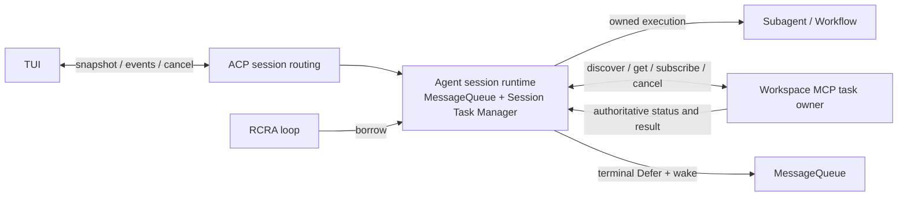

# Session 异步任务架构

> 状态：已批准目标设计。本文是 Subagent、Workflow 与 MCP 后台任务的注册、观察、取消和恢复的权威设计；现行实现入口见 `docs/code-index/`，落地状态以代码、测试及 active spec 为准。
>
> Scope：一个 Session 的异步任务控制面，以及独立驻留的 MCP 任务执行面。RCRA 阶段本身不拥有跨 turn 状态。

## 1. 领域与所有权

**执行 owner** 持有实际执行、终态结果和取消能力。Agent session 拥有后台 Subagent 与 Workflow run；Workspace MCP 实例拥有后台 Bash。一个任务只有一个执行 owner，Task Manager 不接管 MCP 进程，也不通过 UI 条目删除来证明执行已停止。

**Session Task Manager** 是 Agent session runtime 内存中的任务目录与操作入口，生命周期和 MessageQueue 同级，跨 turn 存活。它记录本会话可见任务的身份、来源、状态、摘要和 owner 路由，统一提供注册、状态对账、取消、快照和事件订阅。RCRA 的 Receive 用它判断后台活动、接受唤醒；Act 通过它登记任务。循环只借用该入口，不能创建新的目录或按 turn 重绑事件发送端。ACP 定位 session 并转发请求；TUI 只消费快照与增量事件。

**MCP task record** 是外部任务的权威状态。Agent 中的 MCP 条目只是可重建的投影；MessageQueue 仍是易失收件箱，任务目录也不写入 Session Store。Workflow journal、Subagent transcript 等已有成果存储各守自己的语义，不成为这个目录的持久化副本。

任务身份至少包含 `session_id + owner identity + owner task_id`。`owner identity` 是经过连接配置确认且重连后仍能定位到同一任务空间的 MCP 实例身份，或 Agent 本地 owner；不能只用工具名、服务端自报名称、临时连接 ID 或模型传入字符串。Manager 从复合身份确定性生成一个会话内唯一的 opaque `taskId`，让快照、增量事件和 ACP 取消请求都使用同一个值；原 owner task ID 只留在内部路由。这样同名服务、同一会话的重复原始 ID、实例重连和跨 session 均不会串线。任务记录同时携带**投递归属**（直接发起会话，来源与规则见 §7）；执行 scope 与投递归属正交，本节 owner 规则与 opaque `taskId` 派生键不因投递归属改变。

## 2. 单一操作入口

任务发起者交给 Session Task Manager 一份经过验证的登记：owner 路由、task ID、kind、摘要及取消能力。Manager 原子地建立条目并发布 started 事件；失败不得留运行中条目。Agent owned 任务由 Manager 准入、跟踪执行句柄并等待清理；外部 MCP 调用得到 Tasks handle 后登记投影，并由 MCP owner 继续执行。快速完成必须以 owner 终态覆盖初始 running 状态，不能被迟到的 started 回写。

完成、取消和查询都进入同一入口。Manager 将对外 `taskId` 解回已登记的复合身份，再根据 owner 路由到 Agent owned 句柄、Workflow kill 或 MCP `tasks/cancel`；取消请求只表示请求已被 owner 接纳，直到查询到终态或实际清理证据前仍显示为未结清。未知 task、错误 session、失联 owner 和超时分别返回明确结果，不伪装成功。Manager 对重复终态和乱序增量幂等；同一任务只发布一次终态显示。

Manager 给 ACP/TUI 提供**会话完整快照**和后续变更流。建立订阅与取得快照必须使用序号或等价水位衔接：先接收/缓冲增量，再取快照并按水位应用后续事件，避免两步之间丢事件。TUI 切换 session 或重新连接时替换该 session 的任务投影；不能沿用上个 session 的 atom，也不能只清空再等一次 started。增量丢失时重新取快照。底栏、详情和取消操作消费同一投影，kind/owner 有明确映射，未知类型仍可见状态并能经通用入口取消。

## 3. 完成结果与消息

任务终态同时影响 TUI 状态与 Agent 下一轮输入。对需要通知 Agent 的终态，Manager 先把可信 `Defer` 放入本会话 MessageQueue 并唤醒 Receive，再减少 active count 和发布完成事件；这保证 idle loop 不会在结果入队前退出等待。展示事件的发送失败不能丢弃 Agent 结果，Agent 消息投递失败也不能被展示成功掩盖。取消终态是否通知模型按任务语义决定，但必须明确记录，不借“删除条目”暗示已投递。投递目标为任务的**归属会话**（直接发起会话）；子会话发起的外部任务不因执行 scope owner 不同而改道，规则见 §7。

外部结果在 MCP owner 处保留原始状态和结果；Agent 将其转换为类型化的任务提醒和有界摘要。Workspace Bash 使用 shell 结果的文件引用，不把完整 `structuredContent` JSON 作为模型正文。通用 MCP task 可保留外部来源语义。Owner 对 running→terminal 的唯一跃迁赋予不可变的 terminal transition ID；其后 status message、清理证据等 revision 变化不产生第二次终态提醒。提醒携带由复合任务身份与 terminal transition ID 导出的稳定投递 ID；Receive 将该 ID 与 canonical transcript 中的提醒在同一持久化提交路径去重，已 compact/excluded 的历史仍参与判重。MQ 入队或内存标记不算送达：崩溃在 transcript 提交前可重投，提交后重投被拒绝。持久化失败时保留待对账状态，不能先标记成功。TUI 的单次终态显示由 Manager 的会话投影去重，重连时以快照替换。

## 4. 外部任务发现与恢复

MCP Tasks 的按 ID `tasks/get`、`tasks/cancel` 和订阅不足以在 Agent 丢失内存后找回未知 ID。Workspace MCP 必须补充**按可信 session scope 发现任务**的扩展能力，返回该 session 的任务身份、状态、revision、terminal transition ID 和足以重建摘要/结果的字段（含投递归属，供冷恢复重建投递目标，见 §7）。scope 在可信部署的会话绑定处建立，且必须在后台 `tools/call` 创建任务前到达 MCP owner；响应丢失时也能按 scope 找回已创建任务。不能接受模型工具参数自行声称的 session ID；调用者认证/授权与 session scope 隔离分别校验，scope 本身不是凭证。共享 MCP 实例按 scope 限定创建、查询、取消及订阅。记录至少保留到该 session 的结果完成对账，或按明确的保留上限与过期状态报告；静默删除会造成“恢复成功但任务消失”。不具备发现能力的外部 MCP server 只能提供已知 ID 的 best-effort 观察，不能声称支持冷恢复。

Workspace 扩展同时提供 scope 快照和可从快照 cursor 续接的 scope 变更流。Agent session runtime 重建时，先读取 scope 快照及 cursor，再从该 cursor 订阅变更；对发现的任务按需 `tasks/get` 核实终态，按 owner revision 合并事件，最后发布完整会话快照。若 cursor 已过期或变更流出现空洞，则重新取快照，不把缺口视作无变化。现有仅按已知 task ID 过滤的 `subscriptions/listen` 不承担冷恢复。订阅断开、lag 或查询失败进入可见的失联/待对账状态并重试；不得把本地条目直接判完成或永久保留 running。重连对账可重新投递遗漏的终态提醒，遵守上一节去重规则。Manager 的本地记录可以整体重建；MCP owner 的记录不会被 Agent 重建操作改写。

**故障范围**：单个 Agent loop 或 session runtime 意外退出时，不向 MCP 发送取消；仍存活的 MCP owner 继续执行。Builtin Workspace MCP 默认与 Agent 在同一进程，整个进程退出时二者都消失，因此此部署不提供进程级任务高可用。Workspace MCP 独立部署并保持存活时，新的 Agent 才能按 scope 发现、查询和重订阅其任务。MCP owner 自身退出后的恢复另由该 owner 的持久化/执行环境契约承担，不能由 Agent 内存目录保证。

Subagent 与 Workflow 的执行 owner 仍在 Agent 部署内。该部署退出后，新的 Manager 可依据已有 child transcript、Workflow journal 等成果证据重建可核对状态或恢复入口，但不得把旧进程任务投影为仍在运行，也不得把记录存在当作执行已完成。继续执行属于各自的恢复契约，不由任务目录自动重放。

## 5. 关闭与清理

用户**显式关闭或删除 session** 时，Session runtime 在 admission 锁下进入 `PreparingClose`，阻止新任务并记录已接纳的在途发起，然后向 Session Store 提交关闭意图。**持久提交是关闭请求的接纳点**：明确写入失败时撤销 `PreparingClose`、恢复准入并返回失败；提交结果不确定时先回读确认，在确认前保持 `PreparingClose` 且不得返回成功。若提交前进程退出，客户端未收到接纳结果，需重试；恢复时以 Store 中有无关闭意图为准。已提交意图禁止新 runtime 任务准入。Workspace MCP 的 session scope 也须有与任务创建线性化的 closing gate：关闭 gate 返回 barrier cursor，拒绝之后的新建；先前已接纳的在途创建必须纳入 barrier 后的发现快照。Manager 等待在途调用结算，按 barrier 及后续变更发现并取消本 session 的所有外部任务，同时取消 Agent owned 任务；取得终态/清理证据后才结算关闭。只取消该 session 的任务，不关闭共享 MCP 实例。子会话（subagent 等）结束不是其 root 的显式关闭：不得取消 root scope 任务；发起会话结束前的有界收敛与交接见 §7。

关闭意图属于 session 生命周期元数据，不是任务目录或执行所有权。取消或清理超时报告 `Incomplete`，deployment 保留可重试关闭上下文。新的 Agent 读取已接纳意图并继续资源排空，任务创建响应丢失或取消未确认时不能把空目录当成成功。删除会话记录必须等待本地与外部任务结算；保留记录的关闭在排空后清除意图。Store 提交响应不确定时按 Session ID 回读意图或根记录，不把命令发送当成完成。

会话的唯一执行者、Agent 替换和跨实例接管由 `peri-sdk` 管理。SDK 负责在开放新执行者前停止或隔离旧实例；Peri 不保存或续约执行租约，不认领 Store owner，不验证接管 supervisor 证明，不对工具调用执行 Store token fencing。Workspace scope 的 close/open 仍按 scope epoch 保护任务生命周期，防止迟到关闭请求影响已重开的 scope；该 epoch 不是会话执行所有权。

Agent 意外消失、连接断开、宿主更换或部署重启不等同于用户显式关闭。独立 MCP 任务的发现、取消和终态对账仍归任务 owner；部署释放不应被解释为远端 task cancel。Workspace MCP 不用本地 owner marker 阻止新实例启动；旧任务或孤儿进程的停止与实例替换由 SDK 和部署平台负责，Peri 不声称重启即证明旧任务停止。

## 6. 落地边界与验收

Session runtime 的 TaskManager 汇合 Subagent、Workflow 与 Workspace MCP 任务投影；ACP 提供快照、增量与统一取消；TUI 在会话切换及重连时按 revision 对账；Workspace MCP 提供 session scope 的发现、变更、关闭和重开。终态提醒以稳定 ID 原子落入 canonical transcript。各入口和验证见 `docs/code-index/`。

完整验收仍须覆盖：三类任务的 started/terminal/取消在同一 TUI 区域可见；任务在结果入队前保持 active；快完成与取消竞争；session 切换及重连快照；订阅丢失后的对账；Agent runtime 重建后从仍存活的独立 MCP 找回任务；显式关闭只取消本 session，Agent 意外退出不取消 MCP；同名 MCP 实例及跨 session task ID 不串线。部署进程退出、MCP owner 退出与不支持发现的第三方 server 应分别报告能力边界。子会话发起任务的发起者可达（回执承诺可兑现）、祖先链聚合可归属且不重复产生终态、跨进程重建后投递目标正确（降级路径显式可观测），同样纳入验收（§7）。

## 7. 归属、投递与可见性

本节定义**子会话发起的外部任务**（subagent、嵌套 subagent、workflow 内 agent、print 等）的归属规则，与 §1–§6 同等效力。

### 7.1 三个正交维度

同一任务的三种关系分别取值，不得合并为单一字段：

| 维度 | 取值 | 用途 |
| --- | --- | --- |
| 投递归属 | **直接发起会话** | 终态提醒的 canonical 提交与唤醒 |
| 执行 scope | **执行树根** | MCP task scope、发现/恢复对账、关闭级联、取消授权 |
| 可见性 | **祖先链聚合，至少 root** | TUI 面板与 ACP 快照的只读投影 |

任务记录携带投递归属（发起会话与调用上下文）；投递归属取自可信 session binding 或执行上下文，不得接受模型工具参数或字符串自称的 session ID。

### 7.2 投递规则

- 终态提醒以稳定投递 ID 原子提交到**归属会话**的 canonical transcript；活跃会话可经其 Receive 提交，投递路径也可直接提交，两条路径按同一去重规则收敛。MQ 入队只用于活跃唤醒，不算送达。
- 投递不因 scope owner 不同而改道；回执向发起者承诺的投递必须在其归属会话可达，不可达不得承诺。
- 归属会话不活跃或已结束时，canonical 提交即持久送达：resume/load 后按稳定投递 ID 去重可见，并进入模型投影。
- 持久化失败保留待对账状态；崩溃可重投，提交后重投被拒绝（§3 机制不变）。

### 7.3 生命周期与收敛

- 发起者活跃：Defer 入归属会话 MQ 并唤醒 Receive。
- 发起会话结束前对其已发起且未结算的任务执行**有界等待**；超时按**可观测交接**结束：在归属会话及其调用方可见处记录未结算任务身份与 scope owner，不得无限等待、不得静默丢弃。
- 发起会话（含子会话）结束不得取消 root scope 任务；任务继续由 root scope 的关闭与对账结算。发起者永久不恢复时，scope owner 流程负责结算并报告（丢失可观测）。
- 跨进程：scope 发现（§4）携带投递归属并据此重建投递目标；无法重建时降级为 root 投递，并在通知与视图中显式标注。

### 7.4 可见性

- 聚合视图是只读投影：不夺回投递权、不产生第二结果权威源；root 视图不生成新终态。
- 条目携带发起者身份（thread / 调用上下文 / kind），去重键为稳定任务身份 + terminal transition ID。
- 展示事件失败不丢结果，投递失败不被展示成功掩盖（§3 不变）。
- 取消授权：发起者可取消其发起的任务，scope owner 可取消整树（§1/§5 不变）。
