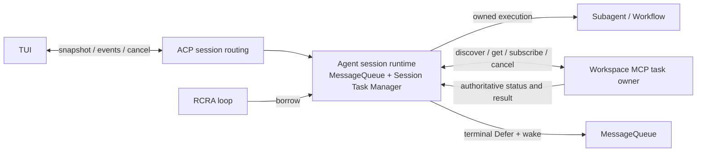

# Session 异步任务架构

> 状态：已批准目标设计。本文是 Subagent、Workflow 与 MCP 后台任务的注册、观察、取消和恢复的权威设计；现行实现入口见 `docs/code-index/`，落地状态以代码、测试及 active spec 为准。
>
> Scope：一个 Session 的异步任务控制面，以及独立驻留的 MCP 任务执行面。RCRA 阶段本身不拥有跨 turn 状态。

## 1. 领域与所有权

**执行 owner** 持有实际执行、终态结果和取消能力。Agent session 拥有后台 Subagent 与 Workflow run；Workspace MCP 实例拥有后台 Bash。一个任务只有一个执行 owner，Task Manager 不接管 MCP 进程，也不通过 UI 条目删除来证明执行已停止。

**Session Task Manager** 是 Agent session runtime 内存中的任务目录与操作入口，生命周期和 MessageQueue 同级，跨 turn 存活。它记录本会话可见任务的身份、来源、状态、摘要和 owner 路由，统一提供注册、状态对账、取消、快照和事件订阅。RCRA 的 Receive 用它判断后台活动、接受唤醒；Act 通过它登记任务。循环只借用该入口，不能创建新的目录或按 turn 重绑事件发送端。ACP 定位 session 并转发请求；TUI 只消费快照与增量事件。

**MCP task record** 是外部任务的权威状态。Agent 中的 MCP 条目只是可重建的投影；MessageQueue 仍是易失收件箱，任务目录也不写入 Session Store。Workflow journal、Subagent transcript 等已有成果存储各守自己的语义，不成为这个目录的持久化副本。

任务身份至少包含 `session_id + owner identity + owner task_id`。`owner identity` 是经过连接配置确认且重连后仍能定位到同一任务空间的 MCP 实例身份，或 Agent 本地 owner；不能只用工具名、服务端自报名称、临时连接 ID 或模型传入字符串。Manager 从复合身份确定性生成一个会话内唯一的 opaque `taskId`，让快照、增量事件和 ACP 取消请求都使用同一个值；原 owner task ID 只留在内部路由。这样同名服务、同一会话的重复原始 ID、实例重连和跨 session 均不会串线。

## 2. 单一操作入口

任务发起者交给 Session Task Manager 一份经过验证的登记：owner 路由、task ID、kind、摘要及取消能力。Manager 原子地建立条目并发布 started 事件；失败不得留运行中条目。Agent owned 任务由 Manager 准入、跟踪执行句柄并等待清理；外部 MCP 调用得到 Tasks handle 后登记投影，并由 MCP owner 继续执行。快速完成必须以 owner 终态覆盖初始 running 状态，不能被迟到的 started 回写。

完成、取消和查询都进入同一入口。Manager 将对外 `taskId` 解回已登记的复合身份，再根据 owner 路由到 Agent owned 句柄、Workflow kill 或 MCP `tasks/cancel`；取消请求只表示请求已被 owner 接纳，直到查询到终态或实际清理证据前仍显示为未结清。未知 task、错误 session、失联 owner 和超时分别返回明确结果，不伪装成功。Manager 对重复终态和乱序增量幂等；同一任务只发布一次终态显示。

Manager 给 ACP/TUI 提供**会话完整快照**和后续变更流。建立订阅与取得快照必须使用序号或等价水位衔接：先接收/缓冲增量，再取快照并按水位应用后续事件，避免两步之间丢事件。TUI 切换 session 或重新连接时替换该 session 的任务投影；不能沿用上个 session 的 atom，也不能只清空再等一次 started。增量丢失时重新取快照。底栏、详情和取消操作消费同一投影，kind/owner 有明确映射，未知类型仍可见状态并能经通用入口取消。

## 3. 完成结果与消息

任务终态同时影响 TUI 状态与 Agent 下一轮输入。对需要通知 Agent 的终态，Manager 先把可信 `Defer` 放入本会话 MessageQueue 并唤醒 Receive，再减少 active count 和发布完成事件；这保证 idle loop 不会在结果入队前退出等待。展示事件的发送失败不能丢弃 Agent 结果，Agent 消息投递失败也不能被展示成功掩盖。取消终态是否通知模型按任务语义决定，但必须明确记录，不借“删除条目”暗示已投递。

外部结果在 MCP owner 处保留原始状态和结果；Agent 将其转换为类型化的任务提醒和有界摘要。Workspace Bash 使用 shell 结果的文件引用，不把完整 `structuredContent` JSON 作为模型正文。通用 MCP task 可保留外部来源语义。Owner 对 running→terminal 的唯一跃迁赋予不可变的 terminal transition ID；其后 status message、清理证据等 revision 变化不产生第二次终态提醒。提醒携带由复合任务身份与 terminal transition ID 导出的稳定投递 ID；Receive 将该 ID 与 canonical transcript 中的提醒在同一持久化提交路径去重，已 compact/excluded 的历史仍参与判重。MQ 入队或内存标记不算送达：崩溃在 transcript 提交前可重投，提交后重投被拒绝。持久化失败时保留待对账状态，不能先标记成功。TUI 的单次终态显示由 Manager 的会话投影去重，重连时以快照替换。

## 4. 外部任务发现与恢复

MCP Tasks 的按 ID `tasks/get`、`tasks/cancel` 和订阅不足以在 Agent 丢失内存后找回未知 ID。Workspace MCP 必须补充**按可信 session scope 发现任务**的扩展能力，返回该 session 的任务身份、状态、revision、terminal transition ID 和足以重建摘要/结果的字段。scope 在可信部署的会话绑定处建立，且必须在后台 `tools/call` 创建任务前到达 MCP owner；响应丢失时也能按 scope 找回已创建任务。不能接受模型工具参数自行声称的 session ID；调用者认证/授权与 session scope 隔离分别校验，scope 本身不是凭证。共享 MCP 实例按 scope 限定创建、查询、取消及订阅。记录至少保留到该 session 的结果完成对账，或按明确的保留上限与过期状态报告；静默删除会造成“恢复成功但任务消失”。不具备发现能力的外部 MCP server 只能提供已知 ID 的 best-effort 观察，不能声称支持冷恢复。

Workspace 扩展同时提供 scope 快照和可从快照 cursor 续接的 scope 变更流。Agent session runtime 重建时，先读取 scope 快照及 cursor，再从该 cursor 订阅变更；对发现的任务按需 `tasks/get` 核实终态，按 owner revision 合并事件，最后发布完整会话快照。若 cursor 已过期或变更流出现空洞，则重新取快照，不把缺口视作无变化。现有仅按已知 task ID 过滤的 `subscriptions/listen` 不承担冷恢复。订阅断开、lag 或查询失败进入可见的失联/待对账状态并重试；不得把本地条目直接判完成或永久保留 running。重连对账可重新投递遗漏的终态提醒，遵守上一节去重规则。Manager 的本地记录可以整体重建；MCP owner 的记录不会被 Agent 重建操作改写。

**故障范围**：单个 Agent loop 或 session runtime 意外退出时，不向 MCP 发送取消；仍存活的 MCP owner 继续执行。Builtin Workspace MCP 默认与 Agent 在同一进程，整个进程退出时二者都消失，因此此部署不提供进程级任务高可用。Workspace MCP 独立部署并保持存活时，新的 Agent 才能按 scope 发现、查询和重订阅其任务。MCP owner 自身退出后的恢复另由该 owner 的持久化/执行环境契约承担，不能由 Agent 内存目录保证。

Subagent 与 Workflow 的执行 owner 仍在 Agent 部署内。该部署退出后，新的 Manager 可依据已有 child transcript、Workflow journal 等成果证据重建可核对状态或恢复入口，但不得把旧进程任务投影为仍在运行，也不得把记录存在当作执行已完成。继续执行属于各自的恢复契约，不由任务目录自动重放。

## 5. 关闭与清理

用户**显式关闭或删除 session** 时，Session runtime 在 admission 锁下进入 `PreparingClose`，阻止新任务并记录已接纳的在途发起，然后向 Session Store 提交关闭意图。**持久提交是关闭请求的接纳点**：明确写入失败时撤销 `PreparingClose`、恢复准入并返回失败；提交结果不确定时先回读确认，在确认前保持 `PreparingClose` 且不得返回成功。若提交前进程退出，客户端未收到接纳结果，需重试；恢复时以 Store 中有无关闭意图为准。已提交意图禁止新 runtime 任务准入。Workspace MCP 的 session scope 也须有与任务创建线性化的 closing gate：关闭 gate 返回 barrier cursor，拒绝之后的新建；先前已接纳的在途创建必须纳入 barrier 后的发现快照。Manager 等待在途调用结算，按 barrier 及后续变更发现并取消本 session 的所有外部任务，同时取消 Agent owned 任务；取得终态/清理证据后才结算关闭。只取消该 session 的任务，不关闭共享 MCP 实例。

关闭意图属于 session 生命周期元数据，不是任务目录或结果副本。取消或清理超时报告 `Incomplete`：进程内由 deployment owner 保留可重试的关闭上下文；Agent 更换后先读关闭意图并禁止新任务准入，再用 MCP closing gate 和 scope 快照继续结算。外部 MCP 工具调用须在发送请求前登记执行准入，覆盖服务端创建任务到本地登记或确认取消的整个窗口；创建响应丢失、超时或取消未确认时保留未结清证据，不能把空任务目录当作成功。**关闭意图仅证明关闭请求已接纳，不证明原 Agent 的 prompt、Subagent、Workflow 或 transcript 已排空。**更换 Agent 必须由可信 SDK supervisor 证明对应旧 Agent 进程代际已经退出，且其本地子进程组已收敛；证明缺失即 `Incomplete`。新的 Agent 用 Store 时钟下的 CAS 取得 root 执行 owner `epoch + nonce`；旧 owner 仍有效时不得接管。Store 的每次会话写入必须在同一业务事务内校验精确 owner 和有效期，迟到写入与接管 CAS 按 Store 写锁线性化。运行中每 10 秒续约；续约失败立即关闭该 session 的 Agent 与工具准入。

取得 Store owner 后，Agent 用 Store 执行代际推进 Workspace MCP 的 owner floor，再关闭该 session 的 task scope。`taskFence` 必须阻断旧代际新工具准入、等待已准入的任务创建登记，并返回可对账的 barrier；仅检查任务快照为空不构成证明。执行期在 Store 绑定可信 Workspace endpoint 的身份，以及是否存在缺少恢复发现能力的其他外部任务 owner；动态接入此类 owner 前必须先持久置位，写入失败即拒绝接入。标记跨代单调保留，直到完整关闭结算。接管时必须对照原绑定，不能用新进程恰好连接的空 Workspace 目录代替旧 owner 的目录。存在其他无法发现的任务 owner、绑定缺失或身份不符时保持 `Incomplete`。独立 Workspace MCP 的内存目录只在其 owner 进程连续存活时可信：自身异常退出后，新进程不得以空目录宣称旧任务完成；缺乏外部清理证明时拒绝恢复并报告 `Incomplete`。内置同进程 MCP 随 Agent 退出，不能获得独立执行高可用。

删除 session 记录只能在本地与外部任务均结算后完成，不能先删掉恢复关闭所需的 scope。显式关闭先完成远端取消/对账，再断开该 session 的 MCP 连接。保留 session 记录的成功关闭在**一个 Store 事务**里校验当前 owner、清除关闭意图并释放该代际；删除则在同一受 owner 保护的事务中删除 session 树、关闭意图和 owner。若 Store 提交响应丢失，按相同 `epoch + nonce` 回读 `Pending / Finished / ChangedOwner`，只有精确 `Finished` 可确认保留记录的关闭；删除回读根记录确实不存在才确认删除。任何未知结果保持关闭准入，不撤销已接纳的关闭。后续重新加载该 session 须在新任务准入前重新打开 Workspace scope。Workspace scope 的 close/open 使用 owner 的 epoch 条件更新：请求携带先前快照的 epoch，打开成功推进 epoch，过期关闭请求不得再次关闭新一代 scope。

Agent 意外消失、连接断开、宿主更换或部署重启不等同于用户显式关闭，不得因此向独立 MCP owner 发送取消。当前 transport EOF 的资源清理仍可停止本地 owner；目标实现需在该路径区分 session 显式关闭和部署释放，EOF 只断开远端观察连接，不把进程级释放解释为远端 task cancel。

普通可执行 `session/load` 也不能只凭 Store 租约到期接管未释放的旧 owner：旧 Agent 在续租失败被观察到之前仍可能执行不经 Store 栅栏的外部工具。Store 需区分已释放 owner 与过期但未释放 owner；后一种接管须证明对应旧 Agent 及其子进程组已退出，并将证明所指的执行代际与 Store 的待接管代际精确匹配。无法证明时仅允许只读观察或返回恢复未完成，不能开放工具准入。

## 6. 落地边界与验收

已落地：session runtime 的 TaskManager 汇合 Subagent、Workflow 与 Workspace MCP 任务投影；ACP 提供快照、增量与统一取消；TUI 在会话切换及重连时按 revision 对账；Workspace MCP 提供可信 scope 的发现、变更、关闭和重开。终态提醒以稳定 ID 原子落入 canonical transcript，独立存活的 Workspace MCP 可供新 Agent 按 scope 找回任务。各入口和验证见 `docs/code-index/`。

跨进程关闭接管按 §5 的证据链实现：Store 的 root owner 代际与同事务写入栅栏、Workspace 的执行代际 floor 与 task barrier、SDK 对精确旧 Agent 进程代际的子进程收敛证明、ACP 的关闭续约和可重试结算。Store 只持久化执行 owner 代际、关闭意图及执行期外部 owner 身份与能力证据；Task Manager 和任务投影继续只在内存。无法取到可信 SDK 证明、可信 Workspace owner 目录或 Store 的精确结算读回时保持 `Incomplete`，不会把失去观察误判为完成。独立 Workspace MCP 自身异常退出后的孤儿 shell 仍需外部进程监督或人工清理证明，当前 owner incarnation guard 会阻止空目录恢复。

完整验收仍须覆盖：三类任务的 started/terminal/取消在同一 TUI 区域可见；任务在结果入队前保持 active；快完成与取消竞争；session 切换及重连快照；订阅丢失后的对账；Agent runtime 重建后从仍存活的独立 MCP 找回任务；显式关闭只取消本 session，Agent 意外退出不取消 MCP；同名 MCP 实例及跨 session task ID 不串线。部署进程退出、MCP owner 退出与不支持发现的第三方 server 应分别报告能力边界。
