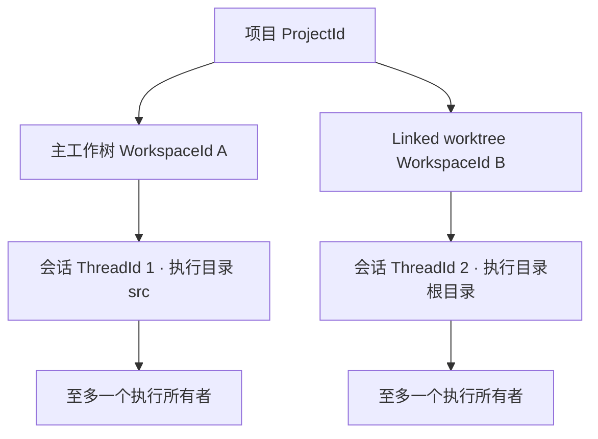

# 会话、项目与 Worktree 身份

> 状态：现行设计。
>
> Scope：本机同一 Peri 存储中的会话归属、执行绑定、恢复与执行所有权。
> 本文定义新会话的身份与执行契约；平台运行验收见
> [验收 issue](../../spec/issues/2026-09-12-worktree-session-identity.md)。
> 术语见 [领域语言](../../CONTEXT.md)。现有冻结与生命周期约束仍遵循
> [架构契约](../standards/architecture-contracts.md)。

## 1. 核心裁决

会话已有独立 `ThreadId`，需要补齐的是项目身份和执行绑定。路径用于定位文件，
不能同时承担项目归属、会话身份和执行所有权。

同一个本地 Git 仓库的主工作树与 linked worktree 共用 `ProjectId`；每份文件树
具有独立 `WorkspaceId`。会话固定绑定一个工作区及其中的执行目录。打开列表、
切换终端或从另一 worktree 恢复，不会改写这个绑定。



项目列表默认聚合本项目的会话，允许按工作区过滤。列表中显示工作区和实际执行
目录；分支只是可变化的展示信息。项目聚合不扩大任何会话的文件访问权限。

## 2. 身份与持久化事实

| 概念 | 身份 / 数据 | 不变量 |
| --- | --- | --- |
| 项目 | `ProjectId`，opaque ID | 一个本地仓库实例；同 remote 的独立 clone 默认不同 |
| 执行工作区 | `WorkspaceId`，opaque ID | 一份主工作树、linked worktree 或非 Git 文件树 |
| 会话 | 现有 `ThreadId` | 历史、消息、目标与运行归属继续使用原 ID |
| 执行绑定 | `SessionBinding` | 项目、工作区、工作区内相对目录与绑定版本 |
| 位置 | `WorkspaceLocation` | 工作区根、Git common directory / private directory 的已验证位置 |
| 执行所有者 | `SessionExecutionLease` | 某宿主当前独占会话执行权；不由历史状态推断 |

不再增加与 `ProjectId` 重叠的 RepositoryId。身份范围限于同一台主机的同一
Peri 存储；跨主机、跨数据库合并和仓库克隆身份传播不在本设计范围。

`SessionBinding` 的持久化字段为：

```text
schema_version
project_id
workspace_id
cwd_relative_to_workspace
```

binding 不可变，协议中的 `revision` 保持常量 `1` 以兼容已有客户端，不作为
数据库字段或并发控制依据。执行代次 `generation` 仍由独占执行 owner 管理。

`ThreadMeta.cwd` 保留为创建时目录和 legacy 证据，禁止通过普通 metadata 更新
改写绑定。有效执行目录由绑定与已验证位置派生；兼容协议中的 `cwd` 是这个结果
的投影。项目/工作区登记、位置更新和 binding 写入由同一个持久化 owner 管理，
通过专用事务接口维护项目与工作区的关系，不能散落在 metadata JSON 中各自解释。

消息、compact flags、frozen snapshot 与列表摘要继续各守现有边界。列表允许投影
小型身份字段，但不得加载消息正文、冻结 blob 或重新计算内容大小。

## 3. 发现与身份登记

### 3.1 Git 事实

使用 Git 的机器可读入口取得事实，不根据 `.git` 是文件还是目录推测路径布局：

```text
git -C <cwd> rev-parse --is-inside-work-tree
git -C <cwd> rev-parse --path-format=absolute --show-toplevel
git -C <cwd> rev-parse --absolute-git-dir
git -C <cwd> rev-parse --path-format=absolute --git-common-dir
git -C <cwd> worktree list --porcelain -z
```

common directory 用于发现同仓库关联，private Git directory 用于区分 checkout。
linked worktree 的这两者不同；主工作树通常相同。
这些 Git 语义来自 [git-worktree](https://git-scm.com/docs/git-worktree#_details)
与 [git-rev-parse](https://git-scm.com/docs/git-rev-parse#_options_for_files)。

命令使用参数数组、显式 cwd 和有界执行，不拼接 shell。发现过程隔离继承的
`GIT_DIR`、`GIT_WORK_TREE`、`GIT_COMMON_DIR` 等会改写仓库选择的环境变量；不能
修改用户 Git 配置来使探测成功。解析支持带空格的路径，worktree list 使用 NUL
分隔。路径按所在文件系统 canonicalize，不统一小写、不使用 lossy 转换生成身份。

### 3.2 登记裁决

由 `peri-resources` 持有本地登记表，分配 opaque ID。Git 路径是发现线索，不是
ID 本身；不把路径 hash 永久当成项目 ID，也不往受版本控制文件或 Git 管理目录
写 Peri 身份标记。

登记记录保存 canonical locator、平台文件对象识别信息和登记代际。相同路径
只有在登记证据仍匹配时才复用身份；观察到删除、替换或冲突时将旧位置失效。
inode / file ID 只能作为一致性证据，不能证明任意复制、重建或历史路径复用。
证据不足返回 `NeedsRelink`，允许用户核对后显式重关联，不自动合并。

工作区身份取 canonical root 路径加上该目录自身的文件对象证据；Git 布局是同一
目录的派生观测，`git init`、移除 `.git` 或重建其管理目录都属于正常演进。同一
目录对象再次解析时复用原项目与工作区 ID，只在原行内刷新观测快照：执行 cwd、
项目归属和已有绑定都不移动。可以覆盖已登记快照的观测必须来自 Git 的真实回答；
Git 不可用时得到的是不完整目录观测，仍按证据不足拒绝。

第一次登记与 binding 写入使用唯一约束、事务和竞争失败后重读 winner，避免
两个宿主同时为同一已验证工作区分配不同有效身份。Git 探测在事务外进行，提交
前复核关键文件对象与关联关系；期间发生变化则放弃该次结果。

### 3.3 情景规则

| 情景 | 行为 |
| --- | --- |
| 主树与 linked worktree | 同项目，不同工作区 |
| 同 worktree 的不同子目录 | 同项目、同工作区，各会话保留原子目录 |
| 指向同目录的符号链接 | canonicalize 后复用登记；保留原路径用于展示/诊断 |
| 相同 remote、branch 或 commit 的独立 clone | 分别登记项目，不推断同一身份 |
| 嵌套仓库、submodule | 使用 cwd 所属的最近 Git 仓库，不上卷到 superproject |
| 非 Git 目录 | 创建目录项目与工作区；不猜测任意父目录是项目根 |
| 已登记目录随后出现或移除 `.git` | 同一目录对象仍取原工作区，刷新观测快照；执行 cwd 与历史绑定不变 |
| Git 可执行文件缺失 | 新发现使用 cwd 目录模式，不推断仓库关系；已有 Git 绑定仍须匹配原发现快照，缺少证据时拒绝执行 |
| Git 权限不足、unsafe repository、损坏或探测中途失效 | 类型化探测错误，不能伪装为非 Git 项目 |
| bare repository | 可作为 linked worktree 的仓库锚点；bare 目录本身不可作为执行工作区 |
| worktree 删除或目录暂时不可用 | 保留身份和历史，位置标记不可用，阻止执行 |
| 删除后同路径重新创建 | 不自动继承旧会话绑定；无法确定是否同一实例时要求重关联 |
| 整仓搬迁、复制、导入或 Git 管理目录重建 | 不承诺透明识别；显式重关联，不能以 remote 相同证明身份 |

发现结果采用 `GitWorkspace` / `DirectoryWorkspace` / `Unavailable` /
`NeedsRelink` / `DiscoveryError` 等明确分支。Git 确认“不是 Git 仓库”，或首次
启动 Git 返回 executable-not-found 时，可以建立目录项目；后者仅表示未启用 Git
发现，不声称目录中没有仓库。两种目录模式均只使用 cwd 及文件对象身份，不推断
任意父目录归属。Git 探测一旦开始成功，后续失败不能降级为目录模式。
已有绑定始终复核完整发现快照；Git 安装状态变化不能改写项目/工作区身份。
非 Git 目录随后初始化 Git，或已登记仓库移除 `.git` 时，该目录仍是同一工作区：
复用原项目与工作区 ID 并刷新观测快照，已有会话继续可执行。子目录会话不因根
目录的布局变化被并入或改绑，仍按各自登记快照复核。Git 不可用不构成「该目录
已不是仓库」的证据，不得据此覆盖已登记的仓库布局。

## 4. 唯一执行绑定

会话的 shell、Read/Edit/Write、@mention、PTC、hooks、skills、项目指引、MCP、
LSP、Workflow 和 SubAgent 都从同一个已解析的 session environment 取得执行目录。
宿主启动目录只用于创建默认新会话及初始列表选择。

Host 可以共享 transport、全局配置来源与确定可共享的服务；项目相关配置、插件
发现结果、hook groups、命令目录和资源句柄必须按会话执行环境装配。缓存的 key
必须包含真实环境与配置身份，不能只包含 ProjectId。同项目工作区之间不合并
`.mcp.json`、局部 settings、权限或可写目录。

不能只修 `SessionState.cwd`，仍把宿主启动目录的 project hooks / plugins / MCP
注入恢复后的会话。跨工作区会话选择开放前，必须完成这些消费者的路径一致性
验收；无法装配正确环境时返回错误，禁止部分成功。

已有全局和 session 权限策略照常生效。目录、项目身份与 Git 信任状态不是授权
凭证；恢复到另一个项目环境不会获得浏览窗口或兄弟 worktree 的额外权限。

## 5. 会话生命周期

### 5.1 new

验证请求目录 → 发现/登记项目与工作区 → 形成 binding → 创建 thread → 取得执行
所有权 → 在该环境构建并持久化 frozen snapshot → 装配会话资源 → 发布 session。
中间失败不得留下可执行的半成品；new/frozen 写入失败继续遵守现有补偿规则。

### 5.2 load / resume

先按 `ThreadId` 读取持久化 binding，再验证工作区位置和原相对目录。相对目录
重新 canonicalize 后必须仍属于原工作区，并复核最近 Git 仓库；目录组件变为
symlink 或新嵌套仓库时不能只凭字符串前缀通过。请求的 cwd
作为预期执行目录校验，不是覆盖 binding 的输入。不同工作区或不同会话子目录
返回 `ExecutionBindingMismatch`；不能因为项目相同就放行。

取得执行所有权后，重读 binding、重新验证位置与运行恢复状态，再恢复
frozen、构建有效环境和资源，最后提交 live state。装配失败必须收回本次新建
资源，不能泄漏 LSP/MCP 或后台任务。热态
复用必须校验同一 binding 和环境；冷态不从请求重新决定 cwd。metadata、Git
定位、资源装配或 frozen 恢复失败，都不能提交新的 active session。

已有 `ARC-SESSION-LOAD-001` 的同步 reservation 和 operation gate 保留。新旧
session 切换只有在目标提交时才公布有效目录和 active identity；失败必须恢复
真实可用的原状态或明确 NoSession，不能留下看似已经切换的输入界面。

目录缺失时，历史通过只读查询/回放路径仍可访问。这条路径不得创建执行资源、
回填 frozen、启动 continuation 或取得写 lease；标准可执行 load 则明确失败。

### 5.3 fork 与跨工作区续作

普通 fork 仅在 source 的已提交历史达到完整工具往返边界、且没有未完成执行时
复制；由源 owner 在生命周期 gate 下给出一致性快照，不能边执行边复制当前 Vec。
它保持 source binding，产生新 ThreadId，并精确继承 source frozen
snapshot，继续满足 `ARC-FROZEN-001`。请求不同 cwd 不得偷偷创建“旧前缀、新目录”
的会话；返回 binding mismatch。

跨工作区续作定义为独立、显式的新环境操作：新 ThreadId、新 binding、目标环境
重新冻结，历史以带来源和截止点的快照复制；不得改写旧消息中的绝对路径，亦
不得把旧工具结果当作目标工作区已执行的事实。跨环境的说明持久化为可信上下文。
它不继承进行中的工具、审批、队列、cron、Workflow、子 Agent 或旧运行句柄。

初始交付不提供该操作。普通 fork/load 不承担它的兼容别名；将来实现时应独立
定义 wire capability 与历史投影验收，不修改普通 fork 的冻结语义。

### 5.4 位置重定位

初始交付不提供重定位或重关联操作。目录移动、移除后重建、Git 管理目录身份变化
返回 `NeedsRelink` 或 `Unavailable`，保留历史，不自动修改 binding 或 frozen。
后续显式重定位若要保留 WorkspaceId，必须在无执行 owner 时校验 Git 关联和
文件对象证据，并让位置更新与执行准入共享线性化点。

当前在 new/load/resume/fork 和新 prompt 准入时验证目录。运行中的外部
`git worktree move/remove` 不触发自动迁移，也不承诺隔离任意外部文件系统改动。
因此活动执行期间应保持其工作区位置稳定；下一次准入发现变化必须拒绝。

## 6. 跨进程执行所有权

项目共享列表使多个宿主看到同一 ThreadId，但历史可见性不授予执行权。
`SessionExecutionLease` 按存储实例和 ThreadId 独占，覆盖整个可执行 session 及
其后台资源；不是每条 prompt 临时锁，也不是按 cwd、项目或分支加锁。

本机使用操作系统持有的排他文件锁，锁文件位于该数据库的稳定 sidecar 目录，
不能放进工作区。锁文件不在每次释放时删除，避免锁住不同 inode；句柄不得继承
到外部命令。所有调用方复用同一 canonical 数据库路径与锁命名；数据库 hardlink
别名和网络共享上的多机访问不在支持范围。

取得 lease 后才能装配会产生执行副作用的资源。运行写入通道必须持有对应 owner
能力；删除、重绑定、rewind、compact、continuation 和子任务写入也不得绕过。
只读列表/历史访问无需 lease；无法取得时显示“其他进程占用”，不凭 pid 或
持久化 `agent_status=active` 声称会话正在运行。

close 必须停止准入、取消并等待本会话及 owned 子任务/进程收尾后才释放 lease。
`Incomplete` 保留实际 owner 与锁，不能只因关闭 RPC 返回就交出所有权。

Bash、命令 hook、MCP、LSP 和 JavaScript 复用 `peri-process` 的进程树证据；
主进程退出或成功发送终止信号都不足以证明其后代已退出。实际 reader/task 的 join
由各 transport owner 负责，取消等待不移走唯一资源句柄。

POSIX 的 OS 证据范围是创建时的专用进程组；显式通过 `setsid` / `setpgid` 脱离
该组的进程不在会话排空保证内。Windows 使用禁止 breakaway 的 Job。这里定义
执行生命周期，不提供阻止任意命令创建外部守护进程的安全沙箱。

SessionEnd 由 ACP 会话环境按实际 cwd/sessionId 触发，独立清理 scope 保留同一次
执行直至完成，关闭重试不重复触发。目录已失效时跳过尚未开始的 hook 并记录原因，
继续清理已经持有的资源；只有实际尚未收尾的资源阻止 clean。

执行 owner 在首次副作用前持久化未清理的运行代际，只有确认全部 owned 资源
收尾后才写入 clean。新 owner 取得 OS 锁后若发现前代未清理，进入
`RecoveryRequired`，不自动启动资源或继续执行；必须有可核对的进程收束/恢复
结果才能结清前代。没有足够进程身份或收尾证据时保留阻塞并要求显式处理。
OS 锁释放不证明外部副作用结束，PID 不存在也不能单独证明整个进程树已经终止。
禁止 TTL 到期后直接抢占。

现有客户端 `WriterLease` 继续表示同一宿主内谁可输入或取消，不能替代上述锁。
本轮不建设跨终端 live attach、远程取消或中心 daemon；需要这些能力时另立设计。

## 7. 查询、TUI 与 ACP 兼容

提供统一的强类型列表 scope：`Project(ProjectId)`、`Workspace(WorkspaceId)`、
`ExactDirectory(WorkspaceId, relative_dir)` 与显式 `All`。筛选在 SQL 层完成，
使用稳定排序 `(updated_at, ThreadId)` 与 cursor 分页；索引覆盖项目/工作区及排序。

普通 TUI 列表默认为 Project，允许 Workspace 筛选。选择其他工作区的会话时，
客户端从宿主取得已验证的有效执行目录，再发起恢复；宿主仍独立校验 binding。
界面在提交成功后显示这个目录，@mention、路径展示和相关文件视图同步切换。
hooks、插件与 MCP 展示取当前会话环境。TUI 本地配置面板仍编辑宿主启动配置，
必须显示“宿主配置”及实际保存路径；它不代表当前工作区的会话配置。

`-c` 默认选择当前工作区、当前相对目录的最近会话，避免用户在新 worktree 启动
时自动接管另一 worktree。`-r <id>` 显式选会话，遵循保存的 binding；启动 cwd
不覆盖它。查询失败与没有候选必须分开呈现，失败不能无声变成新会话。

标准 `session/list` 的 `cwd` 继续表示精确目录过滤，不把旧字段改释为项目过滤。
项目/工作区 scope 和身份投影经版本化 Peri capability 扩展；未协商时保留标准
字段。请求 ID 不匹配保存的环境时，对旧客户端也返回明确错误，不能兼容错误执行。

新 TUI 列表经 ACP → Controller → Resources 查询，复用同一 scope 语义，不在
客户端再次实现 Git 身份算法。既有直接 ThreadStore 列表入口在这条路径落地后
退出对应调用；不保留两套可独立漂移的归属判断。

## 8. 单库存储与版本边界

默认读写始终使用 `~/.peri/threads/threads.db`，`--db-path` 仍可选择显式路径。
schema 版本记录在 `PRAGMA user_version`，当前为 `4`，不另建数据库文件。新 writer
按必需的 `threads` / `messages` 真实表及其列识别未设置版本号的旧 schema；
同库额外业务表（例如 `thread_goals`）及其数据保持原样，不能以整库表数量拒绝
兼容旧库。在单个事务中补齐
缺失列、增加 Project / Workspace / SessionBinding / execution_runs 表及索引。
新建与旧库补列共享同一组列定义；已存在的 schema 2 在事务中删除无状态用途的
binding `revision` 列，保留其余绑定与执行状态，最后提交版本号。并发开库由
schema OS 锁序列化；升级失败回滚整次 DDL。

开库时已有会话、消息、配置和 frozen / inherited / cached context 列值保持原样，
不批量扫描目录或回填 binding。列表保留未绑定历史，`ScopedThreadEntry.binding`
与 `workspace_root` 同时为空，`effective_cwd` 是保存路径，只用于展示。Project /
Workspace 以已登记 root 的目录边界关联旧 cwd，ExactDirectory 精确匹配；比较兼容
Windows 普通/verbatim/UNC 路径与 macOS 系统 `/private` 路径别名。这种展示
关联不证明历史 Git 身份。All 包含无法关联或目录已失效的历史，分页对新旧记录统一
排序。TUI 可切换全部历史，并经 `peri/session_history` 只读预览，不切换当前执行会话。

显式 load / resume / fork 可接纳未绑定根会话：从保存的绝对 `ThreadMeta.cwd`
发现并验证当前工作区，请求 cwd 仍只作期望校验；不使用当前终端目录兜底。
`adopt_legacy_thread` 在写事务中重读 cwd、根关系与绑定，验证解析结果仍有效，
原子插入 binding 并只在 frozen 缺失时保存兼容快照。缺失快照的配置、语言、
MetaHarness 与插件目录均从保存 cwd 发现，不沿用启动项目，也不提前装配执行资源。
已有快照先校验并保持原样，
并发竞争复用赢家，失败或中断不得只提交其中一项。接纳后恢复继续遵守原有 lease、
dirty 和目录身份校验；已绑定会话缺失快照不再被视为 legacy。没有 binding 却已有
execution_runs 的记录拒绝接纳，避免把绑定损坏当成升级。此流程同样适用于已经由
3.15.0 升级为 schema 3、仍未绑定的旧行；schema 3 在写打开时于同一事务升级为
schema 4。迁移只规范化 projects.object_identity、workspaces.root_identity 与
discovery 中的身份 JSON，移除 legacy birth 字段，保留 ProjectId、WorkspaceId、
binding、frozen/history 和 execution 状态。迁移前校验全部身份 JSON 与同表唯一性；
损坏或归一化后冲突使整个事务回滚。升级前必须停止旧版 writer，禁止新旧 schema
writer 混用。

旧数据未保存目录对象身份，不能追溯证明当前同名目录就是历史实例；接纳以保存 cwd
和当前可验证身份为依据，已登记身份冲突继续拒绝。缺目录或非绝对 cwd 保留只读历史。
旧 child 不独立接纳或取得根 lease；其写入沿持久化父链要求接纳后的根 owner。
新会话在同一个库中强制创建 binding。

未知 schema 或未来版本在配置 WAL、DDL 或业务写入前返回
`UnsupportedDatabaseSchema`。升级前需停止旧版 Peri 进程，升级后由支持 binding
和执行 lease 的新版本访问；不支持新旧二进制混用同一库。schema 版本号不是对
不遵守协议的旧 writer 或任意外部 SQLite writer 的访问控制。

只读 metadata 打开不创建数据库、升级 schema、登记或绑定；缺失的默认库按空
历史处理，损坏和不兼容 shape 返回错误。只读工具可读取已支持的历史 shape，
但不授予执行权。未知 binding 版本或损坏 binding 不得当作未绑定会话重建。

文件对象身份使用 Unix device/inode 或 Windows volume/file index；不依赖 creation
time，也不降级为 mtime/ctime 或路径等同。Windows shell 在挂起
状态下加入 Job Object 后才恢复执行，关闭须确认 Job 的活动进程数归零。运行验收
按实际平台分别报告，交叉编译不视为进程生命周期验收。

## 9. 责任分配与成本

| 所有者 | 责任 |
| --- | --- |
| `peri-acp-types` | 身份、binding、scope、错误与资源端口契约 |
| `peri-resources` | Git/文件系统发现、本地登记、SQLite 事务、列表索引与 OS lease 实现 |
| Controller / ACP lifecycle | 选择/验证环境，取得能力，协调装配与协议投影 |
| Agent session runtime | 使用确定 binding，持有实际执行生命周期，取消及资源终态 |
| Middleware | 消费 session environment；不自行改变项目归属或另找执行根 |
| TUI | 查询选择与用户展示，不持有身份事实或执行权 |

不增加通用 workspace 管理框架或新 daemon。Resources 将发现、登记和校验封装在
小接口后；项目 ID 查找、工作区验证和列表查询复用它。慢 Git 操作在启动、显式
刷新和恢复边界执行；执行准入独立复核保存的工作区与目录，不使用客户端缓存替代验证。

本设计的完成条件是同项目可发现、各工作区执行环境正确、热冷恢复一致、缺失
目录可读不可误执行、跨进程不重复运行，以及旧数据不会被猜测归属。实施次序与
测试结果只记录在实施 issue，不在本文维护完成清单。
