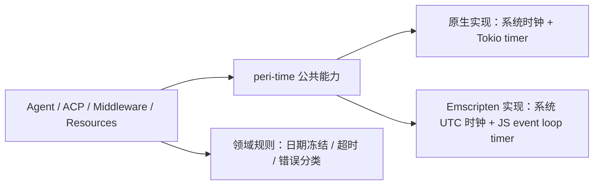

# 时间能力边界

> 状态：已批准目标设计。实现进度与验收证据见[2026-10 月志](../../spec/history/2026-10.md)（2026-10-04 条目）。
> `911859b9` 的 Emscripten JS timer 分支提供迁移基线，当前后端以本仓库的目标
> 编译与宿主测试为准。
>
> Scope：Peri 自身的时钟读取、日历解释、进程内计时和有界等待。时间值的持久化
> schema、cron 业务规则、上层 SDK 的执行所有权和各协议字段仍由所属领域定义。
> 外部库与平台能力依据见[时间平台参考](../reference/time-platform-research.md)。

## 目标与边界

Peri 通过一个底层 `peri-time` crate 消费时间能力。它提供稳定的 Rust 接口，按编译目标
选取底层实现；上层不直接选择 Tokio、Chrono 或 JS timer。这个边界服务于同一套
Agent、ACP 和 Resources 业务语义，不建立第二套 WASM 业务实现。

`peri-time` 只依赖标准库时间类型和所选平台库，不依赖 `peri-acp-types`、Agent、ACP、
Middleware、Resources 或具体业务配置。`peri-acp-types` 保留时间字段的契约类型，
不为这些字段读取当前时间、不启动 timer。既有 UUIDv7 身份构造仍由身份契约持有，
它的内部时钟属于 ID 生成语义，不用于日历、超时或租约判断。装配层决定使用何种
日历约定，业务层决定超时后属于
`Timeout`、`Conflict` 还是未确认的远端结果；底层时间模块只报告计时事实。

编译目标选择实现是当前需要的替换粒度；同一进程中运行时切换 timer 库没有用例。
测试需要控制时间时，在规则函数传入显式时间值，或在持有生命周期的装配边界注入
受控计时驱动，不为每个时间调用建立全局可变时钟。

## 三类时间语义

| 能力 | 值与用途 | 不变量 |
| --- | --- | --- |
| UTC 墙钟 | 创建、更新、事件与持久化时间戳；对外序列化为带时区的 RFC 3339 值 | 跨实例可交换；系统时钟可能跳变，不用于测量耗时或保证唯一性 |
| 日历日期 | 展示和会话 prompt 的日期；由已选时区约定从墙钟解释 | 原生部署沿用本机日历日期，Emscripten 沿用已验证的 UTC 日期；会话创建时冻结，恢复读取快照 |
| 单调时间 | 进程内耗时、deadline、sleep 与 timeout | 不序列化，不跨实例比较；到期取消等待本身不证明外部副作用未发生 |

时间戳、日期与 deadline 不互相替代。跨实例执行所有权、恢复与接管由 `peri-sdk` 管理，Peri 不维护执行租约；本机
`Instant` 不能代替跨实例协调。定时任务的计划
时间由 cron 领域解释，timer 只负责等待下一次检查，宿主冷启动后重新从持久事实计算。

## 对外能力与实现归属

公共接口使用标准库 `SystemTime`、`Instant`、`Duration` 和模块自有的 `CalendarDate`
与 `CalendarConvention`。最小能力是 `now_wall()`、`calendar_date(at, convention)`、
`format_utc_rfc3339(at)`、`monotonic_now()`、`sleep(duration)`、`timeout(duration, future)`
及基于绝对单调 deadline 的等待。原生装配选择 `HostLocal` 日历约定，Emscripten
装配选择 `Utc`；读取当前时间与解释日期是两个操作，测试可传入确定的 `SystemTime`。
`timeout` 返回明确的到期类型，不吞掉被等待 future 的错误，也不对调用方业务错误分类。
具体函数签名在实现时按现有 async `Send` 要求确定，不能让 WASM 后端削弱原本可由
Tokio task 持有的 future。

Chrono 或其他候选库只出现在 `peri-time` 实现内；需要保持既有 wire／存储形状时，
所属 adapter 做显式转换。已有公开契约中的 `chrono::DateTime` 是迁移约束，不能
仅靠替换 `now()` 入口宣称底层库已可自由切换；目标契约不再新增此类库专有类型。

日历格式化在读时先获得一个时间值，再由调用方选择用途：prompt 使用冻结日期；
插件等更新时间使用 UTC 且序列化包含时区。任意 `format_now(&str)` 不作为核心 API，
避免把机器本地时间和 UTC 时间戳藏在同一个字符串入口。已有持久字段的格式迁移须按
各字段的兼容义务单独评估，不能借时间模块替换静默改写旧值。

原生实现可继续使用 Chrono 的 UTC／Local 和 Tokio timer。Emscripten 保留已验证的
UTC 日历与 `setTimeout`／`clearTimeout` 计时实现。若选择其他支持目标平台的库，
只替换 `peri-time` 的实现及 Cargo target 依赖，不让新库类型越过公共接口。
`time` 可在目标编译与宿主测试后评估为日历实现；`web-time` 的上游支持范围明确
排除 Emscripten，不能作为当前目标的后端。
`wasm32-unknown-unknown` 与 `wasm32-unknown-emscripten` 分别判定支持情况，不能凭
笼统的“支持 WASM”替代 Emscripten 宿主验证。

有界等待必须满足：成功时返回原 future 的结果；到期时停止轮询并丢弃该 future；
调用方取消时释放 timer；timer 先到与任务先完成的竞争只产生一个结果。若同次轮询
两者都已就绪，先采纳业务 future 的结果，以保持原生 Tokio `timeout` 的既有行为；
零时长也允许已就绪的 future 完成，未就绪则到期。亚毫秒正预算向上取整到 JS
timer 毫秒，不能提前到期。超出 JS 单次 timer 上限的预算分段等待，不得截短总
预算。重复轮询和调用方取消不得留下活跃 timer。
`interval`、带偏移时区及 cron 计算只有在对应生产用例接入时才进入公共接口。

## 使用边界

- Agent、ACP、Middleware、Resources、Workflow 和面向 WASM 的 MCP 路径中，凡是
  决定生产行为的时间读取或等待，都经 `peri-time`；测试夹具里的 Tokio timeout
  可继续用作外层防挂死保护。
- 部署或协议已经提供时间值时，领域规则消费该值，不再自行读取当前时间。
  冻结 prompt、持久化历史和恢复路径沿用已有快照及协议值。
- 各层保留自己的时间预算常量、关闭顺序和失败语义；`peri-time` 不拥有远端请求、
  MCP 工具、Session Store 或宿主任务的生命周期。
- 时间模块不得访问文件系统、环境变量或网络，也不替部署选择时区。原生本机日期
  是显式部署约定，不作为持久时间戳的默认格式。

## 验证合同

时间模块的原生与 Emscripten 后端共用行为合同：完成、到期、外层取消、竞争、零
预算和长预算；确认底层 timer 被清理。原生端验证 Tokio runtime 下的行为；WASM
端沿现有 `peri-wasm` 宿主验收路径覆盖 Node、Bun 和本地 `workerd`，不把 native
单元测试代替 WASM 结果。日历合同覆盖 UTC 跨日边界、原生本机日期、Emscripten
UTC 日期和会话恢复沿用冻结值。远端写超时的测试还要证明原有“结果不确定”分类
不因更换 timer 而退化为“确定失败”。

代码入口和目标测试命令在实现落地时写入 `docs/code-index/`；实施进度、具体迁移
批次与验收证据留在 active issue，不写进本文。
