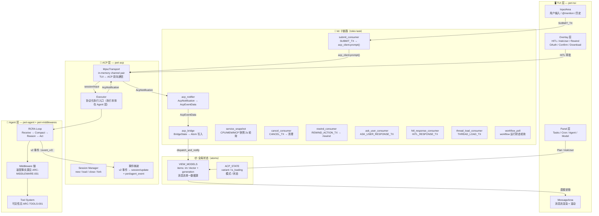
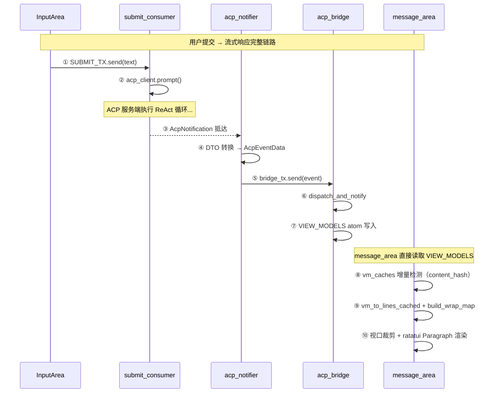
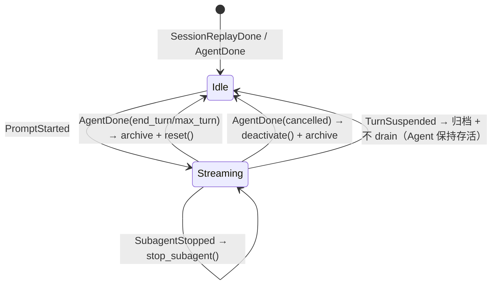
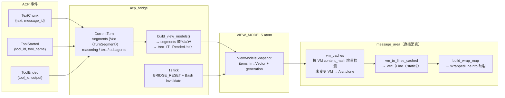
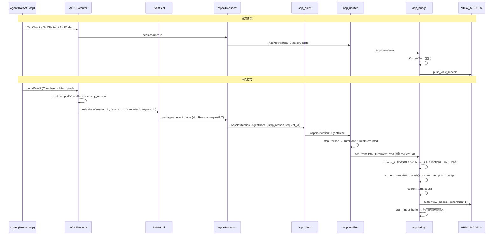
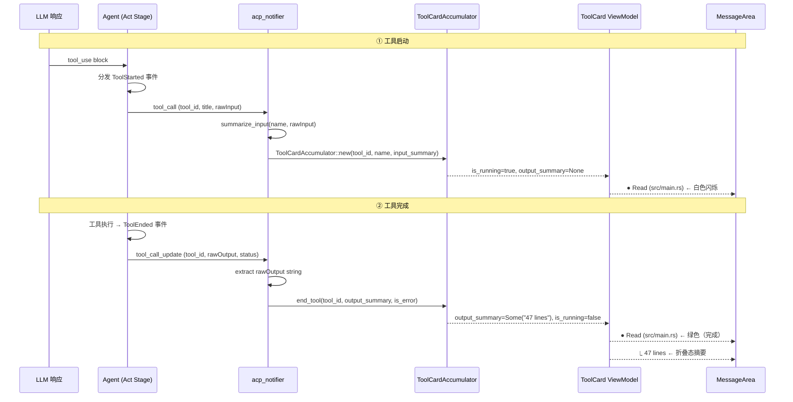
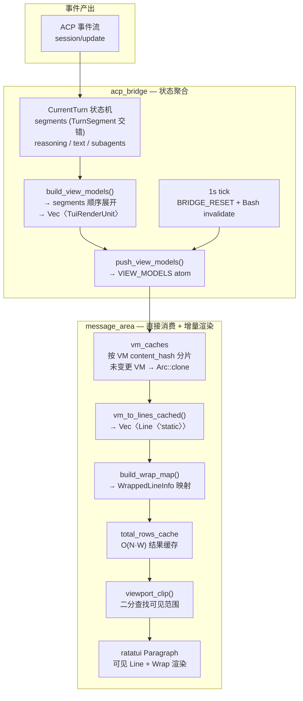
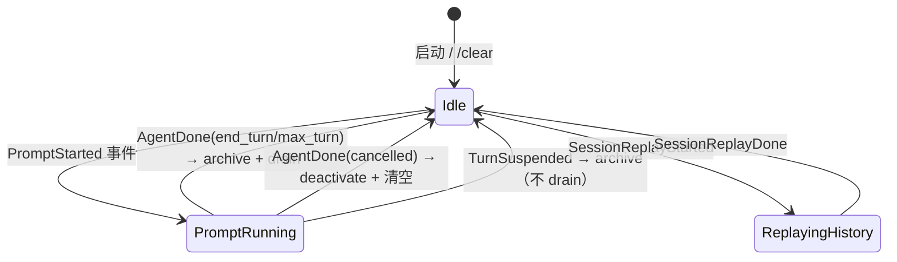

# TUI 与 ACP 数据流

> 最后核对：2026-08-07

## 概述

Peri TUI 是纯 ACP Client 前端，通过 `MpscTransport`（in-memory channel pair）与 `peri-acp` 服务层通信。TUI 不直接依赖 `peri-agent`/`peri-middlewares` 的运行时路径——所有 Agent 消息语义的转换在 ACP 层完成，TUI 只消费为屏幕渲染设计的视图结构。

核心设计目标：**Agent 运行时完全不知道 ViewModel、渲染队列等前端概念的存在；TUI 完全不知道 ReAct 循环、Middleware、Prompt 构建等后端细节。ACP 层承担协议适配与事件映射**——执行与业务归属（Controller/Runtime/Agent）见 `docs/standards/architecture-contracts.md`（ARC-BOUNDARY-001）。



---

## 1. 分层架构

| 层 | Crate | 职责 | 对外暴露 |
|----|-------|------|----------|
| **TUI** | `peri-tui` | 终端 UI 渲染、用户输入、消息展示 | 无 |
| **ACP** | `peri-acp` | 会话管理、事件路由、prompt 执行、ViewModel 映射 | `AcpNotification` / `AcpEventData` |
| **Agent** | `peri-agent` | ReAct 循环、LLM 适配、工具系统、中间件 trait | `ExecutorEvent` |
| **Middleware** | `peri-middlewares` | 20 个中间件实现（15 基础 + 5 条件：Hook/MCP/Workflow/LSP/Goal） | `BaseTool` / `Middleware` trait |

数据依赖方向：**TUI → ACP → Agent/Middleware**。反向通过 EventBus 事件通道回流。

### 1.1 屏幕概览

用户打开 peri-tui 后看到五个视觉区域（自上而下）：消息区、后台 Agent 栏、输入区、状态栏；弹窗层覆盖在消息区之上。

- **消息区** — 消息流渲染 + 滚动，直接消费 `VIEW_MODELS` atom（见 §10 渲染管道）。
- **后台 Agent 栏** — 状态栏上方，仅当有后台子 Agent 运行时出现。通过 `BG_TASKS` / `BG_DISPLAY` / `BG_AGENT_IDS` 三个 Atom 管理后台任务状态。完成后进入 3 秒倒计时缓冲，到期后渲染层移除。
- **输入区** — 固定在屏幕底部。多行文本输入框（自管 EditorState），上方有附件预览栏（粘贴图片时出现），@ 和 / 补全弹窗浮在输入框上方。Agent 完成后的输入预测以灰色占位符显示。
- **状态栏** — 屏幕最底部，双行高度。Row1：权限模式 → cwd basename → provider/model → bg tasks。CPU%/MEM/上下文使用率显示在输入区 composer footer 右侧资源线（`input_area.rs` `footer_right`）。Row2：快捷键 hints + 瞬时状态提示。
- **弹窗层** — 面板或交互弹窗激活时覆盖消息区。面板半屏显示，消息区仍可滚动；交互弹窗居中显示，独占键盘输入。

### 1.2 模块边界（Crate 依赖）

自上而下，不反向：

- **peri-tui** — Atom 响应式组件 + async consumer 任务 + ratatui-kit 渲染。类型依赖包括 `peri-acp` / `peri-acp-types`（DTO）、`ratatui-kit`（组件库）+ `peri-theme`（主题）；`peri-middlewares` / `peri-resources` 为 3.0 批 3 豁免清单中的宿主装配点（launch.rs / main.rs / cli_print.rs 构造用），属直接依赖。运行时通过 MpscTransport（进程内内存通道）与 peri-acp 通信。代码禁止 `use peri_agent::`（引用数为 0）——pre-commit 钩子阻断。TuiRenderUnit 定义在 `peri-tui/src/kit/tui_render_unit.rs`，是 TUI 内部类型。
- **peri-acp** — 会话管理 + 事件路由器 + 配置快照。依赖 `peri-acp-types`、`peri-agent`、`peri-middlewares`。系统唯一的"全知"层。事件路由器将 ExecutorEvent 转换为 AcpNotification，TUI 侧 kit notifier 解码并写入 Atom。
- **peri-agent** — Session → ReAct 循环 → 事件产出。不依赖 `peri-acp-types`。Agent 运行时完全不知道 ViewModel 等前端概念的存在。
- **peri-acp-types** — DTO 定义层（实际依赖不止 serde，含 peri-model、tokio、chrono 等）。包含各事件对应的 data 结构体定义、各类摘要结构。不包含 ViewModel/TuiRenderUnit 类型（该类型定义在 peri-tui 内部）。不包含命令枚举——事件名是字符串，不需要类型化。TUI 和 ACP 的共同数据结构基础。

---

## 2. kit 十链路 — TUI 核心数据管道

TUI 通过 10 个独立 tokio task 组成完整数据管道，在 `run_kit_fullscreen` 中一并 spawn（另有 2 个心跳任务：5s 渲染心跳 + 100ms spinner tick）：

| # | 链路 | 输入 → 输出 | 职责 |
|---|------|------------|------|
| 1 | **acp_notifier** | `AcpNotification` → `AcpEventData` | ACP 协议消息 → kit 内部事件 |
| 2 | **acp_bridge** | `AcpEventData` → Atom 写入 | 事件分发 + BridgeState 状态维护 + 1s tick（BRIDGE_RESET 检测 + running Bash 计时） |
| 3 | **submit_consumer** | `SUBMIT_TX` → `acp_client.prompt()` | 用户输入 → ACP prompt 请求 |
| 4 | **service_snapshot** | 2s tick → 快照 atoms | CPU/MEM/MCP/Cron 状态轮询 |
| 5 | **cancel_consumer** | `CANCEL_TX` → 清理 + `BRIDGE_RESET_COUNTER` 递增 | Ctrl+C 中断时重置桥接状态 |
| 6 | **rewind_consumer** | `REWIND_ACTION_TX` → `/rewind` RPC | Rewind 确认回传 ACP 服务端 |
| 7 | **ask_user_consumer** | `ASK_USER_RESPONSE_TX` → AskUser 回答 RPC | AskUser 表单提交回传 |
| 8 | **hitl_response_consumer** | `HITL_RESPONSE_TX` → HITL 审批 RPC | HITL approve/reject 回传 |
| 9 | **thread_load_consumer** | `THREAD_LOAD_TX` → `acp_client.load_session()` | ThreadBrowser 切线程加载 |
| 10 | **workflow_poll** | 定期轮询 → workflow 快照 | Workflow 运行状态刷新（workflow_snapshot） |



---

## 3. 全局状态 — Atoms 数据模型

TUI 内跨 task 的响应式状态由 `ratatui-kit` 的 `AtomStatic<T>` / `AtomState<T>` 管理；组件通过 hook 订阅，异步 consumer 在明确事件边界写入。

```rust
// 消息流单一数据源
pub static VIEW_MODELS: AtomStatic<ViewModelsSnapshot>;

// UI 状态快照
pub static ACP_STATE: AtomStatic<AcpStateSnapshot>;

// 上下文使用率（供 StatusBar 显示）
pub static CONTEXT_USAGE: AtomStatic<Option<(f64, u64)>>;

// 瞬时通知（PluginActionResult / BgTaskCompleted 等，1.5-3s 自动消失）
pub static NOTIFICATION: AtomStatic<Option<Notification>>;
```

### 3.1 ViewModelsSnapshot — 消息流核心结构

```rust
/// 消息流单一数据源。message_area 直接从此读取 → vm_caches 增量渲染。
pub struct ViewModelsSnapshot {
    /// 全部消息的单一容器。使用 im::Vector —— O(1) clone，O(log n) push_back。
    pub items: im::Vector<TuiRenderUnit>,
    /// 递增版本号。每次 push_view_models 写入 +1，message_area 据此检测变更。
    pub generation: u64,
}
```

> **当前模型**：`BridgeState` 仍保留 `committed: im::Vector<TuiRenderUnit>` 与 `current_turn: CurrentTurn` 的分层；07-08 重构将旧 `Arc<[TuiRenderUnit]>` 容器替换为 `im::Vector + CurrentTurn`，并未删除分层。`TurnDone` 将 `current_turn` 归档到 `committed`。

### 3.2 TuiRenderUnit — 渲染单元枚举

```rust
/// 区分联合渲染单元 —— 消息区仅消费此类型。
pub enum TuiRenderUnit {
    TuiUserBubble(TuiUserBubble),          // 用户消息气泡（❯ 前缀）
    TuiAssistantBubble(TuiAssistantBubble), // AI 回复（markdown + reasoning）
    TuiToolCard(TuiToolCard),              // 工具调用卡片（● 状态指示器）
    TuiSystemNote(TuiSystemNote),          // 系统通知（✻ 前缀）
    TuiSubAgentGroup(TuiSubAgentGroup),    // SubAgent 组（❯ Agent(name)）
    TuiCollapsedGroup(TuiCollapsedGroup),  // 折叠组（N tool calls collapsed）
    TuiDivider(TuiDivider),               // 回合分隔线（── Turn N ──）
    TuiAskUserBlock(TuiAskUserBlock),      // AskUser 问答块
}
```

### 3.3 BridgeState — ACP 事件桥接内部状态

```rust
/// acp_bridge 维护的内部状态，每个 ACP 事件到达时同步更新。
/// 是 VIEW_MODELS 的**唯一事实源**。
pub struct BridgeState {
    /// 0=Idle, 1=Streaming, 2=Modal（渲染变体指示，不同于 phase）
    pub variant: u8,
    /// 全部消息（im::Vector: O(1) clone, O(log n) push_back）
    pub committed: im::Vector<TuiRenderUnit>,
    pub current_turn: CurrentTurn,
    pub phase: SessionPhase,       // Idle / PromptRunning / ReplayingHistory
    /// 递增版本号，每次 push_view_models +1。
    pub generation: u64,
    pub popup_kind: Option<PopupKind>,
    pub active_session_id: String,
    /// `/compact` 命令刚刚完成，TurnDone 时需触发 session/load 重放。
    pub compact_just_completed: bool,
    /// 本轮用户提交的文本——TurnInterrupted 零产出回滚时用于恢复输入框。
    pub last_submitted_text: Option<String>,
    // —— 2026-08-05 后新增（Issue 2026-08-05 stale turn 防护 + streaming_mode=block）——
    /// streaming_mode=block 时追踪上次推送后主 agent 文本/推理字符数，
    /// 作为 `has_md_block_boundary_since` 的比较基点。
    pub last_pushed_text_len: usize,
    pub last_pushed_reasoning_len: usize,
    /// turn 代际计数器——每次用户可见提交（LocalUserBubble）递增。
    /// 识别 stale turn 结束事件（Issue 2026-08-05）：新提交后旧 turn 的
    /// TurnInterrupted 晚到时不删新气泡/不恢复旧文本/不清排队输入。
    pub turn_generation: u64,
    /// 最后一次已真正发出 prompt RPC（PromptSubmitted）时的代际快照。
    /// `turn_generation > last_prompt_generation` = 存在"已显示气泡但未发请求"
    /// 的更新提交——此时到达的 TurnInterrupted 属于旧 turn（stale）。
    pub last_prompt_generation: u64,
    /// 当前 turn 的 prompt requestId（submit_consumer 生成 uuid::now_v7，
    /// 服务器经 turn 结束事件回带）。TurnInterrupted 携带 request_id 且与
    /// 当前值不匹配 → stale（request_id 配对判定，与代际判定 OR 组合）。
    pub current_request_id: Option<String>,
    // TodoWrite 变更集字段（last_successful_todos / next_todo_sequence /
    // todo_call_inputs）用于工具卡片增量，细节见代码。
}
```

**铁律**：`push_view_models` 是唯一写 `VIEW_MODELS` atom 的函数。UserBubble 提交通过 `LOCAL_EVENT_TX` channel → `LocalUserBubble` 事件 → bridge 统一处理追加到 `committed`——不再有 `append_local_user_bubble` 旁路。

---

## 4. 事件通道 — ACP 协议映射

### 4.1 事件层次

```
Agent 层 v2 事件    ACP 事件映射/协议化                    TUI 层消费
────────────────    ────────────────────                    ──────────
event_v2         →  `session/update`                    →  AcpNotification → AcpEventData
                 →  `peri/agent_event`                  →  AcpNotification → AcpEventData
                 →  标准交互请求（HITL / Elicitation）   →  对应面板或审批状态
```

事件完整链路、能力门控与终止事件约束以 `docs/standards/architecture-contracts.md` 的 ARC-EVENT-001 为事实源。

### 4.2 session/update 流式事件 — 标准 ACP 通道

| ACP Tag | 方向 | TUI 事件 | 包含字段 |
|---------|------|----------|----------|
| `agent_message_chunk` | ACP → TUI | `TextChunk` | `text`, `messageId`, `agent_id?` |
| `agent_thought_chunk` | ACP → TUI | `ReasoningChunk` | `text`, `messageId`, `agent_id?` |
| `tool_call` | ACP → TUI | `ToolStarted` | `tool_id`, `title`(tool_name), `rawInput` |
| `tool_call_update` | ACP → TUI | `ToolEnded` | `tool_id`, `rawOutput`, `status` |
| `plan` | ACP → TUI | `handle_plan_update` | `entries[{content, status}]` |
| `usage_update` | ACP → TUI | 写入 `SPINNER_TOKEN_COUNT`；cache hit rate < 80% 时推送 `SystemNotification` 到消息流 | `inputTokens`, `outputTokens`, `cacheReadTokens` |
| `user_message_chunk` | ACP → TUI | `ReplayUserBubble` | `text` (session replay) |
| `session/input` | TUI → ACP | `acp_client.prompt()` | `MessageContent` |

**StateSnapshotMeta**（`peri/agent_event` → `AcpNotification::AgentEvent`）：写入 `CONTEXT_USAGE` atom（`budget_pct` + `total_tokens`），供 StatusBarRow1 显示上下文使用率。不产生 AcpEventData。

**Agent Event Extensions**（`peri/agent_event` → `convert_agent_event`）：以下 7 个 AcpEvent 变体通过 `AcpNotification::AgentEvent` 路由，由 `convert_agent_event` 转换为 AcpEventData：

| AcpEvent 变体 | → AcpEventData | TUI 行为 |
|---------------|----------------|----------|
| `TurnCommitted` | `TurnCommitted` | push_view_models（goal 自驱刷新检查点） |
| `CompactStarted` | `CompactStarted` | 设 PromptRunning |
| `CompactCompleted` | `CompactCompleted` | 注入 SystemNote（仅全量压缩） |
| `CompactError` | `CompactError` | 注入 SystemNote |
| `BackgroundTaskCompleted` | `BackgroundTaskCompleted` | 日志 |
| `AgentExecutionFailed` | `AgentExecutionFailed` | 注入 SystemNote(Error) |
| `WorkflowProgress` | `WorkflowProgress` | 日志 |

### 4.3 交互请求事件 — 标准 ACP 通道（TUI 消费）

> 注：交互类事件走标准 ACP 通道。AskUser 走 `Elicitation`，HITL 走 `AcpNotification::RequestPermission`；rewind 使用 `peri/agent_event` 加 `session/rewind*` RPC。`ContextWarning` 当前没有用户可见的 `budget-warning` 生产路径。

| 事件名 | 方向 | 通道 | TUI Atom / 弹窗 |
|--------|------|------|----------|
| `ask-user` | ACP → TUI | ACP `Elicitation` | `ASK_USER_PENDING` + `PanelKind::AskUser` 面板（非弹窗） |
| `rewind-preview` | ACP → TUI | `peri/agent_event` + `session/rewind*` RPC | `REWIND_PREVIEW` |
| `oauth-needed` | ACP → TUI | ACP 通知 | `OAUTH_INFO` |
| `budget-warning` | — | 当前无用户可见生产路径 | — |
| `hitl-pending` | ACP → TUI | `AcpNotification::RequestPermission` → `HitlPending` | `HITL_PENDING` + `HITL_REQUEST_ID` |
| `confirm` | TUI 内部 | AskUser Panel 二次确认 / ThreadBrowser 切线程 | `CONFIRM_PAYLOAD`（第 7 个 popup，PopupKind 共 7 种：Hitl/AskUser/Rewind/OAuth/Confirm/Download/ModelQuickSwitch） |

### 4.4 Background Tasks 事件

后台 agent/cron/workflow 任务通过 4 个 `BgTask*` 变体管理，写入 `BG_TASKS`、`BG_DISPLAY`、`BG_AGENT_IDS` atoms：

| AcpEventData 变体 | TUI 行为 |
|-------------------|----------|
| `BgTaskStarted(task)` | 追加到 `BG_TASKS` + 创建 `BG_DISPLAY` 条目 |
| `BgTaskCompleted { task_id, success, duration_ms }` | 从 `BG_TASKS` 移除 + 标记 `BG_DISPLAY` 完成（3s 倒计时） + `NOTIFICATION` 通知 |
| `BgTaskCancelled { task_id, reason }` | 从 `BG_TASKS` 移除 + 标记 `BG_DISPLAY` 失败 |
| `BgTaskSnapshot(tasks)` | 全量替换 `BG_TASKS` + 重建 `BG_DISPLAY` |

### 4.5 Agent Event Extensions 事件

通过 `AcpNotification::AgentEvent` → `convert_agent_event` 路由的低频事件。见上方 §4.2 表格。

### 4.6 Plugin 事件

插件系统通过 3 个变体与 TUI 交互：

| AcpEventData 变体 | TUI Atom |
|-------------------|----------|
| `PluginSnapshot(snapshot)` | `PLUGIN_LIST`（全量替换） |
| `PluginActionResult(result)` | `NOTIFICATION`（3s 消失）+ `RENDER_HEARTBEAT`（触发 PluginPanel 重渲染） |
| `PluginSearchResult(result)` | `PLUGIN_SEARCH_RESULTS`（全量替换） |

### 4.7 其他特殊事件

| AcpEventData 变体 | 说明 |
|-------------------|------|
| `BgCallbackBubble { text }` | bg agent 完成回调：先 flush current_turn → committed，等待后续 `LocalUserBubble` 推送用户气泡 |
| `CommittedAssistantText` | 直接 push 到 committed（compact replay 场景） |
| `ReplayToolStarted` / `ReplayToolEnded` | 直接 push / 更新 committed 中的工具卡片（历史回放场景） |
| `RewindCompleted { messages_json }` | Rewind 完成：反序列化 messages_json 替换 state.committed |
| `StateSnapshotMeta` | `peri/agent_event` → 写入 `CONTEXT_USAGE` atom（budget_pct + total_tokens），不产生 AcpEventData |

---

## 5. 流式数据处理 — CurrentTurn 状态机

### 5.1 事件 → CurrentTurn 状态变更



> 注："Streaming" 是 `BridgeState.variant == 1` 渲染指示，非 `SessionPhase` 枚举变体。`SessionPhase` 仅三种：Idle / PromptRunning / ReplayingHistory。AgentDone 两条路径 + TurnSuspended 第三条路径都回到 Idle：正常结束先 `reset()` 再归档；中断先 `deactivate()` 保留已归档；TurnSuspended 归档但不 `drain_input_buffer`（Agent 保持 await_wake 存活）。

### 5.2 CurrentTurn → ViewModels 构建

每次流式事件到达后，`build_view_models` 重建当前回合的 ViewModel 列表：

```
TurnSegment 枚举（三种变体，按到达顺序排列）:
  AssistantText { text_end_byte, reasoning_end_byte }  → TuiAssistantBubble  (含独立 reasoning 切片)
  Tool { tool_idx }                                     → TuiToolCard         (名称 + 状态 + 摘要)
  SubAgent { subagent_idx }                             → TuiSubAgentGroup     (子 agent 内容)

CurrentTurn.segments → 按到达顺序展开:
  AssistantText(0..1, 0..12)  → ① TuiAssistantBubble { text:"1", reasoning:"让我思考..." }
  Tool(0)                     → ② TuiToolCard { name:"Read", ... }
  AssistantText(1..2, 12..12) → ③ TuiAssistantBubble { text:"2", reasoning:None }
  Tool(1)                     → ④ TuiToolCard { name:"Bash", ... }
尾段（segments 之后剩余内容）  → ⑤ TuiAssistantBubble { text:"3", reasoning:"继续想..." }
```

**消息边界判断**：`AssistantText` 段的边界由两个时机共同触发：
1. **message_id 变化**：ACP `agent_message_chunk` 携带 `messageId`，Agent 层每轮 ReAct 迭代创建新的 `BaseMessage`（唯一 `message_id`）。`CurrentTurn` 跟踪 `last_message_id`，`append_text()` / `append_reasoning()` 检测到变化时调用 `flush_text_segment()`。
2. **Tool / SubAgent 开始**：`start_tool()` 和 `start_subagent()` 在推入工具/子 Agent 段之前，先调用 `flush_text_segment()` 刷出当前累积的文本和推理。

`flush_text_segment()` 同时记录文本字节偏移（`last_text_flush`）和推理字节偏移（`last_reasoning_flush`），两者都增长时才推入新的 `AssistantText` 段。这确保每段气泡得到属于自己的推理切片——不再是将全量 `self.reasoning` 塞入首条。

```
append_text("1", message_id="msg_A")  → text="1", last_id="msg_A"
start_tool(Read)                      → flush: AssistantText{text_end:1, reason_end:0} → Tool{0}
append_reasoning("...", msg_B)        → reasoning="...", last_id 变为 "msg_B" → flush
append_text("2", message_id="msg_B")  → text="12", last_id 不变 → 不 flush
start_tool(Bash)                      → flush: AssistantText{text_end:2, reason_end:X} → Tool{1}
```

> **2026-07-08 重构（三阶段）**：
> (1) 旧版 `text: String` + `tool_cards: Vec<ToolCardAccumulator>` → 单一气泡 + 全部工具 → 交错丢失
> (2) `TurnSegment` 枚举 + `flush_text_segment()` → text 按边界分离，但 reasoning 仍全量塞入首段
> (3) `AssistantText` 段增加 `reasoning_end_byte` → 每段气泡取自身推理切片，工具/消息边界后的 reasoning 归入对应气泡
> **动机**：ACP 协议自带消息标识，变体推断是冗余的启发式。

### 5.2.1 视图派生与增量 VM 缓存（sync_cache）

`CurrentTurn::view_models()` 是统一 VM 入口（`&mut self`）：`cache_dirty` 时调用 `sync_cache()` 增量修补缓存，然后返回 `cached_view_models`。`sync_cache()` 从内部 segments / text / reasoning / tool_cards / subagents 对齐 `im::Vector<TuiRenderUnit>`：

1. **遍历 segments**：按时序产生 `TuiAssistantBubble`（文本）、`TuiToolCard`（工具）、`TuiSubAgentGroup`（SubAgent）；冻结的 AssistantText 段只构建一次，未变化的元素直接复用缓存
2. **Trailing 补丁**：segments 之后的残余文本/推理生成最终气泡（长度比对做 O(1) 变化检测）
3. **后处理**：Agent 工具卡片的 `tool_calls_count` 与紧随的 SubAgent 组配对；顶层 turn 额外做折叠归一化（仅最后一个 reasoning 展开，与 push_view_models 折叠 pass 稳态一致）

缓存语义为**增量修补**而非清除式重建：流式变更在 mutation 时 eager sync（不置 dirty），每 token 成本 O(变化量 + 段数扫描)；`invalidate_cache()`（如 acp_bridge 1s tick 刷新工具时长）置位后在下次调用时重同步。`im::Vector` 持久结构使 `cached_view_models` 可 O(1) 克隆共享（SubAgent 组、push_view_models 快照）。

### 5.3 流式增量渲染



---

### 5.4 完整端到端样例：用户输入 → ACP JSON → 数据结构 → TUI 渲染

以下跟踪用户提交 `"请你说 1，read 两个文件，说 2"` 后，LLM 输出 `"1" → Read(a.txt) → "2"` 的完整链路。

```mermaid
sequenceDiagram
    participant USER as 👤 用户
    participant ACP as 🌉 ACP Server<br/>(peri-acp)
    participant NOTIF as acp_notifier<br/>(JSON → AcpEventData)
    participant BRIDGE as acp_bridge<br/>(dispatch_and_notify)
    participant CT as CurrentTurn<br/>(segments 状态机)
    participant ATOM as VIEW_MODELS atom<br/>(im::Vector〈TuiRenderUnit〉)
    participant MSG as message_area<br/>(直接消费 VIEW_MODELS)

    Note over USER,MSG: ─── 场景：用户说"请你说 1，read 文件，说 2" ───

    USER->>ACP: submit("请你说 1，read 两个文件，说 2")
    ACP-->>NOTIF: session/update<br/>user_message_chunk

    rect rgb(20, 30, 40)
        Note over NOTIF,ATOM: Step ① 用户气泡回显
        NOTIF->>BRIDGE: LocalUserBubble<br/>{text: "请你说 1...说 2"}
        BRIDGE->>BRIDGE: committed.push_back(TuiUserBubble)
        BRIDGE->>ATOM: push_view_models()
        ATOM->>ATOM: items: [TuiUserBubble("请你说 1...")]
    end

    rect rgb(20, 50, 30)
        Note over NOTIF,ATOM: Step ② LLM 思考（Reasoning）
        ACP-->>NOTIF: agent_thought_chunk<br/>{text: "用户要求我说 1..."}
        NOTIF->>BRIDGE: ReasoningChunk<br/>{text: "用户要求我说 1..."}
        BRIDGE->>CT: append_reasoning("用户要求我说 1...")
        CT->>CT: reasoning = "用户要求我说 1..."
    end

    rect rgb(30, 30, 60)
        Note over NOTIF,ATOM: Step ③ LLM 输出文本 "1"（messageId: msg_A）
        ACP-->>NOTIF: agent_message_chunk<br/>{messageId: "msg_A", text: "1"}
        NOTIF->>BRIDGE: TextChunk<br/>{text: "1", message_id: "msg_A"}
        BRIDGE->>CT: append_text("1", message_id="msg_A")
        CT->>CT: segments: [Text("1")]
        CT->>CT: build_view_models()
        CT->>BRIDGE: [TuiAssistantBubble{text:"1", reasoning:"用户要求我说 1..."}]
        BRIDGE->>ATOM: push_view_models()
        ATOM->>ATOM: items: [UserBubble, AssistantBubble("1")]
    end

    rect rgb(50, 40, 20)
        Note over NOTIF,ATOM: Step ④ 工具调用 Read(a.txt)
        ACP-->>NOTIF: tool_call<br/>{toolCallId: "tc-001", title: "Read", rawInput: {...}}
        NOTIF->>BRIDGE: ToolStarted<br/>{tool_id: "tc-001", name: "Read", summary: "a.txt"}
        BRIDGE->>CT: start_tool(ToolCard{id: "tc-001", name: "Read"})
        CT->>CT: segments: [Text("1"), Tool(Read, running)]
        CT->>BRIDGE: [AssistantBubble("1"), ToolCard(Read, ⬤)]
        BRIDGE->>ATOM: push_view_models()
    end

    rect rgb(50, 40, 20)
        Note over NOTIF,ATOM: Step ⑤ 工具结果
        ACP-->>NOTIF: tool_call_update<br/>{toolCallId: "tc-001", status: "completed"}
        NOTIF->>BRIDGE: ToolEnded<br/>{tool_id: "tc-001", output: "10 lines", error: false}
        BRIDGE->>CT: end_tool("tc-001", "10 lines", false)
        CT->>CT: segments: [Text("1"), Tool(Read, "10 lines"✓)]
        CT->>BRIDGE: [AssistantBubble("1"), ToolCard(Read, ✓)]
        BRIDGE->>ATOM: push_view_models()
    end

    rect rgb(60, 30, 30)
        Note over NOTIF,ATOM: Step ⑥ LLM 输出文本 "2"（messageId: msg_B ≠ msg_A）
        ACP-->>NOTIF: agent_message_chunk<br/>{messageId: "msg_B", text: "2"}
        NOTIF->>BRIDGE: TextChunk<br/>{text: "2", message_id: "msg_B"}
        BRIDGE->>CT: append_text("2", message_id="msg_B")
        CT->>CT: segments: [Text("1"), Tool(Read), Text("2")]
        CT->>CT: ▼ message_id 变化 → 新建独立 Text 段
        CT->>BRIDGE: [AssistantBubble("1"), ToolCard(Read), AssistantBubble("2")]
        BRIDGE->>ATOM: push_view_models()
    end

    Note over ATOM,MSG: ─── message_area 直接消费 VIEW_MODELS ───

    MSG->>ATOM: 读取 VIEW_MODELS.items<br/>[UserBubble, AsstBubble("1"), ToolCard, AsstBubble("2")]
    MSG->>MSG: vm_caches 按 content_hash 增量检测
    MSG->>MSG: vm_to_lines_cached() → Vec<Line>
    MSG->>MSG: build_wrap_map() + 视口裁剪
    MSG->>MSG: ratatui Paragraph 渲染

    Note over MSG: ╔══════════════════════════════╗<br/>║ ❯ 请你说 1，read 两个文件，说 2<br/>║ Thought for 12 chars<br/>║ 1<br/>║<br/>║ ● Read (a.txt)<br/>║   ⎿ 10 lines<br/>║<br/>║ 2<br/>╚══════════════════════════════╝

    rect rgb(60, 60, 60)
        Note over ACP,BRIDGE: Step ⑦ 回合结束归档
        ACP-->>NOTIF: AgentDone {stop_reason: "end_turn"}
        NOTIF->>BRIDGE: TurnDone
        BRIDGE->>CT: current_turn.view_models()
        CT->>BRIDGE: [AssistantBubble("1"), ToolCard(Read), AssistantBubble("2")]
        BRIDGE->>BRIDGE: committed.push_back() × 3
        BRIDGE->>BRIDGE: committed = [UserBubble, AsstBub("1"),<br/>ToolCard(Read), AsstBub("2")]
        BRIDGE->>CT: current_turn.reset() → segments 清空
        BRIDGE->>ATOM: push_view_models()
    end
```



> **边界判断**：Agent 层每轮 ReAct 迭代创建独立的 `BaseMessage`（唯一 `message_id`），
> ACP `agent_message_chunk` 携带此 `messageId`。TUI 端 `CurrentTurn` 通过 `message_id` 变化
> 识别消息边界——`message_id` 相同则追加到当前段，不同则新建 `Text` 段。
> 不再依赖 ContentSegment 变体推断（枚举已退役）。

---

## 6. 回合结束 — AgentDone 生命周期

Agent 完成 ReAct 循环后，Executor 调用 `EventSink.push_done(stop_reason, request_id)`。PushDone 通过 transport 发 `peri/agent_event_done`（payload 含可选 `requestId`），TUI `acp_client` 映射为 `AcpNotification::AgentDone { stop_reason, request_id }`。`acp_notifier` 根据 `stop_reason` 转换为 TUI 内部事件：

- `stop_reason = "end_turn"` → `AcpEventData::TurnDone`（正常结束，归档消息）
- `stop_reason = "cancelled"` → `AcpEventData::TurnInterrupted { reason, request_id }`（中断，清空未完成消息）
- `stop_reason = "max_turn_requests"` → 同 `TurnDone`

`requestId` 链路（Issue 2026-08-05）：`submit_consumer` 在每次 prompt RPC（含 keepgoing）前生成 `uuid::now_v7()`，经 `session/prompt` params 与 `PromptSubmitted` 事件携带；服务器注入 `SessionContext.request_id`，turn 结束时随 `peri/agent_event_done` 回带；bridge 的 `handle_turn_interrupted` 以 `request_id 配对 OR turn_generation 代际判定` 识别 stale 事件（新提交已发 RPC 后旧 turn 的取消事件晚到时丢弃，不删新气泡/不恢复文本/不清排队输入）。缺失 requestId 的路径（continuation / Immediate 命令 / stdio）回退代际判定。

此外，Agent turn 可能被挂起（idle/await_wake），此时发送 `AcpEventData::TurnSuspended`：归档 current_turn → committed，停止 loading，但**不** `drain_input_buffer`（Agent 保持存活，等待后续唤醒继续）。

> **历史**：旧版通过 `peri/unstable-event` 通道发送自定义 `turn-done` / `turn-interrupted` 事件，已于 2026-07-08 废弃，统一改为 ACP 标准 `StopReason` 通道。



> 注：UserBubble 不再由 TurnDone 搬运。loading 中提交的输入通过 `LOCAL_EVENT_TX` → `LocalUserBubble` 事件在提交瞬间追加到 committed，TurnDone 只负责归档 current_turn 的 assistant VM 和 drain 剩余缓存。

### 6.1 committed 数据结构

TurnDone 后将 current_turn 的 VM 逐条 `push_back` 到 `BridgeState.committed`（`im::Vector`），计算新的 `generation` 写入 atom。UserBubble 已由 `LocalUserBubble` 事件提前加入，无需 TurnDone 重复构造。

### 6.2 StopReason 映射

| LoopResult | PromptStopReason | stop_reason 字符串 | TUI 事件 | 行为 |
|------------|-----------------|--------------------|-----------|------|
| Completed | EndTurn | `"end_turn"` | `TurnDone` | 归档 current_turn → committed |
| Interrupted | Cancelled | `"cancelled"` | `TurnInterrupted { reason }` | 若 current_turn 为空（零产出）→ 撤销用户气泡 + 恢复输入框文本；若有内容 → deactivate + 归档 |
| Suspended | — | — | `TurnSuspended` | 归档 current_turn → committed，不 drain_input_buffer（Agent 保持 await_wake 存活） |
| MaxTurnRequests | MaxTurnRequests | `"max_turn_requests"` | `TurnDone` | 归档，上限保护 |

### 6.3 INPUT_BUFFER 缓存机制

用户在 Agent loading 期间按 Enter 提交的输入不会立即发送，而是推入 `INPUT_BUFFER` 队列（上限 32，FIFO）。AgentDone 后 `drain_input_buffer()` 顺序重新提交，确保用户在 Agent 处理期间可以连续输入而不阻塞。

---

## 7. 工具调用 — ToolCard 生命周期



### 7.1 工具参数摘要 — summarize_input

| 工具 | 提取字段 | 示例输出 |
|------|----------|----------|
| Read / Write / Edit | `file_path` | `src/main.rs` |
| Bash | `command`（截断 400） | `cargo build --release` |
| Glob / Grep | `pattern`（截断 200，带引号） | `pattern: "async fn"` |
| WebSearch | `query`（截断 60，带引号） | `query: "rust async best"` |
| WebFetch | `url`（不截断） | `https://docs.rs/tokio/...` |
| TodoWrite | 无 | (空，仅显示工具名) |
| folder_operations | `operation` + `folder_path` | `list /tmp/workdir` |
| AgentResult | `task_id`（截断 12） | `task_a1b2c3` |
| ExecuteExtraTool | `tool_name`（截断 40） | `mcp__github` |
| artifact | `file_path` | `index.html` |

### 7.2 折叠/展开规则

| 类型 | 默认状态 | 何时展开 |
|------|---------|----------|
| Read / Glob / Grep / Bash / AskUserQuestion | **折叠** | 用户按 Enter |
| Write / Edit | 运行中折叠，**完成后展开** | 自动 |
| AgentResult / ExecuteExtraTool / SearchExtraTools | **展开** | 自动 |
| TodoWrite | **展开** | 始终 |
| 任何 `is_error=true` | **展开** | 强制（错误必须可见） |

### 7.3 工具显示名映射

| 内部名 | 显示名 | 说明 |
|--------|--------|------|
| Bash | Shell | 终端语境 |
| folder_operations | Folder | 简化 |
| 其他 | 原样 | 如 Read / Write / WebSearch / TodoWrite ... |

---

## 8. SubAgent — 嵌套渲染

### 8.1 SubAgent 事件路由

SubAgent 产出的事件携带 `agent_id` 字段，TUI 据此路由到对应的 `TuiSubAgentGroup` 内渲染——不合并到父 Agent 的输出流中：

```
SubagentStarted(agent_id, agent_name) → CurrentTurn.subagents.push(SubAgentAccumulator)
TextChunk(text, agent_id)             → subagent.append_text(text)
ToolStarted(tool_id, name, agent_id)  → subagent.start_tool(tool)
ToolEnded(tool_id, output, agent_id)  → subagent.end_tool(tool)
SubagentStopped(agent_id)             → subagent.is_running = false
```

### 8.2 SubAgent 渲染结构

```
❯ Agent(sub-search) 搜索 rust 异步模式… ⏳ 2 步
    ● Read (src/search.rs)
      ⎿ pub fn search(query: &str) → Vec<Result> { ... }
      ⎿ … 23 more lines
    ● Grep (pattern: "async fn")
      ⎿ src/search.rs:12
      ⎿ src/search.rs:45
    ⎿ 搜索完成：在 3 个文件中找到 12 个异步函数
```

- 嵌套 ToolCard 最多保留**最后 5 个**
- 跳过内部 `AssistantBubble`
- 子消息缩进 **2 空格**
- `TuiSubAgentGroup.children` 使用 `im::Vector<TuiRenderUnit>`，增量 `push_back`
- 完成后显示 `final_result` 摘要（前 3 行，每行 80 字符）

---

## 9. ToolCard 渲染规范

### 9.1 状态指示器

| 状态 | 图标 | 颜色 | 触发条件 |
|------|------|------|----------|
| 运行中 | `●`（800ms 闪烁） | 白色 | `is_running=true`, `is_error=false` |
| 完成 | `●` | 绿色 | `is_running=false`, `is_error=false` |
| 失败 | `●` | 红色 | `is_error=true` |

### 9.2 输出行格式

```
● ToolName (参数一行摘要)        ← 头行（BOLD 工具名，dim 参数）
  ⎿ 输出行 1                     ← 前缀 2 空格 + ⎿
  ⎿ 输出行 2
  ⎿ … N more lines              ← 超出截断提示
```

- 正常完成：输出行 `muted` 色
- 执行失败：输出行 `error` 色
- 输出最多展示 **4 行**，每行截断 **400 字符**

### 9.3 Diff 变更统计（Write / Edit 专属）

```
● Write (src/new_module.rs)
  ⎿ 12 lines changed
  ⎿ +12 · -3
```

`diff_change_summary` 从 diff hunk 统计 +/- 行数。逐行 diff 内容已移除（2026-07-06 决策）。

---

## 10. 渲染管道 — ViewModel → 屏幕像素



### 10.1 增量渲染策略

`message_area` 的 `vm_caches` 通过两层检测避免全量重建：

1. **content_hash 增量检测**：每个 VM 持有 `content_hash`（覆盖 text/reasoning.collapsed/tool duration 等可变字段），`vm_caches` 按 VM 粒度分片——仅 `content_hash` 变化的 VM 重新解析 markdown + 重建 wrap_map，未变更 VM 直接 `Arc::clone` 复用。流式单次成本从 O(N×W) 降至 O(W)。
2. **acp_bridge 1s tick**：保活检测 `BRIDGE_RESET_COUNTER` 变更，若有 `has_running_bash_tool()` 则调用 `invalidate_cache()` + `push_view_models` 推送更新到 VIEW_MODELS（刷新 `Running(Ns)` 计时）。spinner 帧推进已解耦至 TUI 侧独立 100ms spinner tick（entry.rs，仅 loading 态驱动 `RENDER_HEARTBEAT`，原生帧率 10Hz），不再经由此路径。

### 10.2 视口裁剪

`wrap_map` 为每条逻辑行的视觉行（含 wrap）建立索引。`message_area` 通过二分查找确定可见范围，仅渲染屏幕高度内的行，实现大消息流的高效滚动。

### 10.3 滚动与视口交互（message_area/scroll.rs）

| 组件 | 用途 |
|------|------|
| `ScrollThrottle` | 鼠标滚轮节流，键盘不节流。默认 **50ms（20fps）**，优先级：`TuiConfig.scroll_fps`（60→16ms / 30→33ms / 20→50ms）> `PERI_SCROLL_THROTTLE_MS` 环境变量 > 默认 50ms。面板滚轮仲裁（panel_scroll.rs）复用同一帧率配置 |
| `ScrollbarDragState` | 滚动条 thumb 拖拽（锁定 thumb_offset 避免跳变） |
| `DragThrottle` | 拖拽选中节流 |
| 智能跟随 | VIEW_MODELS 变化时自动滚底；用户主动上滚时不抢夺滚动位，滚到视觉底部（扣除 `SCROLL_PADDING` 缓冲）即恢复跟随 |

`flush_scroll_if_due` 由事件到达与渲染帧兜底双驱动，`pending_delta` 累积后一次性推入 scroll_state 并同步 follow。

---

## 11. Session 生命周期 — SessionPhase

`SessionPhase` 枚举仅三种变体（定义于 `peri-tui/src/kit/acp_events/` 目录），控制 TUI 全局模式：

| 变体 | 进入时机 | 含义 |
|------|---------|------|
| `Idle` | 启动 / AgentDone / /clear | 无活跃 prompt，等候用户输入 |
| `PromptRunning` | `PromptStarted` 事件 | Agent 正在处理 prompt |
| `ReplayingHistory` | `SessionReplayStarted` 事件 | 正在重放历史会话 |

流式阶段（"Streaming"）通过 `BridgeState.variant == 1` 和 `ACP_STATE.is_loading` 在渲染层派生，不是独立的 phase。



### 11.1 BRIDGE_RESET_COUNTER — 跨 session 重置

`/clear` 和 thread 切换时递增 `BRIDGE_RESET_COUNTER`。acp_bridge 在下一次事件处理前检测到变更时自动清空：

```
state.committed = im::Vector::new()
state.current_turn = CurrentTurn::new()
state.generation = 0
INPUT_BUFFER 清空
```

**铁律**：`BRIDGE_RESET_COUNTER` 必须在 `/clear` 或 thread 切换前先 +1。仅在 atom 层面重置不足以清除旧 session 残留。

---

## 12. 数据契约速查

### 12.1 TUI → ACP 请求

| 操作 | 通道 | 数据类型 |
|------|------|----------|
| 提交 Agent 文本 | `SUBMIT_TX` → `submit_consumer` | `SubmitRequest::AgentText(String)` |
| 快捷命令 | `SUBMIT_TX` → `submit_consumer` | `SubmitRequest::SessionControl / ViewAction / OpenPanel` |
| Rewind 请求 | `REWIND_ACTION_TX` → `rewind_consumer` | `RewindAction::Confirm` |
| Thread 切换 | `THREAD_LOAD_TX` → `thread_load_consumer` | `thread_id: String` |
| AskUser 回答 | `ASK_USER_RESPONSE_TX` → `ask_user_consumer` | `AskUserResponseAction` |
| HITL 审批 | `HITL_RESPONSE_TX` → `hitl_response_consumer` | `HitlResponseAction` |
| 取消/中断 | `CANCEL_TX` → `cancel_consumer` | `()`（清理 + BRIDGE_RESET_COUNTER 递增） |

### 12.2 ACP → TUI 事件

| 事件类 | 通道 | 结构体 | ViewModel 关联 |
|--------|------|--------|----------------|
| 流式文本 | `session/update` → `agent_message_chunk` | `TuiTextChunk { text, message_id?, agent_id? }` | `TuiAssistantBubble` |
| 流式推理 | `session/update` → `agent_thought_chunk` | `TuiReasoningChunk` | `TuiAssistantBubble.reasoning` |
| 工具开始 | `session/update` → `tool_call` | `TuiToolStarted` | `TuiToolCard` (is_running) |
| 工具结束 | `session/update` → `tool_call_update` | `TuiToolEnded` | `TuiToolCard` (output_summary) |
| 用户提交回显 | `LOCAL_EVENT_TX` → bridge | `AcpEventData::LocalUserBubble { text }` | `TuiUserBubble` |
| SubAgent 开始 | `peri/agent_event` | `AcpEvent::SubagentStarted` | `TuiSubAgentGroup` |
| SubAgent 结束 | `peri/agent_event` | `AcpEvent::SubagentStopped` | `TuiSubAgentGroup.is_running=false` |
| Plan 更新 | `session/update` → `plan` | `Plan` | `TODO_ITEMS` atom |
| 回合完成 | `push_done` → `peri/agent_event_done` | `AcpNotification::AgentDone { stop_reason: "end_turn" }` → `TurnDone` | current_turn VMs push_back → committed |
| 回合中断 | `push_done` → `peri/agent_event_done` | `AcpNotification::AgentDone { stop_reason: "cancelled" }` → `TurnInterrupted` | 若 current_turn 为空（零产出）→ 撤销用户气泡 + 恢复输入框文本；若有内容 → deactivate + 归档到 committed |
| 回合挂起 | `peri/agent_event` | `AcpEvent` → `TurnSuspended` | 归档 current_turn → committed，不 drain_input_buffer |
| Bg 回调气泡 | `peri/unstable-event` | `AcpEventData::BgCallbackBubble` | flush current_turn → committed，等待后续 LocalUserBubble 推送用户气泡 |
| Rewind 完成 | `peri/agent_event` | `AcpEvent::RewindCompleted` → `RewindCompleted` | 反序列化 messages_json 替换 committed |
| 后台任务启动 | `peri/unstable-event` | `BgTaskStarted` | 写入 BG_TASKS / BG_DISPLAY atoms |
| 后台任务完成 | `peri/unstable-event` | `BgTaskCompleted` | 从 BG_TASKS 移除 + 标记 BG_DISPLAY 完成 + NOTIFICATION |
| 后台任务取消 | `peri/unstable-event` | `BgTaskCancelled` | 从 BG_TASKS 移除 + 标记 BG_DISPLAY 失败 |
| 插件快照 | `peri/unstable-event` | `PluginSnapshot` | 写入 PLUGIN_LIST atom |
| 插件操作结果 | `peri/unstable-event` | `PluginActionResult` | 写入 NOTIFICATION（3s 消失） |
| 插件搜索结果 | `peri/unstable-event` | `PluginSearchResult` | 写入 PLUGIN_SEARCH_RESULTS atom |
| Prediction | `AcpNotification::PredictionReady` | `Prediction` | 写入 PREDICTION atom |
---

## 13. 关键设计原则

1. **Agent 不感知 UI**：Agent 运行时仅产出 `ExecutorEvent`，完全不知道 ViewModel、Atom、渲染队列的存在
2. **TUI 不引入 Agent 类型**：TUI 只消费 `TuiRenderUnit`，代码禁止 `use peri_agent::`（引用数为 0）—— pre-commit hook 阻断。注意 `peri-middlewares` / `peri-resources` 属 3.0 批 3 豁免清单的宿主装配点，不在此列
3. **ACP 层是唯一全知层**：唯一同时依赖 `peri-agent` + `peri-middlewares` + `peri-tui` 的层，负责协议适配
4. **All events → Atom → Render**：所有数据变更走统一事件渠道 → atom 写入 → 渲染消费者读取，禁止旁路
5. **BridgeState 单一事实源**：`VIEW_MODELS` atom 仅通过 `push_view_models` 写入，所有状态变更必须经过 BridgeState
6. **增量优于全量**：message_area 的 vm_caches 按 VM content_hash 分片增量渲染，流式单次成本从 O(N×W) 降至 O(W)

**约束清单**（与上述原则配套的不变式）：

- **TurnDone 归档用追加语义**——将 current_turn.view_models() 逐条 push_back 到 committed，然后 reset()。不存在 TUI 侧独立消息列表
- **TurnInterrupted 零产出回滚**——current_turn 为空时移除 committed 最后一条用户气泡 + 恢复输入文本；stale 分支（request_id 配对 / 代际判定）只归档旧 turn 产出并复位，不删新气泡、不恢复文本，且复位后主动 drain 排队输入
- **drain_input_buffer 仅在 turn 结束时触发**——TurnDone 与 stale 分支 drain；用户主动取消（非 stale）不自动续跑
- **push_view_models 是唯一 atom 写入路径**——不存在分支或独立纯函数
- **BRIDGE_RESET_COUNTER 必须递增**——/clear 和 thread 切换前必须递增，仅 Atom 重置不足；acp_bridge 检测变更后重置全部内部状态（committed / current_turn / generation / phase / popup_kind / 代际与 request_id / INPUT_BUFFER）
- **VmCacheSlot 按 content_hash 分片**——流式期间仅最后一个气泡 hash 变化触发重建；content_hash 在折叠/展开 reasoning 或 tool duration 变化时必须 recompute
- **CJK 截断用 chars().take(N)**——禁止 `&s[..N]`；u16 坐标用 saturating_add/sub，防止溢出
- **render body 禁止写 Atom**——`write_no_update()` 除外；`use_*` 顺序必须一致，否则 "Hook type mismatch" panic
