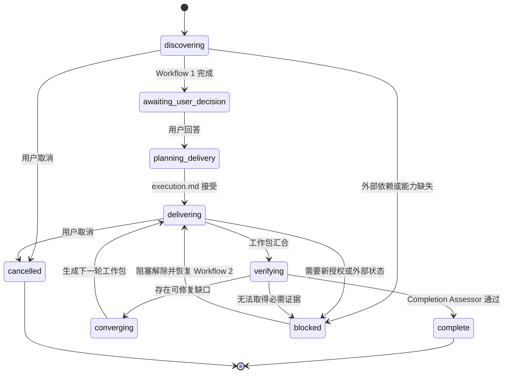
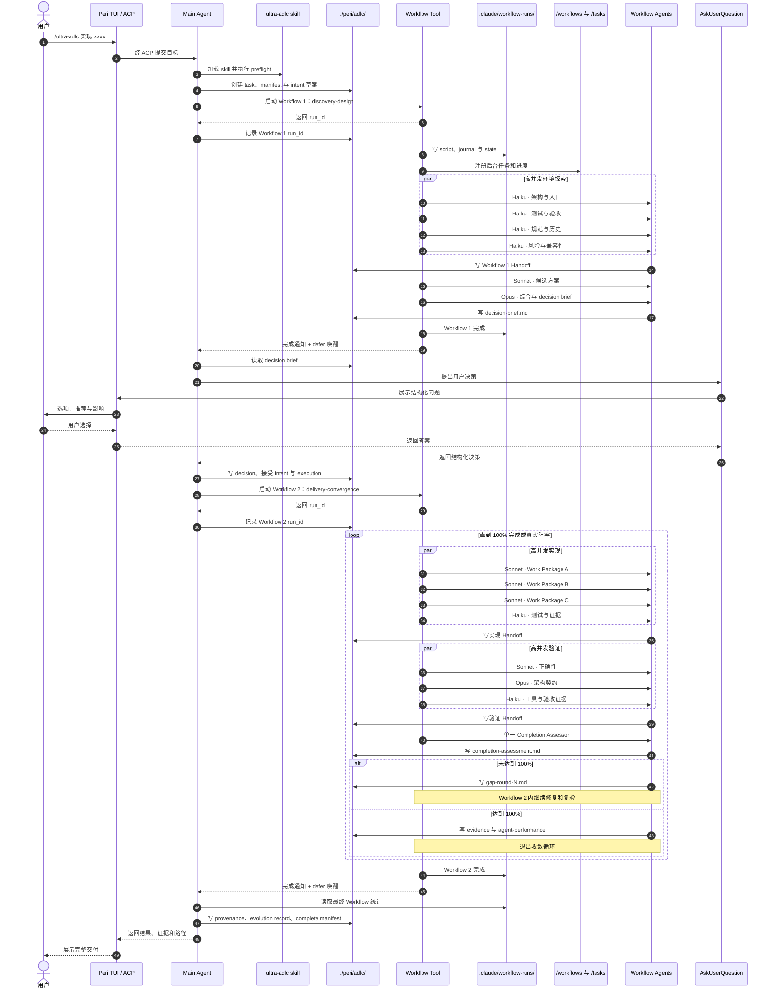

# Ultra-ADLC 设计

**状态**：已实现（builtin skill v1）
**事实源范围**：Ultra-ADLC 的产品语义、文件协议与编排契约

> 本文定义 Ultra-ADLC 的目标行为。当前 Workflow、事件、工具和模型能力仍以
> 代码、契约测试、`docs/standards/` 与
> [Workflow 系统设计](workflow.md)为事实源；本文不得覆盖更高优先级的
> 已实现契约。

---

## 1. 摘要

Ultra-ADLC 是构建在 Peri Main Agent、builtin skill、`Workflow` deferred tool、
`AskUserQuestion` 和文件系统之上的超大规模交付模式。用户只需要用自然语言表达
目标：

```text
/ultra-adlc 实现 xxxx
```

Main Agent 负责理解仓库、形成用户可判断的问题、编译两个高并发 Workflow、维护
契约与留痕，并在任务完整实现前持续收敛。用户不需要知道 crate、文件、测试命令、
模型名称或 Workflow 脚本结构。

Ultra-ADLC 只定义上层编排，不修改 Workflow DAG、RPC、事件协议、TUI Workflow
Panel、中间件顺序或 SubAgent 执行机制。所有执行必须使用现有
`agent`、`parallel`、`pipeline`、`phase`、普通 JavaScript 控制流和
Workflow resume 能力表达。

核心设计为：

```text
自然语言目标
  → Workflow 1：环境发现与设计
  → Main Agent：AskUserQuestion
  → Workflow 2：完整实现与收敛
  → 单一 Completion Assessor
  → 证据与 Agent 表现记录
```

---

## 2. 目标与非目标

### 2.1 目标

1. 为超大规模任务提供只有一行自然语言的用户接口。
2. 让 Agent 先调查环境，再向用户询问只有用户能够决定的问题。
3. 用两个逻辑 Workflow 隔离“发现与设计”和“实现与收敛”。
4. 使用 Peri `fable`、`opus`、`sonnet`、`haiku` Profile 按节点分配认知成本。
5. 最大化有效并发，缩短关键路径，而不是最大化 Agent 数量。
6. 使用文件系统完成 Agent 交接，避免依赖聊天记录和超长返回值。
7. 保留任务、决策、执行、证据与 Agent 表现的项目级审计记录。
8. 禁止“部分完成”“核心完成”或“建议后续补齐”冒充任务完成。
9. 用独立的单一 Completion Assessor 对完整性作最终判断。
10. 将每次完整交付中的 Agent 表现转化为后续 ADLC 进化数据。

### 2.2 非目标

1. 不新增或修改 Workflow DAG 原语。
2. 不修改 `peri-workflow` Node/Rust RPC 协议。
3. 不新增 ACP 或 TUI 事件类型。
4. v1 不新增 `/adlc` TUI 面板；监控复用 `/workflows` 与 `/tasks`。
5. 不迁移 `.claude/workflow-runs/`，也不复制完整 Workflow journal。
6. 不允许 Workflow Agent 直接向用户提问或绕过 Main Agent 的 HITL seam。
7. 不根据单次任务表现自动修改 builtin skill、项目指引或模型配置。

---

## 3. 术语与模块接口

| 术语 | 定义 |
| --- | --- |
| ADLC Task | 从自然语言目标开始，到完整证据交付结束的一次超大规模任务 |
| Main Agent | 用户接口和总协调者；唯一可以调用中间决策 `AskUserQuestion` 的执行主体 |
| Workflow 1 | `discovery-design`，负责发现、候选设计、风险分析和决策材料 |
| Workflow 2 | `delivery-convergence`，负责全量实现、集成、验证和完成度收敛 |
| Work Package | `execution.md` 中可独立分派和验收的最小工作包 |
| Handoff | Agent 写入文件系统、供下游 Agent 消费的结构化交接记录 |
| Completion Ledger | 从用户需求到工作包、实现和验证证据的完整映射 |
| Completion Assessor | 每轮仅一个、使用全新上下文、只读评估任务完成度的 Agent |
| Evolution Record | 任务完成后保存的 Agent 表现与路由改进信号 |

Ultra-ADLC 是一个深模块。它对用户暴露的接口只有自然语言目标和必要的用户决策，
环境发现、模型路由、并发、文件交接、恢复、验证和收敛都属于其内部实现。

---

## 4. 稳定不变量

### ADLC-ENTRY-001

- **Scope**：用户入口。
- **Rule**：用户只需要提交 `/ultra-adlc <自然语言目标>`；不得要求用户预先提供
  crate、文件、测试命令、Agent 数量或 Workflow 脚本。
- **Verify**：端到端用例只提供目标语句，Workflow 1 能生成环境事实和决策材料。

### ADLC-STORAGE-001

- **Scope**：项目级持久化。
- **Rule**：ADLC 根目录固定解析为 `{cwd}/peri/adlc/`。它不得解析到
  `~/.peri/`、`{cwd}/.peri/` 或 cwd 之外。
- **Verify**：路径测试覆盖相对路径、符号链接和 `..` 穿越拒绝。

### ADLC-WORKFLOW-001

- **Scope**：逻辑编排。
- **Rule**：正常路径只有两个逻辑 Workflow；Workflow 1 与 Workflow 2 之间由
  Main Agent 执行用户决策。修复循环属于 Workflow 2，resume 产生的新 run_id
  仍归同一个逻辑 Workflow 2。
- **Verify**：manifest 始终只含 `discoveryDesign` 与 `deliveryConvergence` 两个
  逻辑槽位，每个槽位允许记录多个物理 run_id。

### ADLC-HITL-001

- **Scope**：用户决策。
- **Rule**：Workflow Agent 不得承担中间用户提问。Workflow 1 完成后，Main Agent
  读取 `decision-brief.md`，通过现有 `AskUserQuestion` 工具提问，再启动 Workflow 2。
- **Verify**：关闭 `HumanInTheLoopMiddleware` 时，Ultra-ADLC preflight 安全失败；
  Workflow Agent 工具视图不需要新增 `AskUserQuestion`。

### ADLC-HANDOFF-001

- **Scope**：Agent 交接。
- **Rule**：跨 Agent 的可消费结果必须写为 Handoff；Workflow 返回值只返回状态和
  路径。不得把完整聊天记录或大型工具输出复制给所有下游 Agent。
- **Verify**：下游 Agent 只读取当前契约、直接依赖 Handoff 与必要源码即可执行。

### ADLC-MODEL-001

- **Scope**：模型选择。
- **Rule**：按节点的认知负载、错误代价、可验证性和返工成本选择 Peri Profile；
  不得给整个 Workflow 绑定单一档次，也不得把“最便宜”误作“最高效”。
- **Verify**：`execution.md` 为每类工作包记录 profile 与升级条件；最终证据记录实际
  Profile 分布和升级次数。

### ADLC-CONCURRENCY-001

- **Scope**：Workflow 编排。
- **Rule**：使用现有 `maxConcurrency`、`parallel`、`pipeline` 与 JavaScript 控制流
  实现最大有效并发。只读任务高并发；写任务按 write scope 隔离；共享写入由唯一
  owner 收敛。
- **Verify**：执行记录能够区分可并发工作包、写冲突串行化与关键路径等待。

### ADLC-COMPLETE-001

- **Scope**：任务终态。
- **Rule**：只有 Completion Assessor 证明所有需求、工作包、验收场景和必需验证
  100% 覆盖，任务才能进入 `complete`。不存在 `partially_complete`。
- **Verify**：缺少任一必需证据、存在未批准延迟项或高严重度未解决问题时，评估必须
  返回 `incomplete` 或 `blocked`。

### ADLC-EVOLUTION-001

- **Scope**：任务后学习。
- **Rule**：仅在完整性评估通过后，由 Completion Assessor 生成 Agent 表现记录。
  单任务记录只能进入 evolution dataset，不能直接修改全局策略。
- **Verify**：未完成任务没有成功型 performance record；聚合器按多任务证据生成
  routing、skill 或 eval 建议。

### ADLC-COMPAT-001

- **Scope**：Peri 现有架构。
- **Rule**：v1 不修改 Workflow RPC、事件、TUI Panel、中间件顺序、Workflow journal
  格式或 SubAgent frozen context。`Workflow` 保持 deferred tool。
- **Verify**：实现 diff 不需要修改上述协议事实源；现有 Workflow 契约测试继续通过。

---

## 5. Peri 架构适配

### 5.1 能力组成

`ultra-adlc` 应作为 `peri-middlewares` builtin skill 分发，并通过现有能力工作：

| 能力 | Ultra-ADLC 用法 |
| --- | --- |
| SkillsMiddleware / SkillPreload | 载入 `/ultra-adlc` 完整操作协议 |
| ToolSearch | 发现 deferred `Workflow` 工具 |
| Workflow Tool | 启动两个异步 Workflow |
| HumanInTheLoopMiddleware | Main Agent 的中间决策问题 |
| PermissionMiddleware | 风险操作审批；不得与提问通道混为一体 |
| Workflow completion notification | Workflow 完成后唤醒 Main Agent 继续流程 |
| `/workflows` | 展示 run、phase、Agent、token 与工具统计 |
| `/tasks` | 展示后台 Workflow 生命周期 |
| Frozen context | Workflow Agent 继承同一会话的项目指引、skills 与 system prompt |
| Model Profiles | 使用 `fable`、`opus`、`sonnet`、`haiku` 档位 |

Main Agent 必须在启动 Workflow 1 前执行 capability preflight：

1. `ultra-adlc` skill 已成功加载；
2. 当前 session-local 工具视图包含 `AskUserQuestion`；
3. deferred 目录可以发现并执行 `Workflow`；
4. Node runner 可用，或 Workflow 快速失败能被同步报告；
5. `{cwd}/peri/adlc/` 可安全创建和写入；
6. 所需 Peri Profile 能解析到可用 provider/model。

任何一项失败都应在昂贵的 Workflow fan-out 前停止。

### 5.2 不新增事件链

Ultra-ADLC 不新增 ACP 事件。Workflow 继续使用现有 ProgressEvent、后台完成通知、
`bg-task-completed` 投影和 defer 唤醒路径。ADLC 状态由 Main Agent 写入
`manifest.json`，不把项目级文件状态塞入 Workflow wire contract。

### 5.3 Frozen context

Workflow Agent 已继承同一会话冻结的项目指引、skills、MetaHarness 和 system prompt。
Handoff 只记录本任务新增事实和适用规则的引用，不复制完整 `AGENTS.md`、
`CLAUDE.md` 或 system prompt。这样既遵守 `ARC-FROZEN-001`，又减少上下文重复。

---

## 6. 项目级存储协议

### 6.1 根路径

```text
adlc_root = canonicalize_or_create(cwd / "peri" / "adlc")
```

解析后的路径必须仍位于 cwd。任务目录名使用安全 slug：

```text
YYYY-MM-DD-<goal-slug>[-NN]
```

slug 只允许小写 ASCII 字母、数字和连字符；冲突时递增 `NN`。时间由 Main Agent
或宿主注入，Workflow 脚本不得使用 `Date.now()`、`new Date()` 或随机 API。

### 6.2 目录结构

```text
peri/adlc/
├── tasks/
│   └── <adlc-id>/
│       ├── manifest.json
│       ├── contracts/
│       │   ├── intent.md
│       │   ├── execution.md
│       │   └── evidence.md
│       ├── decisions/
│       │   └── decision-001.md
│       ├── handoffs/
│       │   ├── workflow-1/
│       │   └── workflow-2/
│       ├── artifacts/
│       │   ├── designs/
│       │   ├── reviews/
│       │   ├── test-results/
│       │   └── workflow-provenance/
│       └── learning/
│           └── agent-performance.md
└── evolution/
    ├── records/
    │   └── <adlc-id>.json
    ├── routing-observations.md
    └── eval-candidates/
```

### 6.3 与 Workflow journal 的关系

Workflow 原始运行事实继续保存在：

```text
.claude/workflow-runs/<run-id>/
├── script.js
├── journal.jsonl
├── state.json
└── outputs/
```

ADLC 不迁移或复制它。`manifest.json` 记录逻辑 Workflow 与物理 run_id 的映射；任务
结束时把最终状态、Agent 数、token/tool 统计、phase 摘要和 script hash 写成精简的
`artifacts/workflow-provenance/<run-id>.json`。这样底层 run 被保留策略清理后，项目级
审计仍然成立。

### 6.4 Git 与保留策略

`peri/adlc/` 是可见的项目目录，默认不被 `.peri/*` 规则忽略。Ultra-ADLC 不自动
commit，除非用户明确授权。推荐进入版本控制的内容：

- 三份契约；
- 用户决策；
- Handoff 摘要；
- Completion Assessment；
- Workflow provenance；
- Agent performance 与 evolution record。

临时文件、完整模型输出、重复日志和大型构建产物不得进入项目级审计目录。

---

## 7. 任务 Manifest 与状态机

`manifest.json` 是 Main Agent 协调两个 Workflow 的机器状态，不属于三份契约。

```json
{
  "schema": "peri.adlc/task-v1",
  "adlcId": "2026-09-01-workflow-resume",
  "title": "实现工作流断点恢复",
  "status": "awaiting_user_decision",
  "contracts": {
    "intent": { "path": "contracts/intent.md", "revision": 1 },
    "execution": { "path": "contracts/execution.md", "revision": 0 },
    "evidence": { "path": "contracts/evidence.md", "revision": 0 }
  },
  "workflowRuns": {
    "discoveryDesign": [
      { "runId": "019a...", "status": "completed" }
    ],
    "deliveryConvergence": []
  },
  "decision": {
    "status": "pending",
    "brief": "handoffs/workflow-1/decision-brief.md"
  },
  "completion": { "round": 0, "verdict": null }
}
```

允许的任务状态：

```text
discovering
awaiting_user_decision
planning_delivery
delivering
verifying
converging
complete
blocked
cancelled
```

状态转换：



`blocked` 不是完成。阻塞解除后继续同一个逻辑 Workflow；resume 产生的新 run_id 追加
到对应数组，不覆盖历史 run_id。

---

## 8. 三份契约

### 8.1 `intent.md`：用户与 Main Agent 的接口

回答“为什么做、用户最终得到什么”。由 Main Agent 根据原始目标、Workflow 1 结果和
用户回答维护。

必需字段：

```markdown
# Intent

## User Goal
## Environment Facts Relevant to the Goal
## Desired Behavior
## Acceptance Scenarios
## Non-goals
## User Decisions
## Constraints
## Authorized Actions
## Stop and Escalation Conditions
```

用户可见行为、明确非目标和用户决策只能在此处成为任务事实。用户改变目标时递增
`intent_revision`，并使受影响的下游工作包失效。

### 8.2 `execution.md`：Main Agent 与 Workflow Agent 的接口

回答“Agent 团队如何完整交付意图”。它不要求 Workflow runtime 新增 DAG 能力；
Workflow 脚本只把这里的工作包编译为现有原语。

必需字段：

```markdown
# Execution

## Intent Revision
## Repository Facts
## Selected Design
## Rejected Alternatives
## Impacted Areas
## Work Packages
## Completion Ledger
## Model Routing
## Concurrency and Write Ownership
## Verification Plan
## Handoff Plan
## Retry, Resume, and Escalation
```

每个 Work Package 至少包含：

```text
id
goal
dependencies
profile
allowed tools
read scope
write scope
inputs
expected outputs
acceptance evidence
retry limit
escalation profile
handoff path
```

Worker 不修改 `execution.md`。发现偏差时写 Handoff，由 Main Agent 或 Workflow 2 的
规划 owner 修订执行契约。

### 8.3 `evidence.md`：Completion Assessor 与用户的接口

回答“凭什么认为整个任务完成”。它在 Workflow 2 开始时可以是 draft，但只有
Completion Assessor 通过后才能标记 `status: complete`。

必需字段：

```markdown
# Evidence

## Delivered Outcome
## Intent Coverage Matrix
## Work-Package Coverage
## Acceptance Evidence
## Tool Evidence
## Independent Reviews
## Plan Deviations
## Remaining Risks
## Completion Verdict
## Workflow Provenance
```

实现 Agent 可以贡献测试和工具证据，但不能给自己签发最终完成结论。Completion
Assessor 独占完成判定和所有实质证据内容；物理 Workflow run 进入终态后，Main Agent
只能追加精简 Workflow provenance，不得改变 verdict 或覆盖率。

---

## 9. 文件系统 Handoff

### 9.1 设计目标

Handoff 是 Agent 之间的稳定接口。它把大上下文压缩为可验证、可寻址、可留痕的文件，
使下游不需要重放完整会话。

每个 Agent 使用唯一 Handoff 路径，完成后不可覆盖；修订使用 `-r2`、`-r3` 后缀。
大型输出存入 `artifacts/`，Handoff 只引用路径。

### 9.2 格式

```markdown
---
schema: peri.adlc/handoff-v1
adlc_id: 2026-09-01-workflow-resume
logical_workflow: delivery-convergence
phase: implementation
round: 1
work_package: WP-017
agent_id: impl-runtime-02
role: implementation
profile: sonnet
status: complete
intent_revision: 2
execution_revision: 1
---

# Assigned Scope

# Inputs Consumed

# Completed Work

# Decisions Within Authority

# Evidence

# Remaining Items

# Risks and Blockers

# Output References

# Next Consumer
```

约束：

1. `status: complete` 时 `Remaining Items` 必须为空；
2. `blocked` 必须给出解除阻塞所需的具体外部条件；
3. 每项完成声明必须关联源码、测试或工具证据；
4. 不得包含 secret、token、完整连接串或不必要的用户数据；
5. 下游 prompt 只注入当前契约、直接依赖 Handoff 和必要源码；
6. Workflow Agent 返回值保持简短：

```json
{
  "status": "complete",
  "workPackage": "WP-017",
  "handoffPath": "handoffs/workflow-2/implementation/WP-017.md"
}
```

### 9.3 并发写入

只读 Agent 可以高并发运行。写 Agent 必须拥有不重叠的 write scope；若无法隔离，
必须由单一 owner 写入，或在隔离 worktree 中工作后交给唯一 integration owner 合并。
多个 Agent 不得同时覆盖同一 Handoff 或 manifest。

---

## 10. 两个逻辑 Workflow

### 10.1 Workflow 1：`discovery-design`

职责：

1. 调查仓库事实、现有行为、测试 seam、架构契约和历史问题；
2. 找出可以由环境回答的事实，避免向用户提技术问题；
3. 形成多个可比较的候选方案；
4. 分析用户可见差异、风险、成本和兼容性；
5. 生成 `decision-brief.md`、`intent.md` 草案和 `execution.md` 草案。

推荐编排：

```text
Haiku × N：高并发环境探索
  ↓
Sonnet × N：候选方案与专项风险
  ↓
Opus × 1：综合、消除冲突、生成决策材料
```

Workflow 1 只能执行只读调查和 ADLC 目录写入，不得开始产品实现。

`decision-brief.md` 必须包含：

```markdown
# Decision Brief

## Confirmed Environment Facts
## Recommended Outcome
## Decisions Only the User Can Make
## Options and User-visible Consequences
## Recommended Defaults
## Risks That Need Explicit Acceptance
```

### 10.2 中间用户决策

Workflow 1 异步完成后，经现有 Workflow completion notification 唤醒 Main Agent。
Main Agent 读取 `decision-brief.md`，调用 `AskUserQuestion`：

- 每轮只问影响用户结果、范围、风险或不可逆行为的问题；
- 不问文件、crate、测试命令或普通实现细节；
- 每个问题给出背景、互斥选项、推荐项和后果；
- 用户回答写入 `decisions/decision-001.md` 和 `intent.md`；
- 用户选择“由你决定”时采用推荐默认项；
- 决策完成后生成被接受的 `intent.md` 与 `execution.md`，再启动 Workflow 2。

### 10.3 Workflow 2：`delivery-convergence`

职责：

1. 从接受的 intent 生成全量 Work Package 与 Completion Ledger；
2. 以高并发波次完成所有独立实现；
3. 由唯一 integration owner 收敛共享写入；
4. 高并发执行正确性、架构、安全、测试和验收审查；
5. 调用单一 Completion Assessor；
6. 未完成时生成 gap work packages 并继续循环；
7. 完成后生成 `evidence.md`、Agent performance 与 evolution record。

禁止使用以下退出理由：

- “核心功能已经完成”；
- “大部分工作已经完成”；
- “剩余项建议以后处理”；
- “受 token、上下文或执行时间限制”；
- “Workflow 正常返回，所以任务完成”；
- “测试大部分通过”；
- “主路径可用，边界情况未覆盖”。

合法终态只有：

```text
complete
blocked
cancelled
```

可修复缺口必须在同一逻辑 Workflow 2 内继续收敛。需要新授权或外部状态时可以返回
`blocked`，由 Main Agent 询问用户并 resume Workflow 2；不得创建第三种逻辑 Workflow。

---

## 11. 模型 Profile 路由

Ultra-ADLC 使用 Peri 已有 Profile，而不是写死具体供应商模型：

| Profile | 默认职责 | 不适合 |
| --- | --- | --- |
| `haiku` | 搜索、批量提取、确定性检查、证据整理、低风险专项 review | 跨模块架构裁决 |
| `sonnet` | 主体实现、局部设计、集成、复杂修复、常规正确性 review | 极高杠杆且不可快速验证的决策 |
| `opus` | 需求综合、全局分解、架构冲突、高风险 review、Completion Assessor | 大规模机械搜索 |
| `fable` | Opus 连续收敛失败后的根因裁决、最高风险重规划 | 常规默认路径 |

效率以预期总成本衡量：

```text
expected_total_cost =
  model_cost
  + wall_clock_latency
  + failure_probability × rework_cost
  + duplicated_context_cost
  + coordination_and_merge_cost
```

路由规则：

1. 高杠杆错误会污染大量下游节点时，直接使用 `opus`；
2. 可独立、可验证、失败代价低的工作优先 `haiku`；
3. 主体编码和大多数修复使用 `sonnet`；
4. `haiku` 输出冲突、证据不足或连续失败时升级 `sonnet`；
5. `sonnet` 遇到跨模块契约或高风险冲突时升级 `opus`；
6. Opus 在多轮收敛中仍无法形成完整方案时才升级 `fable`；
7. 升级后的 Agent 消费压缩 Handoff，不重新扫描全部仓库；
8. Profile 错配是协调/路由缺陷，不应转嫁为 Worker 表现扣分。

---

## 12. 高并发编排

### 12.1 原则

目标是最大有效并发，而不是最大 Agent 数：

```text
effective_parallelism = min(
  ready_independent_work_packages,
  isolated_write_scopes,
  provider_capacity,
  configured_budget,
  host_capacity
)
```

Ultra-ADLC 不依赖 Workflow 默认并发值。Main Agent 必须为两个 Workflow 显式传入
`maxConcurrency`。v1 的目标值为：

- Workflow 1：`maxConcurrency = 12`；
- Workflow 2：`maxConcurrency = 12`；
- 若 preflight 发现 provider、预算或宿主限制，可以下调，但必须记录原因；
- 写任务的实际并发由 write scope 和脚本波次进一步限制。

### 12.2 波前而非全局串行

禁止把整个任务执行为：

```text
全部探索 → 全部计划 → 全部编码 → 全部审查 → 全部测试
```

Workflow 2 应在依赖满足后立即启动 Work Package：

```text
WP-A：plan → implement → self-test → handoff
WP-B：       plan → implement → self-test → handoff
WP-C：plan → implement → self-test → handoff
                         ↓
                 integration owner
                         ↓
                 parallel verification
```

同一波中：

- 只读探索和正交 review 尽可能使用 `parallel([...thunks])`；
- 多个数据项的同构处理使用 `pipeline(items, ...stages)`；
- `parallel` 元素必须是 `() => agent(...)` 工厂函数；
- 共享写入不因追求并发而失去唯一 owner；
- 关键路径工作包优先于非关键短任务占用槽位。

---

## 13. Completion Ledger 与完整性守卫

### 13.1 Completion Ledger

`execution.md` 必须维护全量映射：

```markdown
| Requirement | Work Packages | Implementation | Verification | Status |
| --- | --- | --- | --- | --- |
| R-001 | WP-001, WP-002 | pending | pending | pending |
| R-002 | WP-003 | pending | pending | pending |
```

每条 intent requirement 必须映射到至少一个 Work Package；每个 Work Package 必须映射
到实现产物和独立证据。未映射项自动视为未完成。

### 13.2 Completion Assessor

每轮评估只有一个 Completion Assessor：

- 使用全新上下文；
- 默认 `opus`，连续复杂收敛失败时可使用 `fable`；
- 对产品代码和测试只读；
- 不参与前置设计、编码、修复或 review；
- 不相信 Worker、integration owner 或 Workflow 的完成声明；
- 从 `intent.md` 独立重建验收清单；
- 读取当前代码、diff、三份契约、关键 Handoff、工具证据与未解决项。

Assessor 可以写当前轮 assessment Handoff；`incomplete` 时可以写 gap Handoff；只有
`complete` 时可以写最终 `evidence.md`、Agent performance 与 evolution record。

每轮调用一个新的评估 Agent，但同一轮不得并行运行多个 assessor 投票。

完成必须同时满足：

```text
需求覆盖率                 = 100%
工作包完成率               = 100%
验收场景证据覆盖率         = 100%
必需测试通过率             = 100%
高严重度未解决问题         = 0
未经用户批准的延迟项       = 0
未解释的计划偏差           = 0
```

不使用加权平均掩盖关键缺口。任一必需项失败，整体 verdict 必须为 `incomplete`。

### 13.3 缺口循环

未完成时写入 `handoffs/workflow-2/gap-round-N.md`：

```markdown
| Gap | Requirement | Required Work | Profile | Write Scope |
| --- | --- | --- | --- | --- |
| G-01 | R-003 | 补充失败回滚 | sonnet | peri-workflow/ |
| G-02 | R-005 | 添加跨版本测试 | sonnet | e2e/ |
| G-03 | R-006 | 验证安全约束 | opus | read-only |
```

Workflow 2 将缺口重新编译为 Work Package，执行并行修复、重新集成、重新验证和再次
评估。循环持续到 `complete`、真实外部阻塞或用户取消。

---

## 14. Agent 表现与 ADLC 进化

只有 Completion Assessor 返回 `complete` 后，才生成：

```text
tasks/<adlc-id>/learning/agent-performance.md
evolution/records/<adlc-id>.json
```

表现评估以 Agent 被分配的 Work Package 为范围，使用 Handoff、review findings、返工轮次
和工具证据，不依赖 Agent 自评。

评分维度：

| 维度 | 含义 |
| --- | --- |
| 完整性 | 是否完成被分配的全部范围 |
| 正确性 | 输出是否被后续验证接受 |
| 证据质量 | 是否提供可复查的工具证据 |
| 交接质量 | Handoff 是否准确、紧凑、可消费 |
| 约束遵守 | 是否越权、遗漏规则或缩小范围 |
| 返工成本 | 给后续阶段制造的修复成本 |
| 模型效率 | 使用该 Profile 是否比升级或降级更合适 |
| 协作贡献 | 是否减少关键路径和下游上下文成本 |

每个 Agent 记录 1～5 分、总等级、优点、缺点、证据路径和进化信号。协调 Agent、模型
路由和工作包拆分也必须作为可评分角色，避免把系统性错配归咎于 Worker。

单任务 Evolution Record 不自动修改任何规则。多任务聚合后才可以提出：

- Profile 路由调整；
- Handoff schema 改进；
- builtin skill 规则更新；
- 新的 eval case；
- 并发和 work package 拆分策略调整。

上述建议必须通过单独评审或 eval 后才能应用。

---

## 15. TUI、命名与可观察性

v1 复用 `/workflows` 和 `/tasks`，不新增 UI 协议。命名必须让用户能从现有面板识别
ADLC 阶段。

Workflow name：

```text
adlc:<short-id>:discovery-design
adlc:<short-id>:delivery-convergence
```

Phase：

```text
ADLC/W1/Discover
ADLC/W1/Design
ADLC/W1/Synthesize
ADLC/W2/Decompose
ADLC/W2/Implement/Round-N
ADLC/W2/Integrate/Round-N
ADLC/W2/Verify/Round-N
ADLC/W2/Assess/Round-N
ADLC/W2/Converge/Round-N
```

Agent label：

```text
WP-017 · implementation · sonnet
R-004 · verification · haiku
completion-assessor · opus
```

Main Agent 的最终消息必须给出：

1. 用户结果；
2. `contracts/evidence.md` 路径；
3. Completion Assessor verdict；
4. 两个逻辑 Workflow 的 run_id；
5. 剩余风险；
6. `learning/agent-performance.md` 路径。

---

## 16. 完整人机流程



---

## 17. 失败、恢复与取消

### 17.1 快速失败

Workflow 启动后的 Node、脚本、工具缺失等快速失败沿用现有 Workflow Tool 行为。
Main Agent 将错误写入 manifest，并在尚未进入昂贵 fan-out 时直接报告。

### 17.2 Workflow resume

`manifest.json` 为每个逻辑 Workflow 保存 run_id 数组。resume 产生的新 run_id 追加而非
替换。恢复前必须确认 intent/execution revision 与旧 journal 输入一致；若契约改变，
只允许重建受影响节点，不得盲目复用过期结果。

### 17.3 外部阻塞

Workflow 2 只有在缺少新授权、不可用外部系统或无法取得必需证据时才返回 `blocked`。
Main Agent 可以通过 AskUserQuestion 解除阻塞，再 resume 同一逻辑 Workflow 2。阻塞不
得转化为非目标或延迟项，除非用户明确修订 intent。

### 17.4 取消

用户取消时，Main Agent 通过现有 Workflow/Agent cancel 路径终止活跃运行，并把任务
标记为 `cancelled`。取消不自动删除 `peri/adlc/` 留痕。

---

## 18. 安全与权限

1. `peri/adlc/` 的所有路径必须限制在 cwd 内；
2. Handoff 和 provenance 不保存 secret、token、密码或完整连接串；
3. read-only 探索 Agent 使用最小 `allowedTools`；
4. 写 Agent 只获得完成其 write scope 所需的工具；
5. PermissionMiddleware 继续独占工具审批，Ultra-ADLC 不自建审批机制；
6. AskUserQuestion 与审批共享现有交互门，不并发发起相互竞争的用户交互；
7. Completion Assessor 必须只读，不能为了让评估通过而修改代码或测试；
8. 测试失败时不得删除、跳过或弱化测试来制造通过；
9. Agent 不得自行把未完成范围移动到 Non-goals；
10. 未经用户授权不得自动 commit、push、发布或修改外部系统。

---

## 19. 实现落点

v1 已在现有能力上增加上层 skill、注册和契约测试：

| 职责 | 实现位置 |
| --- | --- |
| builtin skill | `peri-middlewares/src/skills/builtin/skills/ultra-adlc/SKILL.md` |
| builtin 注册 | `peri-middlewares/src/skills/builtin/mod.rs` |
| skill frontmatter/发现/契约测试 | `peri-middlewares/src/skills/builtin_test.rs` |
| 两个 Workflow 脚本生成规则 | `ultra-adlc/SKILL.md`，不新增 engine 原语 |
| 文件协议模板 | `ultra-adlc/SKILL.md` 内嵌模板；默认根 `peri/adlc/` |
| 用户文档 | `peri-cool/src/content/docs/docs/features/ultra-adlc.mdx` |

当前 v1 不包含依赖真实模型和外部 provider 的 E2E；这类验证可在协议通过真实任务运行后
独立补充，不改变本设计的运行时边界。

首版不应修改：

- `peri-workflow/src/protocol.rs`；
- `peri-workflow/src/runner.rs`；
- `peri-acp-types/src/workflow.rs`；
- ACP/TUI 事件枚举；
- Workflow Panel 数据结构；
- `production_blueprint` 中间件顺序；
- `.claude/workflow-runs/` 存储格式。

如果实现阶段发现必须修改这些位置，应停止并把偏差作为新的架构决策评审，而不是在
Ultra-ADLC 实现中顺带扩张范围。

---

## 20. 验收矩阵

| 场景 | 预期结果 |
| --- | --- |
| 用户只输入一句自然语言目标 | Workflow 1 能调查环境并形成 decision brief |
| 用户不了解代码库 | 问题只涉及用户结果、范围和风险，不要求技术知识 |
| HumanInTheLoopMiddleware 关闭 | preflight 失败，不启动 Workflow 1 |
| Workflow tool 不可用 | preflight 或快速失败明确报告，不伪造执行 |
| Workflow 1 完成 | Main Agent 收到通知并调用 AskUserQuestion |
| 用户回答 | 决策写入 `decisions/` 与 `intent.md`，随后启动 Workflow 2 |
| 多个独立工作包 | 使用显式高并发和不重叠 write scope |
| Agent 输出较长 | 内容落盘，Workflow 只传路径和短状态 |
| Completion Assessor 发现缺口 | 生成 gap work packages，Workflow 2 继续收敛 |
| 任务只完成大部分 | 不允许进入 `complete` |
| 外部依赖不可用 | 状态为 `blocked`，保留任务和恢复信息 |
| 任务完整通过 | 生成 evidence、performance、provenance 与 evolution record |
| 底层 Workflow run 被清理 | 项目级精简 provenance 和契约仍可审计 |
| 用户取消 | 活跃 Workflow 被取消，ADLC 留痕保留 |

---

## 21. 参考事实源

- [跨模块架构契约](../standards/architecture-contracts.md)：`ARC-BOUNDARY-001`、
  `ARC-FROZEN-001`、`ARC-EVENT-001`、`ARC-TOOLS-001`、`ARC-HITL-001`、
  `ARC-WORKFLOW-RPC-001`、`ARC-MIDDLEWARE-001`。
- [Workflow 系统设计](workflow.md)：现有 Workflow 原语、运行时、journal、
  notification 与 TUI 面板。
- [peri-workflow 代码索引](../code-index/peri-workflow.md)：当前代码入口与稳定不变量。
- `peri-middlewares/src/skills/builtin/skills/ultracode/SKILL.md`：现有 Workflow Tool
  操作手册与脚本约束。
- `peri-acp/prompts/sections/12_ask_user.md`：Main Agent 提问纪律与运行语义。
- `peri-cool/src/content/docs/docs/features/model-profiles.mdx`：Peri Profile 语义和配置。
