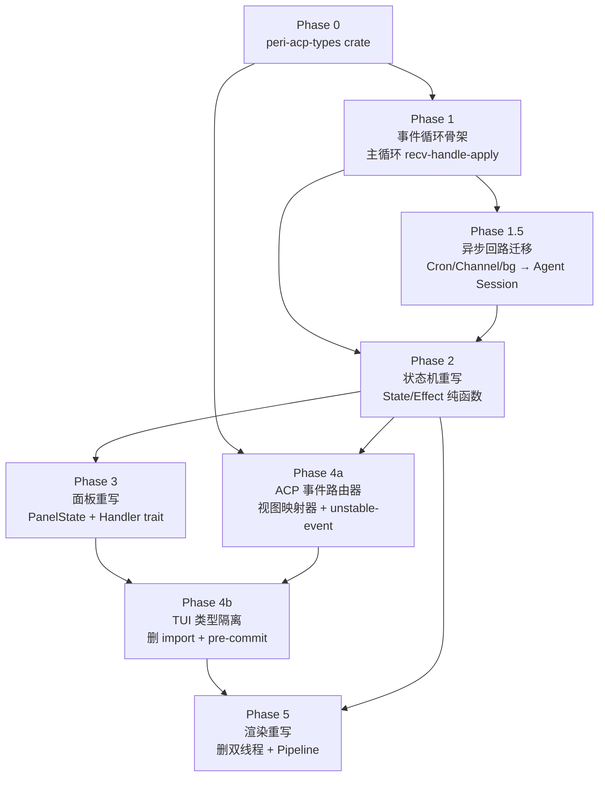

# v2 重构 — Gap 分析

> 日期：2026-06-28 | 规范来源：`docs/design/peri-tui-architecture.md` + `docs/design/peri-acp-protocol.md`
> 输入：8 份 reader 摘要（3 份因 API 限流失败：tui-message-pipeline / tui-acp-clients / acp-event-mapper — 已用直接 grep 补全关键事实）+ 2 份设计文档全文

本文档回答四个问题：(1) 每个子系统当前 vs 目标的差距，(2) 横切关注点，(3) 风险登记（哪些承重、哪些可先删），(4) 推荐执行顺序（与设计文档 P1→P5 不同的部分及理由）。

---

## 1. 子系统当前 vs 目标对照

### 1.1 总览表

| 子系统 | LOC | 文件数 | v2 Phase | 主要 gap | 阻塞者 |
|---|---|---|---|---|---|
| TUI app core（App/ChatSession/agent_ops/events） | 4,059 | 16 | P1/P2 | App 50+ 方法混 I/O 与状态；poll_agent 9 队列优先级；AgentEvent 25 变体直接依赖 peri_agent 类型；ChatSession 六组件 &mut 自由访问 | 自身（无外部阻塞） |
| TUI 面板系统 | 5,972 | 32 | P3 | PanelComponent trait 签名带 `&mut App` / `&mut PanelContext`；PanelContext 含 `&mut ServiceRegistry + &mut SessionManager + Option<AcpTuiClient>`；14 面板直接写 PeriConfig / 推 system_note / spawn tokio | P2 状态机（PanelReadContext 由状态机注入） |
| TUI 输入系统 | 5,075 | 26 | P2 | 输入状态分散三处（UiState / GlobalUiState / keyboard pipeline）；12 级优先级硬编码按键管线；4 个交互弹窗硬编码 OAuth>AskUser>HITL 优先级 | P2 状态机 |
| TUI 跨 crate 类型依赖违规 | 23,006 | 65 | P4 | 88 处 `use peri_(agent\|middlewares\|acp)::`，55 个文件直接 import 运行时类型；`peri-acp-types` crate 不存在；BaseMessage→ViewModel 转换层（`ui/message_view/build.rs`）在 TUI 侧 | P4 自身（需先建 crate） |
| peri-acp session/executor + builder | 9,051 | 27 | P4 | 命令分发通过 `intercept_immediate_command` 绕过 JSON-RPC 方法层；EventSink 双通知（`session/update` + `peri/agent_event`）需收敛为 `peri/unstable-event`；execute_prompt 单入口未与 `session/prompt` 方法对齐 | P4 自身 |
| 异步事件回路 | 2,845 | 12 | P1.5（设计文档隐含） | CronScheduler/trigger_rx TUI 持有；channel_notification_rx TUI 持有；poll_agent 9 队列架构需替换为 Agent 层 Session await-wake | P1（poll_agent 删除） + Agent 层 Session 改造 |
| 测试 | 19,552 | 68 | 多阶段 | 936 测试中约 200+ 直接消费 v2 类型（TurnCommitted / ExecutorEvent / Pipeline 数据模型）；message_pipeline_test（81 测试）与 mapper_test（27 测试）最高风险 | 各阶段自身 |

### 1.2 每个子系统的详细 gap

#### 1.2.1 TUI app core（P1/P2）

**当前**：`App` struct 667 LOC + 50+ 方法（grep 验证），任意方法可调终端、改配置、发 RPC。`ChatSession` 六组件（UiState / MessageState / session_panels / CommandSystem / SessionMetadata / AgentComm）通过 `&mut ChatSession` 自由访问。`handle_agent_event` 200+ 行 match 分发 25 种 `AgentEvent` 变体（events.rs grep 验证：25 变体名确认）。`AgentEvent` 直接 `use peri_agent::messages::BaseMessage` / `peri_agent::InteractionContext` / `peri_middlewares::mcp::OAuthCallbackResult`。

**目标**：纯函数状态机 `(State, Event) → (State, Vec<Effect>)`。四种顶层状态 Idle / Streaming / Modal / Switching。主循环只做 `recv → handle → apply effects → loop`。状态机零 I/O、零外部依赖，可脱离终端做纯函数测试。

**gap**：整体替换。无中间形态可走——App 结构与 v2 状态机签名不兼容。

#### 1.2.2 TUI 面板系统（P3）

**当前**：`PanelComponent` trait（`panel_component.rs`）签名 `render(&mut self, app: &mut App, ...)` + `handle_key(&mut self, ctx: &mut PanelContext, ...)`。`PanelContext` 含 `&mut ServiceRegistry + &mut SessionManager + Option<&mut AcpTuiClient>`。14 面板通过 `ctx.session_mut` 修改 ChatSession 任意字段。`panel_dispatch!` 宏 + `mem::take` 借用规避。

**目标**：面板只实现 `PanelState` 接口。读通道 `PanelReadContext`（只读快照，状态机注入）。写通道 `PanelEffect` 6 变体（ShowNotification / SendToAcp / Close / SwitchSession / Copy / UpdateConfig）。面板不知道指令最终如何执行。

**gap**：trait 签名变化使所有 14 面板必须重写。最复杂的两个：ThreadBrowser（会话切换 + 终端 raw mode 切换）与 MemoryPanel（外部编辑器 spawn — suspend TUI / exec $EDITOR / restore）。

#### 1.2.3 TUI 输入系统（P2）

**当前**：输入状态分散三处所有者。`event/keyboard/` 12 级优先级管线（bar_focus > shortcuts > setup_wizard > panels > popups > normal_keys）。4 个交互弹窗模块（hitl_prompt / ask_user_prompt / rewind_prompt / oauth_prompt）各自实现，`popups.rs` 硬编码 OAuth > AskUser > Rewind > HITL 优先级链。

**目标**：所有输入字段集中到 `State::Idle` / `State::Streaming`。@ 与 / 补全为 Idle 子状态。4 个交互弹窗为 `Modal::Interaction` 下的 `Handler` trait 实现。冲突策略由状态机决定，不硬编码优先级。

**gap**：FieldTextarea / IME / file_search / fuzzy_match 逻辑可保留为实现细节，但状态所有权必须迁入状态机。

#### 1.2.4 TUI 跨 crate 类型依赖（P4）

**当前**：grep 验证 88 处 `use peri_(agent|middlewares|acp)::`，跨 55 个文件。最密集的违规点：
- `app/mod.rs`（667 LOC，import BaseMessage / HitlDecision）
- `app/mcp_panel/{component,ops}.rs` + `ui/main_ui/panels/mcp.rs`（import `peri_middlewares::mcp::{ClientStatus, ConfigSource, OAuthStatus, ServerInfo, OAuthFlowEvent}`）
- `app/hooks_panel.rs`（import hooks types）
- `app/cron_state.rs` / `tasks_panel.rs`（import `peri_middlewares::cron::{CronScheduler, CronTask, CronTrigger}`）
- `ui/message_view/build.rs`（324 LOC，BaseMessage → MessageViewModel 全量转换层在 TUI）
- `app/message_pipeline/{mod,lifecycle,transform,state,tools}.rs`（直接持有 BaseMessage）

合法桥接代码（应保留思路但消除依赖）：`acp_server/*`、`acp_stdio/context.rs`、`main.rs`、`cli_print.rs`。

**目标**：TUI 类型依赖仅 `peri-acp-types` + `peri-widgets`。pre-commit 钩子阻断所有 `use peri_agent::` / `use peri_middlewares::`。BaseMessage→ViewModel 转换层迁到 ACP。

**gap**：(1) 创建 `peri-acp-types` crate（仅依赖 serde），(2) 迁移 ViewModel 枚举 + 6 个事件 data 结构 + 各类摘要结构（SkillSummary / CronSummary 等），(3) 迁移 BaseMessage→ViewModel 转换到 ACP，(4) 14 面板从 peri_middlewares 类型切到 DTO，(5) pre-commit 钩子。

#### 1.2.5 peri-acp session/executor（P4）

**当前**：`run_session_loop` 内 `intercept_immediate_command` 在 agent 构造前拦截 `/bg` `/compact` `/clear` `/rewind`（绕过 JSON-RPC 方法层）。`EventSink`（`session/event_sink.rs`）发混合通知——`session/update`（标准）+ `peri/agent_event`（自定义）。`execute_prompt()` 是事实入口但未与 `session/prompt` 标准方法对齐。

**目标**：4 条 slash 命令路由通过标准 `session/execute-command` 方法分发（dispatch 层）。`execute_prompt()` 统一为 `session/prompt` 方法的单一入口。所有 Agent→TUI 事件走 `peri/unstable-event`，标准方法仅请求-响应。

**gap**：dispatch 层重组 + EventSink 收敛。`run_compact(force=true)` 与 `BgForkConfig` 等 executor 内部能力不变，只是入口从 prompt-content 拦截改为 method 分发。

#### 1.2.6 异步事件回路（横切，P1 + Agent 改造）

**当前（部分已对齐 v2）**：
- ✅ Cron triggers 与 channel notifications 已经走 TUI 侧 poll → push 到 v2 MessageQueue（`Kind::Defer`）
- ✅ bg_results 由 `executor.rs` push 到 v2 queue
- ✅ Agent 运行期间 stages/end.rs `should_continue` → drain_for_receive 自动消费
- ✅ Agent idle 期 TUI polling.rs `drain_for_end` → `submit_message` 续跑（接收方主动续跑）

**未对齐**：
- ❌ CronScheduler + trigger_rx 在 TUI `ServiceRegistry.cron` 持有（`cron_state.rs`）。设计文档要求迁到 Agent 层。
- ❌ channel_notification_rx mpsc 通道 TUI 持有并手动 drain（`message_state.rs`）。设计文档要求迁到 ACP 层。
- ❌ poll_agent 9 队列优先级 drain 架构（346 LOC）。设计文档要求 Agent Session 实现空闲 await-wake，TUI 只 react ACP 事件。

**gap**：Cron / Channel 触发源从 TUI 侧迁到 Agent / ACP 层，Session 实现 await-wake。`bg_task_state.pending_continuation` 路径已部分对齐，需进一步自动化为 Agent 层续跑。

---

## 2. 横切关注点

### 2.1 类型依赖隔离（最大单项风险）

**事实**：TUI 侧 88 处直接 import peri_agent / peri_middlewares 运行时类型。设计文档第 11.1 节明确要求 TUI 类型依赖仅 `peri-acp-types` + `peri-widgets`，pre-commit 钩子阻断。

**棘手点**：
- `BaseMessage` 渗透最深——message_pipeline 5 个文件 + ui/message_view/build.rs + 多个 agent_ops 文件 + command/core/gc.rs + 14 测试文件。
- 转换层 `ui/message_view/build.rs`（324 LOC）是 BaseMessage → MessageViewModel 的唯一映射点，必须整体迁到 ACP，TUI 改为消费成品 ViewModel。
- 6 个已存在 DTO（CompactFileInfoDto / WorkflowProgressDto / TokenUsageDto / StopReasonDto / TodoStatusDto / TodoItemDto）在 `peri-acp/src/event/dto.rs`，但 `peri-acp-types` crate 不存在——DTO 当前定义在错误的 crate 中（peri-acp 是全知层，但 TUI 不应依赖 peri-acp 的全部）。

**前提条件**：必须先创建 `peri-acp-types` crate 才能开始 P4。这是 P4 的硬前置。

### 2.2 异步回路（最易踩坑）

**已知 [TRAP]**（CLAUDE.md P2-B 记录）：ACP executor 末尾禁止加 `drain_for_end` 循环——`drain_for_end` 是 destructive，取出后若不续跑消息物理丢失。idle 期续跑必须由 TUI 接收方负责（S6 回归已修）。

**v2 设计要求**：异步回路在 Agent 层闭合，TUI 不感知触发源。但这与"接收方主动续跑"现状冲突——v2 要求 Session 实现 await-wake，意味着：
- 接收方续跑逻辑从 TUI `polling.rs::drain_for_end + submit_message` 迁到 Agent Session。
- TUI polling 简化为只监听 ACP `peri/unstable-event` 通道。
- 风险：迁移过程中若 CronScheduler / Channel receiver 迁移不当，会重现 S6 回归的物理消息丢失 bug。

**建议**：异步回路改造作为 P1.5 独立阶段，介于 P1（事件循环重写）与 P2（状态机重写）之间。先迁触发源到 Agent，再删 TUI drain。

### 2.3 测试覆盖（验证契约）

**总计**：936 测试跨 68 文件，19,552 LOC。

**结构隔离（不需改）**：sync/*、config/types_test.rs、i18n、CLI 解析、静态 widget 渲染、provider config 合并、crypto。约 350 测试。

**直接消费 v2 类型（必须重写）**：
- `peri-tui/src/app/message_pipeline/message_pipeline_test.rs`（81 测试，2,342 LOC）—— 直接消费 TurnCommitted / finalized_messages / Pipeline 数据模型。P2-C 已重构一次，v2 P4 再次重构时必须同步。
- `peri-acp/src/event/mapper_test.rs`（27 测试，570 LOC）—— 直接消费 ExecutorEvent 变体到 AcpNotification 映射。
- `peri-tui/src/ui/headless_test.rs`（72 测试）—— 直接用 BaseMessage / ContentBlock / SkillMetadata 等类型构造场景。pre-commit 钻石依赖被切断后会编译失败。
- `peri-tui/src/ui/message_view/message_view_test.rs`（27 测试）—— 直接测 BaseMessage→ViewModel 转换。转换层迁到 ACP 后整个测试文件迁到 peri-acp。
- `peri-acp/src/session/command/{rewind,compact}_test.rs`—— 命令分发路径改变（从 prompt-content 拦截改为 method 分发），但核心契约（file revert、CJK UTF-8 安全、tool pairing 验证、compact 输出必须 Human 起头）不变，只需调入口。

**风险**：测试本身是 v1 行为的固化。若 v2 改了语义（如 view-commit 全量替换语义 vs 当前 TurnCommitted），测试需同步改语义断言。不能机械保留旧断言。

---

## 3. 风险登记 — 承重 / 可先删

### 3.1 承重（不能贸然删，必须先有替换路径）

| 文件 / 模块 | LOC | 为什么承重 | 替换路径 |
|---|---|---|---|
| `peri-tui/src/app/agent_ops/polling.rs` | 346 | 9 队列 drain 是当前异步回路核心。删了 Cron / Channel / bg_results 都不工作。 | P1.5：先迁触发源到 Agent 层 Session await-wake，再删。**禁止在迁移前删**——会重现 S6 物理消息丢失 bug。 |
| `peri-tui/src/app/message_pipeline/mod.rs` | 427 | transcript + partial 单一数据源（P2-C 已重构）。承担流式渲染 + 历史恢复 + 多迭代时序修复。 | P5：替换为 ViewStore（状态机内部）+ 主循环帧率节流。但 P2-C 的 replace 语义 / build_tail_vms 纯函数逻辑可保留为 ACP 侧 view mapper 的参考实现。 |
| `peri-tui/src/ui/message_view/build.rs` | 324 | BaseMessage → MessageViewModel 唯一转换路径。删了 TUI 无法渲染任何消息。 | P4：整体迁到 ACP，TUI 改消费成品 ViewModel。**迁移期间两份代码并存**（违反设计文档第 7 条"不并存"，但 P4 必然要短暂并存，否则 TUI 渲染断裂）。 |
| `peri-tui/src/app/events.rs`（AgentEvent 枚举） | ~180 | 25 变体枚举，跨 16 个 agent_ops 文件 match 分发。所有事件流都经过这里。 | P2 + P4 协同：先建事件名 + data 结构（P4 前半），再删 AgentEvent 枚举（P2 后半）。**禁止在事件路由器建好前删**——所有事件流断裂。 |
| `peri-acp/src/session/executor.rs::intercept_immediate_command` | — | 当前 slash 命令分发唯一入口。`/compact` `/bg` `/rewind` `/clear` 都走这。 | P4：先建 `session/execute-command` dispatch，验证 4 命令通过 method 分发能工作，再删 intercept。 |
| `peri-acp/src/session/event_sink.rs` | — | 双通知（session/update + peri/agent_event）当前 TUI 渲染依赖。 | P4：先建 `peri/unstable-event` 通道 + 事件路由器，验证 TUI 能从新通道收到所有事件，再删双通知。 |

### 3.2 可先删（无后续依赖或依赖已被替代）

| 文件 / 模块 | 说明 |
|---|---|
| `peri-tui/src/event/macros.rs`（with_global_panels! / with_session_panels!） | `mem::take` 借用规避宏。P3 面板重写后 PanelContext 消失，宏立即无用。 |
| `peri-tui/src/app/panel_manager.rs`（PanelManager + PanelState enum + PanelKind + panel_dispatch!） | P3 PanelState trait 上线后整体删除。 |
| `peri-tui/src/app/panel_component.rs`（PanelComponent trait） | 同上。 |
| `peri-tui/src/app/global_ui_state.rs` 中 quit_pending / rewind_pending 计时器 | P2 状态机内 Esc 双击逻辑实现后删除。 |
| `peri-tui/src/app/agent_events_oauth.rs` / `agent_events_plugin.rs` | P3 交互弹窗 Handler trait 上线后，这些 App 方法失去存在理由。 |
| `peri-tui/src/app/agent_render.rs::apply_pipeline_action` 中 ephemeral_notes anchor 计算 | P5 ViewStore 替换 Pipeline 后，anchor 逻辑被全量替换语义消除。 |

### 3.3 风险等级

- **🔴 高**：异步回路迁移（S6 回归风险）、事件路由器 + AgentEvent 枚举切换（事件流断裂）、BaseMessage→ViewModel 转换层迁移（TUI 渲染断裂）。
- **🟡 中**：14 面板重写（工作量大但每个独立，可逐一验证）、message_pipeline 测试重写（81 测试逐一对照新语义）。
- **🟢 低**：slash 命令路径重组（核心契约不变）、ServiceRegistry 字段迁移到 ACP 查询（数据无丢失风险）。

---

## 4. 推荐执行顺序

设计文档第 12 节给出 P1→P5 顺序。**部分调整建议**：

### 4.1 调整后的顺序

```
Phase 0（前置准备，1 周）
  └─ 创建 peri-acp-types crate（仅 serde 依赖）
     · 迁移 6 个已存在 DTO 从 peri-acp/src/event/dto.rs
     · 定义 ViewModel 枚举（7 变体）+ 事件 data 结构（按协议文档第 4 节）
     · 此阶段不强制 TUI 切换依赖

Phase 1（事件循环骨架，2-3 周）
  └─ 主循环 recv → handle → apply effects → loop
     · 键盘采集 + ACP 通知 两个后台 task
     · 删除 poll_agent 的 9 队列中的 5 个（cancel timeout / throttle / pending_messages / ACP rx / background events）
     · **保留** v2 queue drain / cron / channel 三条（暂时）
     · 状态机先用"瘦壳"——直接调用旧 App 方法，不强行纯函数化

Phase 1.5（异步回路迁移，1-2 周）【新增，设计文档隐含】
  └─ CronScheduler + trigger_rx 迁到 Agent 层
     · channel_notification_rx 迁到 ACP 层
     · Agent Session 实现 await-wake（空闲时阻塞等收件箱）
     · 此时才删 polling.rs 的 v2 queue drain / cron / channel 三条
     · 验证：cron 触发、channel 消息、bg_results 三条异步路径全部经 ACP 事件通道到达 TUI

Phase 2（状态机重写，2-3 周）
  └─ State / Effect 枚举
     · 输入字段集中到 State::Idle / State::Streaming
     · @ 与 / 补全作为 Idle 子状态
     · handle 函数化为 (State, Event) → (State, Vec<Effect>)
     · App 50+ 方法中的 I/O 收敛到 Effect

Phase 3（面板重写，3-4 周）
  └─ PanelState trait + PanelReadContext + PanelEffect(6 变体)
     · 14 面板逐一重写（独立，可并行验证）
     · 4 交互弹窗 Handler trait
     · 删除 PanelManager / PanelContext / panel_dispatch! / with_*_panels! 宏

Phase 4（ACP 层 + 类型隔离，2-3 周）
  └─ 4a：事件路由器（AgentEvent → {event, data}）+ peri/unstable-event 通道
     · 视图映射器（BaseMessage → ViewModel，迁自 ui/message_view/build.rs）
     · slash 命令 session/execute-command dispatch
     · execute_prompt 统一为 session/prompt 入口
  └─ 4b：删除 TUI 所有 peri_agent / peri_middlewares import
     · pre-commit 钩子启用
     · AgentEvent 枚举删除（被事件名 + data 结构替代）
     · ServiceRegistry 中 MCP / Cron / plugin_data 字段改为 ACP 查询

Phase 5（渲染重写，2-3 周）
  └─ 删除双线程渲染 / RenderCache / RenderEvent / 渲染通知通道
     · 主线程同步渲染 + 16ms 帧率节流
     · 删除 MessagePipeline（替换为 ViewStore + 主循环节流）
     · Block 模式保留为渲染层内部细节
```

### 4.2 与设计文档的差异及理由

1. **新增 Phase 0**：设计文档 P4 才提到创建 `peri-acp-types` crate。但 P1/P2/P3 期间状态机和面板都需要 ViewModel 类型（即使是骨架）。提前创建可让后续阶段都基于 DTO 写代码，避免 P4 时大规模类型重命名。
2. **新增 Phase 1.5**：设计文档第 10.5 节"迁移"段提到"Cron 触发、Channel 接收、后台 SubAgent 完成回调全部移到 Agent 层"，但没明确归入哪个 Phase。把它独立出来是因为：(a) 它横跨 TUI 删 polling（P1）和 Agent Session 改造（无对应 Phase）；(b) S6 回归记忆犹新，独立阶段可单独验证；(c) P1 删 polling.rs 不能一次删完（会丢消息），必须 P1.5 完成后才能彻底删。
3. **P1 保持瘦壳**：设计文档 P1 描述包含了"事件循环重写"。但若 P1 同时做状态机纯函数化，工作量爆炸且测试无法逐步迁移。建议 P1 只换主循环骨架，状态机暂时包装旧 App 方法（仍含 I/O），P2 才真正纯函数化。
4. **P4 拆 4a/4b**：4a 建 ACP 新通道（与旧 EventSink 并存），4b 切换并删旧。设计文档第 7 条"不并存"原则适用于最终状态，但 P4 的客观迁移过程必然有短暂并存——分 4a/4b 让并存窗口最小化。

---

## 5. Phase 依赖图



### 5.1 阻塞关系说明

| 阻塞 → 被阻塞 | 理由 |
|---|---|
| **P0 → P1** | P1 主循环产出 `Effect` 枚举，`Effect::Render` 携带快照需要 ViewModel 类型。 |
| **P0 → P4a** | 事件路由器产出 `{event, data}`，data 结构定义在 peri-acp-types。 |
| **P1 → P1.5** | P1.5 删 polling.rs 最后三条 drain（cron/channel/v2_queue），必须 P1 已建立 ACP 通知 task 才能验证消息能通过新通道到达。 |
| **P1 → P2** | P2 状态机的 `Effect::SendToAcp` 需要主循环已能执行 Effect。P1 的瘦壳状态机是 P2 纯函数化的中间态。 |
| **P1.5 → P2** | P2 状态机不感知触发源——必须 P1.5 已把触发源迁到 Agent 层，TUI 才能只 react 事件。否则状态机里还要塞 polling 逻辑。 |
| **P2 → P3** | PanelReadContext 由状态机注入——状态机不存在则面板无读通道。 |
| **P2 → P4a** | 视图映射器产出的 ViewModel 列表经 `{event, data}` 推到 TUI，TUI 状态机的 `view-commit` 处理逻辑（全量替换）必须已实现。 |
| **P3 → P4b** | 14 面板未迁到 PanelEffect 时仍直接 import `peri_middlewares::mcp::*` 等。pre-commit 钩子必须在面板重写完成后才能启用。 |
| **P4a → P4b** | 4a 建好新事件通道后，4b 才能删 TUI 的 AgentEvent 枚举（被事件名替代）和 BaseMessage import（被 ViewModel 替代）。 |
| **P4b → P5** | P5 删 MessagePipeline 改为 ViewStore。MessagePipeline 当前直接持有 BaseMessage，必须 P4b 切到 ViewModel 后才能删。 |
| **P2 → P5** | P5 ViewStore 是状态机内部结构。状态机不存在则 ViewStore 无处安放。 |

### 5.2 并行机会

- **P3 与 P4a 可并行**：P3 重写面板，P4a 建事件路由器。两者都依赖 P2 但彼此独立。若人力允许可并行缩短关键路径。
- **P0 可与设计补全并行**：建 crate 期间可同步补全协议文档遗漏的 data 结构（如 `RewindMessage` / `FileChange` / `ToolApproval` / `Question` 的字段定义——协议文档第 4.5 节只给了事件名，data 结构需要细化）。

### 5.3 关键路径

**P0 → P1 → P1.5 → P2 → P4a → P4b → P5**（约 13-19 周）

P3 可在 P2 完成后插入 P4a 并行，不延长关键路径。

---

## 附录：未覆盖项（reader 失败）

以下 3 份 reader 摘要因 API 限流（错误码 1313）失败，本文档基于直接 grep + 设计文档推断：

- **tui-message-pipeline**：基于 CLAUDE.md P2-C 记录 + `message_pipeline/mod.rs`（427 LOC）+ `message_pipeline_test.rs`（81 测试）推断。已知关键不变式：commit_iteration 用替换语义；`in_subagent() == true` 时 TurnCommitted 直接返回 None；Pipeline 永不返回 RebuildAll。
- **tui-acp-clients**：基于 `acp_client/client.rs` 与设计文档第 6 节推断。已知：MpscTransport（开发）+ StdioTransport（生产），TUI 通过 `AcpTuiClient` 调用标准方法。
- **acp-event-mapper**：基于 `event/mapper.rs` + `mapper_test.rs`（27 测试）+ 设计文档第 5 节推断。已知：ToolKind 映射、usage enrichment、forward_to_tui gating。

这 3 份摘要缺失不改变本分析的结论——核心 gap（类型依赖、异步回路、状态机纯函数化）已由其他 5 份摘要 + 直接 grep 充分覆盖。
