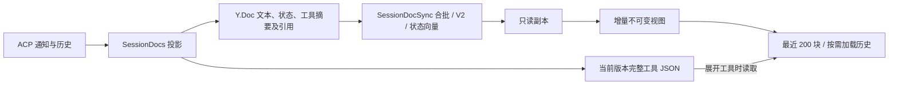

# SDK Yjs 存储与通信优化结论

日期：2026-10-05。范围：`npm-packages/@peri-sdk` 的进程内展示存储、单向复制、读取视图和演示页面。Rust Session Store 与 ACP 仍是持久化和命令的权威。实验基线为 `567640f1837771442628970a56ce68c5a8f8e256`。

## 已实现的结构

- **大工具载荷隔离**：JSON 超过 4,096 UTF-8 bytes 时，热文档只保存版本引用、字节数和最多 512 字符预览；完整 JSON 由 `readPayload` 按需读取。替换、compact/rewind 和销毁释放过期载荷。Chat schema 升为 2。
- **投影索引**：工具保存所属 entry，turn 索引约束终态扫描范围；跳过重复状态写入，canonical 工具去重采用 Set。
- **增量视图**：按 Yjs transaction 失效缓存及引用依赖，复用未改变的 entry/block/tool；历史快照不可变。不承诺所有更新严格 O(1)，变化 entry 的 block 数组与历史顺序仍需遍历。
- **合批通信**：默认 16 ms / 64 KiB / 256 updates 触发；收集 V1 增量，合并后每批转换一次 V2。会话两文档共用序号，断线以真实状态向量补齐，包括未推进向量的删除。新 producer generation 替换整个副本。
- **控制积压**：每个异步订阅者默认 4 MiB，包含在途更新；超限断开并报告恢复所需错误。每个订阅者独占 buffer，可转移给 Worker。`close()` 等待已接纳发送，取消订阅可中止。原始诊断流限制为 1,024 events / 约 4 MiB，溢出不阻断状态投影。
- **演示页面**：默认只发送文档；诊断事件显式开启。最近 200 块、历史按需展开、DOM 节点复用、长文本显示尾部并提供全文下载；工具展开后才请求完整载荷。SDK 主入口与 `/view` 共用外部 Yjs 依赖，避免类型身份分裂。

协议和使用约束见 [SDK README](../../npm-packages/@peri-sdk/README.md)，模块入口见 [代码索引](../code-index/peri-ts-sdk.md)。

## 测量结果

Bun 1.4.2、Yjs 13.6.33、Apple M5 Pro；固定生成器，独立进程串行采样三次，下表为中位数。旧路径和候选使用相同工作量并校验完整工具内容、顺序、归属和终态。

| 指标 | 基线 | 最终候选 |
| --- | ---: | ---: |
| 12,000 工具投影 | 1,740.88 ms | 143.53 ms |
| 默认热快照 | 115.98 MB（V1） | 23.06 MB（V2） |
| 128 次视图总耗时 | 2,883.21 ms | 50.35 ms |
| 单次视图更新中位数 | 22.10 ms | 0.338 ms |
| 未变工具对象复用 | 0 / 128 | 128 / 128 |
| 16 MiB 流的增量帧 | 16,389 | 265 |
| 16 MiB 流的 JSON/base64 body | 25.19 MB | 22.41 MB |
| 实际 SSE adapter 流式完整耗时 | 186.80 ms | 180.90 ms |

工具投影约快 12 倍；默认热快照减少约 80.1%；视图单次约快 65 倍；流式帧数减少 98.38%，JSON body 减少 11.04%。**单独流式耗时应视为近似持平**：三次样本、未随机交错，不支持小幅差异的显著性结论。时间包含生成、投影、adapter base64 编解码、复制应用和最后 flush/close；不包含真实网络、JSON.parse 或浏览器绘制。

**组合场景**先放入 12,000 工具历史，再追加 16,384 × 1 KiB 文本，每 64 分片让接收端视图发布。相同 120 秒 / 2 GiB 进程预算：

- 候选三次全部完成，最终 12,000 工具及 16 MiB 文本精确一致，257 次视图发布、257 次未变工具复用；流式阶段中位 327.62 ms，全场景中位 939.62 ms，峰值 1.72–1.81 GiB。
- 基线三次分别在 2,752 / 2,816 / 2,816 分片时超过 2 GiB，未完成最终全文校验。**不计算组合全程加速倍数**。
- 一组与构建重叠的早期基线已标为无效并保留，正式结论只使用之后串行重跑的数据。

## 代价与适用范围

1. **热同步缩小不等于总数据缩小。** 12k 工具的完整外置结果还有 98.96 MB；热 V2 加全部结果共 122.02 MB，比旧完整快照多约 5.21%。全文保留在 host 内存中，未实现压缩、持久化 blob 服务或无限量数据卸载。
2. view 场景峰值 RSS 从 971.70 增至 1,074.06 MiB（约 +10.53%）；tools 场景从 1,456.53 降至 1,289.75 MiB。峰值包含副本、临时编码、视图和全文验证，不能当作常驻 heap 或归因到某一模块。
3. 组合候选接近资源预算；不能保证更大载荷、多客户端或任意 2 GiB 容器都适用。真实网络吞吐没有测量。
4. 初始快照独立于增量队列预算，仍可能很大；长文本仍完整保存在 Y.Text。长期反复 compact/rewind 的 Yjs 删除历史没有自动重建 generation 的机制。
5. payload 引用只在当前 SessionDocs 生命周期及版本内有效；重启经 canonical ACP 历史重建。旧客户端须适配 schema 2 和按需载荷字段。Rust 侧历史回放完整性的已有边界不由本次改动扩大承诺。

## 验证与证据

实验记录按顺序保留回归、修正和重新验证：

- [计划](00_plan.md)、[第一轮基线](01_experiment_report.md) / [验证](01_verification.md)。
- [第二轮](02_experiment_report.md) / [验证](02_verification.md)：发现逐事件 V2 增加流式耗时，筛选每批转换策略。
- [第三轮最终候选](03_experiment_report.md) / [验证](03_verification.md)：补齐公平的真实 SSE adapter 路径。
- [第四轮组合](04_experiment_report.md) / [验证](04_verification.md)：原始数据、截断和排除项可复核。
- [运行与复现方法](../../npm-packages/@peri-sdk/benchmarks/README.md)：确定性生成器、各轮源码及 harness 归档、运行时和文件指纹均保留。

契约测试覆盖大载荷全文、引用退休、不可变快照、远端重复失效、回放/rewind、销毁、断线删除恢复、丢帧与换代、慢订阅者、异步尾帧关闭、广播重入和 Worker buffer 转移。真实 HTTP SSE 测试覆盖重连与诊断默认关闭，公开构建入口测试覆盖共享 Yjs 类型。

交付验证与最终对抗审查见 [交付检查](delivery.md) 和 [独立对抗审查](adversarial-review.md)。两项关闭时序缺陷已修复并独立复验；最终构建与类型检查通过，完整测试 137 passed / 1 failed，唯一失败为基线 SDK 同样可复现的 WASM 远端存储启动错误。
