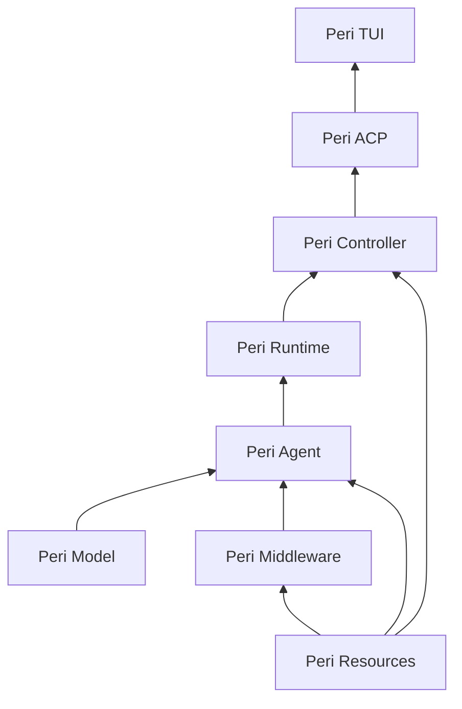
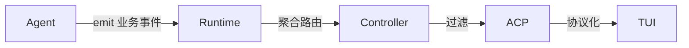
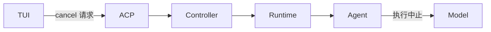
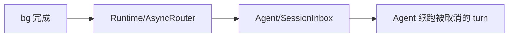

Peri 3.0 架构

> 3.0 全新分层 | 日期：2026-08-05 | 修订：v3.9（时序契约 + cancel 与 MQ 语义）

0. 依赖规则

禁止跨层调用，依赖只能沿声明边单向。箭头 = 提供方向：

- 边含义：Model 提供协议能力；Agent 提供 session 运行单元；Runtime 提供多 session 编排；Controller 提供业务操作；ACP 提供协议服务；Middleware 提供 Hook 实现；Resources 提供外部数据抓手
- 未声明边一律禁止
- crate 依赖方向进 CI 验证

归层判据（三问定层）：

问 1：状态活多久？

- 跟着 session 活 -> Agent（聚合根内）
- 跟着进程/多 session 活 -> Runtime
- 跟着一次调用活 -> 局部，不跨层

问 2：东西从哪来？

- 内部业务状态 -> 按问 1
- LLM 协议形态 -> Model（协议适配层）
- ACP 协议形态 -> ACP
- 外部系统（文件/网络/服务）-> 通道归 Resources，持有按问 1

问 3：给谁用？

- 界面呈现 -> TUI（View 层，仅经 ACP 拿数据）
- 组合多源决策 -> Controller
- 旁路观测 -> 独立观测通道，不参与业务链路

优先级（双命中时）：

1. 通道与持有分离：外部数据的访问通道一律归 Resources；状态持有按问 1
2. 生命周期优先于消费：持有层由问 1 定，消费层只拿只读引用
3. 盲区兜底：协议适配 -> Model；业务切面 -> Middleware；界面 -> TUI；跨层接口契约 -> peri-acp-types
4. 按 1-3 顺序裁定，不另行讨论

1. Peri Model 层

- 协议适配：openai + anthropic 双协议 adapter
- 协议消息统一抽象：ModelMessage/ModelStream（仅协议形态，不含业务语义）
- 流式抽象：统一流式输出接口（ModelStreamEvent）
- 最底层，无依赖

2. Peri Agent 层

- session 生命周期容器：Session 创建/运行/销毁全生命周期归此层
  - 聚合根原则：归此层的职责以 session 生命周期为界；session 是聚合根，本节职责范围由此自洽
  - AgentGroup（agm 理念：Agent 平等、管线通讯）
  - frozen data 构建与持有：session 创建时从 Resources 拉磁盘数据（CLAUDE.md/skills/日期）冻结；subagent 创建时 copy
  - Session 级 hook（on_session_start/end）随 session 归此层
- subagent 创建：SessionFactory::spawn_subagent(parent, config)
  - 建 thread：经 Resources 存储，parent_thread_id 挂父子链
  - 建 session：transcript 绑定存储（with_persistence）
  - 运行 + 结束：更新 agent_status
- async tasks manager：异步 shell 实际执行、bg agent、cron、channel 触发
  - BackgroundTaskRegistry 归此层统一管理：per-session 实例化，随 session 创建/销毁（生命周期/取消/事件跟随 session）
  - Middleware 只做定义与启动发起，不持有管理权
  - 任务启动执行（进程 spawn/进程组/超时/输出收集）在此层
- 消息统一：MessageType（Human/Ai/Tool/SystemReminder，v2 BaseMessage 更名；协议转换在 Reason 阶段）
- MQ 消息管理：MessageQueue（Prompt/Defer/Info + MessageSource）
- RCRA 循环：Receive -> Compact -> Reason -> Act，Receive 为唯一退出口
- Hook/Middleware 统一抽象：MiddlewareHook trait
- Middleware 链装配：session 初始化时构建（数据自 Resources；事实源自 peri-acp builder 迁入，ARC-MIDDLEWARE-001 同步迁）
- cancel 最终执行权：Cascade/Independent 判定与终止执行归此层，上层仅传递，Model 执行中止

3. Peri Runtime 层

- 多 session 编排器：创建/销毁 session（经 Agent 层工厂）、事件聚合路由、调度
- 无状态：唯一持有 `session_id -> SessionHandle` 映射
  - 不持有 session 状态、无持久态、无业务配置
  - 其余全部注入，状态在 Agent 层各 session 内

4. Peri Middleware 分片

- 实现 MiddlewareHook，聚合业务模块：FS/Goal/SubAgent/HITL/...
- MCP：薄封装 Resources 层 MCP 管理为 middleware（工具注册/执行桥接），连接状态从 Resources context 获取
- bg：任务定义 + 启动发起（调 Agent 层 TaskManager 接口），不持有管理权
- 外部依赖一律经 Resources context，不直接触碰外部系统
- 切面 = hook 挂载 + 工具声明 + prompt 贡献 + 条件守卫

5. Peri Resources 层

- 外部系统门面：抽象外部数据，对上提供抓手
  - peri-config：直操配置文件（settings.json 等）
  - peri-sessions：直操 sqlite（session 持久化、transcript；SqliteThreadStore 实现迁入）
  - MCP 状态维持、HITL broker、secret
- 不解释业务语义：只保存与适配状态（存储/配置/连接）；重实现仅限协议适配且显式声明
- 以 context 形式提供给 Agent / Middleware / Controller

6. Peri Controller 层

- 控制面：lite params -> pick Resources -> pick Runtime -> run Session -> pop events
  - lite params 定义：session 标识、agent 定义引用、cwd、初始输入
  - 其余上下文由 Controller 从 Resources 组装注入
- 事件聚合/过滤（业务事件 -> 协议化前的出口）
- cancel：`Controller::cancel(session_id, policy)` -> Runtime 查映射 -> Agent 执行判定 -> Model 中止
  - 只定位与转发，不解释取消语义
- 观测：横切面旁路，非业务职责
  - 采集点分散各层：Model 层 token/调用、Agent 层 stage/turn、Controller 操作、ACP 事件
  - 汇聚：观测事件随主事件流走，在协议化前分支给 Langfuse bridge
  - bridge 是事件流旁路消费者（装配在 Controller 侧宿主），不承担 Controller 职责
  - 关联靠身份牌（session_id + turn_id + agent_id），不改变业务链路

7. Peri ACP 层

- 纯协议实现：ACP 协议适配，不承载业务
- 事件协议化映射、caps 门控
- 全部客户端（TUI/CLI/stdio/IDE/print）一律经 ACP

8. Peri TUI 层（View 层）

- 职责：把 ACP 传来的数据映射成界面呈现（渲染）
- cli = 启动接口：装配 View 与 ACP 客户端，不承载业务
- print = 同层轻量渲染客户端（无界面，输出文本）
- 只经 ACP 拿数据，不触碰业务层

9. 横切面

事件链路：

cancel 链路：

事件契约：

- 事件携带 turn_id + agent_id；session_id 由 Runtime 聚合时按 session 维度补打（Agent 层事件不携带）
- 同 session 事件带单调序号（session_seq）
- terminal 事件必须位于该 turn 全部输出事件之后

身份标识：

- 跨层消息统一携带 (session_id, session_epoch, turn_id, attempt_id)
- epoch/attempt_id 不可复用（防迟到消息命中新 session）

cancel 契约：

- Agent 持有最终执行权，上层仅传递，Model 执行中止
- 幂等：针对 (session_id, turn_id, attempt_id)；重复 cancel 结果一致；turn 终态唯一（Completed 或 Interrupted）
- 优先级：cancel > 续跑 > promote > retry；cancel 后已排队的 resume/promote 全部失效
- cancel ≠ 清除待办：MQ 未消费消息保留，随下次循环消费（作为新 attempt 输入）
  - cancel 请求可带 clear_queue 标志（默认 false）

session 销毁顺序：

- 停收新输入 -> 取消 owned tasks -> join（带 deadline）-> 超时 abort -> 持久化事务收束 -> drain 事件 -> 移除映射

持久真相：

- Thread/transcript = 持久真相；Task = 易失投影
- 重启不复活 Task；遗留 Running/Creating 记录标记为中断

续跑链路（cancel 的镜像）：

错误模型：边界类型化，层内 anyhow

- 跨层边界用 thiserror 枚举，逐层包 context；层内 anyhow 穿透
- 仅三类必须类型化：终止类（cancel/interrupt，防 `?` 误报失败）、可重试类（rate limit/超时，重试策略用）、协议错误（ACP 序列化用）
- TurnError 语义保留 Agent 层（TUI 展示/重试依赖）
- 其余细节错误不逐层映射

compact：RCRA 阶段归 Agent，token 计数经 Model

HITL/secret：broker 经 Resources 注入 Middleware（OnPermissionRequest 在 Middleware）

Task vs Thread：

- Task：内存运行态（registry），bg shell/bg fork，不持久化，生命周期跟随 session
- Thread：持久化实体（sqlite），ThreadMeta + 消息，subagent 必有
- 父子链 parent_thread_id = 父子标记的持久化载体（thread_id = agent_id）

附录：crate 归位

| 层 | crate | 动作 |
|---|---|---|
| Model | peri-model | 不变 |
| Agent | peri-agent | 扩展：Session/AgentGroup/async tasks/frozen/装配迁入；BackgroundTaskRegistry 迁入（per-session 实例化） |
| Runtime | peri-runtime（新） | 薄编排器 |
| Middleware | peri-middlewares | 不变（BackgroundTaskRegistry 定义与实现迁入 peri-agent，Middleware 仅经 TaskManager 接口发起） |
| Resources | peri-resources（新） | 内含 peri-config/peri-sessions 子模块 |
| Controller | peri-controller（新） | Langfuse bridge 自 peri-acp 迁入 |
| ACP | peri-acp | 瘦身：协议/映射/caps |
| TUI | peri-tui | 不变 |
| 契约 | peri-acp-types | 保留 |
| Resources | peri-lsp | resource，被 middleware 使用 |
| Resources | peri-workflow | resource，被 middleware 使用 |
| TUI | peri-web-pty | TUI 层 CLI 命令 |

注：peri-lsp / peri-workflow 为既有 crate，作为 resource 实现接入 peri-resources（包装为 context），不参与分层主链；Middleware 经 context 使用，不直接依赖。
