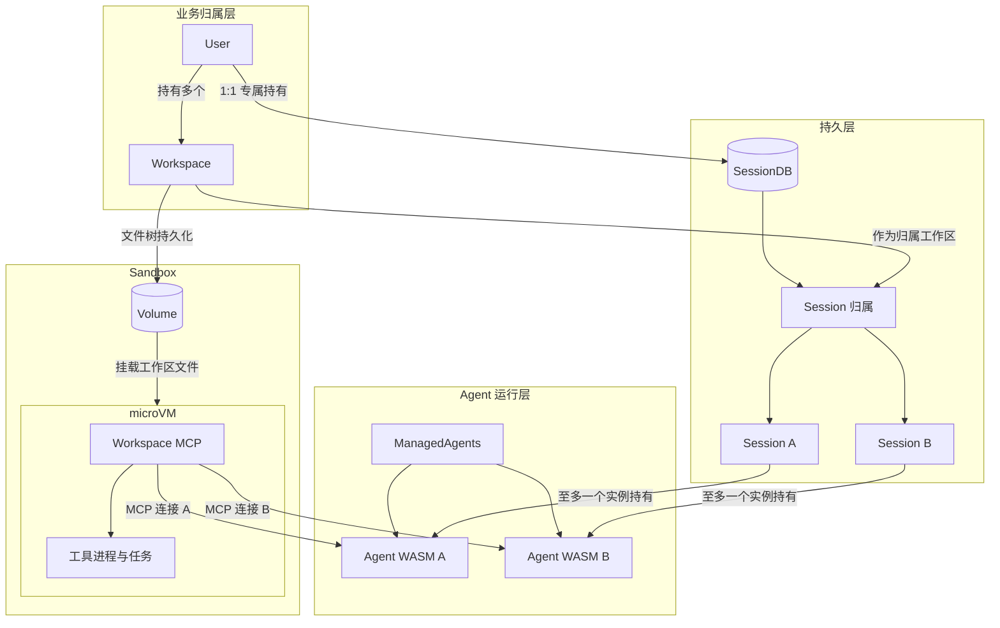

# User、Workspace、SessionDB、Sandbox 与 Agent WASM

> 状态：SDK、Peri 与使用方共同组成的目标部署模型，不是 SDK 的实现清单。一个 User 对应一个 SessionDB 是使用方的业务与部署约束；Peri 持久化的 Workspace / Session 身份遵循 [存储 v2 设计](../../docs/design/storage-v2-machine-workspace-session.md)与 [架构契约](../../docs/standards/architecture-contracts.md)。当前 SDK 接口见 [SDK README](README.md)。

**责任边界：使用方部署 Sandbox 环境，Peri 实现 Agent 核心、Session Store 与 Workspace MCP，TypeScript SDK 负责 Agent 管理和连接这些能力。** 图中的组件同处一张部署图，不表示它们都由 SDK 实现。

## 分层关系

业务归属只有 User 持有 Workspace。Workspace 与 Session 的归属关系由 Peri 的 SessionDB 规则管理：Session 记录引用 Workspace ID，数据库保存并查询该关系；Workspace 不在业务层“包含”Session。每个 User 持有一个专属 SessionDB，每个 SessionDB 只归属一个 User；多个属于同一 User 的 Sandbox 可以连接该库。Peri Store 不记录或校验 User ID，使用方负责将 User、专属数据库和 Workspace 绑定并执行访问授权，不能由数据库地址、Session ID 或 Workspace 路径推断。

Session 在未运行时可以没有 Agent 实例；运行时**至多由一个 Agent 实例持有**。关闭或替换 Agent 不删除 Session。读取历史可以有多个观察者，但观察不构成持有或执行资格。

## 身份与生命周期

| 对象 | 身份和职责 | 生命周期 |
| --- | --- | --- |
| User | 使用方业务层的主体；专属持有一个 SessionDB，可拥有多个 Workspace。 | 独立于运行实例；由使用方识别并授权。 |
| Workspace | 业务上归属 User 的一份文件树；Peri Store 以 `WorkspaceId` 标识，并记录其 Machine 环境。 | 文件树和持久登记可跨 Agent 运行存在。 |
| SessionDB | Peri 的持久化后端，可为本地 SQLite 或 Turso；管理 Workspace 与 Session 的归属关系，以及消息和恢复状态。 | 独立于 Agent WASM。`SessionStorage` 是 SDK 的部署与列表读取接口，写入由 Peri 完成。 |
| Sandbox 环境 | 使用方部署的 Volume、microVM 与其中运行的 Peri Workspace MCP。 | 独立于 Agent 运行，可跨多个 Agent / Session 使用；由使用方负责配置、启动、挂载、监控与回收。 |
| SDK `Sandbox` | 对既有环境的连接与启动配置；`id` 划分 SDK Agent / Session 的 KV 占位命名空间。 | 宿主内存对象，重启后重建；不代表 SDK 实现 microVM 或 Volume。 |
| Session | `SessionId` 是持久身份；读取历史与取得执行资格是不同操作。 | 可在 Agent WASM 退出后按 ID 加载；同一时刻至多由一个 Agent 实例持有并执行。 |
| ManagedAgents | 管理多个 Agent 的创建、占位与关闭；不持有 Session 历史。 | 可重建；运行期由它协调 Agent 实例。 |
| Agent WASM | 一个 Agent 实例及其 WASM 计算核心，持有当前 Session，通过 ACP 消费 Workspace MCP。 | 可替换和重启；关闭后释放运行资源，不删除 Session 历史。 |
| Workspace MCP | Peri 实现的文件、终端、技能等工具与资源服务；使用方可将其部署在 Sandbox microVM 中，SDK 本地示例也可启动普通子进程。 | 可以独立于某次 Agent/Session 运行。 |

`Sandbox.id` 是 SDK 占位作用域，**不是** Peri Store 的 `WorkspaceId`、`MachineId` 或 User ID。新建 Session 的路径由 Agent 提供；恢复时按 Session ID 从 Store 读取持久 cwd。路径不是 Session ID 恢复的所有权凭证。同一 `Sandbox.id` 下的 Session 占位用于协调共享原子 KV 的宿主；执行所有权由 peri-sdk 管理，Peri 不再提供 Store 执行 owner、租约续期或 Workspace 执行 fencing；接入方必须确保共享协调域覆盖所有可能执行同一 Session 的实例。User 授权必须由上层服务单独落实。

目标 Sandbox 是**独立于 Agent 运行的 Volume + microVM + Workspace MCP 环境**：使用方负责提供 microVM、Volume 与部署生命周期，Peri 提供 Workspace MCP 服务程序和工具语义。SDK 的 `Sandbox` 只是宿主内存中的接入对象；它可连接已有 HTTP Workspace，当前本地示例也可启动一个普通 Workspace MCP 子进程。该示例进程不是 microVM。`AgentOptions.sandbox` 引用这个接入对象，`Session.start()` 从中取得 ACP transport、存储部署和 Workspace MCP 地址；Session 路径由 Agent 在新建时提供，加载时从 Store 读取。

## 实现责任

| 责任方 | 提供什么 |
| --- | --- |
| 使用方的业务服务与部署平台 | User 身份和授权；User 与 SessionDB 的 1:1 配置；Workspace 归属；Volume、microVM、挂载、网络与 Sandbox 生命周期；部署 Peri Workspace MCP。 |
| Peri | SessionDB 的 Workspace / Session 归属、消息和恢复；Agent WASM 的执行核心；Workspace MCP 服务程序、工具与任务语义。 |
| TypeScript SDK | `ManagedAgents`、Agent / Session 客户端、执行所有权与原子 KV 占位、WASM ACP transport、`SessionStorage` 接口与只读列表，以及连接外部环境的 `Sandbox` 接入对象。 |

因此，审查 SDK 是否符合本图时，microVM、Volume、User 鉴权和专属数据库配置应检查**接入边界是否可由使用方提供**，不能把它们列为 SDK 尚未实现的功能。Peri 的 Store 和 Workspace MCP 规则也应在 Peri 层验证。

### Sandbox 内部边界

| 组件 | 职责 | 生命周期 |
| --- | --- | --- |
| Volume | 保存 Workspace 文件树；挂载到 microVM，供 MCP 工具读写。它与 SessionDB 分开：代码和文件在 Volume，会话与归属事实在 SessionDB。 | 随 Workspace 持续存在；microVM 或 Agent 重建不删除文件。 |
| microVM | 为 Workspace MCP 和其启动的工具进程提供隔离的运行环境；挂载对应 Volume。 | 可重建，重建后重新挂载 Volume 并启动 MCP；不拥有 Session 历史。 |
| Workspace MCP | 固定服务一个 Workspace 根，暴露文件、终端和资源能力，并管理其工具任务。 | 可服务多个 Agent 的独立 MCP 连接；不随某个 Agent 关闭。 |
| 工具进程与任务 | 由 Workspace MCP 在 microVM 中启动和管理，作用于已挂载的文件树。 | 归 Workspace MCP 管理，不能把 Agent 断开等同于任务结束。 |

使用方可在 Sandbox 环境中部署 Peri Workspace MCP；SDK 的 `Sandbox` 接入对象接收其 URL，并将其作为每个 Agent WASM 的会话级 MCP 配置。每个 Agent WASM 自行建立连接；共享的是服务端和固定的 Workspace 根，不是同一个 MCP client 连接或一个可被请求切换的工作区。Agent 也可用自身的 `mcpServers` 增加其他 MCP 服务；不能覆盖 Sandbox 提供的 `workspace` 名称。

图中的 Agent WASM 是目标部署形态。当前 SDK 的 `ManagedAgents` 管理 TypeScript `Agent` 对象，`Sandbox.transportFactory` 可启动 WASM ACP 实例；Native 部署仍可通过 stdio 启动 Peri 子进程。WASM 部署的 Workspace 工具由外部 MCP 提供；持久存储、工具环境和计算实例不要求同处一个进程。图不表示普通浏览器或托管 Workers 已通过生产部署验收。
