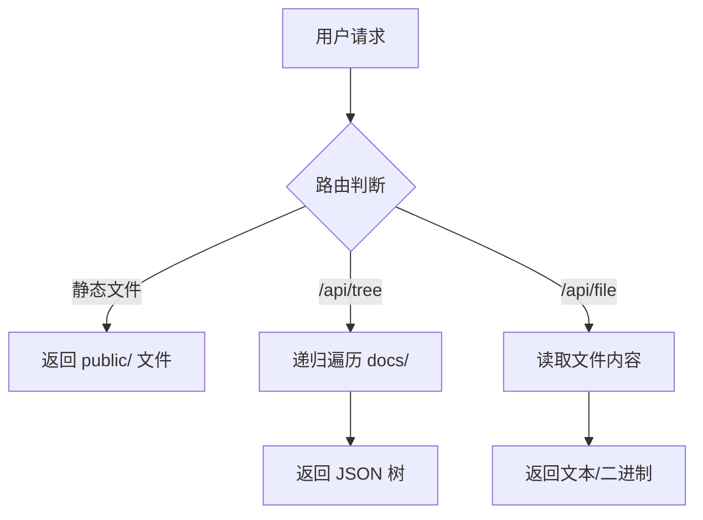
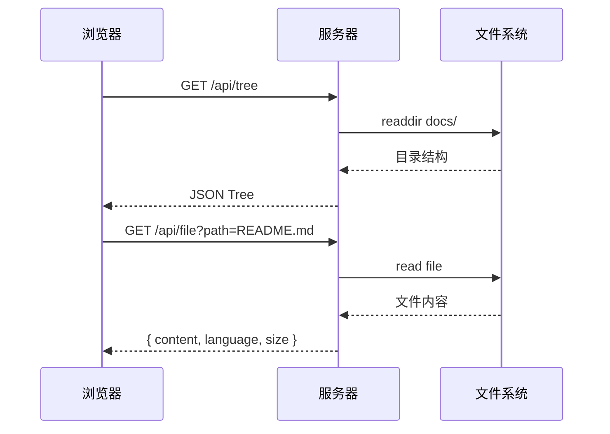
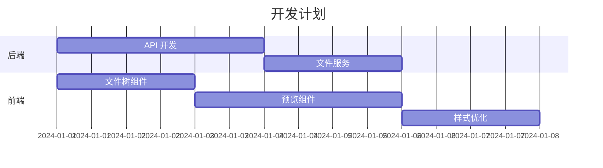

# Site Project — 文档站点预览系统

基于 **Bun + TypeScript** 的轻量级文档预览站点。

## 功能特性

- 📁 **侧边栏文件树** —— 递归遍历 `docs/` 目录，支持折叠/展开
- 📝 **Markdown 全功能预览** —— 表格、代码高亮、引用块、列表
- 🎨 **Mermaid 图表** —— 流程图、时序图、甘特图
- 💻 **代码高亮** —— 支持 30+ 语言
- 🖼️ **图片预览** —— PNG / JPG / GIF / SVG / WebP
- 🎯 **拖拽调整** —— 侧边栏宽度可拖拽

## 快速开始

```bash
cd site-project
bun install
bun run dev
```

访问 `http://localhost:3000`

## Mermaid 示例

### 流程图



### 时序图



### 甘特图



## 代码示例

### TypeScript

```typescript
interface FileNode {
  name: string;
  path: string;
  type: "file" | "directory";
  children?: FileNode[];
}

async function buildTree(dirPath: string): Promise<FileNode[]> {
  const entries = await readdir(dirPath, { withFileTypes: true });
  // ...
}
```

### Python

```python
def fibonacci(n: int) -> list[int]:
    """生成斐波那契数列"""
    a, b = 0, 1
    result = []
    for _ in range(n):
        result.append(a)
        a, b = b, a + b
    return result

print(fibonacci(10))
# [0, 1, 1, 2, 3, 5, 8, 13, 21, 34]
```

### Rust

```rust
use std::collections::HashMap;

fn main() {
    let mut map = HashMap::new();
    map.insert("key", "value");

    for (k, v) in &map {
        println!("{}: {}", k, v);
    }
}
```

## 表格示例

| 特性 | 支持 | 备注 |
|------|------|------|
| Markdown | ✅ | marked.js 渲染 |
| Mermaid | ✅ | 流程图/时序图/甘特图 |
| 代码高亮 | ✅ | highlight.js 30+ 语言 |
| 图片预览 | ✅ | PNG/JPG/GIF/SVG/WebP |
| HTML 预览 | 🔜 | 计划中 |
| PDF 预览 | ❌ | 不支持 |

## 引用块

> "Any application that can be written in JavaScript, will eventually be written in JavaScript."
> — Atwood's Law

> [!NOTE]
> 这是一个提示块，用于强调重要信息。

> [!WARNING]
> 这是警告块，注意安全风险。

## 任务列表

- [x] 后端 API 开发
- [x] 文件树组件
- [x] Markdown 预览
- [x] Mermaid 支持
- [ ] HTML 实时预览
- [ ] 搜索功能
