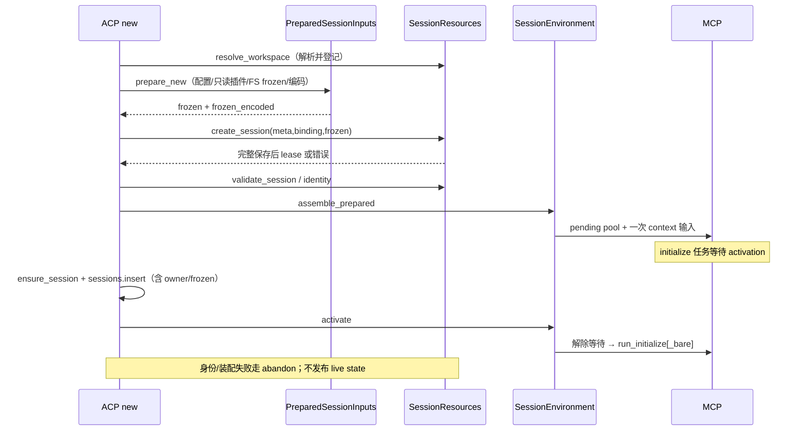
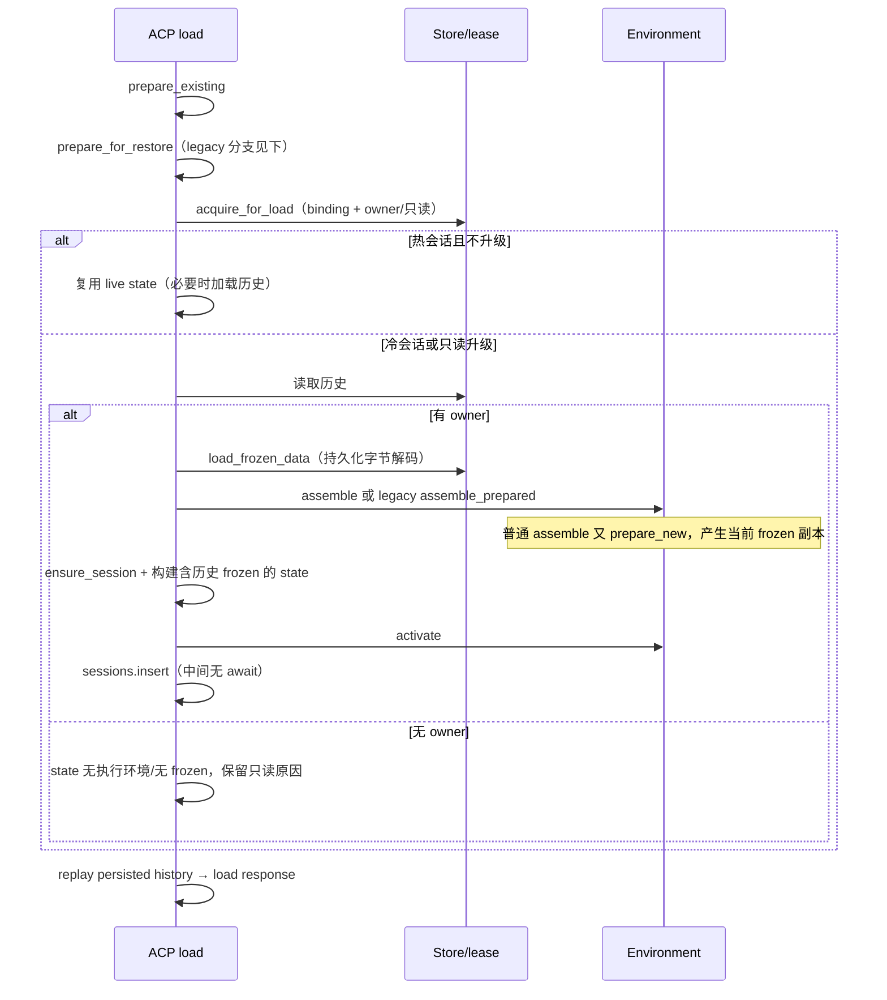
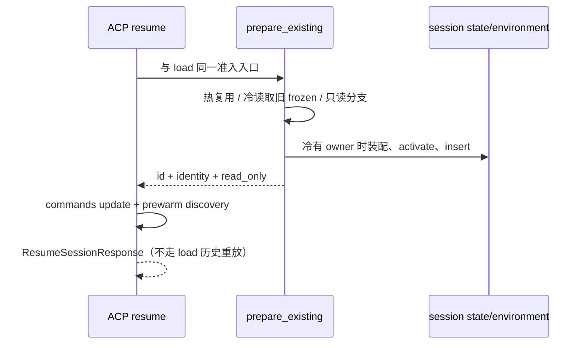
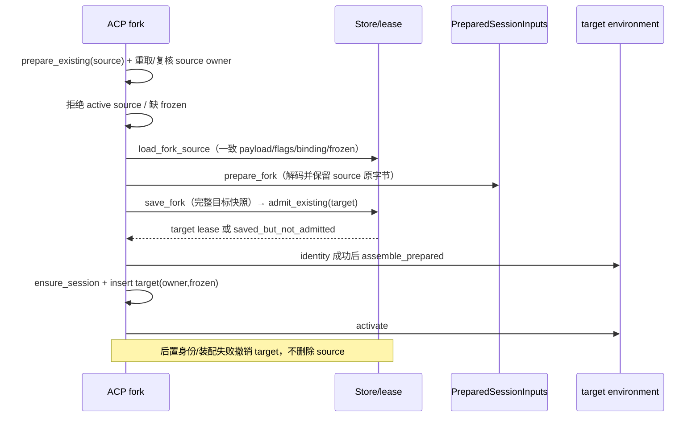
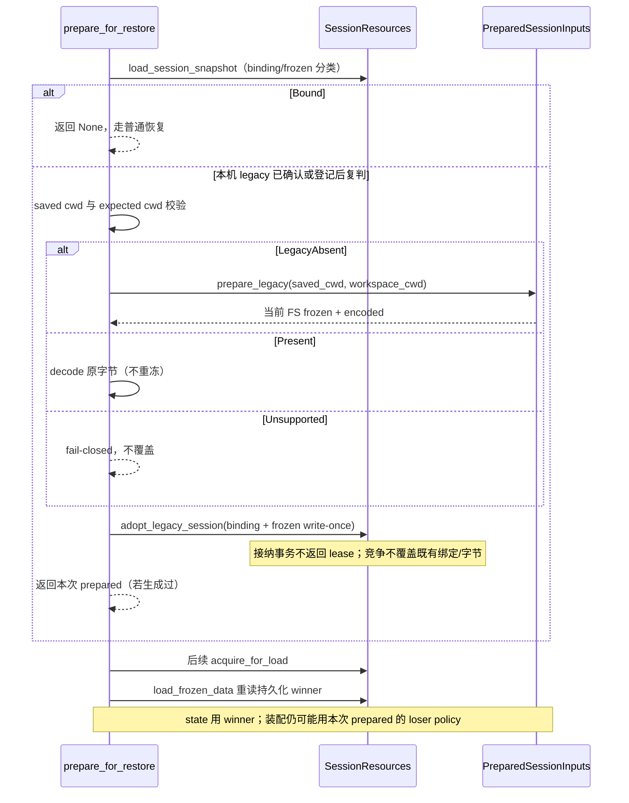

# Workspace MCP resources：W0 取证与裁决记录

> 日期：2026-09-29。状态：**W0 取证已记录；用户裁决待拍板；前置门未通过，禁止据此启动 W1+。**
> 授权来源：本轮用户明确批准“按 plan 分波推进（W0 起）”，并限定本轮只做取证与裁决素材；不是对 X 项推荐的批准。J1–J6 原批准来源按 plan §7.0 原样登记，不重新审议。
> 唯一交付为本文；未修改 plan、代码、配置或其他文档，不 commit。不提供 W1+ 逐文件改动清单、接口实现或施工设计。

## 1. 基线、证据等级与总裁定

- 已通读 `spec/issues/2026-09-29-workspace-mcp-resources-plan.md:1-586`（下称 **plan**），按 `:469` 的 W0 与 `:568` 的 decisions 交付要求取证。
- 仓库 HEAD：`10ccfe7d05522bf2790e150d8a21fd5c76317311`（W0 取证时的快照；J2 深挖期间并行工作提交了 `peri-tui` 变更，HEAD 前移至 `5da95fb9`，本文未读入该批实现）。plan 是未提交 v5，SHA-256：`a005f7e8bea1c93aeb9c501cdc053f96b7c3c3982701b7089da2712b5725f066`。
- 初始工作树已有：`e2e/tui-tester` 子模块工作树变更、未跟踪的 image-upload plan、未跟踪的本 resources plan；本轮不触碰它们。
- **现状**仅指本轮阅读的静态源码，均以 `file:line` 定位；**目标**是已裁决但待实施的要求；**未证实**不能写成能力。历史测试源码仅是待执行的验证入口，不算本轮通过证据。
- 本轮未构建、未运行测试、未启动产品/数据库/MCP 服务，不读个人配置与业务会话数据。原因是唯一可写文件约束：Cargo 构建及测试通常产生其他文件；不能用这些限制下未取得的运行证据宣布成功。

**总裁定（2026-09-29 W0 初版）：不能证明 J2 目标的全路径“无准备期执行、无可执行半会话”。** 当前实现有完整 frozen 先落库、owner 准入、activation 门控及失败撤销；但不存在已核实的“新会话先持 lease 读资源，再提交 frozen”的公开事务能力。冷恢复与 legacy 竞争路径另有 frozen/policy 双来源风险。故 W0 交付是证据与阻塞判定，不是开工许可。

**2026-09-29 更新（X 项拍板 + J2 深挖）**：用户按推荐 A 拍板 X1、X3–X8（§3 各条已更新为生效结论），B0 关闭。J2 针对 B1–B3 的深挖结论见 `spec/issues/2026-09-29-workspace-mcp-resources-j2-feasibility.md`：**条件可行**——缺口已收敛为 3 个可命名的新增原语/修正（`begin_initialization`、`commit_frozen`、装配消费持久 frozen）与 1 条崩溃清理规则，原语形状已给草案；实施须待 W3 且先经用户确认。B1–B3 由“无法证明”降级为“设计已闭合、待实施期运行验证”。

## 2. J1–J6 既定记录与覆盖条款

下表原话/调查结论摘自 `plan:384-389`；“覆盖”区分目标修订与仍须遵守的契约，不代表本轮修改相应文件。

| 项 | 用户原话或 plan 原记录 | 已定影响面 | 精确覆盖、保留及边界 |
| --- | --- | --- | --- |
| J1 | 「system mcp 肯定是摘要在 system prompt 里面，但是如果是直接用户触发，则是全文」 | system Skill 摘要进入冻结 system prompt；用户触发全文；共同校验与 origin 标记，system 不提权。触发术语留 X1。W3。 | 扩展 part-1 `docs/design/mcp-adaptation-v4-part-1.md:170,186` 的宿主 prompt/冻结职责；保留 ARC-FROZEN-001（`docs/standards/architecture-contracts.md:30-34`）、ARC-TOOLS-001（`:54-58`）、ARC-HITL-001（`:66-70`）。覆盖 plan 指出的旧“MCP 不进摘要”口径，不把 URI 塞进 system_mcp_tools。AW3-03 工具集合与 AW3-11 输入时序不因此改变。 |
| J2 | 用户答复「是的」；采纳原 D6 方案 | 拆只读配置准备与受 lease 保护的内容准入/冻结提交；资源读取完成才原子发布可执行 session 与 frozen，失败补偿。W3/W5 前置。 | 改变 `prepared.rs` 同步完成 frozen 的目标时序；part-1 `:170,189` 的冻结归宿仍在 host。ARC-WORKSPACE-001（架构契约 `:11-15`）的绑定/lease 先于执行、ARC-FROZEN-001 的历史精确复用和 write-once 保留。AW3-11（part-4 plan `:99-118`）initialize 前一次输入不放宽；不能以提前 activate 整个环境代替内容准入证明。 |
| J3 | 「Skill Tool 还需要根据其他 mcp 的 skill 从而把控」 | SkillTool / DiscoverSkillsTool 保留宿主，跨 MCP 聚合；只下沉来源。W4。 | **明确覆盖 part-1 `:168` 的“两工具下放 Workspace MCP”目标句**，该句未来须按 J3+J5 修订。part-1 `:81,178` 实例互不调用不冲突：host 是 MCP client。保留 `:176` 的审批/子代理/生命周期宿主边界、ARC-TOOLS-001 与 ARC-MIDDLEWARE-001（架构契约 `:118-122`）；AW3-01 进程内独立实例、AW3-03 七工具表不扩大。 |
| J4 | plan 原记录为「Skill 来源盘点（用户提问的调查回答，非产品裁决）」；结论「不是全部来自 MCP」 | 四类来源、4 个生产调用点；内容通道可收敛，插件 manifest / 第三方目录保留宿主适配；范围由 J5 关闭。 | §7.0 **未提供可摘录的用户提问逐字原话**，不补造。此项是已接受调查记录，不新增覆盖 part-1/AW3/架构契约；与 part-1 `:175` 插件来源合并归宿主一致。该数量是 plan 当时盘点口径，不扩称当前全仓重新审计计数。 |
| J5 | 「Skill Tool 的能力收敛为只有读取 MCP 侧提供的源，Skill Tool 本身要解除对文件系统的依赖」 | 本地三根、插件技能与 builtin 内容归 MCP 侧；工具仅消费 MCP。保留配置/插件 manifest/命令投影等不读取技能内容的 host adapter。W2/W4。 | 与 J3 一起覆盖 part-1 `:168`；具体化 `:167,175` 内容读取与宿主适配边界。**原 X2 已关闭**，不再提供双源/磁盘 fallback 选项。ARC-CAPABILITY-CLOSURE-001（架构契约 `:60-64`）须覆盖资源与聚合来源；ARC-HITL-001 的适用策略留 X6。AW3-04 七工具任意路径行为不改，资源公开根不能冒充原工具沙箱。**交付事实（2026-09-29，W4b）**：宿主技能文件系统读取点已清零——① F2 `SkillsMiddleware::before_agent` 不再扫描（只做 MCP registry → `cached_skills` 投影，零 FS）；② F3 冻结摘要改由 P4 内容准入期的 system 来源快照渲染（`SessionEnvironment::read_workspace_skill_catalog` 只认 builtin `workspace` 身份 + Connected + 未关闭，有界等待、不 block_on；`SkillsMiddleware::render_frozen_summary` 渲染；X5：已声明且被选中却读取失败 ⇒ fail-closed 拒绝创建；X4/X8 类比：面不适用/被关闭 ⇒ 空，不回落磁盘），J1 的 system 摘要投递半边（W3c）随本波落地；③ F4 workflow agent 两工具与链上 Skills/Preload 中间件改接同一 registry（`WorkflowAgentContext.mcp_skill_registry`）；④ F5 子代理预载只查 registry（`lookup_exact` → `lookup_by_command` → 裸名，未命中=缺口报告，不回落磁盘）；⑤ F7/F9 `skills/content.rs` 与 `skills/builtin/`（含 `include_str!` 注册表）删除，provider 成为唯一读取方；⑥ F10 `find_skill_in_list` / `find_skill_content` / `list_skills` / `load_skill_metadata` / `scan_skill_roots` / `scan_dir_recursive` 删除，宿主只剩根解析适配器（`resolve_skill_roots`：路径 + scope/标签）与配置读取（F12，迁至 `peri-middlewares/src/settings.rs`）；⑦ F6 `core:{skill}` 裸名命令改由 MCP 发现管线投影（`project_core_skill_commands` + `CommandRegistry::reconcile`；kind=Skill / source=Core；frontmatter `aliases` 派生别名），构造期扫盘注册与 `SkillsPort::available_skills` 删除；系统来源判定按连接事实（`ConfigSource::Builtin` + 未关闭）写入 `McpSkillRegistry::mark_system_origins`，A24 关闭实例在来源投影处整体剔除（不可发现、不可激活、无绕过）。⑧ F6 关闭位收口（2026-09-29，本轮）：`core:{skill}` 投影的关闭语义两半**同源**——宿主装配从同一份 `disabled_middlewares` 派生 A24 关闭集（workspace 等实例关闭）与 `HostAssemblyInput::skills_face_closed`（`"SkillsMiddleware" ∈ disabled`，链槽关闭），后者经 `BuiltinInstanceContext.skills_face_closed` 随上下文一次注入 pool、由发现管线消费（`run_ensure_discovery` / `run_discovery_with_cache` → `project_core_skill_commands`，为真 ⇒ 既有 `core:` 条目同批撤下且不再注册）；`{server}:{skill}` 发现面、registry 元数据与实例装配不消费该位。证据：`-p peri-middlewares --lib` 全量（新增 `mcp::skill_discovery::core_face_tests` 三条）、`-p peri-acp --lib` 全量（新增 `requests_skill_resources_test.rs::skills_middleware_disabled_hides_core_commands_but_keeps_mcp_face`）。**X1 生效点**：用户显式 slash token（本地 `/skill-name` 由 core 投影的 `AgentPassthrough` 同语义 handler 放行注入；MCP `/server:skill` 由 `McpSkillReleaser`）触发全文，SkillTool 与子代理预载保持既有全文语义但不计作「用户直接触发」。**X5 生效点**：system 摘要读取失败 ⇒ P4 fail-closed（J2 补偿：排空环境 + 撤销未发布创建）；未声明 skills 能力/未连接/未装配池 ⇒ 空（不凭空要求 server 支持）。**X6/X7 生效点**：origin 只取 host 绑定事实（builtin 实例身份），不按名称或资源自称。证据：`cargo test -p peri-middlewares --lib` 1552+8 passed / 0 failed；`-p peri-acp --lib` 771 passed / 0 failed（含 `requests_skill_resources_test.rs` 三条生产路径端到端）；`-p peri-mcp-workspace --lib` 367 passed / 0 failed；静态证据 `peri-middlewares/src/skills/` 无文件系统调用、`scan_skill_roots` 生产调用点为零、`disable_bundled(true)` 波次域隔离常量已删（D2 闭合）。**未完成**：外部 system MCP 的技能进冻结摘要（本轮范围为 workspace origin，按非目标登记）；插件根技能的端到端用例未单列（provider 侧插件 scope 由 W1 用例覆盖）。 |
| J6 | 「metaharness 也是可以挂入 workspace 里面的 resources 里面的，这个就比较简单了，扫描 resources list 即可」 | `.peri/meta/*.md` 来源资源化；host 冻结期 list 后仅 read 启用 section，保持组合规则/契约类型；W3，硬依赖 J2。 | 具体化 part-1 `:170,186` 文件载体下放、prompt 合并/冻结留 host；保留 ARC-FROZEN-001、ARC-MIDDLEWARE-001、AW3-11。扩展 ARC-CAPABILITY-CLOSURE-001 的覆盖来源关闭面；高敏来源白名单与降级留 X7/X8。关闭 workspace 不回落磁盘。**交付事实（2026-09-29，W3b）**：provider 已交付 `peri-meta://workspace/{section_id}`（URI 形状冻结于 `MetaUri`/`meta_uri`/`parse_meta_uri`；`_meta` scope=project；symlink 按 W1 更严口径跳过；不设模板；空文件列出且 read 返回 `""`）；宿主消费切换已交付（`read_builtin_workspace_meta` + `build_frozen_data_with_config_and_runtime_and_docs`），new 路径冻结构建后移至 P3 activate 之后、`commit_frozen` 之前，读取失败按 J2 补偿；legacy 首次接纳保持接纳前构建（J2 §3.1：无执行环境⇒无资源面，覆盖不可得按 X8 保持内置）；`peri-middlewares/src/meta_harness/`（scanner）已删除。**未接线项已闭合（W4a，2026-09-29）**：生产 dispatch（`peri-middlewares/src/mcp/builtin/dispatch.rs`）的 `workspace` arm 现按 `ctx.workspace_resources` 装载资源输入（输入由会话环境装配随 `BuiltinInstanceContext` 一次注入，早于 `run_initialize`；`None` = 资源面未接线），真实会话池的 `resources/list` 已含 `peri-meta://` 条目，覆盖正文的端到端由 `requests_test::meta_resources::{new_session_meta_override_flows_through_builtin_workspace_resources, new_session_meta_override_unavailable_keeps_builtin_and_never_reads_disk}` 两条差分用例锚定（X8 语义不变：实例关闭 ⇒ 覆盖不可得、不回落磁盘）。**本波只接 meta 面**：不装 skill 根 / agent 目录，`disable_bundled = true` 仅作波次域隔离（provider 无域掩码），技能/代理/指令面的接线与消费切换同批归 W4b，届时以宿主配置的真实值替换该位。 |

统一保留：part-4 裁决出处 `spec/issues/2026-09-27-mcp-adaptation-v4-part-4-plan.md:43-47`（AW3-01）、`:62-69`（AW3-04/05）、`:95-118`（AW3-10/11）。AW3-10 不回填 part-1 施工进度；未来只同步获批目标变化。DOC-DESIGN-001 / DOC-UPDATE-001 见 `docs/standards/documentation.md:27-31,39-43`。ARC-MIDDLEWARE-CAPABILITY-001（架构契约 `:124-128`）仍禁止给 StartupState 偷加完整状态权限；ARC-SECRET-001（`:130-134`）贯穿资源 metadata、错误与日志。

## 3. X 项一次性裁决材料

所有原始定义以 `plan:393-433` 为准。**2026-09-29 用户按推荐 A 对 X1、X3–X8 全部拍板**；各条「已裁决」为生效结论，「若不定（照录）」保留为 plan 原始 fallback 记录（已不适用）。X2 由 J5 关闭；J1–J6 不重开。`plan:380,585` 的未定不开工规则对本节已不再触发（X 项已定），但其余阻塞项（B4–B8）与 J2 深挖结论仍按 `2026-09-29-workspace-mcp-resources-j2-feasibility.md` 执行。

### X1：用户直接触发的判定口径

- **问题**：全文触发术语包括哪些入口？
- **选项**：A 仅用户 prompt 中显式 `/skill-name`、`/server:skill` token；B=A+模型 SkillTool；C=B+子代理 `skills:` 预载；D 所有上下文入口（含 system 正文）。
- **推荐 A**：触发者可观察，不依赖模型推断；B/C 保持全文但分别称模型加载/配置预载；D 与 J1 摘要冲突。
- **影响面**：术语、提示词和 W3/W4 验收；B/C 不改变已有全文行为，D 改首批注入量。入口盘点来源 `plan:118-125,218-223`。
- **若不定（照录）**：默认按 A 执行；B/C 入口保持既有全文语义但不计作「用户直接触发」。
- **已裁决（2026-09-29，用户按推荐 A 拍板）**：用户显式 slash token（本地 `/skill-name` 与 MCP `/server:skill`）为唯一「直接触发」口径，触发即注入全文；SkillTool 与子代理预载保持既有全文语义但不计作「用户直接触发」；日后扩口径须显式再裁。

### X3：存量本地语义兼容

- **问题**：FS 归 MCP 后，symlink、深度/数量限制、同名优先、名称规范化及本地 Agent 扩展如何处理？
- **选项**：A 技能公开面禁 symlink、wire frontmatter 不改写、host 派生 CLI alias，本地受信 Agent 保留显式 host profile、远端严格 v1；B provider 全复刻旧扫描/改名；C 全严格 v1、丢弃本地扩展。
- **推荐 A**：避免 wire 身份改写和 symlink 公开风险，同时不无声明删除既有本地 Agent 行为；B 与锁定 Skills 安全规则冲突，C 迁移破坏较大。受信必须是 host 绑定身份，不是 server 自报标签。
- **影响面**：第三方布局、历史 symlink 技能失效登记、同名路由与 Agent 权限字段；W1/W5。现有本地优先级先维持 plan `:324` 的 project→builtin→plugin，跨 origin 不静默覆盖。
- **未定细节**：shadow 项是否公开、非法历史名称处置、精确深度预算、根外 import 授权范围不由 A 自动补齐；需 W1 前明确 profile。不能把 Skills 内部禁隐藏段机械套到 `.claude/AGENTS.md`。
- **若不定（照录）**：默认按 A 执行。
- **已裁决（2026-09-29，用户按推荐 A 拍板）**：技能公开面禁 symlink，wire frontmatter 不改写、CLI 别名由宿主从 metadata 派生；本地受信 origin 的 Agent 保留既定 host 扩展 profile，远端严格 v1；存量 symlink 技能失效面必须登记，shadow/非法名称/深度预算/根外 import 的细节在 W1 冻结（不得由 A 自动补齐）。

### X4：关闭与项目指令 profile

- **问题**：项目指令如何承载，workspace/子能力关闭如何覆盖资源、来源和发现面？
- **选项**：A 私有普通 resources（可带索引）、不伪装 Skill，关闭来源即不可发现/激活，无 FS fallback；B 项目指令例外继续 host 读盘；C 仅隐藏工具，仍可读资源。
- **推荐 A**：与 J5 及完整关闭契约一致；B 是目标例外，C 留下 URI/缓存绕过路径。
- **影响面**：ARC-CAPABILITY-CLOSURE-001、DOC-LOADER-001、W1/W5、历史快照展示与执行授权区分。**关闭 workspace 只移除本地来源，不等于删除 host 两工具或关闭其他仍可用 origin**；两工具自身关闭另依 session policy。
- **若不定（照录）**：默认按 A 执行（scheme 名待 W1 冻结；关闭采用策略键三入口一致矩阵）。
- **已裁决（2026-09-29，用户按推荐 A 拍板）**：项目指令以私有普通 resources（含可选索引）承载、不伪装 Skill；关闭 workspace 或子能力时本地来源同时不可发现、不可激活，且任何组件不得回落磁盘；历史快照可展示但不构成执行授权；scheme 名与关闭矩阵细节在 W1 冻结。

### X5：规范承诺范围与失败语义

- **问题**：directoryRead/依赖编排承诺、system 必选投递失败、单 origin 故障如何处理？
- **选项**：A 不声明 directoryRead、不自动依赖编排且明示不消费；system 已声明且被选中的投递失败 fail-closed；单 origin stale/不可用，其余继续；其余失败为空并告警；B 完整编排及依赖底线（含环）；C 全部失败仅告警。
- **推荐 A，但必须明示这是受限 Peri profile**：限制首期范围并保护必选冻结输入，不能承诺完整 MCPP。锁定正文 §5.7.1 含激活前依赖解析 MUST；“编排可选”不能抹去此冲突。带依赖声明的技能在不消费 profile 中可否激活仍需明确（保守建议拒绝并报告缺口），不能默认为忽略依赖后照常激活。
- **影响面**：W1 能力声明、W2 激活、W3 首请求 readiness；空能力/不适用不是 RPC 失败。origin 隔离降级不能盖过选中 system 来源的致命失败。
- **与 X8 的交叉推荐**：MetaHarness 按 X8 作为可选覆盖特例；只因覆盖不可得可退内置，但同一 workspace 的其他必选 system 输入失败仍按 X5 拒绝。此优先关系随本项 A 裁决一并生效（见下方生效结论）。
- **若不定（照录）**：默认按 A 执行，且不得对外宣称已完整符合 MCPP。
- **已裁决（2026-09-29，用户按推荐 A 拍板）**：采用受限 Peri profile——首期不声明 directoryRead、不实现自动依赖编排且明示不消费；因锁定正文 §5.7.1 含激活前依赖解析 MUST，带依赖声明而宿主不消费编排的技能按保守策略**拒绝激活并报告缺口**（不静默忽略依赖）；system 已声明且被选中的投递失败 fail-closed，单 origin 故障按 stale 隔离、其余来源继续，其余失败为空并告警；对外不得宣称完整符合 MCPP。**交叉优先关系随本裁决生效**：MetaHarness 覆盖按 X8 可退内置，但同一 workspace 其他必选 system 来源失败仍拒绝创建。

### X6：本地来源信任与批准

- **问题**：本地 Skill 经 MCP 后沿用免逐技能批准，还是统一内容绑定批准？
- **选项**：A origin 分级，本机受信来源免逐技能批准但必校验，外部保持批准语义；B 全部逐技能批准；C 全部免批准。
- **推荐 A**：保留本地体验，不扩大外部信任；origin 须来自 host 实例/连接事实，不能仅凭名字 `workspace`、scheme 或 `scope=builtin` 认定。Skill 批准不代替工具审批，也不代替远端 Agent 内容/能力绑定批准。
- **影响面**：HITL、批准缓存键、内容漂移、W2/W4/W5；当前 MCP Skill 各入口是否已有等价批准路径不能仅凭 plan “维持现有”认定，需逐入口验证。
- **若不定（照录）**：默认按 A 执行（本地来源仍校验内容完整性，但免逐技能批准弹窗）。
- **已裁决（2026-09-29，用户按推荐 A 拍板）**：按 host 绑定的 origin 分级——本机受信来源免逐技能批准，但仍必须 digest/frontmatter 校验与 origin 标记；外部 origin 维持内容/能力绑定批准（内容或能力变化重新批准）。origin 只能来自 host 实例/连接事实，不得由名字或 self-claim 认定；Skill 批准与工具审批相互独立。

### X7：MetaHarness 来源白名单（J6）

- **问题**：同 scheme 外部资源能否覆盖系统提示词段落？
- **选项**：A 仅 workspace 实例；B 任意已批准 origin，另加内容/digest 批准；C 不允许资源覆盖。
- **推荐 A**：系统段落替换比普通 Skill 内容更敏感，拒绝外部同 scheme 进入扫描并记录；以 host 绑定实例身份判断，不按文本名称信任。
- **影响面**：W3、prompt 信任边界、ARC-HITL-001 和 MetaHarness 说明；C 与 J6 相悖。
- **若不定（照录）**：默认按 A 执行（外部 origin 的 `peri-meta://` 资源不被消费；scheme 名待 W1 冻结）。
- **已裁决（2026-09-29，用户按推荐 A 拍板）**：只消费来自真实 workspace（本机受信）实例的 `peri-meta://` 资源；外部 origin 的同 scheme 资源一律拒绝并记录（不静默），不进入覆盖扫描；判定依据是 host 绑定的实例身份，不是资源文本自称；scheme 名在 W1 冻结。
- **交付事实（2026-09-29，W3b-consumer）**：宿主实现按实例身份过滤——只取 `ConfigSource::Builtin { instance: "workspace" }` 且 `Connected` 的句柄（`peri-middlewares/src/mcp/client.rs::read_builtin_workspace_meta`），外部 server 即使占用同名 `workspace` 也不被消费；无线级「外部同 scheme」用例（crate 内单测锚定身份判定），W3b 报告登记为未验证项。

### X8：MetaHarness 关闭与失败（J6）

- **问题**：workspace 关闭/资源缺失/read 失败是否阻塞创建？
- **选项**：A 告警并保持内置段落，不因覆盖失败阻塞，不读磁盘兜底；B enabled=true 而不可得即 fail-closed；C 静默忽略。
- **推荐 A**：保持现有可选覆盖的可用性语义，告警可观察；X5 的其他必选输入仍不能降级。当前 `frozen.rs:207-224` 为 true+缺失 warn、false 不覆盖。
- **影响面**：W3、关闭矩阵、DOC-LOADER-001、MetaHarness 用户说明。provider list 空与 read 错误应可区分，不把静默空成功当告警降级。
- **若不定（照录）**：默认按 A 执行。
- **已裁决（2026-09-29，用户按推荐 A 拍板）**：覆盖不可得（workspace 关闭 / 文档缺失 / 读取失败）一律 warn 并保持内置段落、不阻塞会话创建、不回落磁盘读 `.peri/meta`；「关闭 workspace ⇒ 无法覆盖系统提示词段落」进入关闭矩阵（ARC-CAPABILITY-CLOSURE-001 面）并与 J5「本地技能不可用」并列登记；与 X5 的交叉优先关系已在 X5 生效结论中确立。
- **交付事实（2026-09-29，W3b-consumer）**：缺失文档 warn + 保持内置（`build_meta_harness_state` 逐字保留）；关闭集命中直接返回空批（`read_builtin_workspace_meta`）；读取失败在 new 路径按发布前失败走 J2 补偿（排空环境 + 撤销未发布创建，不进入 `commit_frozen`）；宿主 `.peri/meta` FS 读取点与 `peri-middlewares/src/meta_harness/` 一并删除（零 FS 兜底）。legacy 首次接纳无执行环境 ⇒ 覆盖不可得（保持内置），已由 `requests_legacy_test` 用例锚定「不得从磁盘读取段落覆盖」。

## 4. 规范锁定与协议口径

### 4.1 可复核基线

| 对象 | 本轮锁定/证据 | 边界 |
| --- | --- | --- |
| rmcp | `Cargo.toml:98` 声明 3.1.4，`Cargo.lock:5264-5266` 实际解析 3.1.4。SDK 源码根为 `/Users/konghayao/.cargo/registry/src/rsproxy.cn-e3de039b2554c837/rmcp-3.1.4`（下称 SDK）。 | 包版本不等于 wire 协议版本，也不是 MCPP 版本。 |
| MCP 核心主基线 | **2026-07-28**；仓库引用 `docs/reference/mcp-ecosystem.md:305,411,749`；生产 `peri-middlewares/src/mcp/client/transport.rs:29-37` 首选 V_2026_07_28，显式配置走 Discover，缺省 Auto。 | SDK `src/model.rs:169-186` 同时支持历史版本，但 LATEST 仍是 2025-11-25；不能据 LATEST 误称 builtin 用旧协议。Auto 可回退 legacy，不强行让所有外部 server 使用新订阅协议。 |
| MCP resources 官方来源 | `https://modelcontextprotocol.io/specification/2026-07-28/server/resources`（来自仓库上述引用）。本轮内存抓取成功，无重定向；响应 534992 字节，SHA-256 `58aac6a4098dac3bd1949118944988152024e4f9f031629c2dda846c2ebd7453`。 | 该 hash 是网页响应取证，不是官方 Git commit，不把渲染页面 digest 当规范版本号。核心口径按日期版本锁定；本轮未逐条审计整个核心规范。 |
| Skills/Agents 约定 | plan `:37-40` 引用的 `https://raw.githubusercontent.com/KonghaYao/mcpp/main/MCPP/mcp-skills.md`；本轮内存读取 UTF-8 原始字节 **27313**，SHA-256 **`589a8b8839927a7f41b334e34c50e72328f7bdbddfd4ea581f4973ae68f7829b`**。 | 以此内容 digest 锁定本轮 §5.1–§5.10.4 审阅基线；未取得 commit。未来抓到 main 不同 digest 必须报告差异，不静默换基线。没有额外落盘副本。 |

Skills 正文取证行：`:21-33` frontmatter，`:79-112` URI/安全/权威身份，`:116-120` list/get/directoryRead，`:138-143` 发现/缓存，`:152-155` 完整性与恢复，`:178` depends_on MUST，`:245-246` origin 与双入口等价，`:299,306-310,316-328` Agent 字段/批准/能力，`:334` 更新失效。此处行号指上述 digest 的外部正文，不是仓库文件。

**范围锁定不等于完整符合**：Skill/Agent 采用该 MCPP 约定，不把它误称 MCP 核心内置 Skill 方法；项目指令与 MetaHarness URI 是 Peri 私有 profile。第 9 章扩展声明、第 10 章批准和第 7.3 章缓存完整规则尚未取得同版本证据，仍是阻塞。二次尝试补读同一 raw 来源超时（exit 1），不影响首次已取得的 digest，也不伪称复抓成功。没有证据比较 plan 原抓取版本与本次正文是否逐字相同，不能声称“规范零差异”。

### 4.2 本计划所依据的协议边界

- list 是 metadata，read 才是内容；技能权威清单不由 URI scheme 替代。Skill 附件懒读、逐字节 digest 校验、frontmatter 全字段匹配；read 不授权执行。
- `skills/list` / `skills/get` 是 custom requests，不是 `tools/call`；Agent 用标准 resources，无 `agents/list|get`。
- 本轮确认 workspace 已有 2026-07-28 git 订阅；**不新增目录/技能订阅能力承诺，不得撤销已有 git 订阅能力**。plan `:183` 的“不声明 subscription”只能理解为新增资源未实现的能力，不能再泛指整个 workspace。
- X5 A 与 §5.7.1 的 MUST 有明确偏离，须按受限 profile 标识；不以推荐掩盖规范差异。

## 5. W0 可确定的 API 形状、失败与回滚

### 5.1 已有与目标分列（非新接口设计）

| 面 | 现状（静态证据） | 目标/未定 |
| --- | --- | --- |
| rmcp custom hook | SDK `src/handler/server.rs:223-226,503-515`：`on_custom_request(&self, CustomRequest, RequestContext<RoleServer>) -> impl Future<Output=Result<CustomResult,McpError>> + MaybeSendFuture + '_`；默认 METHOD_NOT_FOUND。`src/model.rs:948-975`：method:String、params:Option<Value>、extensions。 | SDK 有足够承载面，不需要凭空猜两个 trait 方法；workspace/dispatch 尚无该覆写，端到端 wire 未证实。 |
| 标准 resources | workspace `mcp-packages/workspace/src/workspace.rs:196-248` 已声明 resources+subscribe，list 单条 git ref、read 返回 `ReadResourceResponse::Complete`。dispatch `peri-middlewares/src/mcp/builtin/dispatch.rs:100-142` 转发 list/read/filter/listen。 | Skills/Agents/指令/MetaHarness 尚非现有资源；templates/custom dispatch 仍未接。具体私有 scheme、metadata、分页 revision 不在 W0 定实现。 |
| Skill DTO | host `peri-middlewares/src/mcp/skill_discovery/skills_list.rs:25-66` 已消费 `{skills,nextCursor?,ttlMs?,cacheScope?}`、条目 `{uri,frontmatter,resources?}`、get `{skill:条目}`；`:204` 发 CustomRequest。 | provider 目标为完整 `{uri,digest}` manifest；现 DTO 允许缺 resources 是互通现状，不等于新 provider 可跳完整性。扩展声明 wire 细节仍未定。 |
| host 两工具 | J3/J5 保留 host；plan `:270-273` 已提出 skill_name 字符串与 origin 消歧方向。 | 不在 W0 新定消歧算法/端口签名；仅确认共同 MCP activation、不得 FS fallback。 |
| 会话存储 | `peri-acp-types/src/session_resources.rs:132-139,464-527`：NewSession 必含 frozen；create 返回 lease，abandon 仅撤销未发布新 identity；adopt 输入 frozen，返回 `()`。 | **没有已证实的 reserve/内容准入/commit-frozen 公共协议**。plan 的 ResourceCatalogSnapshot / ResourceContextSnapshot（`:233`）仍是提案名称，不是现存类型。 |
| frozen | `peri-acp/src/session/frozen_snapshot.rs:13-45`：V1，保存 system_prompt、claude_md/local、skill_summary、date、language、MetaHarness；`:47-110` 编解码。 | 不增加 V2 或来源字段；格式变化、迁移和版本回退方案未定。 |

### 5.2 失败与回滚语义

- **已确定目标**：校验失败不注入，关闭来源不发起读取/激活，不回落 host FS；历史 frozen 保持原字节。X5/X8 的失败分类仍待用户裁决，不写成现行能力。
- **协议错误**：Skills 约定规定未知 `skills/get` URI 为 `-32602`；SDK custom 默认 `-32601`；当前 git read 未知 URI 返回 `-32602`（workspace `:237-241`）。其他资源 missing/denied/invalid 细分码尚未锁定，不能直接推广 git 的选择。
- **当前 new 失败**：完整创建后身份复核/装配报错调用 abandon（`session_lifecycle.rs:560-591`）；不是失败后一律“什么都没创建”。远程保存已成功而本机 lease 失败返回 `saved_but_not_admitted`（resources `:403-416`），不确定提交保留不确定性。
- **当前 fork 失败**：先保存完整目标快照，再本机准入，二者非统一事务（resources `:515-549`）；identity/装配失败只撤销新目标，不动 source（lifecycle `:1126-1151`）。
- **当前 load/resume 失败**：已有历史不删除；冷装配错误走 owner.mark_clean（lifecycle `:231-238`），只读准入不建执行环境。不能由此推导“资源准入启动后失败也能安全补偿”，因为当前冻结前还未启动资源。
- **撤销范围**：`sqlite_store/local.rs:118-144` 校验精确活 owner，关闭写准入、等待在途写入、撤销后释放锁；不是通用数据库 rollback，更不能给 legacy 历史套用“删除新 thread”。资源启动后的 cancel/drain/lease 释放组合尚未证明。
- **发布回退目标**：按 plan `:457-459` 完整波次版本回退，不保留本地/MCP 双读或双注册；关闭 workspace 是能力不可用，不是旧 loader fallback。旧二进制遇未来 frozen 版本 fail-closed，不得覆盖 blob。回退可读矩阵尚未确定，本轮不执行回退。

## 6. 全路径顺序图与证明边界

图中均是**当前源码顺序**；`P`=只读准备函数（不是整个 session setup），`S`=存储/lease，`E`=会话环境，`M`=MCP。方法名与生产调用一致。图后的证据与反例是证明的一部分；不能只看成功箭头宣称 J2 已完成。

### 6.1 new

证据：`peri-acp/src/host/requests/session_lifecycle.rs:499-519,529-591,604-651`；`host/prepared.rs:95-138`；`host/workspace.rs:90-133,176-177`；`host/assemble.rs:381-425,535-557`（上述 host 路径均属 peri-acp/src）。**现状是 frozen 先于 lease/MCP，不是资源读完再 frozen。**

### 6.2 load（热、冷、只读）

证据：`session_lifecycle.rs:82-103,104-181,190-239,729-757`；`workspace.rs:51-60,99-104`。**已证实历史 frozen 进入 SessionState；未证实订阅 policy 使用它**：普通 cold load 把历史 frozen 留在局部变量，却让 assemble 调 prepare_new，再用 `inputs.frozen` 导出 builtin_closed。存在配置变化时双来源静态反例，不能把“历史 prompt 不变”扩称“恢复过程不重扫/policy 同源”。

### 6.3 resume

证据：`session_lifecycle.rs:1025-1058`。与 load 共享安全门及当前 frozen/policy 风险，不能因不同 RPC 名误称不同冻结实现。

### 6.4 fork

证据：`session_lifecycle.rs:1061-1164,1169-1200`；`prepared.rs:85-93,122-125`；`peri-resources/src/sessions/resources.rs:515-549`。fork **准备目标**不重渲染 source frozen，但 source 冷准入本身可能走 §6.2 的当前扫描。不能省略这条前置链。

### 6.5 legacy（经 load/resume/fork source 进入）

证据：`peri-acp/src/host/requests/legacy_session.rs:36-108`；`session_lifecycle.rs:94-103,164-179`；`peri-resources/src/sessions/sqlite_store/session_data.rs:342-436`。COALESCE + binding 在一次事务中 write-once；竞争者随后重读 winner 用于 state，但 `legacy_prepared` 仍指向本次生成内容，装配关闭集未显式改用 winner。**竞争下全环境一致性未证明**。

### 6.6 证明义务与当前可得结论

| 证明义务 | 已得证据 | 裁定 |
| --- | --- | --- |
| P 不启动 MCP/LSP/hook/cron 或 Agent 模型执行 | `prepared.rs:95-138,171-189` 仅配置、严格只读插件、环境探测和 frozen；无 SessionEnvironment/run_initialize 调用。`assemble.rs:535-557` 在 activation 后才启动 MCP 初始化。 | 对准备函数的**业务执行资源**边界有静态支持，未取得运行计数。不能扩称整个 new/load 前置都零副作用。 |
| “无准备期执行”若指任何 OS 子进程 | `prepared.rs:105` → `prompt/mod.rs:90-95,470-475`，macOS 通过 `sw_vers -productVersion` 探测系统版本。new 在 P 前 `resolve_workspace`，存储实现 `sqlite_store/workspace.rs:61-72` 开登记事务。 | **字面零进程/零写入不成立**。不把系统信息探测等同模型/工具执行，但须明确验收范围；若要求连此类探测也禁止则阻塞。 |
| 没有缺 frozen 的可执行 live session | new/fork 插入 state 前已有完整 frozen+owner；冷有 owner 先 decode，bound 缺失/未来版本返回错误（lifecycle `:49-70`）；只读 state 无 owner，`workspace.rs:321-328` 与 `prompt_dispatch.rs:72,150` 拒绝执行。 | 正常返回路径有静态支持；不是 J2 改序后的证明，更不是取消/崩溃/并发全证明。 |
| 无资源就绪前可执行半会话 | 现有 activation 在持久化与 state 装配之后；但资源初始化是后台，尚无资源 snapshot/准入成功条件。load 的 activate 在 insert 前，二者无 await，不代表跨任务绝对原子。 | **J2 未成立**；不能提前 activate 整个池然后宣称已隔离。 |
| 历史/fork frozen 与环境 policy 同源 | fork 目标复用原字节；冷 load/resume 重建额外 frozen，legacy winner/loser 并存。 | **后两条无法证明且有静态风险**，阻塞 W3/W5。 |

**已裁决目标的顺序义务（非施工设计）**：只读配置准备 → 绑定/lease 保护 → 受限内容准入 → 成功后冻结/持久化并发布执行资格；失败不得发布且须结清资源/写入/lease。cold load/resume/fork 必须沿用旧 frozen，legacy 竞争必须全体消费者使用 winner。当前 API 无法完整表达前两步到后两步的转换；本轮不发明状态机/API 来填补证明。

## 7. W0 四项技术核实

### 7.1 rmcp 3.1.4 custom-method hook：SDK 已确认，业务 wire 未确认

- SDK 提供 `on_custom_request`、CustomRequest/CustomResult 分派（§5.1），未知方法默认 -32601；resources/list/read/templates 为独立 trait 入口（SDK `src/handler/server.rs:134-146,380-402`）。
- 本库 client 已发 skills/list/get，DTO 与读后校验存在，不代表 workspace server 已实现。当前 builtin dispatch `:51-143` 只覆写 info/tools/resources list/read/filter/listen，没有 custom/templates 转发。
- builtin 经真实 rmcp server + 独立 duplex/task（`peri-middlewares/src/mcp/builtin/runtime.rs:334-368`），不覆写 discover 的纪律仍成立。custom 方法能否在生产 modern/legacy 生命周期、能力声明和错误映射下完整贯通，尚无本轮 wire 结果。

### 7.2 会话准备/lease 事务：有短事务，不具备已证明的 J2 两阶段能力

- **本机 new**：先 OS 锁，BEGIN IMMEDIATE，写 thread（含 frozen）、binding、dirty execution generation，commit 后 register_lease（`peri-resources/src/sessions/sqlite_store/local.rs:297-350`）。具备“完整输入一次提交并准入”，不是“租约先于 frozen 输入”。
- **远程 new**：先 data.save_new_session，再本机 admit_existing，门面明确两次提交与 saved_but_not_admitted（resources `:392-417`）；不能声称跨库原子事务。
- **fork**：即使门面提供一个行为，内部先保存完整快照、再本机准入（resources `:515-549`）；行为封装不等于数据库单事务。
- **legacy**：本机 adopt 原子 binding/frozen，未带 lease（`session_data.rs:342-436`）；远端实现也有 frozen write-once 与 binding SQL（`remote/session_lifecycle.rs:65-74`），本轮不据此宣称跨库 legacy 全路径等价。
- `acquire_execution` 必须先取 session facts 并复核既存 binding（resources `:354-371`），不是未发布新会话的 reserve API。公开 SessionResources 不暴露事务/CAS（types `session_resources.rs:464-527`）。
- **明确阻塞判定**：存储“无事务”这一说法不成立；但把当前事务当 J2 可行性证明同样不成立。new/legacy 的资源先读后 frozen、取消/崩溃恢复、远端不确定提交和已启动资源补偿，均未闭合。阻塞 W3/W5；按 W0 总门，后续施工不得借机先行。

### 7.3 frozen 路径：V1 已持久化，仍是 host FS 来源且恢复装配有偏差

- `peri-acp/src/session/frozen.rs:63-82` 读项目指令、技能扫描及 MetaHarness；`:91-118` 模板渲染后组装 FrozenContext；`prepared.rs:110-124` 编码或复用；snapshot V1 的有序 map/set 编码与未来版本拒绝见 `frozen_snapshot.rs:13-110`。
- new 存原 prepared 字节；fork 存 source 原字节；load/resume 解码持久 blob；legacy 缺失补写、已有不覆盖。store 不负责 prompt 重渲染（types `session_resources.rs:97-139`）。
- 重要偏差：普通恢复的环境装配仍 `assemble → prepare_new`，而 state 使用历史 frozen；legacy 竞争也可能把本次 prepared 用于环境。新 git 订阅的 builtin_closed 正好消费这份额外 frozen，故不能用现有“冷恢复 prompt 保持原值”的测试源码替代 policy 同源证明。

### 7.4 已合并 LSP/git_watch：实际改变 plan 基线

- Git 历史核实：`0bcae8ad`（LSP client/pool 下沉），随后 HEAD `10ccfe7d`（git_watch 经 workspace resources/subscriptions）。本轮只确认提交存在及当前源码，不重复宣称它们全部测试通过。
- LSP 工厂/配置调用现为 `peri_mcp_lsp::{load_merged_lsp_servers,create_host_lsp_pool}`（`peri-acp/src/host/assemble.rs:343-374`），同一 Arc 在 `:411-413` 注入 builtin；pool 构造 `mcp-packages/lsp/src/pool.rs:47-91` 只建客户端描述，`:94` 起按需初始化。没有因此新增 workspace 实例或改变七工具归属。
- 每会话环境仍创建 session-scoped MCP pool（assemble `:381-388`），TaskManager/callback 在其前构造（workspace `:90-98`），context 一次注入早于 run_initialize（assemble `:414-425,535-557`）。AW3-11 仍是硬约束。
- **plan E1/E3 事实已过时**：workspace 已有 git ref resources/list/read 与 subscribe 能力；dispatch 已转发该面（§5.1）。不是 tools-only，也不能从头抹掉这些能力。
- 默认仅订阅 `workspace://git/ref`，用户显式 subscriptions（包括空配置）优先（`peri-middlewares/src/mcp/builtin/workspace_subscription.rs:14-38`）。server filter 仅接此 URI，listen 注册/取消 sink（workspace handler `:251-270`）；成功工具调用后才触发采样，无 sink 不采样（`:126-143,274-294`）。不能推导新增资源自动订阅/失效。
- host 通知链先失效资源 cache，再 read git 正文/映射 canonical reminder（`peri-middlewares/src/mcp/client/subscription.rs:77-88,175-184`）；不是技能/Agent activated cache 的完整失效链。
- 订阅关闭门取 context.closed（`client.rs:281-295`），来自 `workspace.rs:99-104` 的 frozen；冷恢复双来源因此与本计划直接相关。
- 新 git 采样使用 handler 内 `tokio::spawn`（workspace handler `:138-184`），有采样 timeout，但本轮未证明该 task 被 host owner join/drain。记录为生命周期验证缺口，不武断判成已发生泄漏，也不修改此并行实现。

## 8. 对 plan 的事实更正报告（plan 保持不动）

1. `plan:103-105,139,163` 的“workspace tools-only / dispatch 只 info/tools”已被 git_watch 合并改变；缺的是新增内容域、custom/templates，而不是全部 resources 通路。
2. `plan:183` 的首期不声明 subscription 不可适用于整个 workspace：已有 git ref subscribe/filter/listen 必须保留，新增资源不自动继承订阅支持。
3. `plan:360` 的“冻结先于 MCP pool 兴起”对 new/本次 legacy Build 成立，但 run_initialize 精确在 `assemble.rs:535-557` 的 activation 等待之后；不能把调用 assemble_prepared 等同已经运行 MCP。cold load 的额外 Build 与历史 frozen 使用必须分开。
4. `plan:385,537,578` 的事务“未确认”现可收敛为：本机完整创建有短事务，远程与 fork 有分步准入，J2 所需资源读取夹层仍无可证明公共能力。
5. `plan:336,486` 的“移走磁盘目录后行为不变（经 MCP 读）”不能无条件成立：MCP provider 若每次真实读取磁盘，目录移走理应不可得；要证明的是 **host 不读 FS**，验收需明确是隔离 host 可见性还是保留 provider fixture 内容，不能要求 server 在源已消失后仍返回当前内容。本轮只报告，不改验收文本。

## 9. 阻塞项、验证方法与波次门

**总门（2026-09-29 更新）**：X 项已由用户按推荐 A 拍板（B0 关闭），J2 的 B1–B3 已在 `2026-09-29-workspace-mcp-resources-j2-feasibility.md` 给出条件可行结论与接口草案，但仍**没有 W1+ 执行授权**：W1+ 开工须先经用户确认草案与口径。下表“阻塞波次”表示技术依赖的最小影响范围，不是绕过确认开工。

| ID | 未证明/需裁决事项 | 验证方法（不含施工清单） | 直接阻塞 |
| --- | --- | --- | --- |
| B0 | **已关闭（2026-09-29）**：X1、X3–X8 已按推荐 A 拍板；X5/X8 优先关系与依赖声明处置随 A 一并生效（见 §3）；J1–J6 不重开，X2 不恢复 | — | 无（原 W0 出口条件已满足） |
| B1 | **设计阻塞已关闭、实施验证待做（2026-09-29）**：缺口=新增 `begin_initialization` / `commit_frozen` 与草稿清理；可行性见 j2-feasibility §3–§5 | 实施期：在获准的隔离 fixture 中观测 new 每个断点（取 lease 前、read 中、commit 前后、发布前）；注入 read/encode/store/准入错误、取消和进程中断；核对可执行状态、dirty/未决、资源排空与重入 | W3/W5，继而 W4/W6 |
| B2 | **设计阻塞已关闭、实施验证待做（2026-09-29）**：缺口=装配消费持久 blob/winner、删除装配期第二构建；见 j2-feasibility §6 | 实施期：创建后变更 meta_harness 关闭配置并冷恢复，比较持久 blob、SessionState、context.closed、实际订阅建立数；并发 legacy 接纳断言所有消费者仅用 winner | W3/W5 |
| B3 | **设计阻塞已关闭、实施验证待做（2026-09-29）**：范围表与发布点已定义；见 j2-feasibility §7 | 实施期：按范围表区分只读配置阶段、登记、受 lease 保护内容阶段与 Agent 执行；用进程/RPC/hook/cron/首模型请求计数验证顺序，覆盖 load activate-before-insert 与 bare/无环境分支 | W3 |
| B4 | Skills 第 9/10/7.3 章同版本来源与扩展声明未锁定；本轮 digest 与 plan 旧抓取差异未知；X5 已拍板为受限 profile，偏离须显式登记 | 取得同一不可变版本的章节/内容 digest，对照扩展声明、批准和缓存；把受限 profile 与依赖声明处置写入验收口径 | W1 协议声明、W2/W4/W5 激活安全 |
| B5 | **部分收敛（2026-09-29）**：SDK 承载与 dispatch 缺口已静态定位（j2-feasibility §8.1），运行验证方法已给出（§8.2） | 真实 rmcp 内存 wire 测试：modern/受支持 legacy、声明与方法一致、list 分页/get 未枚举/未知 -32602、未知方法 -32601、取消；保留七工具和既有 git 资源/订阅行为 | W1 验收→W2；不凭静态 hook 宣布 wire 通过 |
| B6 | 新内容域的 session/origin/auth/关闭过滤、批准及 cache 代际尚无运行证据 | 双会话/不同授权、同名伪 origin、三关闭入口、显式 URI/slash/工具/preload/workflow；拒绝时 RPC=0；旧代迟到响应不复活，关闭 workspace 不回落磁盘 | W1/W2/W3/W4/W5 相应验收 |
| B7 | 提前资源启动后的 owner drain/lease 释放，现有 git 采样 task 的生命周期未完整证明 | read/list 与通知并发时取消/EOF/reconnect/关闭，记录 initialize、subscriptions/listen、采样进程与 task 终态；关闭未确认不得 mark_clean/release，测重试 | W3/W6；涉及新资源 wire 生命周期时也阻塞 W1 验收 |
| B8 | 新 frozen 格式是否变化与旧二进制回退可读矩阵未定；目录移走验收口径歧义 | 保持 V1 时逐字 round-trip/未来版本 fail-closed；若格式改变另取历史兼容与版本回退证据；明确 host/provider 隔离的零 FS fixture，避免缓存伪通过 | W3/W4/W5 发布与 W6 收口 |

已存在但本轮未运行的验证入口：`peri-acp/src/host/prepared_test.rs:162-201,233-245`（准备字节/不写状态/fork 字节）；`requests_frozen_cases_test.rs:4-85,166`（冷恢复 prompt/未来版本）；`requests_legacy_test.rs:24,285`；`requests_workspace_cases_test.rs:408`（失败清理）；`peri-resources/tests/session_resources_contract.rs:118`；`peri-middlewares/src/mcp/builtin_subscription_workspace_wire_test.rs:34,431`。这些源码不能替代本轮缺失的 J2 或并发 policy 运行证明。

## 10. 本轮交付核对

- J1–J6 已按 plan 摘录；J4 没有原话的事实已注明；X2 由 J5 关闭。
- 七个 X 项的问题/选项/推荐理由/影响/原默认均保留；**2026-09-29 已按推荐 A 拍板**，各条含生效结论。
- 规范以 MCP 日期版本及 Skills 内容 digest 锁定；未锁章节和未做版本差异检查明确阻塞（B4）。
- API 仅记录 SDK/现存端口及已定目标；J2 两阶段接口草案另见 `2026-09-29-workspace-mcp-resources-j2-feasibility.md`（不属本文件的 W0 冻结施工范围）。
- 五条路径有现状顺序图；证明不能闭合的地方不伪造“通过”。
- 技术核实四项及并行合并影响已记录；plan 事实错误仅在本文报告。
- 写入后核对：X 项均含「已裁决（2026-09-29，用户按推荐 A 拍板）」；5 个顺序图；本文无行尾空白，代码围栏成对；plan SHA-256 与取证基线一致，未修改。
- 结束时工作树另出现 `peri-tui/locales/`、`peri-tui/src/` 的多项修改及 paste/submit 测试新文件，属于执行期间出现的并行变更；该批变更随后由并行工作提交（HEAD 前移至 `5da95fb9`），本轮未写入、回退或检查其实现，不把全仓状态差异归为本轮产物。本轮唯一写工具目标是本文与 j2-feasibility 文件。
- **后续状态（2026-09-29 更新）：X 项已决、B0 关闭、B1–B3 设计闭合；开工前需用户确认 j2-feasibility 草案与口径，并等待 B4–B8 的实施期验证安排。**
